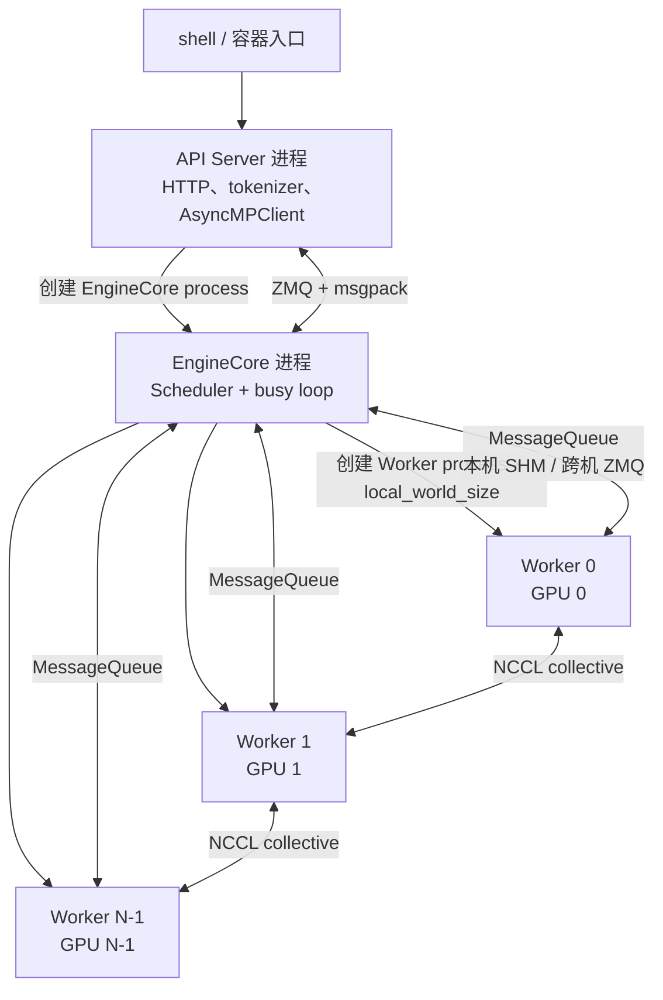
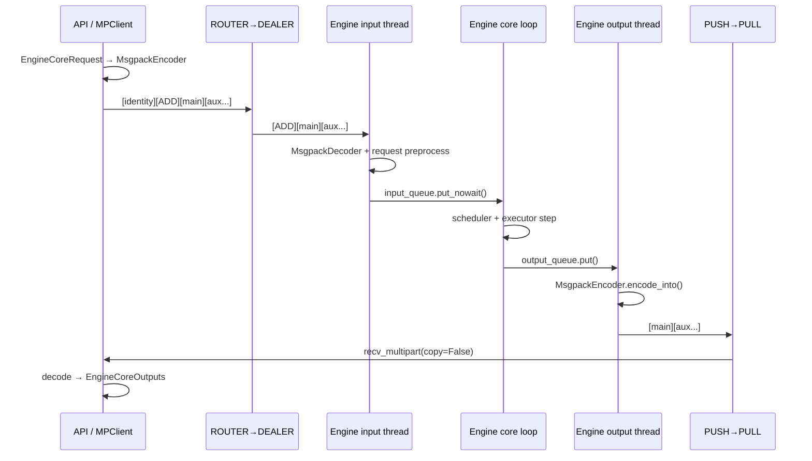
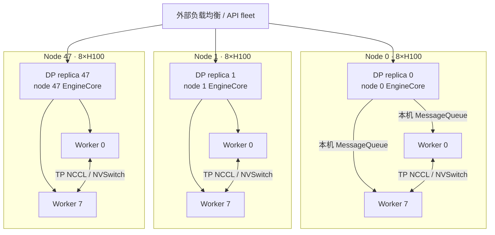

# 05. 进程模型与进程间通信内部机制

> **谁该读这一篇？** 第一次接触多进程、共享内存或 ZeroMQ（ZMQ），以及需要定位 vLLM 分布式推理卡死、IPC 超时、`/dev/shm` 不足问题的读者。
>
> **前置阅读：** [`02-architecture.md`](02-architecture.md) §1-2。本文不假定读者已经懂 socket、序列化、虚拟地址空间或 ZMQ。
>
> **耗时：** 约 60～80 分钟；如果已有操作系统和网络编程基础，可从 §5 开始。
>
> **源码基线：** 本章按仓库锁定的 vLLM `b23bd73`（2026-07-20）V1 实现复核。引用格式仍为 `file_path:line_number`；源码升级后行号可能漂移，应优先搜索类名、函数名及下方语义锚点。

学完本章，应能回答五个问题：

1. 进程、线程、虚拟地址空间、文件描述符分别是什么？
2. `fork`、`spawn`、写时复制和 CUDA “poison fork” 有什么关系？
3. ZMQ 与普通 TCP socket 有什么区别？`ROUTER/DEALER`、`PUSH/PULL`、`PUB/SUB` 各解决什么问题？
4. vLLM 的 API Server、EngineCore、Worker 之间分别传什么，经过几次序列化和内存复制？
5. 扩展到 48 台 8×H100（共 384 卡）时，哪些通信仍是节点内 IPC，哪些会跨节点？

先给出全章最重要的纠偏：

> **共享内存不等于“完全零拷贝”，ZMQ 也不等于“网络通信”。**
>
> vLLM 的 `MessageQueue` 是混合实现：本机常规消息写入共享内存环形缓冲区；ZMQ 负责唤醒通知、超大消息回退和跨节点传输。writer 把序列化结果写入共享内存时仍有一次内存复制。PEP 574 的收益是让大 buffer 不必先被复制进 pickle 主字节流，并让多个本机 reader 直接读取同一共享段，而不是承诺端到端 0 次复制。

---

## 1. 先建立最小操作系统模型

### 1.1 程序、进程、线程不是一回事

| 名词 | 可以把它理解成 | 主要拥有或共享什么 |
| --- | --- | --- |
| 程序 | 磁盘上的可执行文件和 Python 源码 | 静态文件，本身没有运行状态 |
| 进程 | 一次正在运行的程序实例 | 独立虚拟地址空间、PID、文件描述符表、信号处理状态 |
| 线程 | 进程内的一条执行流 | 独立栈和寄存器；与同进程线程共享堆、模块、文件描述符 |
| 协程 | 用户态调度的可暂停函数 | 仍运行在线程和进程中，不提供地址空间隔离 |

两个 Python 进程即使都存在名为 `scheduler` 的变量，它们也通常位于彼此隔离的地址空间。一个进程执行：

```python
state["running"] = 100
```

不会自动改变另一个进程里的 `state`。要让另一个进程看到变化，必须使用 IPC（Inter-Process Communication，进程间通信），或者让两边映射同一段共享内存。

线程不同：两个线程能直接看到同一 Python 对象，因此少了 IPC，却增加了锁、竞态和故障隔离问题。CPython 的 GIL 限制 Python 字节码并行，但这不是“任何线程都不能并行”：C/CUDA 扩展和阻塞 I/O 可以释放 GIL。vLLM 的 EngineCore 正是用 I/O 线程把 ZMQ 收发、部分编解码和 GPU 执行重叠起来，见 `vllm/v1/engine/core.py`。

### 1.2 一个进程的虚拟地址空间

```text
高地址
┌──────────────────────────────┐
│ 内核映射（用户态不能随意访问） │
├──────────────────────────────┤
│ 线程栈 / 主线程栈             │  向下增长
├──────────────────────────────┤
│ mmap 区：动态库、文件、共享内存 │
├──────────────────────────────┤
│ heap：Python 对象、allocator  │  向上增长
├──────────────────────────────┤
│ data / bss                   │
├──────────────────────────────┤
│ text：程序机器码             │
└──────────────────────────────┘
低地址
```

这里的地址是**虚拟地址**。CPU 的页表把它翻译为物理页。两个进程可以同时打印出相同的虚拟地址，但默认映射到不同物理页；也可以打印出不同虚拟地址，却通过共享内存映射到同一物理页。

因此判断“是否共享”不能只看 Python 的 `id()` 或指针值，而要问：

- 两个进程的页表是否指向同一物理页？
- 数据是否已被复制到 socket 内核缓冲区或另一块用户态缓冲区？
- 接收端构造对象时是创建 view，还是分配新内存并复制？

### 1.3 文件描述符、socket 和内核缓冲区

Linux 进程访问文件、pipe 和 socket 时，用户态拿到的是一个小整数，例如 fd 17。fd 是当前进程文件描述符表的索引，不是数据本身。

普通 TCP 发送可以粗略画成：

```text
发送进程 Python bytes
        │ send()
        ▼
内核 socket 发送缓冲区 ── TCP/IP ──> 对端内核接收缓冲区
                                            │ recv()
                                            ▼
                                      接收进程 buffer
```

一次“传消息”的成本至少要分成四类：

1. **编码/序列化**：Python 对象变成字节及附属 buffer；
2. **内存复制**：用户 buffer、共享段、内核 socket buffer 之间搬运；
3. **系统调用和上下文切换**：进出内核、进程被唤醒；
4. **排队和同步**：发送者等队列空间，接收者等数据，慢消费者制造背压。

以后看到“zero-copy”必须追问：省掉的是哪一次复制？只在发送端，还是接收端？只对 NumPy/Tensor payload，还是连元数据也不编码？

### 1.4 进程退出、daemon 和僵尸进程

父进程创建子进程后，需要监控其退出状态并回收。子进程已经退出、父进程却还没 `wait()` 时，会短暂成为 zombie；它不再执行，但 PID 和退出信息仍占内核表项。

Python `multiprocessing.Process(daemon=True)` 的含义更接近“随父进程退出的后台子进程”，不是 systemd daemon。当前 vLLM Worker 是 daemon process，见 `vllm/v1/executor/multiproc_executor.py`；它还用 death pipe 检测父进程 EOF，并唤醒阻塞中的队列。EngineCore 进程的创建点则在 `vllm/v1/engine/utils.py`，没有在此处设置 `daemon=True`。

---

## 2. 进程是如何创建的：fork、spawn 与写时复制

### 2.1 `fork` 做了什么

`fork` 创建一个几乎复制父进程状态的子进程。这里“复制”不等于立即 memcpy 整个进程内存：Linux 通常先让父子页表共同指向相同物理页，并把页标成只读；任一方第一次写某页时，内核才复制该页，这就是 COW（Copy-on-Write，写时复制）。

```text
fork 刚完成：
父虚拟页 A ─┐
             ├──> 物理页 P（共享、只读标记）
子虚拟页 A' ─┘

子进程写 A' 后：
父虚拟页 A  ───> 物理页 P
子虚拟页 A' ───> 物理页 Q（复制后修改）
```

`fork` 的优点是启动快、未修改页面可共享；风险包括：

- 父进程其他线程不会以正常状态“复制过去”，但锁可能保留在被持有状态；
- socket fd 会被继承，多份进程若没有关闭不需要的 fd，会妨碍 EOF 和资源回收；
- allocator、日志库、通信库的后台线程状态可能不适合 fork 后继续使用；
- 已初始化 CUDA runtime 后再 fork 可能产生不可恢复的 CUDA 状态错误。

vLLM 在使用 `fork` 时显式跟踪 Worker 继承的 socket fd，随后关闭不需要的副本，见 `vllm/v1/executor/multiproc_executor.py`。

### 2.2 `spawn` 做了什么

`spawn` 启动一个全新的 Python interpreter，再导入入口模块，并通过 pickle 传递 target、参数等初始化信息。它不会继承父进程的 Python 堆和锁状态，因此 CUDA 场景通常更稳，但代价是启动和重复 import 更慢、传参必须可序列化。

手写多进程程序时，`spawn` 要求入口保护：

```python
import multiprocessing as mp

def child(rank: int) -> None:
    print(rank)

if __name__ == "__main__":
    ctx = mp.get_context("spawn")
    p = ctx.Process(target=child, args=(0,))
    p.start()
    p.join()
```

没有 `if __name__ == "__main__"`，子解释器重新导入模块时可能再次创建子进程，形成递归启动。

### 2.3 vLLM 如何选择

<!-- vllm-source: {"path":"vllm/utils/system_utils.py","symbol":"_maybe_force_spawn"} -->
[源码锚点：vllm/utils/system_utils.py · _maybe_force_spawn](https://github.com/vllm-project/vllm/blob/699e180df48d78b5275d528124641c67b4b1664c/vllm/utils/system_utils.py#L126)

当前实现由 `get_mp_context()` 统一选择，源码是 `vllm/utils/system_utils.py`：

- `VLLM_WORKER_MULTIPROC_METHOD` 的默认值是 `fork`；
- 已经初始化 CUDA/XPU 时强制改为 `spawn`；
- Ray actor、NUMA bind 和 WSL 等条件也会强制 `spawn`；
- ROCm 还会同步可见设备环境变量，再创建 context。

所以不能简单记成“vLLM 永远 fork”或“CUDA 程序永远 spawn”。准确说法是：

> vLLM 默认允许 fork，但在检测到不安全条件时强制 spawn；无论哪种方式，都应避免在错误的进程里过早初始化 CUDA。

Python 本身在不同版本和平台上的默认 start method 会变化，排障时不要靠常识猜，直接记录：

```python
import multiprocessing as mp
print(mp.get_start_method())
```

vLLM 则应同时检查 `VLLM_WORKER_MULTIPROC_METHOD` 和启动日志中的 override warning。

---

## 3. IPC 方法全景：为什么不能只会“队列”

| 机制 | 是否跨机器 | 数据如何到对端 | 常见用途 | 主要代价/限制 |
| --- | --- | --- | --- | --- |
| 匿名 pipe | 否 | 内核 pipe buffer | 父子 readiness、EOF/death 通知 | 一般是一对端点，传对象仍需序列化 |
| Unix domain socket | 否 | 本机内核 socket | 本机结构化消息、ZMQ `ipc://` | 有系统调用和 buffer 复制 |
| TCP socket | 是 | TCP/IP | 跨节点控制消息 | 网络、拥塞、重连、安全配置 |
| POSIX shared memory | 否 | 多进程映射同一物理页 | 高频大 payload | 必须自行定义布局、同步、生命周期 |
| `mmap` 文件 | 通常本机 | 映射文件页 | 持久化或文件共享 | 页缓存和文件生命周期 |
| `multiprocessing.Queue` | 否 | pipe + pickle + feeder thread | 通用 Python 对象 | 隐式线程、序列化和复制开销 |
| ZMQ | 取决于 transport | 消息库封装 `inproc/ipc/tcp` | 异步路由、扇入扇出、发布订阅 | 非持久消息代理；要理解 socket pattern/HWM |
| NCCL | 多 GPU/可跨节点 | NVLink/PCIe/RDMA/TCP | Tensor collective/P2P | 只解决设备间数据通信，不传任意 Python 对象 |

选择 IPC 不能只看单条消息延迟，还要看：

- 是一对一、一对多还是多对一？
- 消息是几十字节的命令，还是几十 MiB 的张量？
- receiver 都在同一主机吗？
- 是否要求可靠持久化、重放或 exactly-once？
- 慢 reader 应阻塞 writer、丢弃旧通知，还是独立隔离？
- 进程异常退出后谁负责清理和通知其他进程？

vLLM 没有用一种机制包打天下，而是把它们组合起来。

---

## 4. ZMQ 从零开始

<!-- vllm-source: {"path":"vllm/utils/network_utils.py","symbol":"make_zmq_socket"} -->
[源码锚点：vllm/utils/network_utils.py · make_zmq_socket](https://github.com/vllm-project/vllm/blob/699e180df48d78b5275d528124641c67b4b1664c/vllm/utils/network_utils.py#L310)

### 4.1 ZMQ 是什么，不是什么

ZeroMQ/ØMQ 是一个异步消息库。应用看到的仍叫 socket，但它不是“更快的 `socket.socket`”这么简单：

- 普通 TCP socket 面向字节流；ZMQ socket 面向**离散消息**；
- ZMQ 在后台 I/O thread 中处理连接、排队、重连和 framing；
- socket type 自带通信模式，如路由、负载分发、扇出；
- `bind/connect` 决定谁拥有 endpoint，不决定谁是业务上的请求方；
- 它可以走 `inproc://`、`ipc://` 或 `tcp://`，所以“用了 ZMQ”并不能推出“数据经过网卡”。

它也不是 Kafka/RabbitMQ：没有默认持久化日志、消费 offset、事务或 exactly-once。进程崩溃、队列溢出或错误关闭时，应用必须接受其语义并设计握手、超时和恢复。

官方 `libzmq` 文档还特别强调：大多数经典 socket type **不是线程安全的**。通常做法是“一条线程拥有一个 socket”，线程之间另用 queue 或 `inproc://` 通信。vLLM 的 EngineCore 也让 input thread 和 output thread 分别创建、持有各自的 socket。

### 4.2 Context、socket、endpoint 三层对象

```python
import zmq

ctx = zmq.Context(io_threads=1)   # 管理后台 I/O 线程和 socket 生命周期
s = ctx.socket(zmq.PUSH)          # 创建带 PUSH 语义的消息 socket
s.bind("ipc:///tmp/demo.sock")    # endpoint = transport + address
s.send(b"hello")                 # 发送一条完整消息
```

逐层理解：

1. **Context**：进程内的 ZMQ 运行时，管理 I/O thread；不是每条消息都创建一个。
2. **Socket**：带特定 pattern 的逻辑端点；有发送/接收队列、HWM、identity 等状态。
3. **Endpoint**：`ipc:///path`、`tcp://host:port` 或 `inproc://name`。

常见 transport：

| transport | 范围 | 典型地址 | 注意点 |
| --- | --- | --- | --- |
| `inproc://` | 同一 ZMQ context 内的线程 | `inproc://cancel-123` | 不跨进程；延迟低 |
| `ipc://` | 同一主机的进程 | `ipc:///tmp/vllm-xxx` | 依赖 Unix socket 路径和目录权限 |
| `tcp://` | 可跨主机 | `tcp://10.0.0.8:5000` | 要处理路由、防火墙、端口和安全边界 |

### 4.3 message、frame 与 multipart

一条 ZMQ message 可以由多个 frame 组成，接收端用 `recv_multipart()` 一次取回完整边界：

```text
一条逻辑请求
┌──────────────┬──────────────┬────────────────┬──────────────┐
│ routing id   │ request type │ msgpack metadata│ tensor buf 0 │
└──────────────┴──────────────┴────────────────┴──────────────┘
      frame 0        frame 1         frame 2          frame 3
```

这比 TCP 字节流方便：TCP 的一次 `send()` 不保证对应接收端一次 `recv()`，应用必须自己编码长度；ZMQ 保留 message/frame 边界。

`send_multipart(..., copy=False)` 的含义也要谨慎。它请求 pyzmq 尽量让 libzmq 引用现有 buffer，减少 Python 用户态的一次复制，但：

- 小消息可能仍被库复制；
- TCP/IPC 进入内核和网卡时仍有其自己的数据移动；
- 发送完成前原 buffer 必须保持存活，因此 vLLM 用 `MessageTracker` 和 `pending` 保存引用，见 `vllm/v1/engine/core_client.py`、`vllm/v1/engine/core.py`。

### 4.4 vLLM 用到的 socket pattern

| pattern | 方向/行为 | vLLM 中的用途 | 最容易误解的点 |
| --- | --- | --- | --- |
| `ROUTER` | 收到消息时附带对端 identity；发送时按 identity 路由 | API client 请求入口 | 它不是 HTTP router；第一帧是路由信封 |
| `DEALER` | 双向异步，能连接 ROUTER | EngineCore 输入和启动握手 | 不受 REQ/REP 严格一问一答约束 |
| `PUSH/PULL` | 单向 pipeline；多个 peer 间分发/公平接收 | EngineCore 输出 → client | 不是广播；一条消息只交给一个下游 PULL |
| `PUB/SUB` | publisher 扇出，subscriber 按 topic 前缀订阅 | SHM 写入通知 | 慢订阅者或未完成订阅时可丢消息，不适合可靠命令 |
| `XPUB/XSUB` | 可观察订阅事件的高级 pub/sub | `MessageQueue` readiness、DP coordinator | XPUB 可确认 reader 已订阅，解决启动“慢加入者”窗口 |
| `PAIR` | 单连接、双向 | 同进程 cancellation ping | 不适合通用多对多拓扑 |

#### ROUTER/DEALER 的信封

假设两个 EngineCore 的 identity 分别是 `b"\x00\x00"` 和 `b"\x01\x00"`：

```text
API ROUTER 发送： [engine_identity][request_type][encoded request][aux buffers...]
                         │
                         └── libzmq 根据 identity 选择连接

Engine DEALER 收到：    [request_type][encoded request][aux buffers...]
```

ROUTER 消费路由帧，DEALER 只看到业务帧。当前 vLLM client 发送元组的代码在 `vllm/v1/engine/core_client.py`；EngineCore 用 `type_frame, *data_frames = recv_multipart(copy=False)` 接收，见 `vllm/v1/engine/core.py`。

#### PUSH/PULL 不是 PUB/SUB

如果一个 PUSH 连接三个 PULL，消息通常在三个 PULL 之间分配，而不是每个都收到。如果一个 PUB 连接三个 SUB，每个匹配 topic 的 SUB 都可能收到一份。前者适合工作分发/扇入，后者适合状态广播或“有新数据了”的提示。

### 4.5 bind/connect 不等于 server/client

`bind` 表示这个 socket 创建并拥有地址，`connect` 表示连接已有地址。谁先发送由 socket pattern 决定，而不是由 bind/connect 决定。

vLLM 的通用工厂 `make_zmq_socket()` 在 `vllm/utils/network_utils.py`：默认让 `PUSH/SUB/XSUB` connect，其他类型 bind，但调用方可以显式覆盖。API 侧 ROUTER bind，EngineCore 侧 DEALER connect；输出侧 client 的 PULL 默认 bind，EngineCore 的 PUSH 默认 connect。

### 4.6 HWM、背压和“为什么进程像卡死了”

HWM（High Water Mark）是 socket 队列的高水位。达到 HWM 后，不同 socket type 可能阻塞、返回 `EAGAIN`，或像 PUB 一样丢给慢 subscriber 的消息。它不是字节数的严格全局上限，通常按 peer/消息队列理解。

vLLM 的 `make_zmq_socket()` 对 `PULL/DEALER/ROUTER` 设置 `RCVHWM=0`，对 `PUSH/DEALER/ROUTER` 设置 `SNDHWM=0`，见 `vllm/utils/network_utils.py`。在 ZMQ 语义里 0 表示不施加该 HWM 限制；这能减少突发流量下的阻塞，却意味着应用更需要用上层队列、请求上限和监控控制内存增长。

共享内存通知是另一种取舍：`SpinCondition` 的 PUB `SNDHWM=1`，SUB 开 `CONFLATE=1`，见 `vllm/distributed/device_communicators/shm_broadcast.py`。通知只表达“去检查 ring”，旧 ping 被合并或丢掉没关系，因为真实状态保存在共享内存 metadata 中。

这是一条很重要的设计原则：

> **通知可以有损，状态必须可重新读取。** 如果把唯一的业务 payload 放在有损 PUB/SUB 上，这个结论就不成立。

### 4.7 Poller、握手、重连与关闭

- **Poller**：一条线程同时等待多个 socket，不必逐个阻塞 `recv()`；EngineCore 输入线程从 `vllm/v1/engine/core.py` 开始创建并注册多个输入端点。
- **握手**：ZMQ connect 是异步的，“调用 connect 成功”不代表对端已经 ready。vLLM 的 DEALER 先向 ROUTER 发 ready payload，client 等齐所有 engine identity，见 `vllm/v1/engine/core_client.py`。
- **slow joiner**：PUB 在 SUB 完成订阅前发送的消息可能收不到；`MessageQueue` 使用 XPUB 接收订阅事件，再广播 `READY`，见 `shm_broadcast.py`。
- **reconnect**：ZMQ 可后台重连，但不会自动恢复应用状态、重放任意丢失请求或判断推理是否已执行。
- **linger**：socket close 时等待待发消息的时长。vLLM 输出线程设置 linger，以尽量先发出 `ENGINE_CORE_DEAD`，见 `vllm/v1/engine/core.py`；部分 shutdown socket 明确 `linger=0`，避免退出无限等待。

---

## 5. vLLM V1 的进程拓扑

<!-- vllm-source: {"path":"vllm/v1/engine/core_client.py","symbol":"MPClient"} -->
[源码锚点：vllm/v1/engine/core_client.py · MPClient](https://github.com/vllm-project/vllm/blob/699e180df48d78b5275d528124641c67b4b1664c/vllm/v1/engine/core_client.py#L503)
<!-- vllm-source: {"path":"vllm/v1/engine/utils.py","symbol":"launch_core_engines"} -->
[源码锚点：vllm/v1/engine/utils.py · launch_core_engines](https://github.com/vllm-project/vllm/blob/699e180df48d78b5275d528124641c67b4b1664c/vllm/v1/engine/utils.py#L1104)
<!-- vllm-source: {"path":"vllm/v1/executor/multiproc_executor.py","symbol":"WorkerProc.worker_main"} -->
[源码锚点：vllm/v1/executor/multiproc_executor.py · WorkerProc.worker_main](https://github.com/vllm-project/vllm/blob/699e180df48d78b5275d528124641c67b4b1664c/vllm/v1/executor/multiproc_executor.py#L853)

### 5.1 单个在线实例的主链



主要创建点：

| 对象 | 当前源码入口 | 关键事实 |
| --- | --- | --- |
| In-process EngineCore | `vllm/v1/engine/core_client.py` | `InprocClient` 直接构造 `EngineCore`，没有 API↔Engine ZMQ |
| Multi-process EngineCore | `vllm/v1/engine/utils.py` | `CoreEngineProcManager` 按本机 DP rank 创建 EngineCore process |
| Worker | `vllm/v1/executor/multiproc_executor.py` | 每个 local rank 创建 daemon Worker process |
| Worker readiness/death | `multiproc_executor.py` | 单向 pipe 通知 ready，death pipe 用 EOF 感知父进程退出 |

“每 GPU 一个 Worker”是常见 CUDA MultiprocExecutor 形态，不应扩展成所有 backend 的绝对定律：Ray actor、外部 launcher、CPU/XPU backend 或将来执行器实现可能改变进程承载方式。读源码时以选中的 Executor 为准。

### 5.2 Inproc、MP 与分布式不是同一个维度

| 模式 | Client → EngineCore | EngineCore → Worker | 适用情况 |
| --- | --- | --- | --- |
| `InprocClient` | Python 直接调用 | 由所选 Executor 决定 | 离线同步路径、调试 |
| `SyncMPClient` / `AsyncMPClient` | ZMQ | 由所选 Executor 决定 | 在线服务、进程隔离 |
| `MultiprocExecutor` | 不适用 | MessageQueue + 本机进程/分布式组 | 常见单机 TP/PP，也可有远端 reader |
| `RayDistributedExecutor` | 不适用 | Ray actor/RPC + GPU 通信 | 多节点资源编排 |

Client 类型描述的是**前端和 EngineCore 的关系**；Executor 类型描述的是**EngineCore 如何管理 Worker**。把两个维度混成“Inproc/MP/Ray 三选一”会导致错误推理。

### 5.3 EngineCore 为什么还有 I/O 线程

EngineCore 进程里不只有 scheduler 主循环：

- input thread：ZMQ socket → msgpack decode → `input_queue`；
- core busy loop：处理请求、调 scheduler、执行 step；
- output thread：`output_queue` → msgpack encode → ZMQ socket。

创建点在 `vllm/v1/engine/core.py`。这样 ZMQ I/O 和部分编解码可以与 GPU 执行重叠，并避免多个线程共享同一经典 ZMQ socket。

---

## 6. API Server ↔ EngineCore：控制请求到底怎么走

### 6.1 两条单向逻辑通道

| 方向 | client 侧 | EngineCore 侧 | payload |
| --- | --- | --- | --- |
| 请求输入 | `ROUTER` bind | `DEALER` connect | identity + request type + msgpack 主帧 + 可选附属 buffers |
| 输出回传 | `PULL` bind | `PUSH` connect | msgpack 主帧 + 可选附属 buffers |

client 创建 socket 见 `vllm/v1/engine/core_client.py`；EngineCore 的输入与输出 socket 线程见 `vllm/v1/engine/core.py`。

为什么输入不用简单 PUSH/PULL？因为一个 client 可能管理多个 DP EngineCore，需要把指定请求发给指定 identity；ROUTER 正好提供寻址。输出已经知道对应 client index，且是单向回传，用 PUSH/PULL 更简单。

### 6.2 一次 ADD 请求的时间线



请求端组 frame 的代码在 `vllm/v1/engine/core_client.py`，接收端解码与输出编码/发送在 `vllm/v1/engine/core.py`。

### 6.3 msgpack 主帧与附属 buffer

<!-- vllm-source: {"path":"vllm/v1/serial_utils.py","symbol":"MsgpackEncoder"} -->
[源码锚点：vllm/v1/serial_utils.py · MsgpackEncoder](https://github.com/vllm-project/vllm/blob/699e180df48d78b5275d528124641c67b4b1664c/vllm/v1/serial_utils.py#L136)

`MsgpackEncoder` 位于 `vllm/v1/serial_utils.py`：

- 普通字段编码进 msgpack 主帧；
- Tensor/NumPy 大于阈值时，将 backing buffer 放到 `aux_buffers`，主帧只编码索引和 dtype/shape 等元数据；
- 非连续 ndarray 仍需要先变连续，源码在 `serial_utils.py`；
- 默认不允许随意 fallback 到 pickle；只有显式打开 `VLLM_ALLOW_INSECURE_SERIALIZATION` 才允许，见 `serial_utils.py`。

这也是为什么“msgpack 就一定只有一段 bytes”不准确。vLLM 在 ZMQ multipart 中把主帧和大 buffer 分开发，减少把 payload 拼接进单一大字节串的复制。

多模态请求还可以配置 tensor IPC consumer/provider。client 在 `vllm/v1/engine/core_client.py` 构造 `TensorIpcSender`，EngineCore 在 `vllm/v1/engine/core.py` 接收。它与后面的 Worker `MessageQueue` 是另一条专用优化，不要混为同一套 PEP 574 pickle 协议。

### 6.4 这条链的复制账本

| 环节 | 一定发生什么 | 可能避免什么 |
| --- | --- | --- |
| Python 请求 → msgpack | 元数据被编码 | 大连续 Tensor/ndarray 不拼进主帧 |
| pyzmq `copy=False` | libzmq/transport 仍管理消息 | 避免一部分 Python→libzmq 用户态复制 |
| `ipc://` | 经过本机 socket 机制 | 不经过外部网络路由 |
| `tcp://` | 经过 TCP/IP，可能经过 NIC | 不能因 `copy=False` 称端到端零拷贝 |
| Engine decode | 构造请求对象/元数据 | 附属 buffer 可被 view 引用，取决于对象类型和生命周期 |

所以本章把它称为“控制/请求通道”而不是“零拷贝通道”。

---

## 7. EngineCore ↔ Worker：MessageQueue 与共享内存

<!-- vllm-source: {"path":"vllm/distributed/device_communicators/shm_broadcast.py","symbol":"MessageQueue"} -->
[源码锚点：vllm/distributed/device_communicators/shm_broadcast.py · MessageQueue](https://github.com/vllm-project/vllm/blob/699e180df48d78b5275d528124641c67b4b1664c/vllm/distributed/device_communicators/shm_broadcast.py#L464)
<!-- vllm-source: {"path":"vllm/distributed/device_communicators/shm_broadcast.py","symbol":"ShmRingBuffer"} -->
[源码锚点：vllm/distributed/device_communicators/shm_broadcast.py · ShmRingBuffer](https://github.com/vllm-project/vllm/blob/699e180df48d78b5275d528124641c67b4b1664c/vllm/distributed/device_communicators/shm_broadcast.py#L250)
<!-- vllm-source: {"path":"vllm/distributed/device_communicators/shm_broadcast.py","symbol":"MessageQueue.enqueue"} -->
[源码锚点：vllm/distributed/device_communicators/shm_broadcast.py · MessageQueue.enqueue](https://github.com/vllm-project/vllm/blob/699e180df48d78b5275d528124641c67b4b1664c/vllm/distributed/device_communicators/shm_broadcast.py#L823)

### 7.1 先纠正“数据面完全不用 ZMQ”

当前 `MessageQueue` 位于 `vllm/distributed/device_communicators/shm_broadcast.py`。它同时支持：

1. 本机 reader 的常规 payload：`ShmRingBuffer`；
2. 本机 reader 的 wake-up：ZMQ PUB/SUB；
3. 本机 payload 超过 ring 单 chunk 上限：ZMQ XPUB/SUB 回退；
4. 远端 reader：ZMQ TCP XPUB/SUB 直接传 multipart payload。

初始化代码明确计算 `n_local_reader` 和 `n_remote_reader`，并分别建立本地与远端路径，见 `shm_broadcast.py`。

### 7.2 SharedMemory 到底共享了什么

writer 调用：

```python
shared_memory.SharedMemory(create=True, size=...)
```

内核创建具名共享段；reader 只拿到名字和布局参数，再调用：

```python
shared_memory.SharedMemory(name=name)
```

两边各自得到一个 `memoryview`，页表最终映射到同一批共享物理页。创建与 attach 都在 `shm_broadcast.py` 的 `ShmRingBuffer` 中完成。

共享内存不自动提供：

- Python 对象结构；
- 消息边界；
- 谁可以写、谁已经读；
- 原子性和 CPU 内存可见性；
- 慢 reader 的背压策略；
- 异常退出后的清理。

这些都由 `ShmRingBuffer` 的协议补齐。

### 7.3 Ring buffer 的内存布局

`ShmRingBuffer` 是 single-writer / multi-reader broadcast queue，布局注释从 `shm_broadcast.py` 开始：

```text
data 区                                  metadata 区
┌────────┬────────┬─────┬────────┐      ┌──────────┬──────────┬─────┐
│ chunk0 │ chunk1 │ ... │ chunk9 │      │ meta[0]  │ meta[1]  │ ... │
└────────┴────────┴─────┴────────┘      └──────────┴──────────┴─────┘
 每个 chunk 最多 max_chunk_bytes          每个 meta = 1 + n_reader 字节

单个 meta：
┌─────────┬──────────┬──────────┬─────┬──────────┐
│ written │ reader 0 │ reader 1 │ ... │ reader N │
└─────────┴──────────┴──────────┴─────┴──────────┘
```

默认 `max_chunk_bytes=24 MiB`、`max_chunks=10`，见 `shm_broadcast.py`。只算 data 区，一个本地广播队列默认约 240 MiB；metadata 很小。实际 executor 可以按 payload 需求传入不同 chunk 大小，所以容量规划应读取运行配置和日志，不能机械地给每个队列都乘 240 MiB。

### 7.4 slot 状态机

对于某个 slot：

| metadata | 含义 | writer 能写？ | reader i 能读？ |
| --- | --- | --- | --- |
| `0 ???...???` | 还未发布/正在写 | 是（由单 writer 保证） | 否 |
| `1 000...000` | 刚发布，无人读 | 否 | 是 |
| `1 010...100` | 部分 reader 已读 | 否 | 未读 reader 可以 |
| `1 111...111` | 所有 reader 已读 | 是，可复用 slot | 否 |

writer 的步骤见 `shm_broadcast.py`：

1. 等当前 slot 未写或已被所有 reader 读完；
2. 把 `written=0`；
3. 写完整 payload；
4. 清零所有 reader flag；
5. memory fence；
6. 把 `written=1`，再次 fence，推进 ring index。

reader 的步骤见 `shm_broadcast.py`：

1. 等 `written=1` 且自己的 read flag 为 0；
2. 读取 slot 并反序列化；
3. 把自己的 read flag 置 1；
4. memory fence，推进自己的 ring index。

这里不使用一把大 mutex，是因为只有一个 writer，每个 reader 只写属于自己的 flag；但仍需要 memory fence 保证“payload 写完”先于“written 可见”。Python 层面的赋值顺序不等于所有 CPU 架构上的跨核可见顺序。

### 7.5 慢 reader 如何形成背压

ring 不是覆盖式日志。只要一个 reader 没把某 slot 标为已读，writer 绕一圈后就不能重用它。于是：

```text
Worker 7 卡在 CUDA/NCCL
    ↓
reader7_flag 长时间为 0
    ↓
ring 的可用 slot 逐步耗尽
    ↓
EngineCore writer 在 acquire_write() 自旋/让出 CPU
    ↓
所有 Worker 看起来都没有新命令
```

这不是一定说明共享内存坏了；根因可能是某个 Worker、GPU collective 或远端节点先卡住。源码会按 `VLLM_RINGBUFFER_WARNING_INTERVAL` 周期记录长等待，见 `shm_broadcast.py`。

### 7.6 SpinCondition：为什么共享内存旁边还有 PUB/SUB

reader 可以持续轮询 metadata，延迟低但空闲时烧 CPU；也可以每次阻塞等 socket，省 CPU 但高负载时增加系统调用。`SpinCondition` 做自适应折中，源码说明在 `shm_broadcast.py`：

- 最近持续有消息：`sched_yield()` 后快速重查共享 flag；
- 空闲超过阈值：用 Poller 等 ZMQ notification；
- writer 每次发布后发一个 ping；
- shutdown monitor 用同进程 `PAIR/inproc` 发 cancel ping，唤醒 idle reader。

由于共享 metadata 是真相来源，PUB/SUB ping 即使合并也不会丢失 payload。reader 醒来后重新检查 flag，而不是把 ping 当消息内容。

### 7.7 PEP 574 OOB buffer 的真实作用

enqueue 从 `shm_broadcast.py` 开始：

```python
all_buffers[0] = pickle.dumps(
    obj,
    protocol=pickle.HIGHEST_PROTOCOL,
    buffer_callback=oob_callback,
)
```

当支持 buffer protocol 的大对象被 pickle 时，callback 可以把 payload 作为 `PickleBuffer` 留在主 pickle 流之外。当前 vLLM 对小于 1 MiB 的 buffer 仍 inline，大 buffer加入 `all_buffers`，见 `shm_broadcast.py`。

逻辑结果是：

```text
all_buffers[0] = pickle 元数据 + NEXT_BUFFER 引用
all_buffers[1] = 大 payload 的 memoryview
all_buffers[2] = 另一个大 payload 的 memoryview
...
```

reader 再调用：

```python
pickle.loads(all_buffers[0], buffers=all_buffers[1:])
```

恢复对象，见 `shm_broadcast.py`。

#### 逐段复制账本

假设 writer 广播一个含 8 MiB NumPy buffer 的对象给同机 8 个 Worker：

| 阶段 | 是否复制 8 MiB payload | 说明 |
| --- | --- | --- |
| pickle 生成主流 | 通常不把它复制进主流 | PEP 574 OOB 的核心收益 |
| writer 写入 SHM slot | **复制 1 次** | `buf[...] = buffer`，见 `shm_broadcast.py` |
| 8 个 reader 读取 SHM | 不为每个 reader 再复制一份 IPC payload | 都映射同一共享物理页 |
| `pickle.loads(..., buffers=...)` | 可基于 buffer 重建 view | 是否最终共享取决于对象 reducer/消费者，不能一概保证 |
| GPU 使用 | 可能还有 host→device 或设备内复制 | 属于另一层数据移动 |

因此比较合理的表述是：

> 对本机广播，vLLM 把“给 N 个 Worker 各复制一次 payload”降为“writer 写共享 ring 一次，N 个 reader 从同一共享段取 view”；PEP 574 还避免把大 buffer 先拼进 pickle 主流。它不是端到端 0-copy。

### 7.8 小消息、溢出消息和远端消息走哪条路

`enqueue()` 的分支位于 `shm_broadcast.py`：

```text
                         ┌─ 本地且装得下 ─> 写 SHM ring ─> 发 notification ping
obj → pickle5 + OOB ─────┤
                         ├─ 本地但超过 chunk ─> XPUB/SUB multipart payload
                         └─ 远端 reader ───────> TCP XPUB/SUB multipart payload
```

本机 overflow 会先在 ring 中写一个 `overflow=1` 标志，再通过 local socket 发真实 multipart；reader 看到标志后转去 socket `recv()`。这保证 ring 顺序与大消息回退路径对齐。

`send_multipart(all_buffers, copy=False)` 对本机 overflow 和远端路径减少可避免的用户态拼接复制，但仍服从前述 ZMQ/transport 语义。

### 7.9 MessageQueue 在 Executor 里传什么

`MultiprocExecutor` 创建一个一写多读 `rpc_broadcast_mq`，将调用编码并广播给 Worker，见 `vllm/v1/executor/multiproc_executor.py`，核心是：

```python
(send_method, args, kwargs, output_rank)
```

每个 Worker 从广播队列 `dequeue()`，执行方法，再通过自己的 response `MessageQueue` 回结果；相关入口都在 `multiproc_executor.py` 的 `WorkerProc` 中。

这意味着不能把 API↔Engine 的 msgpack 协议套到这里：

- API↔EngineCore：`MsgpackEncoder/Decoder` + ZMQ multipart；
- MultiprocExecutor↔Worker：pickle protocol 5/OOB + hybrid MessageQueue；
- Worker↔Worker Tensor：NCCL 等 device communicator。

---

## 8. GPU 通信是第三个世界：NCCL 不等于 IPC queue

Worker 之间的 tensor parallel、pipeline parallel 或 expert parallel 通信，通常进入 NCCL/Gloo/custom communicator，而不是把 GPU tensor pickle 后塞进 `MessageQueue`。

| 层 | 典型内容 | 机制 |
| --- | --- | --- |
| API ↔ EngineCore | request、abort、token output、utility command | ZMQ + msgpack |
| EngineCore ↔ Worker | “执行哪个方法、参数是什么”、结果状态 | MessageQueue：SHM + ZMQ + pickle5 |
| Worker ↔ Worker | activation、partial logits、all-reduce/all-to-all 数据 | NCCL / device communicator |

节点内 NCCL 可能走 NVLink/NVSwitch 或 PCIe；跨节点可走 InfiniBand/RoCE + GPUDirect RDMA，也可能回退 TCP。这里的数据路径、拓扑和超时与 ZMQ 控制通道不同，但上层故障会互相表现为背压：一个 NCCL rank 卡住，会让对应 Worker 不再消费 MessageQueue，最终让 EngineCore 的 ring 也堵住。

---

## 9. 384×H100：不要画成“一条 384-reader 共享内存队列”

假设 48 台机器，每台 8×H100；一种常见映射是模型副本 `TP=8`、`DP=48`。这里只用于理解进程和通信边界，并不代表所有模型都应该固定 TP=8。



在这个例子中：

- Worker 数量约 384，每个 DP replica 有自己的 scheduler/EngineCore 和 8 个 TP Worker；
- 不是一个 EngineCore 用共享内存广播给 384 个进程；POSIX SHM 不能天然跨 48 台机器；
- 每台节点内的 executor 命令可走本机 SHM，TP collective 尽量留在 NVSwitch 域；
- API fleet 与多个 DP EngineCore 的控制路径可通过 TCP ZMQ 或外部路由组织；
- DP 副本通常彼此独立处理请求，不会为每一步做 384 卡全局 all-reduce。

如果单个模型副本必须跨节点，例如 `TP=16` 或 `PP=2, TP=8`：

- `MessageQueue` 会区分 local/remote reader，远端 payload 不能走本机 SHM；
- GPU collective/PP activation 会跨 NIC；
- 任何远端慢 rank 都可能反向形成 executor 背压；
- ZMQ TCP、NCCL/RDMA、服务网格/负载均衡是三套不同连接，监控和防火墙要分别处理。

### 9.1 进程数量不能只用 GPU 数估算

以 48 个 TP=8 副本为例，最低限度就可能包含：

- 384 个 Worker 承载 GPU；
- 约 48 个 EngineCore（每 DP rank 一个）；
- 若干 API Server；
- DP coordinator（具体取决于 LB 模式和 MoE wave coordination）；
- Ray actor/agent、日志和监控 sidecar、NCCL 辅助线程、ZMQ I/O thread。

所以容量与 pid limit、fd limit、`/dev/shm` 容量、Unix socket 路径、TCP 端口范围都要按**副本和节点**计算，不能只说“384 个进程”。详细部署切分见 [`../08-production-deployment/13-384-h100-glm-deepseek-deployment.md`](../08-production-deployment/13-384-h100-glm-deepseek-deployment.md)。

---

## 10. 一条请求的端到端通信账本

```text
HTTP request
  │
  ├─ API 进程：解析/鉴权/tokenize，构造 EngineCoreRequest
  │
  ├─ msgpack encode：元数据主帧 + 大 buffer 附属帧
  │
  ├─ ZMQ ROUTER → DEALER：按 DP Engine identity 路由
  │
  ├─ Engine input thread：decode，放入进程内 input_queue
  │
  ├─ EngineCore：scheduler 产生本 step 的执行调用
  │
  ├─ MultiprocExecutor：pickle5/OOB
  │      ├─ local Worker：写一次 SHM ring + ZMQ ping
  │      └─ remote Worker：ZMQ TCP multipart
  │
  ├─ Worker：执行 GPUModelRunner
  │      └─ Worker 间：NCCL collective / P2P
  │
  ├─ Worker response MessageQueue → EngineCore
  │
  ├─ Engine output thread：msgpack encode
  │
  └─ ZMQ PUSH → PULL → API 流式 HTTP response
```

看到延迟上升时按层分解：

1. API queue/tokenize；
2. ROUTER 输入排队/编解码；
3. scheduler queue；
4. MessageQueue 等 slot 或远端 ZMQ；
5. GPU compute/NCCL；
6. 输出 thread/PULL；
7. HTTP 客户端回压。

“GPU utilization 低”不能直接推出模型算子慢；也可能是 Worker 正等命令、EngineCore 被慢 reader 堵住、或前端输出回压。

---

## 11. 故障与背压排查

### 11.1 症状 → 可能层次

| 症状 | 优先怀疑 | 先看什么 |
| --- | --- | --- |
| 启动卡在 waiting for engine core | 握手、模型加载、EngineCore 早退 | EngineCore stderr、ready timeout、进程存活 |
| `Address already in use` | IPC path/TCP port 冲突 | `ss -xlpn`、`ss -ltnp`、残留进程 |
| `No space left on device` 但磁盘有空间 | `/dev/shm` 不足 | `df -h /dev/shm`、容器 `--shm-size` |
| ring buffer long wait | 慢/死 Worker、NCCL hang、reader 未消费 | rank 日志、GPU/NCCL 状态、metadata warning |
| CPU 空闲时仍很高 | reader busy-spin 或大量序列化 | 线程栈、SpinCondition 活跃度 |
| 内存持续增长 | ZMQ HWM 无界、上层 queue 堆积、引用等待 tracker | RSS/PSS、请求队列、pending messages |
| shutdown 卡住 | linger、未关闭 fd、子进程/NCCL 未退出 | 进程树、fd、线程栈 |
| fork 后 CUDA 错误 | 父进程提前初始化 CUDA | start method、import/初始化顺序 |
| 只有跨节点失败 | TCP 路由/防火墙、NCCL NIC/RDMA、地址发布错误 | 分开验证 ZMQ port 与 NCCL interface |

### 11.2 常用只读诊断命令

```bash
# 进程树、父子关系、状态和线程数
ps -eo pid,ppid,stat,nlwp,rss,cmd --forest | grep -E 'vllm|EngineCore|VllmWorker'

# 某进程打开的 fd；Unix/TCP socket 是否存在
ls -l /proc/<PID>/fd
ss -xlpn
ss -ltnp

# 共享内存容量和残留段
df -h /dev/shm
ls -lh /dev/shm

# 虚拟内存映射与共享/私有页（PSS 比 RSS 更适合看共享页）
cat /proc/<PID>/smaps_rollup

# GPU 进程、显存和利用率
nvidia-smi
```

不要看到 `/dev/shm/psm_*` 就直接删除。先确认创建进程已经退出且没有 reader 仍 attach；物理段的生命周期由 `close()`/`unlink()` 协作管理，误删活跃段会让其他进程出错。当前 `ShmRingBuffer.__del__` 只有 creator 执行 unlink，见 `shm_broadcast.py`。

### 11.3 分层二分法

1. **进程层**：API、EngineCore、所有 Worker 是否存活？PPID 是否合理？
2. **握手层**：ready identity 是否收齐？IPC/TCP endpoint 是否可达？
3. **队列层**：卡在 input queue、SHM acquire、response dequeue 还是 output queue？
4. **GPU 层**：所有 NCCL rank 是否进入同一个 collective？
5. **客户端层**：输出是否已生成但 HTTP client 不读？

不要一上来同时修改 NCCL、ZMQ HWM、共享内存大小和 batch 参数。先定位阻塞层，再改一个变量。

---

## 12. 三个最小实验

这些实验用于建立直觉，不是 vLLM benchmark。

### 12.1 验证“普通变量隔离，共享段可见”

```python
from multiprocessing import get_context, shared_memory

normal = bytearray(b"parent")

def child(shm_name: str) -> None:
    normal[:] = b"child!"             # 只改子进程自己的堆
    shm = shared_memory.SharedMemory(name=shm_name)
    shm.buf[:6] = b"shared"           # 改共同映射的物理页
    shm.close()

if __name__ == "__main__":
    ctx = get_context("spawn")
    shm = shared_memory.SharedMemory(create=True, size=6)
    shm.buf[:] = b"parent"
    p = ctx.Process(target=child, args=(shm.name,))
    p.start(); p.join()
    print(normal)              # bytearray(b'parent')
    print(bytes(shm.buf))      # b'shared'
    shm.close(); shm.unlink()
```

### 12.2 看懂 ROUTER identity 和 multipart

```python
import multiprocessing as mp
import zmq

ADDR = "tcp://127.0.0.1:29876"

def dealer() -> None:
    ctx = zmq.Context()
    s = ctx.socket(zmq.DEALER)
    s.setsockopt(zmq.IDENTITY, b"engine-7")
    s.connect(ADDR)
    s.send_multipart([b"ADD", b"payload"])
    print(s.recv_multipart())
    s.close(); ctx.term()

if __name__ == "__main__":
    ctx = zmq.Context()
    router = ctx.socket(zmq.ROUTER)
    router.bind(ADDR)
    p = mp.get_context("spawn").Process(target=dealer)
    p.start()
    identity, request_type, payload = router.recv_multipart()
    print(identity, request_type, payload)
    router.send_multipart([identity, b"OK"])
    p.join()
    router.close(); ctx.term()
```

观察：ROUTER 收到三帧，DEALER 只收到业务帧 `OK`；identity 是路由信封，不会自动进入 DEALER 的业务消息。

### 12.3 观察 PEP 574 的 OOB

```python
import pickle
import numpy as np

a = np.arange(1_000_000, dtype=np.float32)
oob = []
main = pickle.dumps(a, protocol=5, buffer_callback=oob.append)

print(len(main), len(oob), memoryview(oob[0]).nbytes)
b = pickle.loads(main, buffers=oob)
print(np.shares_memory(a, b))
```

这个实验演示 pickle API 可以让重建对象共享原 buffer；它**不代表 vLLM 跨进程 SHM 写入没有复制**。vLLM 还要把 OOB buffer 写进 ring，具体复制发生在 `shm_broadcast.py`。

---

## 13. 常见误区逐条纠正

| 误区 | 准确说法 |
| --- | --- |
| “进程之间绝对不能共享内存” | 默认地址空间隔离，但可以显式映射同一 shared memory |
| “fork 会立刻复制全部内存” | 通常先 COW 共享页，写入时按页复制 |
| “Python 线程完全没有并行” | GIL 限制 Python bytecode；I/O 和释放 GIL 的 native code 可并行 |
| “bind 的一端就是客户端” | bind/connect 是地址所有权；业务角色由协议和 socket type 决定 |
| “ZMQ 就是 TCP” | ZMQ 是消息层，可用 inproc/ipc/tcp transport |
| “一次 send 对应一次 TCP recv” | TCP 是字节流；ZMQ 才保存 message/multipart 边界 |
| “PUB/SUB 保证每条消息送达” | 慢加入、HWM 和断线都可能导致丢失；它不是持久消息系统 |
| “`copy=False` 就没有任何复制” | 只减少特定用户态复制；内核、网络、SHM 写入、GPU 搬运仍可能复制 |
| “PEP 574 自动让所有对象零拷贝” | 只对支持 buffer protocol/reducer 的数据有效，并依赖 consumer 如何重建 |
| “MessageQueue 就是共享内存” | 当前实现还用 ZMQ 通知、overflow 回退和远端传输 |
| “NCCL hang 与 IPC 无关” | 根因在 GPU 层，但会让 Worker 停止消费 IPC，最终表现为 ring 背压 |
| “384 卡就是一个 384 进程通信组” | 通常按 DP replica、节点和并行域分层，不应建立全局 SHM queue |

---

## 14. 代码索引

| 想追的问题 | 源码位置 |
| --- | --- |
| InprocClient 直接调用 EngineCore | `vllm/v1/engine/core_client.py` |
| MPClient 创建 ROUTER/PULL | `vllm/v1/engine/core_client.py` · `MPClient` |
| client 等待所有 EngineCore READY | `vllm/v1/engine/core_client.py` |
| client 组装 identity/type/data multipart | `vllm/v1/engine/core_client.py` |
| EngineCore process 创建 | `vllm/v1/engine/utils.py` · `CoreEngineProcManager` |
| EngineCore 输入/输出 I/O thread | `vllm/v1/engine/core.py` |
| EngineCore DEALER 收消息 | `vllm/v1/engine/core.py` |
| EngineCore PUSH 发输出 | `vllm/v1/engine/core.py` |
| ZMQ socket 工厂/HWM/identity/linger | `vllm/utils/network_utils.py` |
| msgpack 与附属 tensor/ndarray buffer | `vllm/v1/serial_utils.py` |
| start method 强制条件 | `vllm/utils/system_utils.py` · `_maybe_force_spawn` / `get_mp_context` |
| MultiprocExecutor 创建广播 MQ | `vllm/v1/executor/multiproc_executor.py` |
| Worker process、ready/death pipe | `multiproc_executor.py` · `WorkerProc` |
| SpinCondition 的 ZMQ 通知 | `vllm/distributed/device_communicators/shm_broadcast.py` |
| SHM ring 布局和 attach | `shm_broadcast.py` |
| MessageQueue 本地/远端分支 | `shm_broadcast.py` |
| writer/reader slot 状态转换 | `shm_broadcast.py` · `acquire_write` / `acquire_read` |
| pickle5/OOB、SHM copy、overflow | `shm_broadcast.py` |

外部基础资料：

- [Python multiprocessing：start methods](https://docs.python.org/3/library/multiprocessing.html#contexts-and-start-methods)
- [Python SharedMemory 官方文档](https://docs.python.org/3/library/multiprocessing.shared_memory.html)
- [PEP 574：pickle protocol 5 与 out-of-band buffer](https://peps.python.org/pep-0574/)
- [libzmq socket 官方语义](https://libzmq.readthedocs.io/en/latest/zmq_socket.html)
- [ØMQ Guide](https://zguide.zeromq.org/docs/)

---

## 15. 面试追问：从定义走到源码

### 15.1 为什么 vLLM 不把所有东西都放进 `multiprocessing.Queue`？

答题链：

1. `multiprocessing.Queue` 适合通用对象，但通常经 pickle、pipe 和 feeder thread；
2. 高频广播给多个 Worker 会重复序列化/复制，慢 reader 和容量也难按 vLLM step 协议精确控制；
3. vLLM 用 single-writer/multi-reader SHM ring，使本机多个 reader 读同一份 payload；
4. 用 PEP 574 拆出大 buffer，避免塞入 pickle 主流；
5. 仍用 ZMQ 解决通知、overflow 和跨节点，因为 SHM 不能跨主机。

### 15.2 ROUTER/DEALER 为什么适合 DP EngineCore？

答题链：

1. client 需要管理多个 EngineCore connection；
2. EngineCore 用稳定 identity 注册；
3. ROUTER 发消息时用第一帧选择 EngineCore；
4. DEALER 是异步双向，不要求严格 request/reply lockstep；
5. ready handshake 先建立 identity 路由，避免 ROUTER 在未知连接上发消息。

### 15.3 共享内存为什么还需要同步？

答题链：共享物理页只解决“看到同一批 bytes”，不解决消息边界、写完/未写完、多个 reader 的进度和 CPU 内存顺序。vLLM 用固定 chunk、written flag、每 reader flag、single-writer 约束和 memory fence 建立协议。

### 15.4 一个 Worker 卡住为何拖住全部 Worker？

它不一定立刻拖住其他 Worker，但广播 ring 的 slot 只有所有 reader 都确认后才可复用。慢 reader 累积到 ring 绕回时，writer 不能覆盖未读 slot，于是停止发布新调用；其他 Worker 随后也拿不到新工作。这是有界 broadcast queue 的背压语义。

### 15.5 “零拷贝”该怎么严谨回答？

不要回答“用了 mmap，所以 0 copy”。应列路径：pickle OOB 避免大 payload 进入主流；writer 仍将 payload 复制一次进 SHM；N 个本地 reader 直接 view 同一共享段；对象重建和 H2D 可能继续复制。`copy=False` 也只针对 pyzmq 某段用户态路径。

### 15.6 384 卡时为什么不做一个中心 EngineCore？

一个中心 scheduler 会形成 CPU、队列、故障域和跨节点广播瓶颈；POSIX SHM 又不能跨节点。常见做法是按 DP replica 分 EngineCore，每个副本只调度自己的一组 TP/PP Worker，由外层 LB 分发请求。只有模型本身跨节点时，才在单副本内引入 remote reader 和跨节点 collective。

### 15.7 ZMQ 自动重连是否等于请求不会丢？

不等于。重连只恢复 transport connection；它不知道某条推理请求是否已到达、已执行或输出是否被消费。需要应用层 request id、状态机、超时、幂等 abort/重试策略。持久化和 exactly-once 不是 ZMQ 默认能力。

---

## 小结

- 进程默认地址空间隔离；共享内存通过页表映射让多个进程访问同一物理页，但同步和生命周期仍由应用负责。
- `fork` 主要靠 COW，不会立刻复制全部内存；CUDA/线程/锁状态让 `spawn` 在部分场景更安全。vLLM 会根据环境强制选择。
- ZMQ 是异步消息库，不是单纯 TCP wrapper，也不是持久消息代理。理解 frame、identity、socket pattern、HWM、握手和 linger 才能排障。
- API↔EngineCore 使用 ZMQ + msgpack multipart；EngineCore↔Worker 的 `MessageQueue` 是 SHM + ZMQ + pickle5/OOB 的混合机制；GPU tensor collective 属于 NCCL 层。
- PEP 574 和 `copy=False` 都只省特定复制，不能笼统宣称端到端零拷贝。
- 384×H100 应按 DP replica、节点和 TP/PP 通信域分层建模，而不是画成一个全局共享内存队列。

## 自检

1. 两个进程打印出相同虚拟地址，是否说明共享同一物理内存？为什么？
2. `fork` 后父子进程的 10 GiB heap 是否立刻占用额外 10 GiB？什么时候会增长？
3. `spawn` 为什么要求 target 可 pickle，入口为什么要加 `__main__` guard？
4. ZMQ `bind/connect` 与业务上的 client/server 有何区别？
5. ROUTER 收到的 identity frame 到 DEALER 端后为什么消失？
6. PUSH/PULL 与 PUB/SUB 在“一条消息有几个消费者”上有何区别？
7. HWM 达到后，所有 socket type 都会阻塞吗？
8. 为什么 SHM notification 可以 `CONFLATE`，真实 scheduler command 却不能随便丢？
9. `buf[buf_offset:...] = buffer` 对“零拷贝”结论意味着什么？
10. 一个远端 Worker 卡在 NCCL，为什么可能最终表现为本地 EngineCore ring buffer long wait？
11. 48 台 8×H100、TP=8、DP=48 时，大致有多少 Worker 和 EngineCore？哪些通信通常不跨节点？
12. API→Engine 使用的 msgpack/OOB 与 Executor→Worker 使用的 pickle5/OOB 是同一个协议吗？

如果第 8、9、10 题能沿源码状态机讲清楚，才算真正理解这一章。

### 参考答案

1. **不一定。** 虚拟地址只是在每个进程自己的页表中有相同数值；两个页表可能映射到不同物理页。只有使用共享内存、同一 `mmap` 文件映射或显式 CUDA IPC，并核对映射关系，才能证明共享了同一物理存储。
2. `fork` 采用写时复制，父子进程最初共享只读物理页，所以不会立刻多占 10 GiB。任一方写入某页时才触发 page fault，内核复制该页；实际增长量取决于被修改的页，而不是整个 heap 大小。
3. `spawn` 会启动全新的解释器，只能通过 pickle 把 target、参数和必要状态传过去；`__main__` guard 防止子进程重新 import 主模块时再次执行启动逻辑，避免递归创建进程。
4. ZMQ 的 `bind` / `connect` 是拓扑动作，描述谁拥有监听端点；它不等同于业务上的 server/client。一个业务 client 可以连接另一个业务 client 的 socket，真正的请求方向由 socket 类型和消息协议决定。
5. ROUTER 端收到的 identity 是路由元数据，ROUTER 用它选择返回路径；转发给 DEALER 时通常只传业务帧，因此 DEALER 看不到 identity。若需要在业务层保留请求关联，必须显式放入 request ID。
6. PUSH/PULL 是负载分发：一条消息只会交给一个下游 PULL。PUB/SUB 是广播：每个订阅者都可能收到消息，但订阅建立前的消息通常会丢失，且没有逐消费者确认。
7. 不会。HWM 只表示队列水位；不同 socket 的满队列行为不同，可能阻塞、返回 `EAGAIN`、丢弃旧消息或丢弃新消息。生产代码必须根据 socket 类型、`SNDTIMEO/RCVTIMEO` 和错误码验证实际语义。
8. notification 是“状态已变化”的提示，旧通知被新通知覆盖通常仍能由消费者重新读取最新状态，所以可以 `CONFLATE`。scheduler command 是有顺序、有副作用的增量操作，丢一条可能导致请求、KV block 或 worker 状态永久不一致。
9. 这行代码把 `buffer` 的内容复制到目标 slice，因此它不是零拷贝；零拷贝只能说明元数据或 buffer 所有权被复用，不能把一次实际内存 copy 误说成零拷贝。应结合 `data_ptr`、shared-memory buffer 和 profile 证据判断。
10. EngineCore 把 command 写入 worker ring 后等待 completion；远端 worker 若卡在 NCCL，相关 completion 不会产生，本地 ring slot 也不会释放，最终表现为 EngineCore 的 long wait、queue 堆积甚至 API 超时。根因在 collective，表象在 IPC。
11. 若每个 TP=8 的服务单元占一台 8-GPU 节点，则 48 台共有 384 个 GPU worker；若每台节点上一个 EngineCore/服务单元，则约 48 个 EngineCore。TP 内的 NCCL 通常在节点内，DP 副本之间不需要同步；跨节点通信取决于 PP、EP 或具体部署拓扑。
12. 不是同一个协议。API→Engine 通常是 ZMQ 上的 msgpack/OOB；Executor→Worker 是进程内/本机的 pickle5/OOB 与共享内存队列。它们都可借用 out-of-band buffer 降低复制，但 framing、生命周期和故障语义不同，不能互换。

## 下一步

- 想继续看 scheduler 如何形成每一步执行决策：[`../03-code-walkthrough/02-scheduler.md`](../03-code-walkthrough/02-scheduler.md)
- 想看 TP/PP/EP 与 collective：[`../05-distributed/01-tp-pp-ep.md`](../05-distributed/01-tp-pp-ep.md)
- 想把本章映射到 384×H100 生产部署：[`../08-production-deployment/13-384-h100-glm-deepseek-deployment.md`](../08-production-deployment/13-384-h100-glm-deepseek-deployment.md)
