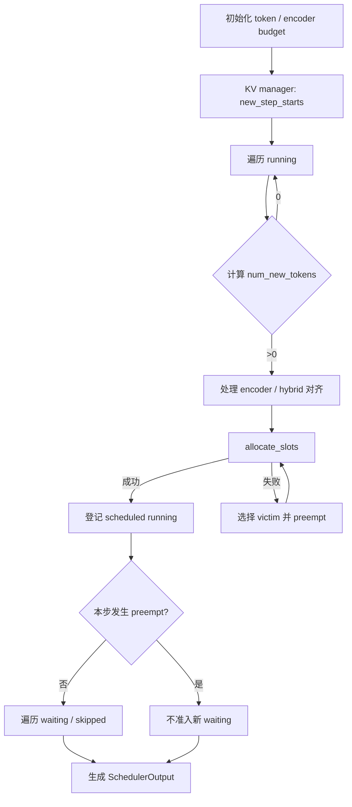

# 02. Scheduler 深读

> **谁该读这一篇？** 已理解 V1 请求生命周期，想真正读懂 token budget、KV 分配、抢占、spec decode、structured output 与 KV connector 如何在同一步互相约束的工程师。
>
> **前置阅读：** [`01-entry-points.md`](01-entry-points.md)、[`02-core-concepts/03-kv-cache-management.md`](../02-core-concepts/03-kv-cache-management.md)。
>
> **耗时：** 约 25 分钟。
>
> **学完能：**
>
> 1. 沿当前 `Scheduler.schedule()` 的真实顺序解释 running / waiting / skipped waiting。
> 2. 手算一个 step 的 token、encoder 与 KV block 预算。
> 3. 准确描述 FCFS/PRIORITY 的 victim 选择和当前 recompute 抢占。
> 4. 从 `SchedulerOutput` 判断 runner 本步要新增、更新、释放哪些状态。

> **静态复核：** 锁定 `b23bd73f540175f9e117eaee5029cd7d8df63964`。当前实现不是 `_schedule_running()` / `_schedule_waiting()` 两个方法，也没有 `--preemption-mode swap`；这些旧版伪代码不再作为事实引用。

---

## 1. 先抓住统一模型

<!-- vllm-source: {"path":"vllm/v1/core/sched/scheduler.py","symbol":"Scheduler.schedule"} -->
[源码锚点：Scheduler.schedule](https://github.com/vllm-project/vllm/blob/b23bd73f540175f9e117eaee5029cd7d8df63964/vllm/v1/core/sched/scheduler.py#L421)

当前注释先否定“prefill phase / decode phase”二分法。每个请求只有两组关键量：

- `num_computed_tokens`：已经由模型计算完成的位置；
- `num_tokens_with_spec + num_output_placeholders`：本轮希望追上的位置。

差值就是候选 `num_new_tokens`。长 prompt 得到多个 token，普通 decode 通常得到一个或少量 speculative token；Scheduler 对它们使用同一个预算循环。这一抽象自然覆盖 chunked prefill、prefix cache、spec decode 和 jump decoding。

## 2. 三个队列/集合，不是两个阶段

| 状态 | 含义 | 本步可能发生什么 |
| --- | --- | --- |
| `running` | 已被 runner 持久化、持有或关联执行状态 | 先尝试追赶 token；KV 不足时可能成为 victim |
| `waiting` | 尚未进入或被抢占后重新排队 | 在 running 之后准入；先查 prefix/external KV，再分配槽位 |
| `skipped_waiting` | 本次遍历因约束暂时跳过 | 后续 step 重新尝试，避免一个阻塞请求卡住全部队列 |

此外还有 paused streaming session、encoder cache、KV connector pending 等状态。面试时说“只有 waiting/running”可以做入门简化，但读源码时必须看到这些阻塞状态。

## 3. `schedule()` 的真实顺序

关键细节：

1. `token_budget` 取 `max_num_scheduled_tokens`，通常与 `max_num_batched_tokens` 相等，但 speculative decode 等场景可更小。
2. running 优先处理，不表示永远严格 FCFS；encoder budget、PP cadence、hybrid block alignment 等原因会让某请求 `continue`。
3. `allocate_slots()` 返回 `None` 才触发 KV 压力抢占。
4. 本步一旦发生抢占，就不再准入 waiting 请求，避免刚释放的资源马上引入更多状态变化。
5. waiting 准入还要满足最大 running 数、LoRA 容量、structured output、远端 KV/encoder connector 等约束。

## 4. 手算一个 step

设最终配置：

- `max_num_scheduled_tokens = 16`；
- running A 还差 1 个 decode token；
- running B 还差 5 个 speculative/normal token；
- waiting C 的 prompt cache 命中 8 token，仍需计算 20 token；
- encoder budget 充足，KV 也足够。

计算：

| 顺序 | 请求 | 申请 | 实际调度 | 剩余 budget |
| --- | --- | ---: | ---: | ---: |
| 1 | A | 1 | 1 | 15 |
| 2 | B | 5 | 5 | 10 |
| 3 | C | 20 | 10 | 0 |

C 的 8 个 cache-hit token 影响 `num_computed_tokens` 起点，但不会消耗本步 forward token budget；剩余 20 个 miss token 被 chunk 为 10。下一步是否继续 C，取决于 A/B 新增输出、KV 和所有预算的最新状态。

## 5. KV 不够时发生什么

<!-- vllm-source: {"path":"vllm/v1/core/sched/scheduler.py","symbol":"Scheduler._preempt_request"} -->
[源码锚点：Scheduler._preempt_request](https://github.com/vllm-project/vllm/blob/b23bd73f540175f9e117eaee5029cd7d8df63964/vllm/v1/core/sched/scheduler.py#L1208)

当前 `_preempt_request()` 做五件事：

1. 释放 request KV blocks 和 encoder cache；
2. 清除 inflight prefill；
3. 状态改为 `PREEMPTED`；
4. `num_computed_tokens = 0`，清掉 spec tokens；
5. prepend 回 waiting，并记录 preemption event/ID。

这就是 recompute。它没有 swap 分支。KV offload 或 P/D connector 会在独立接口中保存/加载外部状态，不能写成 `--preemption-mode swap`。

victim 选择：

- FCFS：`running.pop()`，牺牲队尾；
- PRIORITY：选择 `(priority, arrival_time)` 最大者。当前约定数值越小优先级越高，因此最大者是最低优先级、同优先级中较晚到达者。

如果 victim 已在本步被登记，Scheduler 还会归还它占用的 token/encoder budget，并移除相应输出字段。这是不能只看 `_preempt_request()` 的原因。

## 6. `SchedulerOutput` 是 runner 的差量协议

<!-- vllm-source: {"path":"vllm/v1/core/sched/output.py","symbol":"SchedulerOutput"} -->
[源码锚点：SchedulerOutput](https://github.com/vllm-project/vllm/blob/b23bd73f540175f9e117eaee5029cd7d8df63964/vllm/v1/core/sched/output.py#L191)

| 字段族 | 作用 |
| --- | --- |
| `scheduled_new_reqs` | 首次发送完整请求数据，runner 建立持久状态 |
| `scheduled_cached_reqs` | 已知请求只发送变化，减少每 step IPC/CPU 开销 |
| `num_scheduled_tokens` / total | 本步每请求和总 forward token 数 |
| `scheduled_spec_decode_tokens` | 本步真正采用的 draft token 子集 |
| `scheduled_encoder_inputs` | 需要处理的图像/音频等 encoder item |
| `finished_req_ids` / `preempted_req_ids` | 通知 runner 清理或重置持久状态 |
| common prefix / connector metadata | cascade attention、外部 KV/encoder cache 的执行契约 |
| structured-output flags | async scheduling 下 grammar bitmask 是否就绪 |

“Scheduler 决定，Worker 执行”不是说 Worker 没有状态，而是 Worker 的状态变化由这个差量协议驱动。

## 7. 约束如何相互作用

### Structured output

grammar 状态未就绪时，请求可能停在 waiting；async scheduling 还要保证用于 bitmask 的输出 token 已到达。不要把 grammar 开销只归因于 sampler。

### Speculative decoding

候选 draft tokens 进入 `num_tokens_with_spec`，但受 model length、token budget 与本步允许数量裁剪。被拒 token 会影响下一步的 computed-token 校正。

### Multimodal / encoder

除了 token budget，还有 encoder compute budget、encoder cache 容量和“一个 item 是否允许切分”的约束。`num_new_tokens == 0` 不一定是 token budget 用尽。

### KV / EC connector

waiting 请求可能处于异步加载外部 KV 或 encoder cache 的状态；Scheduler 必须先确认完成，才能把请求变成可执行输入。超时与 connector failure 是生产排障的一等分支。

## 8. 生产诊断

当前 Prometheus counter `vllm:num_preemptions_total` 上升时，联看：

- `vllm:kv_cache_usage_perc` 是否贴近 1；
- waiting 数和 queue time 是否同步上升；
- prompt token 分布、`max_num_seqs` 与 `max_num_batched_tokens`；
- priority workload 是否让低优先级长请求反复重算；
- 外部 KV connector 是否卡在 load/save/ack。

不要只把 `--gpu-memory-utilization` 调高：0.92 已是当前默认，继续提高可能把 NCCL、CUDA Graph、临时 tensor 和模型动态峰值挤出安全余量。

## 9. 30 秒面试回答

> V1 Scheduler 不区分 prefill/decode 阶段，而是让每个请求的 `num_computed_tokens` 追上已有 token，统一受 token、KV、encoder 和请求数预算约束。它先服务 running，再准入 waiting；`allocate_slots` 失败时按 FCFS 队尾或 priority 最低者抢占。当前抢占会释放 KV、清零进度并重新排队，没有 swap mode。结果通过 `SchedulerOutput` 以 new/cached request 差量交给 runner。

## 小结

- `num_computed_tokens` 与目标 token 的差值统一描述 prefill、decode 和 spec decode。
- KV、token、encoder、LoRA、grammar、connector 都能阻塞调度，不能只画一个 token budget。
- 抢占必须同时回滚本步预算和 runner 状态；当前 V1 使用 recompute。
- `SchedulerOutput` 是跨 Scheduler/runner 的差量状态协议。

## 自检

1. running 请求 `num_new_tokens == 0` 有哪四类原因？
2. 为什么发生一次 preempt 后，本步不再准入 waiting？
3. priority 数值 0 和 10 谁更高？victim 如何打破同优先级平局？
4. cache hit token 为什么不消耗 forward token budget？
5. `preempted_req_ids` 对持久 `InputBatch` 有什么意义？

## 下一步

- [`02b-scheduling-policies.md`](02b-scheduling-policies.md)：公平性、优先级与抢占代价。
- [`03-kv-cache-manager.md`](03-kv-cache-manager.md)：`allocate_slots()` 为什么返回 `None`。
