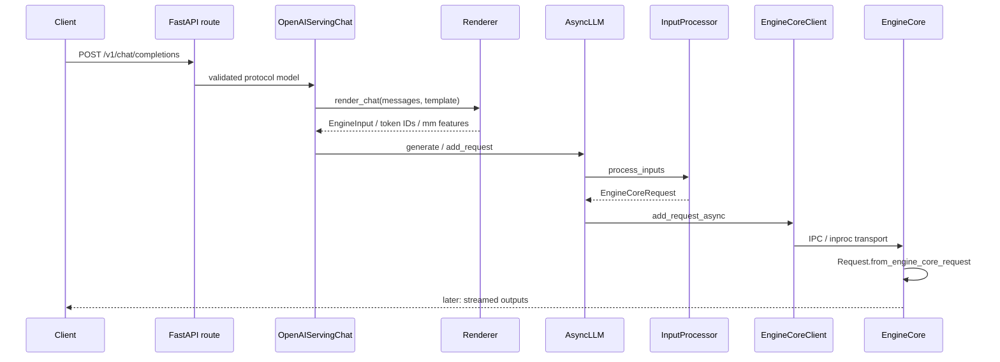

# 08. 输入处理与 Tokenization：从 OpenAI 请求到 EngineCoreRequest

> **谁该读这一篇？** 能启动 API server，但不清楚 chat template、tokenizer、多模态处理和 `AsyncLLM` 的 CPU 工作到底落在哪里的人；正在排查高 TTFT、tokenizer mismatch 或请求取消问题的工程师。
>
> **前置阅读：** [`01-entry-points.md`](01-entry-points.md)、[`01-overview/02-architecture.md`](../01-overview/02-architecture.md)。
>
> **耗时：** 约 25 分钟。
>
> **学完能：**
>
> 1. 从 `/v1/chat/completions` 追到 `EngineCoreRequest`，说清每个进程边界。
> 2. 区分 chat rendering、tokenization、input preprocessing 与 EngineCore request 初始化。
> 3. 解释 prompt embeddings、LoRA、prompt adapter、多模态 feature 在哪一层改变输入或缓存键。
> 4. 用错误类型和指标判断 CPU 前处理、队列、GPU 或网络谁在拖慢 TTFT。

> **静态复核：** 锁定 `b23bd73f540175f9e117eaee5029cd7d8df63964`；未声称 GPU 实测。

---

## 1. 一张图先看全链路



四个容易混淆的边界：

1. Pydantic/protocol validation 判断 HTTP 字段是否合法；
2. Renderer 把 messages 与 chat template 变成模型输入；
3. Input preprocessing/tokenization 把 text、tokens、embeds、多模态统一成 engine input；
4. `InputProcessor` 加上 sampling/pooling、LoRA、priority、trace 与 DP 元数据，产出跨进程契约。

## 2. OpenAI 协议层：不要从 tokenizer 开始追

<!-- vllm-source: {"path":"vllm/entrypoints/openai/chat_completion/serving.py","symbol":"OpenAIServingChat.create_chat_completion"} -->
[源码锚点：OpenAIServingChat.create_chat_completion](https://github.com/vllm-project/vllm/blob/b23bd73f540175f9e117eaee5029cd7d8df63964/vllm/entrypoints/openai/chat_completion/serving.py#L239)

协议层先处理：

- 模型名、served model 与 LoRA model 选择；
- request ID、trace headers、priority 与 disconnect 检查；
- chat messages、tools、reasoning、structured output 等协议字段；
- streaming / non-streaming 两条响应路径；
- `max_tokens`、stop、logprobs 等到 `SamplingParams` 的转换。

因此 HTTP 400 不一定进入 tokenizer；模型不存在、字段冲突、prompt/prompt_embeds 互斥等错误可能在 protocol model 或 serving 层直接返回。

## 3. Chat template 与 tokenization

Chat completion 不是把 `messages[*].content` 简单拼接。Renderer 负责：

1. 选择显式 `chat_template`、tokenizer 自带模板或模型约定；
2. 把 role/content/tool call 转成模型实际看到的文本或结构；
3. 决定是否添加 generation prompt；
4. 对多模态 content part 建立 placeholder 与 feature 的位置关系；
5. 调 tokenizer，或保留已经是 token/embedding 的输入。

最常见的“服务能跑但答案变差”问题，是离线训练/评估与在线服务使用不同 chat template、BOS/EOS 或 tokenizer revision。排查时保存“渲染后文本 + token IDs + tokenizer/model revision”，不要只保存原始 messages。

## 4. `InputPreprocessor`：统一文本、token、embeds 和多模态

<!-- vllm-source: {"path":"vllm/inputs/preprocess.py","symbol":"InputPreprocessor.preprocess"} -->
[源码锚点：InputPreprocessor.preprocess](https://github.com/vllm-project/vllm/blob/b23bd73f540175f9e117eaee5029cd7d8df63964/vllm/inputs/preprocess.py#L274)

输入形态最终归一到 `EngineInput` 家族：

| 输入 | 关键验证 | 进入模型前的形态 |
| --- | --- | --- |
| text prompt | tokenizer、special tokens、长度 | `prompt_token_ids` |
| token IDs | token 范围、长度、模型约束 | 保留 IDs，不重复 tokenize |
| prompt embeds | shape/dtype/长度与互斥字段 | `prompt_embeds`，forward 时替换对应位置 |
| multimodal | modality 数量、processor、placeholder 对齐 | token IDs + `MultiModalFeatureSpec` |
| encoder-decoder | encoder/decoder 两侧完整性 | 拆成 encoder 与 decoder engine input |

`prompt_embeds` 会绕过普通文本 tokenization，但仍需要长度、模型能力和位置约束。它不是“任意 tensor 直通 GPU”的后门。

## 5. `InputProcessor.process_inputs()`：跨 EngineCore 的契约

<!-- vllm-source: {"path":"vllm/v1/engine/input_processor.py","symbol":"InputProcessor.process_inputs"} -->
[源码锚点：InputProcessor.process_inputs](https://github.com/vllm-project/vllm/blob/b23bd73f540175f9e117eaee5029cd7d8df63964/vllm/v1/engine/input_processor.py#L242)

这里做当前 V1 的最后一轮输入侧组装：

- 校验 `SamplingParams` / `PoolingParams` 与 supported task；
- 校验 LoRA request 和 data-parallel rank；
- 拆 encoder/decoder input，并调用平台 request validation；
- 补齐 `max_tokens`，合并 generation config、tokenizer EOS 等规则；
- 生成 multimodal feature spec 与 cache metadata；
- 附上 arrival time、priority、trace headers、resumable/streaming 状态；
- 产出可序列化的 `EngineCoreRequest`。

源码已经提示：把 raw prompt 直接交给 `InputProcessor` 的路径在弃用，新的调用者应先使用 Renderer 的 `render_cmpl()` / `render_chat()`。写扩展时不要复制将被移除的兼容路径。

## 6. `AsyncLLM.add_request()`：异步安全与取消

<!-- vllm-source: {"path":"vllm/v1/engine/async_llm.py","symbol":"AsyncLLM.add_request"} -->
[源码锚点：AsyncLLM.add_request](https://github.com/vllm-project/vllm/blob/b23bd73f540175f9e117eaee5029cd7d8df63964/vllm/v1/engine/async_llm.py#L280)

`AsyncLLM` 不是一个简单队列：

- engine 已失败时立即抛 `EngineDeadError`；
- 检查某些 KV sharing 与 prompt logprobs 的不兼容组合；
- streaming input 使用独立添加/更新流程；
- output collector 在请求提交前建立，避免首个输出与消费者注册竞态；
- 调用失败或客户端断开时，abort 必须同时通知 output processor 与 EngineCore。

客户端断开 ≠ GPU 立即停止。取消信号要跨 event loop、output collector、core client 到 Scheduler；已提交的 kernel 也不能在任意指令点被强制中断。生产容量模型必须允许这段取消传播延迟。

## 7. EngineCore 侧的最后一步

<!-- vllm-source: {"path":"vllm/v1/engine/core.py","symbol":"EngineCore.preprocess_add_request"} -->
[源码锚点：EngineCore.preprocess_add_request](https://github.com/vllm-project/vllm/blob/b23bd73f540175f9e117eaee5029cd7d8df63964/vllm/v1/engine/core.py#L954)

EngineCore 将传输对象转为内部 `Request`，并处理只有 core 才掌握的状态：

- request ID 隔离/映射；
- multimodal receiver cache；
- block hash 生成所需状态；
- structured-output grammar 的异步初始化；
- request wave / resumable 等调度信息。

到这里才进入 Scheduler 的 waiting 队列。把“HTTP 已返回 200/stream headers”当成“请求已在 GPU running”是错误的可观测性假设。

## 8. CPU 成本与 backpressure

输入侧 CPU 热点通常来自：

- 大 prompt 的 tokenizer；
- chat template / tool schema / JSON 处理；
- 图像解码、resize、vision processor；
- prompt embeds 反序列化与校验；
- grammar 编译；
- 大量短请求导致 event loop、IPC 与对象分配开销占比上升。

诊断要把时间拆成：HTTP 排队 → validation/render/tokenize → EngineCore queue → scheduled → first model output → detokenize/network。只有第一段上升时，调 GPU 参数通常无效。

backpressure 原则：

1. 在进入昂贵 tokenizer/mm processor 前做 body size、并发和租户 quota；
2. 为 CPU 前处理设置有界队列，不无限创建 async task；
3. 把取消传到正在等待的前处理任务；
4. 对多模态下载设置域名 allowlist、大小、超时和解码资源限制；
5. 不在 event loop 上运行不可让出的长 CPU 工作。

## 9. 五类失败怎么定位

| 失败 | 常见层 | 证据 | 处置 |
| --- | --- | --- | --- |
| invalid input | protocol/serving | 4xx、字段级错误 | 修请求；不要重试放大流量 |
| tokenizer mismatch | renderer/tokenizer | 相同 messages 得到不同 IDs | 固定 model/tokenizer revision 与 template |
| oversized prompt | processor/config | prompt + max tokens 超 model limit | 前置 token budget、截断或拒绝 |
| multimodal limit | protocol/mm processor | item 数、像素、feature token 超限 | 网关限额与模型配置一致 |
| cancellation leak | async/core boundary | client 断开后 running/waiting 不下降 | trace abort IDs，核对 core ack 与 collector 清理 |

错误分类还决定重试：输入错误不重试；EngineCore 暂时过载可带 jitter/backoff；客户端取消不应转换成服务端自动重试。

## 10. 无 GPU 源码 trace

```bash
cd /path/to/vllm
grep -n "async def create_chat_completion" vllm/entrypoints/openai/chat_completion/serving.py
grep -n "def process_inputs" vllm/v1/engine/input_processor.py
grep -n "async def add_request" vllm/v1/engine/async_llm.py
grep -n "def preprocess_add_request" vllm/v1/engine/core.py
```

练习输出一张五列表：API object、internal object、process boundary、状态变化、可观测证据。额外为 invalid model、oversized prompt 和 disconnect 各画一条提前退出路径。

## 11. 远端 endpoint 实验

不要求本机安装 vLLM，只要有授权的测试 endpoint：

```bash
export VLLM_TEST_ENDPOINT=http://127.0.0.1:8000
curl -N -sS "$VLLM_TEST_ENDPOINT/v1/chat/completions" \
  -H 'Content-Type: application/json' \
  -d '{
    "model": "your-served-model",
    "messages": [{"role": "user", "content": "用一句话解释 KV cache"}],
    "max_tokens": 32,
    "stream": true
  }'
```

记录 DNS/connect、response headers、首个 data chunk、末 chunk 四个时间点。再分别发送非法 model、超过限制的 prompt，并在流式请求中途 Ctrl-C；用服务日志确认三条路径是否进入 EngineCore、是否触发 abort。

## 12. 生产检查表

- [ ] model、tokenizer、chat template revision 可追溯；
- [ ] body/token/multimodal/tenant limits 在昂贵处理前生效；
- [ ] CPU 前处理有界并发与 queue time 指标；
- [ ] request ID 贯穿网关、API、EngineCore 和输出日志；
- [ ] 4xx、429、5xx、disconnect 使用不同重试策略；
- [ ] prompt 文本/embedding 的日志与 trace 满足脱敏要求；
- [ ] LoRA、prompt adapter、multimodal 标识进入正确 cache 隔离键；
- [ ] 取消与 shutdown 有 drain 超时和泄漏监控。

## 13. 面试回答

**30 秒版：**

> Chat 请求先在 OpenAI serving 层做协议校验和 chat rendering，再由 InputPreprocessor 统一 text/tokens/embeds/multimodal，`InputProcessor.process_inputs` 合并采样、LoRA、priority 和 trace，生成 `EngineCoreRequest`。`AsyncLLM` 通过 core client 提交；EngineCore 再建立内部 Request 和 grammar/hash 状态，最后进入 Scheduler。CPU 前处理、EngineCore queue、GPU 和输出网络必须分段观测。

**3 分钟追问框架：** 按“协议 → Renderer → EngineInput → EngineCoreRequest → internal Request”五层展开；每层各讲数据契约、失败、取消和可观测证据，再补 tokenizer/template 一致性与多租户资源限制。

## 小结

- HTTP model 不是 EngineCore Request；中间有 rendering、preprocessing 与 input processing 三个语义边界。
- tokenizer/template 漂移会改变 token IDs、长度、cache hit 和最终答案。
- 多模态、embeds、LoRA 不只是 API 参数，还影响 feature、forward 输入与缓存隔离。
- TTFT 要分段；CPU preprocessing 慢时调 Scheduler/GPU 没用。

## 自检

1. protocol validation 与 platform request validation 分别能拦什么？
2. 为什么 raw prompt 直传 `InputProcessor` 是不应继续依赖的兼容路径？
3. prompt embeds 绕过了什么，又没有绕过什么？
4. client disconnect 后为何不能假设 GPU 立刻停止？
5. 你会为 tokenizer mismatch 留下哪三份证据？

### 参考答案

1. protocol validation 负责通用 API 形状、字段类型、互斥参数和安全边界；platform request validation 负责当前模型、平台和 backend 能否执行，例如 multimodal、pooling、LoRA 或 attention 限制。前者是“请求是否合法”，后者是“当前服务能否接”。
2. raw prompt 直传绕过了统一的 rendering/tokenizer/template 语义，容易让不同入口得到不同 token IDs、prompt length 和 cache key。它可能保留兼容性，但只能作为明确版本化的 fallback，不能成为生产默认路径。
3. prompt embeds 绕过 tokenizer 和文本 template，因为调用方已经提供 embedding；但它没有绕过长度、dtype、shape、模型 hidden size、KV cache、scheduler、batching 和安全/配额校验。embeds 也不能自动证明与目标 tokenizer 语义等价。
4. disconnect 通常只让 HTTP/streaming 层停止发送；EngineCore 可能已经把请求排入 GPU、NCCL 或 connector transfer。必须通过 abort/cancel 信号、request status、finished/aborted metrics 和 KV usage 下降确认最终释放，而不是看到 TCP 断开就认为 GPU 停了。
5. 保存同一请求的 tokenizer/model revision/template 指纹、输入 token IDs/长度 hash、以及服务端与客户端的 rendered prompt/response usage 对照。不要把原始敏感 prompt 写进日志；可保存脱敏 hash、长度和必要的 token-ID 证据。

## 下一步

- [`02-scheduler.md`](02-scheduler.md)：EngineCore Request 如何获得本步 token/KV 预算。
- [`09-output-processing-and-streaming.md`](09-output-processing-and-streaming.md)：反向追输出、detokenization、streaming 与取消。
