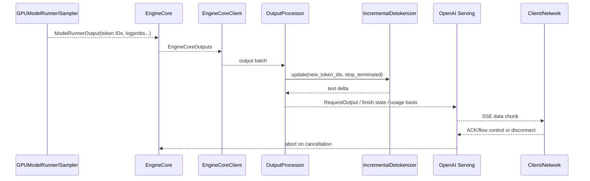

# 09. 输出处理与流式返回：从 Sampler 到 SSE

> **谁该读这一篇？** 想解释“GPU 已经出 token，为什么客户端还没看到”、排查流式卡顿、乱码、stop 多吐字、usage 不一致或取消不生效的工程师。
>
> **前置阅读：** [`04-model-runner.md`](04-model-runner.md)、[`08-input-processing-and-tokenization.md`](08-input-processing-and-tokenization.md)。
>
> **耗时：** 约 25 分钟。
>
> **学完能：**
> 1. 从 `ModelRunnerOutput` 追到 `RequestOutput` 与 OpenAI SSE chunk。
> 2. 区分采样、stop、incremental detokenization、usage 与协议序列化职责。
> 3. 分离 TTFT、ITL、scheduler/forward、detokenize 和网络 backpressure。
> 4. 设计取消、慢客户端与中途错误的资源回收路径。

> **静态复核：** 锁定 `b23bd73f540175f9e117eaee5029cd7d8df63964`；本章没有当前 SHA 的网络/GPU 实测徽章。

---

## 1. 输出链路总览



GPU 输出的是 token IDs 与附加张量，不是最终 JSON。首 token 要经过 EngineCore、IPC、output processor、detokenizer、协议序列化和网络，任一段都能扩大客户端 TTFT。

## 2. Sampler 输出不等于用户输出

Model runner 的 sampler 负责从 logits 选 token，并产出需要的 logprob/grammar/spec-decode 信息。随后还要决定：

- token 是接受的正式输出、被拒的 speculative token，还是 placeholder；
- EOS、stop token、`max_tokens` / model length 是否结束；
- stop string 是否需要等待更多字符才能确认；
- `n > 1` 时属于哪个 choice；
- 请求是否要返回 prompt/output logprobs。

所以“每个 forward 一定返回一个可见字符”不成立：token 可能解码为空、是多字节/子词的一部分、被 stop buffer 暂存，或仅用于内部状态。

## 3. `OutputProcessor.process_outputs()`

<!-- vllm-source: {"path":"vllm/v1/engine/output_processor.py","symbol":"OutputProcessor.process_outputs"} -->
[源码锚点：OutputProcessor.process_outputs](https://github.com/vllm-project/vllm/blob/b23bd73f540175f9e117eaee5029cd7d8df63964/vllm/v1/engine/output_processor.py#L586)

OutputProcessor 是 EngineCore 输出到用户请求状态的主汇合点：

1. 按 request ID 找到 `RequestState` 和 collector；
2. 合并 token IDs、logprobs、events 与 finish 状态；
3. 让 detokenizer 增量生成 text delta；
4. 更新 prompt/output token 计数和 timing；
5. 生成 `RequestOutput`，推入 async collector；
6. 对 finished/aborted 请求清理状态，并把需要的 abort 反馈给 EngineCore。

`RequestOutputCollector` 必须处理生产者快于消费者的情况。slow client 若让 collector/HTTP send 无限堆积，会把网络问题转换成 API 进程内存问题。

## 4. Incremental detokenization 为什么有状态

<!-- vllm-source: {"path":"vllm/v1/engine/detokenizer.py","symbol":"IncrementalDetokenizer.update"} -->
[源码锚点：IncrementalDetokenizer.update](https://github.com/vllm-project/vllm/blob/b23bd73f540175f9e117eaee5029cd7d8df63964/vllm/v1/engine/detokenizer.py#L41)

Tokenizer 的 token → text 并非逐 token 独立函数：

- BPE/SentencePiece token 可能需要相邻上下文；
- UTF-8 字符可能跨 token 才完整；
- special token 是否跳过受请求参数影响；
- stop string 可能跨多个 delta；
- byte fallback 会让中间状态暂时不可显示。

因此 detokenizer 保存已读 IDs、prefix/offset 与 stop buffer。遇到乱码时，先确认客户端是否错误地把每个 chunk 当独立字符串解码；服务端也不能为低延迟直接跳过增量状态。

## 5. Stop 与 finish reason

结束条件分层：

| 条件 | 发现位置 | 用户可见结果 |
| --- | --- | --- |
| EOS / stop token ID | engine/output state | 通常不输出终止 token |
| stop string | detokenized text | 可能缓存尾部字符，确认后裁剪 |
| `max_tokens` | request token count | finish reason `length` |
| max model length | scheduler/engine | length/限制相关结束 |
| abort / disconnect | serving/output/core | 无正常 finish chunk 或中止错误 |
| engine error | core client/serving | 5xx 或流中断，取决于 headers 是否已发送 |

`ignore_eos`、`include_stop_str_in_output` 等参数会改变细节。协议层的 finish reason 是对内部状态的映射，不应该靠客户端猜最后一个 token。

## 6. Logprobs 与 usage

logprobs 成本不只是 JSON 变大：runner 要保留/传输额外 top-k 信息，output processor 要对齐 token，协议层还要序列化。大 `logprobs` + 高并发可让 CPU 和网络成为瓶颈。

Usage 至少区分：

- prompt tokens；
- cached prompt tokens / prompt token details；
- completion tokens；
- choices `n` 对总输出的影响；
- speculative tokens 不应按未接受 draft 计费；
- streaming usage 是否仅在尾 chunk 返回或连续返回。

客户端必须显式请求/支持流式 usage；如果连接在尾 chunk 前中断，客户端观察值可能不完整，服务端计费应基于内部最终记录而不是“客户端收到多少 chunk”。

## 7. OpenAI SSE 流

<!-- vllm-source: {"path":"vllm/entrypoints/openai/chat_completion/serving.py","symbol":"OpenAIServingChat.chat_completion_stream_generator"} -->
[源码锚点：OpenAIServingChat.chat_completion_stream_generator](https://github.com/vllm-project/vllm/blob/b23bd73f540175f9e117eaee5029cd7d8df63964/vllm/entrypoints/openai/chat_completion/serving.py#L414)

流式 generator 负责把内部 delta 转成 OpenAI-compatible chunk：

- 首 chunk 的 role/choice 初始化；
- content、reasoning、tool call 等不同 delta；
- 每个 choice 的 index、logprobs 与 finish reason；
- 可选 continuous/final usage；
- 最终 `[DONE]`；
- exception 到 SSE error/连接中断的映射。

代理层必须关闭不合适的 response buffering，并配置足够的 idle timeout。否则 server 正常逐 token yield，客户端仍可能几秒一批收到。

## 8. 一条时间线拆开 TTFT/ITL

```mermaid
gantt
    title 一次流式请求的延迟分解（示意）
    dateFormat X
    axisFormat %L
    section 输入
    网关与前处理        :a, 0, 20
    EngineCore 排队     :b, 20, 55
    section 执行
    首次调度与 prefill  :c, 55, 115
    sampler/output IPC  :d, 115, 123
    section 输出
    detokenize/JSON     :e, 123, 128
    网络到客户端        :f, 128, 140
    后续 iteration      :g, 140, 175
```



- 客户端 TTFT：发送完成到收到首个可见 SSE delta；
- 服务端 `time_to_first_token_seconds`：服务端定义的请求生命周期到首 token，通常不含完整外部网络；
- inter-token latency：相邻输出事件间隔分布；
- TPOT：请求级、排除首 token 的平均值；
- scheduler/forward time：只解释引擎内部一部分；
- network gap：server yield 到 client receive 的差值，需要两端时间戳或 trace。

不要用平均 TPOT 替代 ITL p99：平均值正常时，周期性长 step、GC、代理 flush 仍会造成卡顿。

## 9. 取消与 backpressure

<!-- vllm-source: {"path":"vllm/v1/engine/async_llm.py","symbol":"AsyncLLM.abort"} -->
[源码锚点：AsyncLLM.abort](https://github.com/vllm-project/vllm/blob/b23bd73f540175f9e117eaee5029cd7d8df63964/vllm/v1/engine/async_llm.py#L709)

取消的安全顺序：

1. HTTP 层发现 disconnect 或应用取消；
2. 停止继续向该 socket 写；
3. `AsyncLLM.abort` 清 output processor/collector，并向 EngineCore 发 abort；
4. Scheduler 从 waiting/running 移除并释放 KV/encoder 状态；
5. runner 在差量状态中清理持久 request row。

正在执行的 GPU kernel 通常运行到完成；取消收益主要从后续 step 开始。必须让 abort 幂等，因为 disconnect、timeout、shutdown 与内部错误可能同时触发。

慢客户端策略要显式：

- 有界 per-request buffer；
- send timeout 与最大积压字节；
- 超限 abort，而不是无限占 KV；
- 网关/mesh 禁止聚合 SSE；
- 记录 server-yield 和 socket-send 延迟。

## 10. 错误传播

在首个 response headers 前，服务可以返回结构化 4xx/5xx；headers/SSE 已开始后，HTTP status 不能重写，只能发协议允许的 error event 或关闭连接。客户端库必须把“正常 `[DONE]`”“带 error event”“EOF without DONE”区分开。

重试安全性：已经收到部分文本后自动重试会产生重复内容和重复计费。若业务需要续传，必须用 request ID、已确认 token/offset 与服务端 resumable 协议，而不是盲目重发完整请求。

## 11. curl 与 Python 实验

```bash
export VLLM_TEST_ENDPOINT=http://127.0.0.1:8000
curl -N -sS -w '\nconnect=%{time_connect} start=%{time_starttransfer} total=%{time_total}\n' \
  "$VLLM_TEST_ENDPOINT/v1/chat/completions" \
  -H 'Content-Type: application/json' \
  -d '{"model":"your-served-model","messages":[{"role":"user","content":"数到 20"}],"stream":true,"stream_options":{"include_usage":true},"max_tokens":64}'
```

Python 客户端应记录每一行到达的 monotonic timestamp，而不是只打印文本：

```python
import json, time, requests

started = time.monotonic()
with requests.post(
    "http://127.0.0.1:8000/v1/chat/completions",
    json={
        "model": "your-served-model",
        "messages": [{"role": "user", "content": "数到 20"}],
        "stream": True,
        "max_tokens": 64,
    },
    stream=True,
    timeout=(5, 60),
) as response:
    response.raise_for_status()
    for line in response.iter_lines(decode_unicode=True):
        if line:
            print(f"{time.monotonic() - started:.6f}s {line}")
```

实验三次：正常消费、每个 chunk 后 sleep 1 秒模拟慢客户端、中途关闭连接。对照 running/waiting、KV usage、abort 日志和服务端/客户端 chunk 时间。

## 12. 生产检查表

- [ ] SSE proxy buffering 关闭，idle/read timeout 大于允许的最长 token gap；
- [ ] per-request output buffer 有界，慢消费者触发 abort；
- [ ] TTFT/ITL/TPOT 使用清晰定义和直方图，不混用平均值；
- [ ] server yield、socket send、client receive 可用 request ID 对齐；
- [ ] usage/finish reason 在 streaming 与 non-streaming 一致；
- [ ] logprobs、`n`、tool/reasoning delta 有容量和兼容测试；
- [ ] disconnect、timeout、shutdown、engine error 的 abort 幂等；
- [ ] 客户端识别 `[DONE]`、error event 与异常 EOF。

## 13. 面试回答

**30 秒版：**

> Sampler 产出 token IDs/logprobs，EngineCore 经 client 把它交给 OutputProcessor。OutputProcessor 维护请求状态、stop、usage 与增量 detokenizer，生成 RequestOutput；OpenAI serving 再映射成 SSE delta。客户端 TTFT 还包含 IPC、detokenize、JSON 和网络，ITL 也可能被 proxy buffering 或慢客户端放大。取消要从 HTTP 传播到 AsyncLLM、Scheduler 和 runner，并释放 KV。

**3 分钟版：** 按 sampler → EngineCoreOutputs → OutputProcessor → detokenizer → protocol → network 六层展开；每层讲数据契约、延迟、错误和资源回收，最后用双端时间戳定位 backpressure。

## 小结

- token ID 到可见 SSE 还有完整 CPU/IPC/网络链路。
- 增量 detokenization 与 stop string 都有跨 token 状态。
- usage、logprobs、finish reason 是协议契约，不应从文本反推。
- 慢客户端必须有界并最终 abort，否则长期占用 collector、内存与 KV。

## 自检

1. 为什么一个 sampled token 可能不产生可见 delta？
2. TTFT 指标正常但客户端首字慢，优先查哪三段？
3. streaming usage 尾 chunk 丢失时，服务端计费应以什么为准？
4. headers 已发送后发生 EngineCore error，HTTP 层还能做什么？
5. 慢消费者为什么会反向影响 KV 容量？

## 下一步

- [`07-hands-on/05-serve-openai-api.md`](../07-hands-on/05-serve-openai-api.md)：启动服务并验证 streaming/usage/error。
- [`08-production-deployment/05-slo-and-observability.md`](../08-production-deployment/05-slo-and-observability.md)：把分段延迟做成 SLO 与仪表盘。
