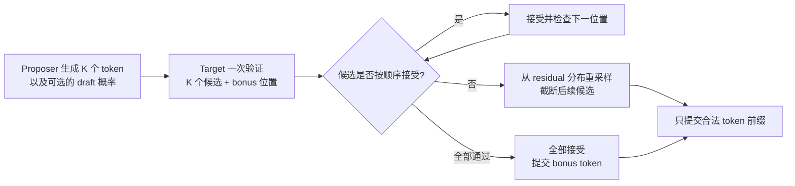
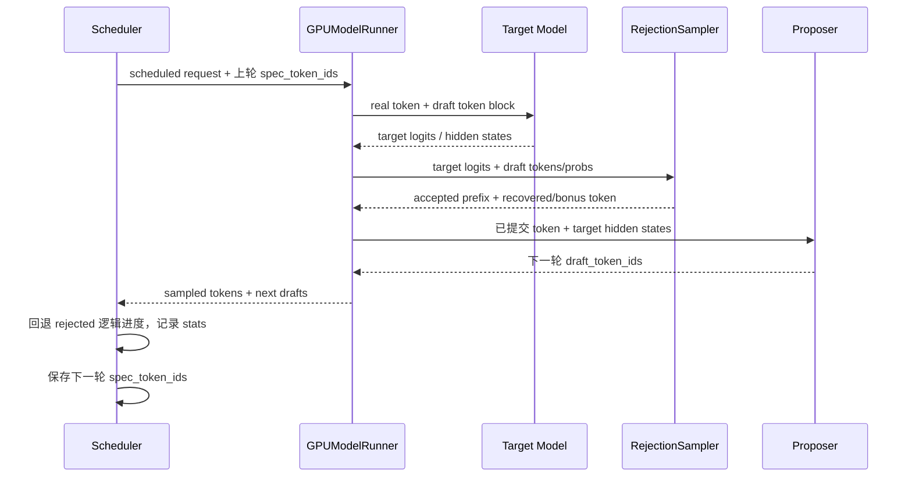

# 02. Speculative Decoding（投机推理）：从 EAGLE3、并行 Draft 到自适应验证

> **谁该读这一篇？** 想降低单请求 / 小 batch TPOT 的推理工程师；要为代码、Agent、RL rollout 选择 proposer 的平台工程师；希望沿 vLLM V1 源码追踪 proposal、verification、rejection sampling 与 KV 状态提交的贡献者。
>
> **前置阅读：** [`02-scheduler.md`](../03-code-walkthrough/02-scheduler.md)、[`03-kv-cache-manager.md`](../03-code-walkthrough/03-kv-cache-manager.md)、[`04-model-runner.md`](../03-code-walkthrough/04-model-runner.md)、[`01-sampling-and-logits.md`](../09-advanced-features/01-sampling-and-logits.md)
>
> **耗时：** 约 25 分钟
>
> **学完能：**
>
> 1. 推导标准 speculative sampling 的接受与 residual resampling 公式，并说清“无损”的边界
> 2. 按 proposal 成本、串并行方式和 workload 选择 n-gram、Suffix、Draft Model、EAGLE3、MTP、PARD、DFlash 或 DSpark
> 3. 沿 `SpeculativeConfig -> Scheduler -> GPUModelRunner -> RejectionSampler -> metrics` 追踪一次完整迭代
> 4. 解释 dynamic K、confidence-aware adaptive verification、跨词表 TLI 为什么代表当前演进方向
> 5. 用接受长度、位置接受率、TPOT、吞吐与显存做可复现的开关实验

> **版本边界（2026-08-25）：** 本书的可执行源码契约锁定在 `b23bd73f540175f9e117eaee5029cd7d8df63964`。本文主体均可在该版本定位；最后的“上游前沿观察”另外核验到 vLLM `main@5e379a361e3ea8bb82b7efd768c36f39a0cf32fd`，并用独立的不可变链接标记，不能反推旧版本已支持同一能力。

投机推理不是“用小模型替换大模型”，而是把 **proposal 与 verification 解耦**：便宜的 proposer 猜一段候选，target 模型并行验证，再只提交数学上合法的前缀。它买到的是“更少的串行 decode step”，支付的是 draft 计算、额外 target query、采样与状态管理开销。

这也决定了它最适合的区域：**中低 QPS、decode 仍偏 memory-bound、接受长度足够高**。高并发下 `batch_size x K` 把验证推向 compute-bound，固定的 `K` 很容易从收益变成负担。

---

## 1. 先看结果：一次验证到底提交几个 token

设 proposer 给出 `K=4` 个候选：

```text
draft:   [A, B, C, D]
target:  [A, B, X, ...]
commit:  [A, B, R]
```

- `A、B` 通过验证；
- `C` 在第 3 个位置被拒绝，后面的 `D` 随之失效；
- `R` 从 target 与 draft 的 residual distribution 采样，保证当前位置仍服从 target；
- 本步提交 3 个 token，下一步从 `R` 继续。

如果 4 个候选全部接受，target 已经算出了下一位置的分布，因此还能提交 1 个 bonus token：

```text
draft:   [A, B, C, D]
target:  [A, B, C, D, E]
commit:  [A, B, C, D, E]   # K + 1
```

所以工程上更有用的指标不是孤立的“命中率”，而是：

```text
mean_acceptance_length
  = 1 + accepted_draft_tokens / verification_steps
```

这里的 `1` 是每个 verification step 至少会提交的 target-origin token：要么是首个拒绝位置的 recovered token，要么是全接受后的 bonus token。

---

## 2. 为什么标准 speculative sampling 无损

在位置 `i`，target 分布为 `p_i(x)`，draft 分布为 `q_i(x)`，draft 提议 `x_i ~ q_i`。标准算法以

```text
a_i(x_i) = min(1, p_i(x_i) / q_i(x_i))
```

的概率接受；一旦拒绝，就从

```text
r_i(x) = max(p_i(x) - q_i(x), 0) / Z
```

重新采样并停止验证后续候选。接受分支贡献 `min(p_i, q_i)`，拒绝分支补上 `p_i - min(p_i, q_i)`，两者相加仍是 `p_i`。



vLLM 的经典 V1 runner 在 `RejectionSampler.forward` 中分别取 bonus logits 与 target logits，应用 sampling constraints 后进入 `rejection_sample`：

<!-- vllm-source: {"path":"vllm/v1/sample/rejection_sampler.py","symbol":"RejectionSampler.forward"} -->
[RejectionSampler.forward](https://github.com/vllm-project/vllm/blob/b23bd73f540175f9e117eaee5029cd7d8df63964/vllm/v1/sample/rejection_sampler.py#L94)

Model Runner V2 则把 `standard / synthetic / block` 三种 verification 路径收进独立 sampler。`block` 并不是“整块要么全收”，它改变联合验证和 residual 的计算方式：

<!-- vllm-source: {"path":"vllm/v1/worker/gpu/spec_decode/rejection_sampler.py","symbol":"RejectionSampler"} -->
[Model Runner V2 RejectionSampler](https://github.com/vllm-project/vllm/blob/b23bd73f540175f9e117eaee5029cd7d8df63964/vllm/v1/worker/gpu/spec_decode/rejection_sampler.py#L43)

### 2.1 “无损”有三个边界

1. **只对具有正确 acceptance / residual 规则的路径成立。** `rejection_sample_method="synthetic"` 是压测和建模工具，按人为接受率丢弃候选，不应宣称与 target 分布等价。
2. **数学等价不等于 bitwise 相同。** batch shape、kernel、浮点精度、随机数消费顺序都可能改变单次输出或 logprob；应验证分布与质量门禁，而不是只比较一条字符串。
3. **logits processor 必须逐候选位置保持语义。** penalties、bad words、structured output、thinking budget 等状态不能把被拒绝 token 当成已提交历史。当前 sampler 为 draft 位置展开这些约束，而 structured output 还需要验证和回滚 grammar 状态。

---

## 3. 当前方法地图：不要只记算法名

选择 proposer 时，先问三件事：**需不需要额外权重、proposal 是否串行、机会来自模型知识还是 workload 重复性**。

| 方法 | Proposal 来源 | Draft 阶段 | 额外权重 | 更适合的机会 | 主要风险 |
| --- | --- | --- | --- | --- | --- |
| `ngram` | 当前请求 token 历史 | CPU / Numba 查找 | 无 | prompt 内重复、代码补全 | 长匹配少时接受长度短 |
| `ngram_gpu` | 当前请求 token 历史 | GPU 查找 | 无 | 高并发、希望避免 CPU proposal | GPU 状态与同步开销也要测 |
| `suffix` | prompt + 过去生成的 suffix tree | 自适应树查找 | 无，需 Arctic Inference | Agent 循环、代码编辑、RL rollout | 非重复 workload 收益有限，缓存有容量成本 |
| `draft_model` | 独立小 LM | 通常自回归 K 步 | 有 | 通用 target、有合适小模型 | draft 串行时延、显存、词表兼容 |
| `eagle / eagle3` | target hidden states + 轻量 head | 特征 / token 级自回归 | 有 | 已有配套 EAGLE head | checkpoint 必须匹配 target；aux hidden state 增加耦合 |
| `mtp` | target 原生未来 token 模块 | 模型家族决定 | 通常随 target 自带 | DeepSeek / Qwen / GLM 等原生 MTP 模型 | 不是任意模型都能“打开 MTP” |
| PARD | 适配后的 parallel draft model | 单次并行预测 K 个位置 | 有 | 降低串行 draft 开销 | 必须使用按 parallel drafting 训练的权重 |
| `dflash` | target 多层 hidden state + masked query block | 单次并行 block forward | 有 | 配套 DFlash checkpoint | attention backend、query/KV 布局更复杂 |
| `dspark` | 并行 block backbone + 顺序/Markov 修正 | 混合并行与轻量顺序阶段 | 有或随模型提供 | 新一代 block drafter、可输出 confidence | checkpoint / target 强耦合，能力仍快速演进 |
| `medusa / mlp_speculator` | 多 head 或 MLP | 依模型实现 | 有 | 兼容的历史 checkpoint | runner / 模型支持面需逐版本核验 |

配置层公开的方法集合、MTP 家族枚举和高级开关都集中在 `SpeculativeConfig`；表格只说明设计类别，**真正的支持矩阵以配置校验、model registry、runner 分支和 E2E tests 四者交集为准**。

<!-- vllm-source: {"path":"vllm/config/speculative.py","symbol":"SpeculativeConfig"} -->
[SpeculativeConfig](https://github.com/vllm-project/vllm/blob/b23bd73f540175f9e117eaee5029cd7d8df63964/vllm/config/speculative.py#L82)

### 3.1 EAGLE3：从顶层特征预测走向多层特征融合

EAGLE 的关键不是“再放一个小 LM”，而是复用 target hidden states。EAGLE-3 更进一步：论文把目标改为直接 token prediction，并融合 target 多层特征，避免只依赖顶层特征。vLLM 侧对应两个明确集成点：

- `EagleProposer` 继承统一的 model-based proposer，并声明需要 target hidden states；
- `GPUModelRunner._setup_eagle3_aux_hidden_state_outputs` 依据 draft config 选择 target 的辅助层输出。

<!-- vllm-source: {"path":"vllm/v1/spec_decode/eagle.py","symbol":"EagleProposer"} -->
[EagleProposer](https://github.com/vllm-project/vllm/blob/b23bd73f540175f9e117eaee5029cd7d8df63964/vllm/v1/spec_decode/eagle.py#L10)

<!-- vllm-source: {"path":"vllm/v1/worker/gpu_model_runner.py","symbol":"GPUModelRunner._setup_eagle3_aux_hidden_state_outputs"} -->
[EAGLE3 aux hidden-state wiring](https://github.com/vllm-project/vllm/blob/b23bd73f540175f9e117eaee5029cd7d8df63964/vllm/v1/worker/gpu_model_runner.py#L5424)

这也解释了部署约束：EAGLE3 head 不是只看 vocabulary 是否相同，还要匹配 target 架构、hidden size、被抽取层和训练约定。随便把一个 EAGLE3 checkpoint 接到“同规模”模型上，通常不是低接受率问题，而是契约错误。

### 3.2 MTP：训练时能力，推理时仍要验证

原生 Multi-Token Prediction 让 target checkpoint 自带未来 token 模块。vLLM 会根据 target HF config 映射出对应 MTP architecture，并把它接入与 EAGLE 共用的 proposer 框架。它省掉独立 draft model 的选择，但不意味着：

- proposal 是免费的；MTP layer 仍有 forward、KV 与显存成本；
- 所有未来 token 可以直接提交；它们仍需 target verification；
- `num_speculative_tokens` 可以无限加大；模型训练的 `n_predict`、runner 和 KV layout 都会限制深度。

当前配置代码已经枚举多个 MTP model type，并把旧的 family-specific method 归一为 `method="mtp"`。因此生产配置应优先写通用方法名，让 vLLM 从 target config 推导具体 architecture。

### 3.3 PARD、DFlash、DSpark：前沿重点是消除 draft 的 K 步串行

传统小 draft model 为了提议 K 个 token，自己也要自回归 K 次。PARD 训练模型在一次 forward 中并行预测多个未来位置，在 vLLM 中表现为：

```json
{
  "method": "draft_model",
  "model": "amd/PARD-Qwen3-0.6B",
  "num_speculative_tokens": 12,
  "parallel_drafting": true
}
```

`SpecDecodeBaseProposer.propose` 对 `parallel_drafting` 走一次 forward，否则循环生成后续候选：

<!-- vllm-source: {"path":"vllm/v1/spec_decode/llm_base_proposer.py","symbol":"SpecDecodeBaseProposer.propose"} -->
[SpecDecodeBaseProposer.propose](https://github.com/vllm-project/vllm/blob/b23bd73f540175f9e117eaee5029cd7d8df63964/vllm/v1/spec_decode/llm_base_proposer.py#L502)

DFlash 也把 masked query block 放进一次 non-causal / infill 风格的 draft forward，并从 target hidden states 预计算 context K/V。它不是简单的 `draft_model + parallel_drafting=true` 别名：scheduler 甚至要为它多预留一个 query slot。

<!-- vllm-source: {"path":"vllm/v1/spec_decode/dflash.py","symbol":"DFlashProposer.set_inputs_first_pass"} -->
[DFlash 首次并行 proposal 输入](https://github.com/vllm-project/vllm/blob/b23bd73f540175f9e117eaee5029cd7d8df63964/vllm/v1/spec_decode/dflash.py#L101)

DSpark 在此基础上把 block proposal 与轻量的顺序依赖修正组合起来。锁定版本已包含 `method="dspark"`、专用 lookahead 规则与模型实现；它的 confidence-aware verification 则属于后续上游演进，见第 8 节。

### 3.4 Suffix Decoding：Agent workload 让“数据本身”成为 drafter

普通 n-gram 只在当前 token 序列内找匹配。Suffix Decoding 同时维护 request-local prompt tree 和跨请求 global suffix tree，根据频次估计 continuation 概率，并逐请求动态决定 proposal 长度。它把机会从“模型更聪明”转成“工作负载高度重复”：

- 代码编辑会反复复制未改动区域；
- Agent self-reflection / tool loop 会重复模板与上下文；
- RL rollout 会从相似 prompt 生成结构近似的轨迹。

`SuffixDecodingProposer.propose` 会先把本轮真正提交的 token 写回 suffix cache，再查询新的候选，因此被拒绝 token 不会污染后续树状态。

<!-- vllm-source: {"path":"vllm/v1/spec_decode/suffix_decoding.py","symbol":"SuffixDecodingProposer.propose"} -->
[SuffixDecodingProposer.propose](https://github.com/vllm-project/vllm/blob/b23bd73f540175f9e117eaee5029cd7d8df63964/vllm/v1/spec_decode/suffix_decoding.py#L35)

### 3.5 TLI：draft 与 target 不再必须共享 tokenizer

传统 draft model 要求 vocabulary 对齐，否则同一个 token id 在两个模型里可能代表不同字符串。`use_heterogeneous_vocab=true` 启用 Token-Level Intersection（TLI）：

1. 初始化时规范化两个 tokenizer 的 token 字符串；
2. 构造 `draft_to_target`、`target_to_draft` 映射与交集 mask；
3. 把 draft logits 限制在交集 token；
4. proposal 后把 draft id 翻译成 target id，再做 verification。

<!-- vllm-source: {"path":"vllm/v1/spec_decode/vocab_mapping.py","symbol":"VocabMapping"} -->
[VocabMapping](https://github.com/vllm-project/vllm/blob/b23bd73f540175f9e117eaee5029cd7d8df63964/vllm/v1/spec_decode/vocab_mapping.py#L68)

它扩大了可选 draft 模型池，但交集小会限制 proposal 分布，也会降低接受率。锁定版本只允许 `method="draft_model" + greedy draft sampling` 组合；不能把 TLI 理解为任意 tokenizer、任意 sampling 都已无缝兼容。

---

## 4. vLLM 一步调用链：proposal 实际上为下一轮服务

最容易误读的地方是时序。稳定状态下，runner 在本轮 target sampling 后生成下一轮 draft token，scheduler 再把这些 token 放进下一轮 verification。



### 4.1 Config：先决定方法、K 与 runner 契约

`SpeculativeConfig` 不只是 CLI 参数容器。`__post_init__` 会：

- 推断或规范化 method；
- 为 MTP / EAGLE / DFlash / DSpark 构造 draft model config；
- 检查 draft TP、vocabulary、model family 与 speculative depth；
- 为 suffix、parallel drafting、dynamic K 等组合做 fail-fast 校验。

正确的生产习惯是查看启动日志中的最终 `SpeculativeConfig(...)`，不能只相信传入 JSON。

### 4.2 Scheduler：预算和 KV lookahead 是 method-specific

Scheduler 初始化时按 method 计算 `num_lookahead_tokens`。普通 EAGLE / draft model / DSpark 使用 `K`，DFlash 因 infill query 额外需要一个 slot。随后 `schedule()` 只把本轮预算允许的 draft 前缀放入 `scheduled_spec_decode_tokens`。

<!-- vllm-source: {"path":"vllm/v1/core/sched/scheduler.py","symbol":"Scheduler.__init__","anchor":"self.num_lookahead_tokens = 0","span":24} -->
[不同方法的 lookahead 预算](https://github.com/vllm-project/vllm/blob/b23bd73f540175f9e117eaee5029cd7d8df63964/vllm/v1/core/sched/scheduler.py#L236-L259)

<!-- vllm-source: {"path":"vllm/v1/core/sched/scheduler.py","symbol":"Scheduler.schedule","anchor":"# Speculative decode related.","span":17} -->
[Scheduler 消费上轮 draft token](https://github.com/vllm-project/vllm/blob/b23bd73f540175f9e117eaee5029cd7d8df63964/vllm/v1/core/sched/scheduler.py#L618-L634)

### 4.3 Runner：target verify 与下一轮 proposal 在同一执行路径汇合

`GPUModelRunner._prepare_inputs` 根据每个请求实际 draft 长度展开 input、position、slot mapping 和 logits index；`_sample` 在有 spec metadata 时调用 rejection sampler；`propose_draft_token_ids` 再分派到 n-gram、suffix、Medusa、EAGLE/MTP、DFlash 或 draft model proposer。

<!-- vllm-source: {"path":"vllm/v1/worker/gpu_model_runner.py","symbol":"GPUModelRunner._calc_spec_decode_metadata"} -->
[构造 verification metadata](https://github.com/vllm-project/vllm/blob/b23bd73f540175f9e117eaee5029cd7d8df63964/vllm/v1/worker/gpu_model_runner.py#L2821)

<!-- vllm-source: {"path":"vllm/v1/worker/gpu_model_runner.py","symbol":"GPUModelRunner.propose_draft_token_ids"} -->
[proposal method dispatch](https://github.com/vllm-project/vllm/blob/b23bd73f540175f9e117eaee5029cd7d8df63964/vllm/v1/worker/gpu_model_runner.py#L4954)

### 4.4 Sampler：先对每个候选位置应用约束，再做接受/拒绝

target logits 不能直接拿来验收。temperature、top-k/top-p、min tokens、penalties、bad words、allowed token mask 等会改变真正的 target distribution。vLLM 先按每个请求的 draft 长度展开 sampling metadata，再逐位置应用约束，然后才比较 draft 与 target。

这也是“投机解码 + structured output / reasoning parser”最容易出错的边界：输出一次可能返回多个 token，任何下游 parser 都不能假设每个 delta 只有一个 token。

### 4.5 Scheduler commit：逻辑回滚优先于物理清零

runner 返回后，`Scheduler.update_from_output` 计算：

```text
num_rejected = proposed_draft_tokens - accepted_draft_tokens
num_computed_tokens -= num_rejected
```

<!-- vllm-source: {"path":"vllm/v1/core/sched/scheduler.py","symbol":"Scheduler.update_from_output","anchor":"num_rejected = num_draft_tokens - num_accepted","span":18} -->
[拒绝后的逻辑进度回退](https://github.com/vllm-project/vllm/blob/b23bd73f540175f9e117eaee5029cd7d8df63964/vllm/v1/core/sched/scheduler.py#L1684-L1701)

这不等于“立刻擦掉 GPU 上的 KV”或“每次都释放末尾 block”。权威状态是 `num_computed_tokens` 与下轮 slot mapping：被拒绝位置不再属于已提交前缀，后续计算会覆盖或复用；只有满足 block 生命周期条件时才回收到 free queue。正确性来自**不再引用错误 KV**，而不是显存清零。

---

## 5. Dynamic speculative decoding：固定 K 为什么不够

假设 batch size 为 `B`，每个请求验证 `K` 个 draft token。粗略地，target 本轮需要处理的 query 数从 `B` 扩到 `B x (K+1)`。当 GPU 仍 memory-bound，多几个 query 可能只小幅增加时延；一旦越过 compute knee，多算的 rejected token 就是实打实的成本。

锁定版本支持按并发区间选择 K：

```json
{
  "method": "eagle3",
  "model": "<matching-eagle3-checkpoint>",
  "num_speculative_tokens": 5,
  "num_speculative_tokens_per_batch_size": [
    [1, 16, 5],
    [17, 64, 3],
    [65, 128, 1],
    [129, 512, 0]
  ]
}
```

Scheduler 会把区间表编译成 lookup，并在每步按 running batch size 选择 `num_spec_tokens_to_schedule`：

<!-- vllm-source: {"path":"vllm/v1/core/sched/scheduler.py","symbol":"Scheduler.schedule","anchor":"num_spec_tokens_to_schedule = self.num_spec_tokens","span":8} -->
[按 batch size 选择 K](https://github.com/vllm-project/vllm/blob/b23bd73f540175f9e117eaee5029cd7d8df63964/vllm/v1/core/sched/scheduler.py#L1129-L1136)

这仍是**离线调好的规则表**，不是在线自适应算法。它只观察 batch size，不知道当前请求第 4 个 token 的接受概率是否远高于另一个请求第 1 个 token。

---

## 6. 可观测性：接受率只是第一层

vLLM 的 Prometheus counter 可以计算三类指标：

```promql
# draft token 接受率
rate(vllm:spec_decode_num_accepted_tokens_total[5m])
/
rate(vllm:spec_decode_num_draft_tokens_total[5m])

# 平均接受长度，包含每步 1 个 recovered / bonus token
1 + (
  rate(vllm:spec_decode_num_accepted_tokens_total[5m])
  /
  rate(vllm:spec_decode_num_drafts_total[5m])
)
```

位置 `j` 的接受率更能指导 K：如果前 2 个位置稳定、后 3 个位置快速衰减，继续验证长尾只是在消耗 compute。

<!-- vllm-source: {"path":"vllm/v1/spec_decode/metrics.py","symbol":"SpecDecodingProm"} -->
[SpecDecodingProm 指标定义与 PromQL](https://github.com/vllm-project/vllm/blob/b23bd73f540175f9e117eaee5029cd7d8df63964/vllm/v1/spec_decode/metrics.py#L177)

注意 Prometheus Python client 会给 counter 暴露 `_total` 后缀；源码中的构造名可能没有 `_total`，查询服务的 `/metrics` 输出才是最终证据。

### 6.1 必须一起看的端到端指标

| 维度 | 至少记录 | 只看单项会错在哪里 |
| --- | --- | --- |
| Proposal | draft latency、draft tokens/s、额外显存 | 接受率高但 drafter 太慢仍会亏 |
| Verification | mean acceptance length、每位置接受率 | 总接受率掩盖长 K 尾部浪费 |
| 用户时延 | TTFT、TPOT / ITL、P50/P95/P99 | 平均吞吐可能掩盖长尾回归 |
| 容量 | output tokens/s、request goodput、最大稳定并发 | bs=1 的漂亮结果不能外推到线上 |
| 正确性 | greedy 对照、分布 / 质量 eval、structured-output 成功率 | “服务没报错”不等于无损路径正确 |
| 资源 | GPU memory、KV 使用、CPU、H2D/D2H sync | n-gram / GPU proposer 也并非绝对零成本 |

---

## 7. 一套可执行的选择与调优流程

### 7.1 先选 proposer 家族

1. **模型原生带 MTP：** 先试 `method="mtp"`，从 `K=1` 开始，不要超过 checkpoint 暴露的能力。
2. **有严格匹配的 EAGLE3 / DFlash / DSpark 权重：** 优先测 model-aware proposer；checkpoint 契约比算法名更重要。
3. **代码编辑、Agent loop、RL rollout 高重复：** 先测 suffix，再以 n-gram 做最低复杂度基线。
4. **只有通用小模型：** 用 `draft_model`；词表不同且版本支持时再试 TLI。
5. **draft 自回归时延占比高：** 寻找匹配的 PARD / parallel drafting 权重；不能仅靠开关把普通 AR checkpoint 变成并行 drafter。

### 7.2 单变量矩阵

固定 target checkpoint、dtype / quantization、TP、attention backend、KV cache、sampling params、prompt/output 分布和请求到达轨迹，只改变 speculative config：

| 实验 | K | 并发 | 目的 |
| --- | ---: | ---: | --- |
| baseline | 0 | 1 / 8 / 32 / 128 | 找 target 的 memory/compute knee |
| shallow | 1-2 | 同上 | 验证 proposer 是否有净收益 |
| medium | 3-5 | 同上 | 找平均接受长度与 verify 成本交点 |
| long | 8+ | 仅合适方法 | 检查 suffix / parallel drafter 的长 proposal 机会 |
| dynamic | schedule | 全轨迹 | 验证跨负载区间是否比固定 K 稳定 |

每组至少包含 warmup、稳态窗口和多次重复。论文速度数字只能做假设，不能作为你的验收阈值。

### 7.3 回滚门禁

满足任意一项就回退到 baseline 或更小 K：

- P95/P99 TPOT 超过 SLO；
- request goodput 或 output tokens/s 在目标到达率下降；
- OOM、KV pressure、CPU sync 或 scheduler overhead 明显上升；
- greedy 对照、质量 eval、structured output / tool calling 出现正确性差异；
- 位置接受率显示后半段长期接近零；
- 新模型 / 新 vLLM 版本没有重新跑完整矩阵。

---

## 8. 上游前沿观察：从 dynamic K 到 confidence-aware verification

截至 2026-08-25，上游 `main@5e379a3` 在锁定版本之后新增了两项值得单独追踪的能力。它们是**候选版本事实**，不是本书锁定版本的运行承诺。

### 8.1 DSpark adaptive verification

固定 K 和 batch-size schedule 都给同一 batch 的请求相同上限。上游 adaptive verification 改为：

1. DSpark confidence head 给每个请求、每个位置估计 acceptance confidence；
2. 将截至位置 `j` 的 confidence 连乘，得到 draft slot 的 survival probability；
3. 所有请求的 slot 在全局 verification budget 下竞争；
4. 启动时 profile 不同 shape 的 step cost，选择预期 accepted tokens/s 更高的预算。

于是“高置信请求的第 5 个位置”可以排在“低置信请求的第 1 个位置”之前。这比按 batch size 统一改 K 更细，但当前只支持带 confidence head 的 DSpark，并要求 full CUDA Graph；LoRA、PP、output logprobs 等组合仍有限制。

- [Adaptive Verification 官方说明](https://github.com/vllm-project/vllm/blob/5e379a361e3ea8bb82b7efd768c36f39a0cf32fd/docs/features/speculative_decoding/adaptive_verification.md)
- [DSpark confidence-scheduled verification 提交](https://github.com/vllm-project/vllm/commit/7f7a32cfec0f1bc5b73c37200b86631523a1ea8f)

### 8.2 Per-request acceptance metrics

锁定版本提供服务级 Prometheus 聚合指标；上游又给 OpenAI API response 增加实验性的 `metrics.speculative_decoding`，可返回单请求的：

- `mean_acceptance_length`；
- `draft_acceptance_rate`；
- `acceptance_histogram`；
- `num_spec_steps / num_draft_tokens / num_accepted_draft_tokens`；
- detailed 模式下每步 drafted / accepted 数组。

这让“哪类请求适合哪种 proposer / K”从离线猜测变成按 route、tenant、prompt 类型分析的可能。该 schema 明确是 experimental，依赖它的客户端必须 pin vLLM 版本。

- [Per-request Acceptance Metrics 官方说明](https://github.com/vllm-project/vllm/blob/5e379a361e3ea8bb82b7efd768c36f39a0cf32fd/docs/features/speculative_decoding/acceptance_metrics.md)
- [OpenAI response acceptance stats 提交](https://github.com/vllm-project/vllm/commit/7cfb97e33791a348cd5d7b622cca521d82d8399f)

这两项合在一起指向同一趋势：投机推理正在从“部署时选一个 K”演进为 **按请求估计价值、按实时成本分配 verification compute、再用细粒度 telemetry 闭环**。

---

## 9. 常见误区与源码判断题

### 误区 1：接受率 80% 就一定加速

错误。还需要知道 draft latency、K、target verify shape、batch size、每位置 survival rate 和系统同步开销。应直接比较目标负载下的 TPOT 与 goodput。

### 误区 2：MTP 是“零开销”

错误。它省掉独立 draft checkpoint 的选择与部分数据搬运，但 MTP layer、proposal KV、verification query 都有成本。

### 误区 3：prefix caching 与 speculative decoding 完全正交

概念上分别优化 prefill 与 decode，但实现上共享 KV block、slot mapping、prefix hit 边界和 lookahead reservation。EAGLE / MTP 还可能要求 prefix hit 回退一个位置来重建 drafter 输入，组合正确性必须测试。

### 误区 4：拒绝后必须把 KV 显存清零

错误。必须回退的是逻辑已计算长度和后续引用；显存内容可以留着，之后覆盖即可。清零不是正确性的必要条件。

### 误区 5：`parallel_drafting=true` 能加速任意 draft model

错误。checkpoint 必须按多位置并行预测训练；否则张量形状即使能跑，proposal 语义也不成立。

### 误区 6：synthetic rejection 也无损

错误。synthetic mode 使用人为 acceptance profile，适合隔离 verification 性能与做容量研究，不应作为等价采样路径上线。

---

## 10. 自检答案

**1. 为什么 mean acceptance length 比 draft acceptance rate 更接近 decode 加速机会？**

因为它直接表示每次昂贵 verification 平均提交多少 token，并包含 recovered / bonus token。draft acceptance rate 只统计候选命中比例，不包含每步固定提交的 1 个 token，也不能单独表达不同 K 的收益。

**2. 为什么大 batch 下 K 应下降？**

验证 token 数近似随 `B x (K+1)` 增长。小 batch memory-bound 时额外 query 能利用闲置 compute；大 batch 跨过 compute knee 后，rejected query 会线性吃掉算力，降低 TPOT 和 goodput。

**3. EAGLE3 与普通 draft model 在源码输入上最关键的差异是什么？**

普通 draft model 主要消费 token / position / 自己的 KV；EAGLE3 proposer 还消费 target 的多层 auxiliary hidden states。runner 必须按 checkpoint config 抽取正确 target layers。

**4. rejected draft 的 KV 如何处理？**

Scheduler 按拒绝数回退 `num_computed_tokens`，下轮 slot mapping 不再把 rejected 位置视为有效前缀。物理 block 可以继续保留并被覆盖，也可能在 block 生命周期允许时回收；不要求清零。

**5. Dynamic SD 与 adaptive verification 的本质区别是什么？**

Dynamic SD 用离线配置的 `batch size -> K` 区间表，batch 内请求共享 K。Adaptive verification 使用每请求、每位置 confidence 和 profile 得到的 cost model，在全局预算内选择更有价值的 draft slots。

---

## 11. 一手资料

1. [Leviathan et al., Fast Inference from Transformers via Speculative Decoding](https://arxiv.org/abs/2211.17192) —— 标准 speculative decoding 与等价分布证明。
2. [Li et al., EAGLE](https://arxiv.org/abs/2401.15077) —— target feature-level autoregression。
3. [Li et al., EAGLE-2](https://arxiv.org/abs/2406.16858) —— context-aware dynamic draft tree。
4. [Li et al., EAGLE-3](https://arxiv.org/abs/2503.01840) —— 直接 token prediction 与多层 feature fusion。
5. [Oliaro et al., SuffixDecoding](https://arxiv.org/abs/2411.04975) —— 面向 Agent / 重复 workload 的 suffix-tree proposal。
6. [An et al., PARD](https://arxiv.org/abs/2504.18583) —— target-family 可复用、单 forward 并行 draft。
7. [vLLM Speculative Decoding 官方文档（锁定版本）](https://github.com/vllm-project/vllm/tree/b23bd73f540175f9e117eaee5029cd7d8df63964/docs/features/speculative_decoding) —— 配置示例与支持边界。
8. [vLLM speculators](https://github.com/vllm-project/speculators) —— draft model 数据生成、训练与 checkpoint 格式。

## 小结

- 标准 speculative sampling 通过 `min(1, p/q)` 接受和 `(p-q)_+` residual resampling 保持 target 分布；synthetic mode 不属于这一保证。
- 当前方法的主线不是单纯追求更大 K，而是降低 proposal 串行成本、利用 target hidden states、利用 workload 重复性，并让 verification budget 随负载与置信度变化。
- vLLM 的关键时序是“本轮 verify + sample 后生成下一轮 proposal”；Scheduler 管 token / KV budget，Runner 展开 query，Sampler 决定合法提交前缀。
- 生产决策必须同时看 mean acceptance length、位置接受率、draft / verify 时延、TPOT、goodput、显存和正确性。
- 上游 adaptive verification 与 per-request telemetry 表明下一阶段会从静态 K 转向按请求、按成本闭环调度。

## 下一步

- [`03-cudagraph-and-compile.md`](03-cudagraph-and-compile.md) —— 理解 dynamic K、不同 query shape 与 CUDA Graph 的组合成本。
- [`03-mini-experiments.md`](../07-hands-on/03-mini-experiments.md) —— 对同一 workload 做开 / 关 speculative decoding 的单变量实验。
- [`05-slo-and-observability.md`](../08-production-deployment/05-slo-and-observability.md) —— 把接受率、TPOT 与 goodput 接进生产门禁。
