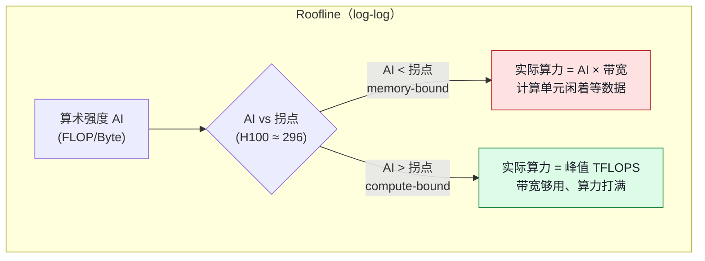

# 05. 性能模型：存算比、Roofline，以及 Prefill / Decode 的本质差异

> **谁该读这一篇？** 需要从"第一性原理"判断一个推理优化值不值得做的人——拿到一台卡，先算清楚理论吞吐上限是多少、现在差多远、瓶颈在算力还是带宽，再决定开 batching、量化、还是投机解码。
>
> **前置阅读：** [`00-prerequisites.md`](../01-overview/00-prerequisites.md) §7（roofline 的粗略版，本章是它的定量展开）、[`02-continuous-batching.md`](../02-core-concepts/02-continuous-batching.md)、[`01-quantization.md`](01-quantization.md)
>
> **耗时：** 约 18 分钟
>
> **学完能：**
> 1. 写出算术强度（存算比）的定义，并算出 H100 / A100 的 roofline 拐点。
> 2. 用一行算式证明 prefill 的存算比 ≈ batch 内 token 数、decode 的存算比 ≈ 并发请求数，从而推出谁 compute-bound、谁 memory-bound。
> 3. 用 Llama-3-70B 的真实显存和带宽，算出 batch=1 decode 的理论 token/s 上限，并解释为什么加 batch 能几乎免费地拉吞吐。
> 4. 讲清一个反直觉但生产上极关键的点：**batching 能摊薄权重读取，但摊不薄 KV cache 读取**——这决定了长上下文为什么依然慢，也决定了 MLA / GQA / KV 量化为什么是刚需。

> **当前源码复核（`b23bd73`）：** 本章 FLOPs/bytes 是分析模型，不是 vLLM runtime 硬件 counter。任何 `estimated_flops`、read/write bytes 都必须注明是否含权重、KV、激活、collective、padding 和 kernel fusion，并用 Nsight/平台 profiler 的实际时间、带宽与算力交叉验证。

这一章不讲某个具体优化，而是给你一把尺子。后面所有优化（量化、投机、MLA、chunked prefill、disaggregation）本质上都是在 roofline 图上往某个方向挪一格。先有尺子，才知道往哪挪。

---

## 1. 存算比（算术强度）到底在量什么

GPU 干一件事要花两样东西：**算**（浮点运算，FLOPs）和**搬**（从 HBM 读写数据，Bytes）。两者并行发生——计算单元在算的同时，访存单元在搬。一个 kernel 的实际耗时是这两者的较大值：

```
t = max( FLOPs / 峰值算力 ,  Bytes / 峰值带宽 )
```

**算术强度（Arithmetic Intensity，AI）**，中文也叫**存算比**，就是这两个量的比值：

```
AI = FLOPs / Bytes      单位：FLOP/Byte
       ↑        ↑
   这次计算的    这次计算要从 HBM
   总浮点运算    读 + 写的总字节数
```

它衡量"每从显存搬 1 个字节，能喂给计算单元多少次运算"。AI 高 = 搬一次数据能算很久 = 算力是瓶颈（**compute-bound**）；AI 低 = 算一下就得再搬 = 带宽是瓶颈（**memory-bound**）。

---

## 2. Roofline 拐点：硬件给定的那条分界线

每张卡有两条硬上限。把它们一除，就得到这张卡的**拐点（ridge point）**——AI 超过它就 compute-bound，低于它就 memory-bound：

```
拐点 = 峰值算力 / 峰值带宽      单位：FLOP/Byte
```

| GPU | 峰值算力（dense） | HBM 带宽 | 拐点 ≈ |
| --- | --- | --- | --- |
| **A100 80GB SXM** | BF16 312 TFLOPS | 2.0 TB/s | **156 FLOP/Byte** |
| **H100 SXM** | BF16 990 TFLOPS | 3.35 TB/s | **≈ 296 FLOP/Byte** |
| **H100 SXM（FP8）** | FP8 1979 TFLOPS | 3.35 TB/s | **≈ 590 FLOP/Byte** |
| **H200 SXM** | BF16 990 TFLOPS | 4.8 TB/s | **≈ 206 FLOP/Byte** |



记两个数就够日常估算：**A100 拐点 ~150，H100 拐点 ~300**。注意拐点会随精度变——FP8 把算力翻倍但带宽不变，拐点反而更高（590），意思是 **FP8 让"打满算力"变得更难**，这点在 §6 还会回来。

---

## 3. 一个 Linear 层的存算比 ≈ 参与的 token 数

LLM 的绝大部分 FLOPs 和绝大部分权重读取都在 Linear 层（QKV proj、O proj、MLP 的 gate/up/down）。把一个 Linear 层拆开算，结论会异常干净。

设某个权重矩阵形状 `[K, N]`（输入维 K、输出维 N），一次 forward 喂进 `M` 个 token（形状 `[M, K]`）：

- **FLOPs**：矩阵乘 `[M,K] × [K,N]`，约 `2 · M · K · N`（乘加算两次浮点）。
- **Bytes**：权重要从 HBM 读一遍，BF16 是 `2 · K · N` 字节。（输入 / 输出激活 `2·M·K`、`2·M·N` 量级小得多，先忽略。）

于是：

```
AI ≈ (2 · M · K · N) / (2 · K · N) = M
```

**一个 Linear 层的存算比，约等于这一步喂进去的 token 数 M。** 权重只读一次，但被 M 个 token 反复使用——M 越大，每个搬进来的权重字节被"复用"得越多，AI 越高。这就是整个推理性能模型的核心等式。

把它套到两个阶段：

### 3.1 Prefill：M = prompt 的 token 数 → 天然 compute-bound

Prefill 一次把整个 prompt（成百上千 token）喂进 forward，所有 token 共享同一份权重读取：

```
M = prompt 长度（如 2048）   →   AI ≈ 2048  ≫  拐点 300   →   compute-bound
```

只要 prompt 不是特别短，prefill 的 AI 就远超拐点，**算力被打满，带宽有富余**。这就是"prefill 是 compute-bound"的定量来源——不是定性感觉，是 `AI ≈ 2048 > 296` 这个不等式。推论：prefill 阶段很难再靠"加 batch"提速（算力已经满了），但**能靠量化提速**（INT4 把 compute-bound 的 GEMM 换成更快的低精度 GEMM）。

### 3.2 Decode：M = 并发请求数 → batch 小就是 memory-bound

Decode 每个请求每步只产 1 个新 token。如果 batch 里有 B 个请求一起 decode，那么喂进 Linear 层的就是 B 个 token：

```
M = 并发请求数 B
B = 1   →  AI ≈ 1    ≪ 300   →   严重 memory-bound（算力 99% 闲置）
B = 32  →  AI ≈ 32   ＜ 300   →   仍 memory-bound，但好多了
B ≈ 300 →  AI ≈ 300  ≈ 拐点   →   刚好把 H100 算力喂满
```

**"decode 是 memory-bound"的本质：batch 不够大时 M 太小，权重搬进来没算几下就得搬下一块。** 而把 B 拉到拐点附近（H100 上 ~300），decode 才进入 compute-bound 区。这正是 continuous batching 的物理动机——不是"为了多服务几个用户"那么简单，而是**把 decode 从 roofline 的左半边推到右半边**。

---

## 4. 用真实数字算一遍：Llama-3-70B 的 decode 上限

光看 AI 不够直观，直接算理论 token/s。

**Llama-3-70B，BF16，单卡装得下（先假设不切 TP）：**

- 权重 ≈ 70.6B × 2 Byte ≈ **141 GB**
- decode 一步，无论 batch 多大，**每个权重字节都要从 HBM 读恰好一次**

在 H100（3.35 TB/s）上，读完 141 GB 权重的时间：

```
t_weight = 141 GB / 3.35 TB/s ≈ 42 ms
```

这 42 ms 是 decode 一步的**带宽下限**（还没算 KV 和 attention）。于是：

| batch B | 每步耗时 | 产出 token | 吞吐 | GPU 算力利用率 |
| --- | --- | --- | --- | --- |
| 1 | ~42 ms | 1 | **≈ 24 tok/s** | ~0.3%（AI=1 / 300）|
| 32 | ~42 ms | 32 | **≈ 760 tok/s** | ~11% |
| 256 | ~43 ms | 256 | **≈ 6000 tok/s** | ~85% |

> 关键洞察：**从 B=1 到 B=32，每步耗时几乎不变（都被 42 ms 的权重读取卡住），但吞吐涨了 32 倍。** 这就是"加 batch 几乎免费"的来源——你在用本来就要付的带宽成本，多服务 31 个用户。也是为什么单请求延迟（TPOT）在中等负载下对并发数不敏感：decode 步长由权重读取决定，不由你一个人决定。

实践里 70B 一般用 **TP=8**，每张卡只存 1/8 权重（~17.6 GB），8 张卡并行读，单步权重读取降到 ~5.3 ms，单流可到 ~190 tok/s——这又是另一个故事（TP 同时引入 AllReduce 通信，见 [`05-distributed/01-tp-pp-ep.md`](../05-distributed/01-tp-pp-ep.md)）。

---

## 5. 最关键的反直觉：batching 摊薄权重，但摊不薄 KV cache

到这里有个陷阱。上面说"加 batch 让 AI 涨到 B"，那是不是 B 拉够大，decode 就彻底 compute-bound、长上下文也快了？**不是。** 因为 decode 一步其实做两类计算，它们的存算比行为完全不同：

| 计算 | 读什么 | batch 后能否摊薄？ |
| --- | --- | --- |
| **Linear 层**（QKV/O/MLP） | 模型权重（所有请求共享同一份） | ✅ 能。B 个请求复用同一份权重 → AI ≈ B |
| **Attention**（Q·Kᵀ、softmax·V） | 每个请求**自己的 KV cache**（互不共享） | ❌ 不能。请求 i 的 query 只读请求 i 的 KV |

Attention 这部分的存算比，对单个 decode token 来说**恒等于 ~1**：读进来 context_len 个 KV 向量，每个只被这 1 个新 query 用一次。加 batch 把更多请求并排，但每个请求的 KV 还是只服务自己——KV 读取量随 batch **线性增长**，AI 不增长。

**后果（这是生产上长上下文慢的根因）：**

- 短上下文：KV 小，Linear 层主导，加 batch 有效，吞吐高。
- 长上下文（如 32K、128K）：每个请求的 KV cache 巨大，decode 的耗时逐渐被"读 KV"主导，而读 KV **无法靠 batch 摊薄**。于是 batch 拉得再大，每 token 延迟也压不下去，吞吐天花板被 KV 带宽锁死。

一笔 KV 账（Llama-3-70B，GQA 8 个 KV head，head_dim 128，80 层）：单请求每 token 的 KV ≈ `2(K和V) × 80层 × 8 × 128 × 2 Byte ≈ 320 KB/token`。32K 上下文 → 单请求 KV ≈ **10 GB**。batch=32 个这样的请求 → 每步光读 KV 就要 320 GB，在 H100 上 ~95 ms，**比读权重还贵**。

这把后面几个优化的动机一次性串起来——它们都是冲着"减少 KV 字节"或"提高 KV 的复用"去的：

- **GQA / MQA**：减少 KV head 数 → 直接砍 KV 字节（Llama-3 已用 GQA，否则上面数字 ×4）。
- **MLA（DeepSeek）**：把 KV 压成一个低秩 latent，KV 字节再降一个量级 → [`07-model-architectures.md`](../03-code-walkthrough/07-model-architectures.md)。
- **KV cache FP8**：KV 字节直接减半 → [`01-quantization.md`](01-quantization.md)。
- **Prefix caching**：命中的前缀 KV 不重算也少读 → [`04-prefix-caching.md`](../02-core-concepts/04-prefix-caching.md)。

---

## 6. 把所有优化挂到 roofline 上

有了尺子，每个优化做的事都能用一句话说清——它在 roofline 图上把工作点往哪挪：

| 优化 | 在 roofline 上做什么 | 对谁有效 |
| --- | --- | --- |
| **Continuous batching** | 提高 decode 的 M（=B）→ AI 右移，逼近拐点 | decode（核心手段）|
| **Chunked prefill** | 把 compute-bound 的 prefill chunk 塞进 memory-bound 的 decode 步，用 prefill 的算力填满 decode 闲置的计算单元 | 混合负载（见下）|
| **权重量化（INT4/FP8）** | 减少权重 Bytes → 同样 M 下 AI 翻倍；且 compute-bound 的 prefill 用更快的低精度算 | decode 提带宽、prefill 提算力 |
| **KV 量化 / MLA / GQA** | 减少 attention 的 Bytes → 缓解 §5 的 KV 墙 | 长上下文 decode |
| **投机解码** | 一次 target forward 验证多个 token → 把"1 token / 次权重读取"变成"k token / 次"，等效提高 decode 的 AI | 小 batch、低并发场景 |

**chunked prefill 值得单独点一句**，它是 roofline 思维最漂亮的应用：decode 步算力大量闲置（AI≈B≪拐点），prefill 步算力打满但只在偶发。V1 默认把两者**混在同一步**跑——prefill 的高 AI 工作正好填上 decode 的低 AI 工作留下的算力空洞，让这一步的综合 AI 抬到拐点附近。本质是"拿 compute-bound 的活去补 memory-bound 的算力窟窿"。细节见 [`05-chunked-prefill.md`](../02-core-concepts/05-chunked-prefill.md)。

> **FP8 的小陷阱（呼应 §2）**：FP8 把算力翻倍 → 拐点从 300 抬到 590。这意味着用了 FP8 后，要把 decode 喂到 compute-bound 需要**更大的 batch**。FP8 主要收益其实是"权重 Bytes 减半 → AI 翻倍 → 带宽侧提速"，算力翻倍这件事在 memory-bound 的 decode 里基本吃不到。判断一个量化方案对 decode 的收益，永远先看它省了多少 Bytes，而不是多了多少 TFLOPS。

---

## 单变量实验：单位与 sanity check

表格至少包含：每请求/每 step token 数、FLOPs、权重/KV/激活/collective bytes、理论时间 `max(FLOPs/peak, bytes/bandwidth)`、实测 kernel/step 时间、实测带宽/算力利用率。统一使用 FLOP、byte、second，注明 GB/GiB。一次只改 batch、context 或 dtype 之一；估算与 profiler 相差数量级时先修模型，不据此调参。

## 小结

- **存算比（AI）= FLOPs / Bytes**，和硬件**拐点（峰值算力/带宽）**比大小，决定 compute-bound 还是 memory-bound。A100 拐点 ~150，H100 ~300。
- **一个 Linear 层的 AI ≈ 参与的 token 数 M**。Prefill 的 M = prompt 长度（上千）→ AI ≫ 拐点 → compute-bound；decode 的 M = 并发请求数 B → B 小则 AI ≪ 拐点 → memory-bound。这就是两阶段差异的定量根。
- Llama-70B decode 每步要读 141 GB 权重（H100 ~42 ms），**加 batch 不增加这个成本却线性增吞吐**——这是 batching 的物理本质。
- **batching 摊薄权重读取，但摊不薄 KV cache 读取**。长上下文下 decode 被 KV 带宽锁死，催生 GQA / MLA / KV 量化 / prefix caching。
- 所有推理优化都能翻译成"在 roofline 上把工作点往拐点挪"的一句话。

---

## 自检（先自答，再看要点）

**1. H100 上 Llama-3-8B（BF16，16 GB 权重）做 batch=1 decode，理论 token/s 上限大概多少？**

要点：`16 GB / 3.35 TB/s ≈ 4.8 ms/步` → `~210 tok/s`。比 70B 快约 9 倍，因为权重小 9 倍、带宽成本小 9 倍。注意这是无视 KV 和 kernel launch 的理论上限，实测会更低（见 [`10-gpu-utilization-and-tail-latency.md`](../08-production-deployment/10-gpu-utilization-and-tail-latency.md)）。

**2. 为什么 prefill 几乎不能靠加 batch 提速，decode 却可以？**

要点：prefill 的 M（=prompt token 数）本来就上千，AI 已远超拐点、算力已满，再加 batch 只是排队等算力；decode 的 M（=并发数）很小、AI 远低于拐点、算力大量闲置，加 batch 直接把闲置算力用起来，且不增加权重读取成本。

**3. 一个客户上了 128K 长上下文，发现 batch 拉到 64 吞吐也上不去，为什么？该往哪个方向优化？**

要点：长上下文下 decode 耗时被**读 KV cache**主导，而 KV 读取**无法靠 batch 摊薄**（每个请求读自己的 KV）。加 batch 只增加总 KV 读取量。方向：砍 KV 字节——KV FP8、换用 MLA 架构的模型、确保 GQA 生效、靠 prefix caching 复用公共前缀；架构上考虑 P/D 分离让 decode 节点专注吞吐。

**4. 有人说"上了 FP8 算力翻倍，decode 该快一倍"，对吗？**

要点：不全对。FP8 在 decode 的真实收益来自**权重 Bytes 减半 → AI 翻倍 → 带宽侧提速**；算力翻倍对 memory-bound 的 decode 基本吃不到（拐点反而被抬高到 590，更难 compute-bound）。看量化对 decode 的收益要看省了多少 Bytes，不是多了多少 FLOPS。

---

## 下一步

- 上一节回看：[`01-quantization.md`](01-quantization.md)（量化为什么对 decode 是"带宽优化"、对 prefill 是"算力优化"，这章给了它定量解释）。
- 配套生产视角：[`08-production-deployment/10-gpu-utilization-and-tail-latency.md`](../08-production-deployment/10-gpu-utilization-and-tail-latency.md)（理论上限知道了，为什么实测打不满？全链路诊断）。
- 想动手验证：[`07-hands-on/03-mini-experiments.md`](../07-hands-on/03-mini-experiments.md)（扫 `max_num_seqs` 观察吞吐随 batch 的曲线，亲眼看到拐点）。
- 回到核心概念：[`02-core-concepts/02-continuous-batching.md`](../02-core-concepts/02-continuous-batching.md)、[`05-chunked-prefill.md`](../02-core-concepts/05-chunked-prefill.md)。
