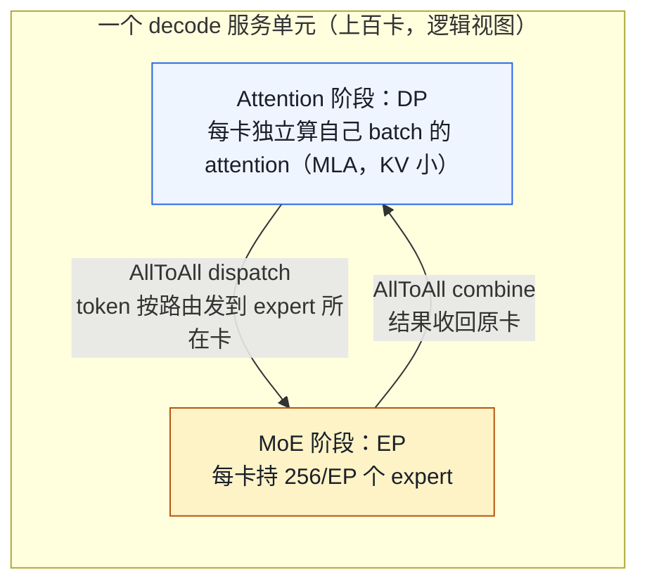

# 05. 千卡 / 万卡集群推理：规模化才暴露的工程问题

> **谁该读这一篇？** 要把一个大模型（尤其大 MoE，如 DeepSeek 量级）部署到几百、上千、上万张卡上的人。你已经懂 TP/PP/EP/DP 怎么切（前四章），现在要回答的是另一类问题：**这些机制在规模上去之后会以什么方式坏掉、怎么定位、怎么救。**
>
> **前置阅读：** [`01-tp-pp-ep.md`](01-tp-pp-ep.md)（并行机制 + §11 故障传染）、[`02-disaggregated.md`](02-disaggregated.md)（P/D 分离）、[`03-expert-parallel-deep-dive.md`](03-expert-parallel-deep-dive.md)（AllToAll / EPLB）。本章是这三章在"千卡/万卡"尺度上的实战延伸。
>
> **耗时：** 约 30 分钟
>
> **学完能：**
> 1. 说清"规模上去"为什么是质变而不是量变——通信墙、故障墙、长尾墙三条。
> 2. 画出一个大 MoE 服务单元的真实形态（DP-attention + 大 EP），并解释它为什么动辄上百卡。
> 3. 对 6 类规模化典型故障，给出"现象 → 怀疑 → 验证 → 处置"的工业排查路径。
> 4. 解释 EPLB / DP padding 对齐 / 微批重叠 / 弹性 EP / blast radius 控制各自治的是哪个规模化病。

前四章讲"怎么把模型切到多卡"。这一章讲一件不一样的事：当卡数从 8 涨到 8000，**很多在小集群上无所谓的设计，会变成压垮服务的主因**。规模不是把同样的问题放大，而是引入新问题。

---

## 1. 规模上去，质变在哪：三堵墙

| 墙 | 小集群（≤16 卡） | 千卡 / 万卡 |
| --- | --- | --- |
| **通信墙** | NVLink 机内全连，通信几乎免费 | 跨机、跨 rail、跨 spine；网络成为吞吐的硬限制，AllToAll/AllReduce 打满网卡 |
| **故障墙** | 几周挂一次，手动重启 | 单卡年故障率 × 万卡 → **每天挂若干次**，必须自动化；NCCL 是 fail-stop，一个 rank 死/慢拖垮整组 |
| **长尾墙** | batch 内长尾，单实例可控 | **集合通信是同步屏障**——最慢的那张卡决定整组的步长，一张慢卡污染上百卡 |

这三堵墙是后面所有具体问题的根。记住一个贯穿全章的判断：**在大规模同步并行里，性能不由平均值决定，由最慢的那个 rank 决定（tail-bound）；可用性不由单卡可靠性决定，由 blast radius（一次故障波及多少卡）决定。**

---

## 2. 一个大 MoE 服务单元长什么样

先建立画面，否则后面问题没有落点。以 DeepSeek-V3/R1 这类"大 MoE + MLA"模型为例，**单个服务单元（serving unit）**通常是这样组织的（具体数字随版本/硬件变，这里取量级）：

- **Attention 部分走 DP**：每张卡持有完整的注意力权重（MLA 把 KV 压成低秩 latent，KV 很小），各卡处理**不同请求**的 attention。
- **MoE 部分走 EP**：256 个 logical expert 摊到几十张卡上，每张卡只持有几个 expert 的权重；每个 token 经路由发到它命中的 expert 所在的卡（AllToAll），算完再收回（AllToAll）。
- 于是**同一批卡，在 attention 阶段是 DP、在 MoE 阶段是 EP**——这就是"DP-attention + EP-MoE"形态。
- 规模上：DeepSeek 公布过 **prefill 阶段 EP32、decode 阶段 EP320**（含冗余专家）这一量级。也就是说，**一个模型实例的 decode 就横跨上百张卡**，再把这样的实例复制 N 份填满集群。

关键认知：**这个单元里每一步 forward 都有两次全员参与的 AllToAll（dispatch + combine），它们是同步点。** 第 3、4 节的长尾和通信问题全从这两次 AllToAll 长出来。

> 为什么 attention 用 DP 而不是 TP？因为 MLA 的 KV 已经很小，attention 不是显存瓶颈；DP 避免了 attention 里的 AllReduce，把宝贵的网络带宽全留给 MoE 的 AllToAll。这是大 MoE 部署的标志性取舍，参见 [`07-model-architectures.md`](../03-code-walkthrough/07-model-architectures.md)（MLA）与 [`03-expert-parallel-deep-dive.md`](03-expert-parallel-deep-dive.md)。

---

## 3. 问题一：EP 同步长尾 —— 一张慢卡拖垮整组（最核心）

这是大规模 MoE 推理**最普遍、最隐蔽**的性能问题。

**机理。** decode 每步有两次 AllToAll，它们是同步屏障：所有 EP rank 必须都到达才能继续。于是这一步的耗时 = `max(各 rank 的计算时间)`，而不是平均。任何让某个 rank 变慢的因素，都会让其余几百张卡空等：

- **Expert 负载不均（hot expert）**：路由是数据相关的，某些 expert 天然更热门，承载它的卡 token 多、算得慢，其余卡等它。
- **DP-attention 各 rank batch 不等**：DP 下不同 rank 分到的请求数/序列长度不同 → attention 阶段 token 数不等 → 到 AllToAll 处对齐时，token 少的 rank 早早算完干等。
- **落后的慢卡（straggler）**：ECC 错误重试、thermal throttle 降频、邻居噪声（同机其他实例抢 PCIe/内存带宽）。

**分析思路。**
1. 看**每个 rank 每步的计算时长直方图**——是个别 rank 长期偏慢（straggler）还是随 batch 抖动（负载不均）。
2. 看 **AllToAll 等待时间占 step 的比例**——高占比说明在同步点空等。
3. 看 **expert 命中分布**（vLLM 的 `RoutedExpertsCapturer` 统计）——是否高度集中在少数 expert。
4. 看**各 DP rank 的 batch/token 数方差**——方差大说明 DP 负载没均衡。

**处置（按问题对症）。**

| 病因 | 解法 | vLLM 里 |
| --- | --- | --- |
| Hot expert | **EPLB**：给热门 logical expert 加冗余副本（redundant expert），把热度摊到多张卡；周期性 rearrange physical→device 映射 | `vllm/distributed/eplb/eplb_state.py`；DeepSeek-R1 例：256 logical + 32 redundant = 288 physical，32 EP rank → 每卡 9 个 |
| DP rank 负载不均 | **DP token 对齐（padding）**：每步用一次轻量 all-reduce 同步各 rank 的 token 数，padding 到一致，避免在 AllToAll 处长短不齐 | `vllm/v1/worker/dp_utils.py`（DP padding 同步）|
| 同步点空等本身 | **微批重叠（DBO / ubatch）**：把一个 batch 拆两个 micro-batch 交错跑，micro-batch A 在 AllToAll 通信时，micro-batch B 在算 attention——用计算把通信时间藏起来 | `vllm/v1/worker/ubatching.py`、`gpu_ubatch_wrapper.py` |
| 个别慢卡 | 慢节点检测 + 主动驱逐（见 §5）| 运维层 |

> EPLB 的代价：rearrange 要搬 expert 权重（几百 MB～GB 级），不能太频繁；而且加冗余 expert 吃显存。所以**不是默认开**——只在监控确认负载不均显著、且持续时才开（判据见 [`03-expert-parallel-deep-dive.md`](03-expert-parallel-deep-dive.md) §6.4）。

---

## 4. 问题二：AllToAll 撞上网络墙

EP 越大，AllToAll 越是 all-pairs 通信。万卡尺度上，网络（IB/RoCE）才是真正的天花板，不是算力。

**机理。**
- **All-pairs 流量**：EP=320 的 dispatch 理论上是 320×320 的点对点，跨机流量极大。
- **拓扑不友好**：跨 rail（不同网卡平面）、跨 spine 的流量要走更高层交换机，带宽更窄、跳数更多。
- **ECMP hash 碰撞**：多条 RDMA 流被哈希到同一条物理链路 → 单链路热点，明明总带宽够却卡在一条链路上。
- **Incast**：combine 阶段多卡同时往一卡回灌 → 交换机队列爆、丢包、触发拥塞控制（DCQCN）退避，延迟飙升。

**分析思路。**
1. 实测 AllToAll 时延 vs 理论值（[`03-expert-parallel-deep-dive.md`](03-expert-parallel-deep-dive.md) §5 给了各 backend 的量级）。慢一个数量级 → 网络问题。
2. 看 NIC 收发带宽是否打满、交换机有没有丢包/PFC pause、队列深度。
3. 看是不是个别链路热（ECMP 碰撞）而非整体带宽不足。

**处置。**
- **分层 AllToAll**：机内走 NVLink、机间走 IB，两级聚合，把跨机流量压到最小——这正是 **DeepEP** 干的事（NVSHMEM + IBGDA，GPU 直发 RDMA 不经 CPU）。vLLM 通过 `--all2all-backend deepep_high_throughput`（prefill）/ `deepep_low_latency`（decode）启用。
- **拓扑感知放置**：让同一个 EP 组尽量落在同 rail/同 leaf 下，减少跨 spine；K8s 上用 topology-aware 调度 + `NCCL_IB_HCA` 绑定网卡平面。
- **combine 端 reduce 下沉**：在交换机做 in-network reduction（SHARP）或分层规约，缓解 incast。
- **拥塞控制调参**：RoCE 下调 DCQCN/PFC，避免 pause 风暴。

一句话：**大 MoE 在通用 NCCL AllToAll 上一定撞墙，这就是 DeepSeek 必须自研 DeepEP 的原因**（[`03-expert-parallel-deep-dive.md`](03-expert-parallel-deep-dive.md) §4 行 155）。

---

## 5. 问题三：故障墙 —— 万卡每天都在挂

**机理（先算一笔账）。** 假设单卡 + 其网卡/光模块的年故障率合计 2%，万卡集群期望年故障 ≈ 200 次，**平均一两天就挂一次**；叠加链路抖动、ECC、thermal，实际"非完全健康"事件远多于此。在这个尺度，故障不是异常，是常态，必须设计成自愈。

**最致命的一点：NCCL 是 fail-stop 的。** 一个 rank crash 或 hang，同一个 communicator 里的其他 rank 会在下一次集合通信处**一起 hang**，默认要等到 watchdog timeout（几分钟）才报错退出。也就是说：

- 一个 8 卡 TP 实例里挂 1 张卡 = **整个实例死**。
- 一个 EP320 的单元里有 1 张卡 hang = **这上百卡全卡住**直到超时。

**这把"blast radius"变成第一设计原则。**

**分析思路：区分三种"坏"。**
| 类型 | 现象 | 怎么认 |
| --- | --- | --- |
| **Crash**（卡/进程死） | 某 rank 进程退出、NCCL 报 `unhandled cuda error` / `remote process exited` | 进程监控 + NCCL 错误日志 |
| **Hang**（卡住不动） | 整组步频归零、watchdog timeout、GPU-Util 100% 但无产出 | NCCL watchdog、心跳超时 |
| **Straggler**（变慢不死） | 整组步频下降但没报错，某 rank 每步偏慢 | per-rank step timing 直方图（§3）|

最难的是 straggler——不报错，只是慢，监控不盯 per-rank timing 根本发现不了。

**处置。**
- **控制 blast radius**：实例（TP×PP 的 communicator）尽量小。**不要为省显存无脑拉大 TP**——TP 越大，单卡故障炸掉的范围越大。能用 DP 多副本就别用大 TP。
- **利用"推理无状态"**：推理实例除了 KV cache 没有需要持久化的状态，KV 可重算。所以恢复策略简单粗暴：**从 LB 摘除 → 杀掉整个实例 → 拉新实例 → warmup 后重新入流量**。配合冗余副本 + 全局 LB，单实例死对用户近乎无感（in-flight 的请求重试到别的副本）。
- **快速失败而非长等**：调短 NCCL watchdog/心跳超时，让 hang 尽快暴露并触发重建，而不是干等几分钟。
- **慢卡主动驱逐**：监控 ECC 计数、SM 时钟、per-rank timing，命中阈值就把该节点 cordon 掉，别让它当 straggler 拖整组。
- **弹性 EP（进阶）**：EP 组支持在不停服的情况下动态增减 rank（重算 expert 映射），让坏卡能被在线替换而不是整单元重启——vLLM 的 EPLB 基础设施（`vllm/distributed/eplb/`）是这条路的起点。
- **K8s 配套**：liveness/readiness 探针 + 反亲和（同实例的 rank 别全堆一台机的同一故障域）+ PodDisruptionBudget（[`01-tp-pp-ep.md`](01-tp-pp-ep.md) §11.2、[`06-reliability-and-failure-modes.md`](../08-production-deployment/06-reliability-and-failure-modes.md)）。

---

## 6. 问题四：冷启动 / 权重加载 / rollout 被规模放大

小集群忽略的环节，万卡上会变成事故。

**机理。**
- **权重加载风暴**：几百 GB 权重 × 数千张卡**同时**从共享存储（NFS/对象存储）拉 → 存储 IOPS 和出口带宽被打爆，启动时间从分钟变成几十分钟。
- **CUDA Graph capture × 数千实例**：每个实例都要 capture 多个 batch size 的图，单实例几十秒，乘以规模 + 抢占资源 → 漫长。
- **滚动重启慢**：要换版本/改配置时，逐批重启一个万卡 fleet 可能要数小时，期间容量打折。

**处置。**
- **权重不要让每张卡各自去存储拉**：一处读入，再用 RDMA / tree broadcast 在集群内扩散（"读一次、广播 N 份"）；或用节点本地只读缓存 + 预分发。
- **分批 rollout + warmup gate**：就绪探针必须**等 CUDA Graph capture + warmup 完成**才放流量，否则新副本一上线就长尾爆炸（[`10-gpu-utilization-and-tail-latency.md`](../08-production-deployment/10-gpu-utilization-and-tail-latency.md) §6.7）。
- **sleep / wake 复用实例**：vLLM 支持把实例置于 sleep（卸 KV、留权重）再快速唤醒（metric `vllm:engine_sleep_state`），切模型/缩容时比冷启动快得多。
- **容量规划留 rollout 余量**：滚动重启期间的容量缺口要提前用 buffer 副本补上（[`04-autoscaling-and-capacity.md`](../08-production-deployment/04-autoscaling-and-capacity.md)）。

---

## 7. 问题五：跨数千副本的全局调度与路由

单副本内的调度（Scheduler）前面讲过；万卡上多了一层**跨副本的全局路由**问题。

**机理。**
- **Prefix-cache 亲和失效**：同一会话/同一系统 prompt 的请求若被随机打散到不同副本，本可命中的 KV 前缀全 miss，TTFT 抬升、算力浪费。规模越大、副本越多，随机打散的代价越大。
- **P/D 分离下的 KV 路由**：prefill 池算完要把 KV 传给某个 decode 实例（NIXL/RDMA），选哪个 decode 实例、怎么不打爆它，是全局决策。
- **热点副本**：负载/KV 占用不均，部分副本过载抢占、部分空闲。

**处置。**
- **分层路由**：上层按区域/容量做粗负载均衡，下层按 **prefix 亲和 + KV 占用 + 队列深度**打分选副本（[`02-smart-routing-and-load-balancing.md`](../08-production-deployment/02-smart-routing-and-load-balancing.md)）。
- **P/D 比例动态调整**：prefill 重（长 prompt 多）就加 prefill 池，decode 重就加 decode 池；workload 漂移时在线调比例（[`02-disaggregated.md`](02-disaggregated.md)）。
- **全局调度器形态**：llm-d / AIBrix / NVIDIA Dynamo 这类"集群级 inference gateway + 全局调度"就是冲这个问题去的（[`01-deployment-architectures.md`](../08-production-deployment/01-deployment-architectures.md)）。

---

## 8. 问题六：万卡上的可观测性 —— 找到那一张慢卡

规模化让监控本身变难。

**机理与难点。**
- **基数爆炸**：per-rank × per-layer × 万卡的指标维度，Prometheus 直接被打爆。
- **均值骗人**：集群平均吞吐很好看，但 §3 说了性能是 tail-bound——你要找的是**那一张拖后腿的卡**，它淹没在均值里。

**处置。**
- **盯分布而非均值**：per-rank step time 的 p99/max、各 DP rank 的 token 数方差、AllToAll 等待时长——这些才暴露 straggler 和负载不均。
- **慢节点雷达**：一个专门的"哪张卡最慢"视图（按 per-rank timing 排序），比一堆均值面板有用。
- **关键先行指标**：`vllm:num_preemptions_total`（KV 压力）、AllToAll wait 占比、NCCL timeout 计数、DP imbalance、`vllm:engine_sleep_state`。
- **采样式分布式 trace**：全量 trace 万卡不现实，按比例采样 + 异常请求强制采样。
- 基础打法见 [`05-slo-and-observability.md`](../08-production-deployment/05-slo-and-observability.md) 与 [`08-monitoring-cookbook.md`](../08-production-deployment/08-monitoring-cookbook.md)，本节是它们在万卡尺度的补充。

---

## 9. 规模化排查总表（现象 → 怀疑 → 验证 → 处置）

把全章压成一张工业 runbook：

| 现象 | 第一怀疑 | 验证 | 处置 |
| --- | --- | --- | --- |
| 整组吞吐低、各 rank 计算时长方差大 | DP/expert 负载不均 | per-rank token 数与 step 时长直方图、expert 命中分布 | DP padding 对齐；EPLB；微批重叠 |
| 整组吞吐低、某一两 rank 长期偏慢 | straggler（ECC/throttle/邻居噪声） | per-rank timing 排序、`nvidia-smi` 时钟/ECC | cordon 驱逐慢卡 → 重建实例 |
| forward 慢、网络带宽高/丢包 | AllToAll 撞网络墙 | AllToAll 实测 vs 理论、NIC/交换机队列、ECMP 热点 | DeepEP/分层 AllToAll；拓扑感知放置；调拥塞控制 |
| 整组步频归零、GPU-Util 100% 无产出 | NCCL hang（某 rank 死/卡） | NCCL watchdog 日志、心跳 | 调短 timeout 快速失败 → 摘流量 → 重建整实例 |
| 启动/扩容极慢 | 权重加载风暴 / capture 慢 | 存储出口带宽、就绪耗时 | 广播式加载；分批 rollout；warmup gate；sleep/wake |
| TTFT 抬升、prefix 命中率掉 | 跨副本路由没做亲和 | `vllm:prefix_cache_hit_rate`、路由日志 | prefix-aware/session-sticky 路由 |
| 部分副本过载抢占、部分空闲 | 全局负载不均 / P/D 比例失配 | 各副本 `num_requests_running`/KV 占用 | 负载打分路由；动态调 P/D 比例；扩容 |

---

## 小结

- 规模上去是**质变**：通信墙（网络成瓶颈）、故障墙（挂卡成常态）、长尾墙（最慢的 rank 决定整组）。
- 大 MoE 服务单元 = **DP-attention + 大 EP**，单实例横跨上百卡，每步两次 AllToAll 是同步点。
- **EP/DP 同步长尾**是最核心的性能病：hot expert → EPLB，DP rank 不均 → token padding 对齐，同步空等 → 微批重叠（DBO）。
- **AllToAll 撞网络墙**靠分层通信（DeepEP/NVSHMEM）+ 拓扑感知放置 + 拥塞控制。
- **故障墙**的第一原则是控制 blast radius（别无脑拉大 TP）+ 利用推理无状态做快速重建 + 慢卡驱逐 + 弹性 EP。
- 冷启动/路由/可观测性在万卡上都被放大，分别用广播加载/warmup gate、分层亲和路由、盯分布而非均值来治。

---

## 自检（先自答，再看要点）

**1. 为什么说大规模同步并行里"性能由最慢的 rank 决定"？这对监控有什么直接含义？**

要点：每步的 AllReduce/AllToAll 是同步屏障，step 耗时 = max(各 rank 时长)，所以一张慢卡拖整组。含义：监控必须盯 **per-rank 时长分布的 p99/max 和方差**，不能只看集群均值——均值好看的同时可能有一张卡在拖后腿（straggler）。

**2. 一个 EP320 的 decode 单元里有一张卡 hang 了，会发生什么？为什么这影响"该不该把 TP 拉很大"的决策？**

要点：NCCL fail-stop，这上百卡会在下一次 AllToAll 一起 hang 到 watchdog timeout。blast radius = 整个 communicator。所以并行维度（尤其 TP/EP communicator）越大，单卡故障炸掉的范围越大；能用 DP 多副本分散就别为省显存无脑拉大 TP。

**3. DP-attention 下发现各 rank 吞吐不齐、整体被拖慢，根因和解法？**

要点：DP 各 rank 分到的请求数/序列长度不同 → attention 阶段 token 数不等 → 到 MoE 的 AllToAll 同步点时长短不齐、快的等慢的。解法：每步用一次轻量 all-reduce 同步各 rank token 数并 padding 对齐（`vllm/v1/worker/dp_utils.py`），再叠加微批重叠把通信藏到计算后。

**4. EPLB、DP token padding、微批重叠，三者治的分别是哪个问题？**

要点：EPLB 治 **expert 维度**的负载不均（hot expert，加冗余副本+重排）；DP token padding 治 **DP rank 维度**的 token 数不齐；微批重叠（DBO/ubatch）治 **同步点空等**本身（用计算掩盖 AllToAll 通信）。三者正交，可叠加。

**5. 万卡集群权重加载为什么会成为瓶颈？怎么解？**

要点：几百 GB × 数千卡同时从共享存储拉 → 存储出口带宽/IOPS 被打爆，启动几十分钟。解法：一处读入再 RDMA/tree broadcast 扩散，或节点本地只读缓存预分发；配合分批 rollout 和 warmup gate（capture 完才放流量）。

---

## 下一步

- 机制回看：[`03-expert-parallel-deep-dive.md`](03-expert-parallel-deep-dive.md)（AllToAll 6 后端、EPLB 细节）、[`02-disaggregated.md`](02-disaggregated.md)（P/D 分离与 KV 传输）、[`01-tp-pp-ep.md`](01-tp-pp-ep.md) §11（故障传染）。
- 生产配套：[`06-reliability-and-failure-modes.md`](../08-production-deployment/06-reliability-and-failure-modes.md)、[`07-incident-playbook.md`](../08-production-deployment/07-incident-playbook.md)、[`10-gpu-utilization-and-tail-latency.md`](../08-production-deployment/10-gpu-utilization-and-tail-latency.md)（长尾治理）。
- 部署形态：[`01-deployment-architectures.md`](../08-production-deployment/01-deployment-architectures.md)（llm-d / AIBrix 等集群级栈）、[`02-smart-routing-and-load-balancing.md`](../08-production-deployment/02-smart-routing-and-load-balancing.md)（全局路由）。
- 想看源码：`vllm/distributed/eplb/`（EPLB）、`vllm/v1/worker/dp_utils.py`（DP padding）、`vllm/v1/worker/ubatching.py`（微批重叠）、`vllm/distributed/device_communicators/all2all.py`（AllToAll 后端）。
