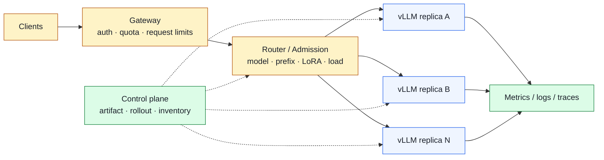
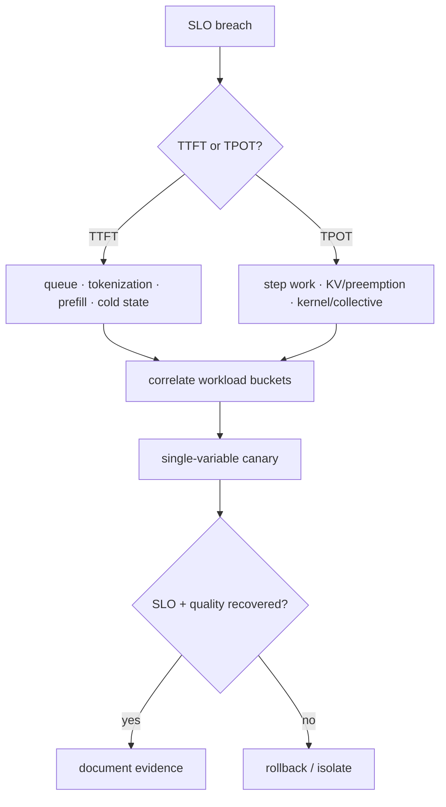

# LLM 推理系统设计：先问需求，再画架构

> **谁该读这一篇？** 需要设计或面试讲解在线 LLM inference platform 的工程师、tech lead 与容量评审者。
>
> **前置阅读：** [`01-common-questions.md`](./01-common-questions.md)、[`分布式并行`](../05-distributed/01-tp-pp-ep.md)、[`生产部署架构`](../08-production-deployment/01-deployment-architectures.md)
>
> **耗时：** 约 45 分钟
>
> **难度：** 高级
>
> **当前性说明：** 本章按 vLLM `b23bd73f540175f9e117eaee5029cd7d8df63964` 静态复核；示例公式用于展示方法，不代表当前 SHA 的 GPU 实测容量。
>
> **学完能：**
>
> 1. 在给架构前问清模型、workload、SLO、硬件、质量、安全与变更窗口
> 2. 用单位完整的权重 / KV / service demand / replica 公式给出第一版容量边界
> 3. 比较单节点、replica DP、TP / PP / EP 与 P/D disaggregation，而非只报一个方案
> 4. 把 routing、cache、failure domain、observability、deployment、cost 与 rejection criteria 放进同一设计

## 1. 面试开场：先拒绝无前提架构

题目如果只有“设计一个能承载 1 万用户的 LLM 服务”，不要立刻画 GPU 集群。“用户数”不是请求到达率，也不是同时运行数。先把未知量变成问题。

### 1.1 模型与输出契约

- 模型 / tokenizer / chat template revision 是否固定？dense 还是 MoE，GQA / MLA，生成还是 pooling / multimodal？
- dtype / quantization 是否可改？允许的质量损失和 golden set 是什么？
- context、输入 / 输出长度的 p50 / p95 / p99 是多少？是否有 reasoning、tool call、structured output、LoRA？
- streaming、logprobs、`n`、seed / determinism、stop 与 finish reason 的 API 契约是什么？

### 1.2 Workload 与到达过程

- 峰值 arrival rate 是 requests/s 还是 sessions/s？open-loop 还是 closed-loop？burst 持续多久？
- input / output token 分布与相关性是什么？短 chat、长 RAG、batch、embedding 是否混在一个池？
- system prompt、documents、images、LoRA 的复用比例是什么？prefix/cache locality 能否由路由保持？
- 取消率、超时、retry 与优先级分布是什么？

### 1.3 SLO 与 goodput

- TTFT、TPOT / ITL、端到端 latency 分别看 p50、p95 还是 p99？
- 什么算成功：HTTP 2xx、按时首 token、全部 token 在 deadline 内、还是 quality gate 也通过？
- admission 允许排队多久？超载时是 429、降 max tokens、切小模型还是延迟执行？

### 1.4 硬件、拓扑与平台

- GPU 型号、显存、单机卡数、NVLink / PCIe、跨节点网络、CPU / RAM / storage 是什么？
- driver、CUDA、PyTorch、vLLM SHA 与 model artifact 是否已有兼容矩阵？
- 启动多久、镜像 / 权重从哪里拉、region / AZ / failure domain 如何划分？

### 1.5 安全、成本与变更

- 谁认证和限额？tenant 数据、prompt / output / trace 如何隔离和脱敏？LoRA / media URL / chat template 谁能提供？
- 成本目标按 GPU-hour、每百万 output tokens，还是满足 SLO 的 goodput 计？
- 维护窗口多长？能否 shadow / canary？允许多少 warm spare？回滚 RTO / RPO 是什么？

> **面试信号：** 强候选人会把缺失输入列成假设表，并说明哪一个假设最可能让架构翻转；弱候选人把所有问题默认为某张 GPU、某个 70B 模型和一个平均长度。

---

## 2. 容量估算：四张账，单位不能丢

### 2.1 权重与常驻内存

理论权重下界：

$$M_{weights}=N_{params}\times b_{weight}$$

其中 `N_params` 是实际加载参数数，`b_weight` 是每参数字节。量化还要加 scale / zero point / padding，某些 layer 仍保留高精度。每 rank 的近似权重：

$$M_{weights,rank}\approx\frac{M_{sharded}}{TP\times PP}+M_{replicated,rank}$$

这不是总显存：还要加 CUDA context、NCCL、activation、workspace、graph capture、LoRA slot、encoder cache 与安全余量。`gpu_memory_utilization` 是分配政策，不是这些项的替代公式。

### 2.2 KV cache

常见 decoder attention 的逻辑 KV：

$$B_{KV/token}=2\times L\times H_{kv}\times D_{head}\times b_{kv}$$

请求 KV：

$$M_{KV,request}=B_{KV/token}\times (T_{prompt}+T_{generated})$$

再按 TP / PP 的实际 cache spec 修正。MLA、hybrid attention、cross-attention、encoder-only runner 与 KV offload 不能套同一公式。最后用 `vllm/v1/kv_cache_interface.py` 的实际 page size / page count 和启动日志校验。

### 2.3 算力与显存带宽服务时间

prefill 与 decode 分开：

- prefill 处理大量 input tokens，attention 随 context 增长，通常更偏 compute / 大矩阵；
- decode 每 step 产生少量 token，却反复读取 weights 与历史 KV，常更偏 memory bandwidth / communication。

不要用理论 FLOPS 直接算 QPS。先从目标硬件 benchmark 得到按长度桶的 service demand：

$$D_{req}=T_{prefill}(T_{in})+\sum_{i=1}^{T_{out}}T_{decode}(T_{in}+i, batch_i)$$

### 2.4 Replica 与故障余量

若单 replica 在目标 SLO 下的 sustainable arrival rate 是 `μ_good`，峰值输入是 `λ_peak`，目标利用率上限 `ρ_target<1`，预留 `R_failure` 个失效副本：

$$R_{steady}=\left\lceil\frac{\lambda_{peak}}{\mu_{good}\rho_{target}}\right\rceil$$

$$R_{total}=R_{steady}+R_{failure}+R_{rollout}$$

`μ_good` 必须来自**满足 TTFT / TPOT / quality / error SLO 的请求**，不是峰值 tokens/s。若单副本 fail 后剩余副本的 `ρ` 超过门禁，N+1 设计不成立。

### 2.5 一个带单位的示例

假设仅用于演算：模型实际加载 `32×10^9` 参数、BF16 权重 `2 byte/param`；目标 GPU 每张 `80 GiB`，但平台实测允许模型、non-KV 与 KV 的预算另算。

1. 权重下界：`32e9 param × 2 byte/param = 64e9 byte ≈ 59.6 GiB`。
2. 不能据此断言单卡可服务：还没有给 activation、workspace、graph 与 KV 留空间。
3. 若模型 config 为 `L=64, H_kv=8, D_head=128, BF16 KV`：
   `2 × 64 × 8 × 128 × 2 = 262,144 byte/token = 256 KiB/token`。
4. 一个 `2,000 input + 500 output` 请求的逻辑 KV 约：
   `2,500 token × 256 KiB/token = 640,000 KiB ≈ 625 MiB`。
5. 这仍不是“每卡并发 = 空闲 GiB / 625 MiB”：TP 分片、block 尾部、prefix sharing、运行时余量与调度上限都要实测。

**sanity check：** 单请求 context 翻倍，逻辑 KV 应近似翻倍；若估算没有这个趋势，公式或单位错了。

---

## 3. 从最小架构开始，再给扩展路径

### 3.1 单 GPU / 单节点

先问模型是否能在一个 failure domain 内放下并满足 SLO：

- 单 GPU：最少通信和组件，适合小模型 / pooling / 开发验证；容量和故障域最小。
- 单节点 TP：用高速互联跨卡放模型；collective 增加，但运维边界清晰。
- 单节点 TP×PP：当纯 TP 不合适或层放置需要 PP；要量 stage balance。
- 单节点多 replica：模型单卡 / 小 TP 可放下时，replica DP 常比扩大 TP 更利于吞吐和故障隔离。

**拒绝条件：** 权重能放下但最大请求 / graph capture 无余量；或 TP 扩大后 collective 让 p99 反而越线。

### 3.2 多节点 replica DP

每个 replica 是独立 engine / cache，用路由横向扩展。优点是 failure domain 与 rollout 粒度小；代价是 prefix / LoRA / encoder cache 分散。

路由输入应区分：

- hard constraints：model / tokenizer / LoRA version、modality、tenant、region、健康状态；
- soft scores：queue / estimated work、prefix locality、adapter active、cache warmth、failure-zone balance；
- backpressure：无 replica 能在 deadline 内接单时，排队 / 降级 / 429，而不是无界 retry。

**拒绝条件：** 路由只看连接数，不看 token work；或 sticky routing 无上限，热点 session 能压垮单 Pod。

### 3.3 跨节点 TP / PP / EP

只有单节点放不下或目标 latency / MoE 布局要求时才跨节点。设计必须给：rank-to-GPU map、process groups、链路、collective、failure handling 与 topology-aware placement。

- TP 跨慢网络：层内同步频繁，先用 trace 证明收益。
- PP：降低层内 group 范围，但有 stage bubble / imbalance。
- EP：expert dispatch / all-to-all，必须量 router skew 与 straggler。

**拒绝条件：** 只写 `TP=16`，不写两节点间带宽、collective time 和任一 rank 失败后的恢复路径。

### 3.4 Prefill / Decode disaggregation

P/D 拆分允许分别扩容和选择硬件，但增加 KV transfer 与跨池 queue：

$$T_{transfer}\ge\frac{M_{KV,to\ transfer}}{BW_{effective}}+T_{setup}+T_{queue}$$

设计要给 connector timeout、backpressure、version compatibility、partial transfer cleanup 和聚合模式 fallback。

**拒绝条件：** KV transfer p99 接近或超过拆分节省的 compute time；或 connector 故障会让请求悬挂且不能回到聚合池。

---

## 4. 四类 workload 如何让设计翻转

### 4.1 短对话 / 高并发 chat

优先变量：output tokens、TPOT、取消率与 system-prefix locality。

- 用 admission 控制 active sequences，不让 retry 代替容量。
- prefix-aware / session-aware routing 只能作为 soft score，并有负载上限。
- 小 TP + 多 replica 可能比大 TP 更高 aggregate goodput；延迟门禁决定。
- speculative decoding 只有在 target workload 接受率与端到端 goodput通过时启用。

失败域：热点租户、长输出、客户端断开未 abort、rollout 冷 cache。

### 4.2 长上下文 RAG

优先变量：input p99、retrieval docs、KV bytes/token、prefill time 与 prefix 重用。

- 在 gateway 限制 tokens / documents，不只限制字符。
- chunked prefill 控制 step 抖动，但不会消除总 attention 成本。
- 先比较 GQA / MLA 模型、KV dtype、context truncation 与检索质量；不能只“加 KV cache”。
- 超长请求可独立 pool，避免把短 chat 的 TPOT p99拖垮。

失败域：retriever 返回暴涨、template 变化导致 cache hit collapse、上下文截断破坏质量。

### 4.3 Agent / Structured output / LoRA

优先变量：多轮 turn、tool schema、grammar compile、adapter working set 与安全授权。

- structured output 只保证语法边界；工具执行仍需服务端授权 / schema semantic validation。
- `auto` backend 可能随版本改变，upgrade gate 要覆盖真实 schema。
- LoRA-aware route 可减少 active-slot miss，但必须限制任意 path / runtime update。
- tool description 的 cache locality 要与 tenant isolation / salt 一起设计。

失败域：schema complexity DoS、tool prompt 泄露、adapter thrash、同名版本漂移。

### 4.4 Multimodal / Pooling / Batch

这三类不要默认与生成流量混池：

- multimodal 还有 media IO、processor cache、encoder budget / cache 与 URL 安全；
- pooling 没有 autoregressive decode，sequence / token output 的网络成本不同；
- offline batch 更关心截止时间与成本，可接受不同 admission / priority。

失败域：损坏媒体、token-level 巨大响应、encoder OOM、batch job 饿死在线请求。

---

## 5. SLO、可观测与证据链

### 5.1 指标不是名字清单

先从当前服务 `/metrics` 和锁定 SHA 的 registration code 建 inventory，再定义：

- traffic：requests/s、input / output tokens/s、长度分布、tenant / model；
- queue：waiting / running、admission reject、deadline miss；
- latency：E2E、TTFT、TPOT / ITL，均用 histogram 分位数；
- engine：KV usage、preemption、prefix hit tokens、batch / iteration work；
- platform：GPU memory / bandwidth / power、CPU、network、NCCL / link error；
- quality：golden success、schema / tool validation、retrieval / ranking metric。

不要在设计里发明 metric 名；可以写“从当前 inventory 选择对应 counter / gauge”。

### 5.2 一个排障关联图

### 5.3 Alert 与 action 的边界

Alert 应指向 runbook 和 owner，不应直接执行有风险的集群 mutation。自动动作只做经过批准、幂等、有上限、可回滚的操作；证据不足 fail closed。生产诊断见 [`09-vllm-doctor-skill.md`](../08-production-deployment/09-vllm-doctor-skill.md)。

---

## 6. Reliability、部署与成本

### 6.1 Failure domain 表

| 故障 | 隔离 | 检测 | 缓解 | 恢复证据 |
| --- | --- | --- | --- | --- |
| 单 worker / GPU | replica / node | health + request failures | stop route, drain | golden + SLO |
| NCCL / link | topology domain | rank logs + link telemetry | drain whole group | multi-rank soak |
| model artifact | immutable version | load / hash / quality gate | rollback artifact | signature + golden |
| cache / connector | cache namespace | hit / transfer / timeout | bypass or aggregate pool | no stale reuse |
| gateway / auth | redundant edge | 4xx/5xx + auth audit | fail closed | policy tests |
| retry storm | admission boundary | attempts / queue growth | retry budget + shedding | queue drains |

### 6.2 Rollout 状态机

`artifact verified → shadow → small canary → expand → drain old → remove old`。每一步都有 duration、sample size、quality / SLO gate 和 rollback owner。缩容先停止新流量，再等 active 请求 / connector state / stream 完成；不能只杀 Pod。

### 6.3 成本模型

至少报告：

$$Cost_{per\ 1M\ good\ output\ tokens}=\frac{GPU\ hours\times price+platform\ cost}{good\ output\ tokens}\times10^6$$

把 rejected、deadline miss、重试重复计算、idle warm spare、rollout overlap 和 P/D 网络算进去。低每 token 成本若靠更差质量或更高 p99 得到，不是可比方案。

---

## 7. 一份完整答题骨架

1. **复述目标**：用户体验、质量、availability、security、cost。
2. **列假设表**：模型、长度、arrival、SLO、硬件、change window；标出最敏感三项。
3. **算四张账**：weights、KV、service demand、replicas + N+1 / rollout reserve。
4. **给最小方案**：单节点 / 小 TP + replicas；说明为什么此时够用。
5. **给翻转条件**：何时需要 PP / EP / disaggregation / workload split。
6. **画 data plane + control plane**：auth、admission、routing、engine、telemetry、artifact / rollout。
7. **讲三个 tradeoff**：latency vs throughput、cache locality vs balance、efficiency vs failure domain。
8. **列 failure table**：detect、mitigate、recover、evidence。
9. **定义 reject / rollback**：哪些指标越线立即停止。
10. **说明未知**：需要 benchmark / profile 的量，不编数字。

---

## 8. 设计练习与失败证据

为下面三个场景各写两页，不允许复用同一架构：

1. 短 chat：output-heavy，TPOT p99 严格，有共享 system prompt。
2. 长 RAG：input-heavy，长度长尾明显，retrieval quality 不可降。
3. 多租户 LoRA + tools：adapter working set 大，需要强隔离与审计。

每份必须附：assumption table、单位完整的容量公式、一个 alternative、三个 rejection criteria、一次故障演练和 rollback。失败证据包括：用“并发用户”代替 arrival / active sequences；把 theoretical memory 当可分配显存；没有 N+1；metric 不存在；只画 data plane 不画 artifact / rollout；没有 quality / security gate。

> **生产取舍：** 架构复杂度必须由可量化瓶颈购买。未证明单节点 / replica 方案失败前，不要用跨节点 TP 或 P/D disaggregation装饰答案。

> **硬件验证状态：** 当前 SHA 未做 GPU system-design 容量实测；所有 `μ_good`、service demand 与 connector bandwidth 必须由目标环境补齐。

## 小结

- Requirements 不是开场礼貌，而是决定模型、并行、cache、routing 与 SLO 是否成立的输入。
- 容量必须同时算权重、KV、服务时间和 failure / rollout reserve。
- 从最小架构开始，用明确翻转条件引出复杂方案。
- routing、observability、security、deployment、cost 与 rollback 都是 inference system 的一部分。

## 自检

1. 哪三个未知量最可能让“单节点 TP”翻转为“多 replica / disaggregation”？
2. 为什么 `total users / per-GPU concurrency` 不是可靠 replica 公式？
3. prefix-aware routing 如何同时避免热点和跨 tenant 错误复用？
4. 若 canary 的 tokens/s 提升但 TPOT p99 和 quality 变差，应如何裁决？

## 下一步

- [`03-capacity-and-troubleshooting-drills.md`](./03-capacity-and-troubleshooting-drills.md)：把公式和故障树做成有解练习
- [`04-mock-interview-and-rubric.md`](./04-mock-interview-and-rubric.md)：按五轮评分模拟完整面试
- [`08-production-capstone.md`](../07-hands-on/08-production-capstone.md)：把设计落到可复现证据包

## Source trail

- `vllm/config/{model,cache,scheduler,parallel}.py`
- `vllm/v1/core/sched/scheduler.py`、`vllm/v1/core/kv_cache_manager.py`
- `vllm/v1/kv_cache_interface.py`、`vllm/v1/attention/backends/`
- `vllm/distributed/parallel_state.py`、`vllm/distributed/eplb/`
- `vllm/v1/engine/`、`vllm/entrypoints/openai/`
