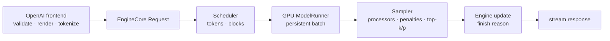

# vLLM 五轮模拟面试与评分 Rubric

> **谁该读这一篇？** 准备 inference engine / serving / performance / platform 岗位的候选人，以及需要结构化面试题与评分锚点的面试官。
>
> **前置阅读：** [`01-common-questions.md`](./01-common-questions.md)、[`02-system-design.md`](./02-system-design.md)、[`03-capacity-and-troubleshooting-drills.md`](./03-capacity-and-troubleshooting-drills.md)
>
> **耗时：** 90 分钟模拟 + 30 分钟复盘
>
> **难度：** 高级
>
> **当前性说明：** 本章按 vLLM `b23bd73f540175f9e117eaee5029cd7d8df63964` 静态复核；评分奖励证据边界，不奖励背诵未经当前环境验证的性能数字。
>
> **学完能：**
>
> 1. 完成概念、源码追踪、计算、系统设计、事故五轮模拟
> 2. 用统一 1–5 rubric 评价准确性、证据、取舍、验证 / 回滚与沟通
> 3. 把真实项目经历组织成可核验叙事，不虚构指标

## 0. 模拟规则

- 总时长 90 分钟：5 + 15 + 15 + 30 + 20，另留 5 分钟候选人提问。
- 候选人可以说“不知道”，但要说明下一步如何从源码 / 运行证据求证。
- 面试官不给隐藏模型 config；候选人必须主动问缺失输入。
- 所有数字必须标注“题设、推导、观测或估计”。把估计称作实测是严重扣分。
- 每轮都要求一个 failure boundary 与 rollback；只讲 happy path 不超过 3 分。

建议两人练习：面试官只按 prompt 和 follow-up 提问，不在过程中纠错；最后逐项给出证据。

---

## 1. 统一 1–5 Rubric

### 1.1 准确性 Accuracy

| 分数 | 锚点 |
| --- | --- |
| 1 | 核心概念错误，答案与题目无关，或编造不存在能力 |
| 2 | 能说名词但机制混乱；把 V0 / 第三方 / 当前 V1 混写 |
| 3 | 主干正确，有少量未限定实现细节；提醒后可修正 |
| 4 | 机制、状态与边界正确，主动区分契约 / 当前实现 / 假设 |
| 5 | 在 4 的基础上能处理反例、数值边界和跨组件影响 |

### 1.2 证据 Evidence

| 分数 | 锚点 |
| --- | --- |
| 1 | 只有口号或硬编码数字，无来源 |
| 2 | 报文件 / metric 名但无法说明其证明什么，或名称过时 |
| 3 | 能给一个有效源码入口或运行信号 |
| 4 | 给出相互印证的源码、配置、日志 / metric / experiment chain |
| 5 | 说明证据缺口、口径、采样偏差与如何复现 / 归档 |

### 1.3 取舍 Tradeoffs

| 分数 | 锚点 |
| --- | --- |
| 1 | 所有 feature 都开，只有收益没有成本 |
| 2 | 泛泛说“看情况”，没有翻转条件 |
| 3 | 能讲一个收益 / 代价对和适用 workload |
| 4 | 用 SLO、quality、capacity、failure domain 比较 alternatives |
| 5 | 给出敏感变量、拒绝条件与成本 / 运维后果 |

### 1.4 验证与回滚 Validation / Rollback

| 分数 | 锚点 |
| --- | --- |
| 1 | 直接全量变更，无 gate / rollback |
| 2 | 只说“压测 / 监控”，没有指标与失败条件 |
| 3 | 有 canary、核心指标和人工回滚 |
| 4 | 有 quality + SLO + failure gate、drain、不可变回滚单位 |
| 5 | 还覆盖失败注入、证据归档、恢复验证与 fail-closed 边界 |

### 1.5 沟通 Communication

| 分数 | 锚点 |
| --- | --- |
| 1 | 术语堆砌，无法直接回答，单位混乱 |
| 2 | 有结论但结构散乱，关键假设藏在后面 |
| 3 | 结论先行、结构基本清晰，能回答追问 |
| 4 | 主动确认需求、画最小图 / 公式、清楚标未知 |
| 5 | 根据听众调整深度，压缩 / 展开自如，能总结决策与下一步 |

单轮 25 分。总分只用于复盘，不用于机械录用：任一轮 Accuracy=1 或 Validation=1 都应单独讨论风险。

---

## Round 1：概念快问（5 分钟）

### 面试官 Prompt

> 用两分钟解释：Paged KV cache、continuous batching 与 prefix caching 分别解决什么问题？三者之间是什么关系？

### 期望证据

- Paged KV：逻辑 token → 非连续物理 block，按需分配；仍有尾块 / metadata 成本。
- Continuous batching：step 边界重调度，处理长度异质性；受 token budget 与 KV capacity 共同约束。
- Prefix caching：按完整 block 链式 hash 复用已计算 KV；extra keys 隔离 LoRA / multimodal / salt。
- 能指出 `vllm/v1/core/{block_pool,kv_cache_manager,kv_cache_utils}.py` 和 scheduler 作为核准入口。

### Follow-ups

1. block size 越小是否越好？
2. prefix hit rate 高，为什么 TTFT 可能不降？
3. continuous batching 是否意味着 prefill / decode 一定同 step 混跑？

### Strong signals

- 先分别定义，再画“Scheduler 使用 KV manager；prefix cache 是 block 复用状态”的关系。
- 不引用固定碎片百分比、默认 block size或性能倍数。
- 主动提到 tokenizer / template / LoRA identity 的正确性边界。

### Weak signals

- 把 PagedAttention 说成 CPU swap；把 prefix cache 说成 response cache。
- 声称 GPU utilization 必然接近 100%。
- 只讲论文，不知道当前 V1 组件入口。

### 本轮评分重点

Accuracy 与 Communication 权重最高。满分回答在 2 分钟内完成主干，追问时才展开实现。

---

## Round 2：源码追踪（15 分钟）

### 面试官 Prompt

> 一个带 `top_p`、`seed`、`logprobs=5` 的 streaming chat 请求进入 V1。请从 frontend 追到 sampler，再说 token 如何返回。指出哪些细节必须读当前源码，不能凭经验假设。

### 候选人应画出的最小链路

### 期望证据

- frontend：`vllm/entrypoints/openai/`，配置 / renderer / tokenizer 参与请求语义。
- request / core：`vllm/v1/request.py`、`vllm/v1/engine/core.py`。
- scheduler：`vllm/v1/core/sched/scheduler.py` 产出本步 token / block metadata。
- runner / sampler：`vllm/v1/worker/gpu_model_runner.py`、`vllm/v1/sample/sampler.py`。
- sampling 顺序：raw logprob mode、FP32、allowed / bad words / processors / penalties、temperature、min-p、top-k/p、gather。
- seed 只控制 generator，不承诺跨 backend / batch / hardware bitwise deterministic。
- top-N logprobs 仍可能做 full-vocab log-softmax；返回体是另一个成本。

### Follow-ups

1. 为什么 per-request generator 可能影响 top-k/top-p backend？
2. `logprobs=-1` 与 5 的成本差异是什么？
3. 客户端断开后，哪条证据证明 KV 最终释放？
4. 如果加 structured output，bitmask 在哪里接入？

### Strong signals

- 用“读取当前 startup log / config / source”回答 backend，而不是背默认。
- 能区分 raw / processed logprobs 和 API serialization。
- 把 cancellation / cleanup 纳入完整 lifecycle。

### Weak signals

- 声称请求可以上传任意 Python logits processor。
- 把 logprobs top-N 误写成不做 full-vocab softmax。
- 只列文件，不说明状态如何流动。

### 本轮评分重点

Evidence 必须 ≥3 才算通过。Accuracy=5 要能指出至少一个当前实现易漂移点，并说明如何核准。

---

## Round 3：容量计算（15 分钟）

### 面试官 Prompt

> 题设：模型 `40×10^9 params`，BF16 weights；`L=60`、`H_kv=8`、`D_head=128`、BF16 KV。每请求 p95 是 3,000 input + 1,000 output tokens。四张 80 GiB GPU 做 TP=4。假设每 rank 除权重外固定 non-KV peak 为 12 GiB，并要求留 8 GiB 安全余量。先算理论每 rank 可给 KV 的容量与 p95 request KV，再说明为什么还不能给生产并发承诺。

### 参考推导

权重：

$$40e9\ param\times2\ byte/param=80e9\ byte\approx74.51\ GiB$$

均匀 TP=4：

$$74.51/4\approx18.63\ GiB/rank$$

题设下每 rank KV 理论预算：

$$80-18.63-12-8=41.37\ GiB/rank$$

KV bytes/token（全模型逻辑）：

$$2\times60\times8\times128\times2=245{,}760\ byte/token=240\ KiB/token$$

p95 请求逻辑 KV：

$$4{,}000\ token\times240\ KiB/token=960{,}000\ KiB=937.5\ MiB$$

若 KV heads 在 TP=4 均匀分片，每 rank逻辑部分近似：

$$937.5/4=234.375\ MiB/request/rank$$

粗糙 KV-only 上界：

$$41.37\ GiB\times1024\ MiB/GiB\div234.375\ MiB/request\approx180\ requests$$

### 必须主动否定的承诺

`180` 不是生产并发：题设忽略 replicated weights、quant / padding、page 离散、实际 cache spec、max batch activation、prefix / output length tail、scheduler token budget与 SLO。正确下一步是从启动 profile / page count 校验，再阶梯压测得 `μ_good`。

### Follow-ups

1. 若 `H_kv=2 < TP=4`，分片假设会怎样？
2. 若 KV 改 FP8，理论和质量 gate各怎样变化？
3. 为什么 p95 request size 不能保护 p99 / max OOM？
4. 如何加入 N+1 和 rollout reserve？

### Strong signals

- 单位从 byte 到 GiB 全程可约分。
- 把理论上界、启动可分配、SLO并发明确分层。
- 最后给 sanity check：context / dtype变化趋势正确。

### Weak signals

- 直接说 40B BF16 是 80 GiB，忽略十进制 / 二进制。
- 用 query heads 计算 KV；把全模型 KV 再错误乘 layer。
- 把 180 写进 HPA capacity。

### 本轮评分重点

Accuracy 包括数学与对象选择；Communication 看是否先列假设再算。算术小误差但方法正确可得 4，单位 / 分片概念错不超过 2。

---

## Round 4：系统设计（30 分钟）

### 面试官 Prompt

> 设计一个多租户企业 Agent 平台：两个模型版本，每个版本有 20 个 LoRA；请求包含 2k–20k token、tool schema 与 structured output；峰值 120 request/s；TTFT p99 < 1.5 s、TPOT p99 < 80 ms；任何一个节点故障仍满足 SLO。GPU 和预算未给。请先问问题，再给最小方案、alternative 与 rollout / rollback。

### 期望澄清

- 模型架构 / 参数 / tokenizer / dtype / quality gate；LoRA rank / size / working set。
- input / output联合分布、turn 数、tool schema复用、arrival burst、cancel / retry。
- GPU / topology / regions、artifact storage、cold-start、change window。
- tenant auth / quota、LoRA / tool schema谁可更新、data retention / audit。
- structured backend、reasoning parser、speculative / prefix policy是否可变。

### 期望设计内容

1. **最小方案：** 每模型版本独立 deployment；单节点能放下则小 TP + replica DP；gateway 负责 auth / token / schema limits，router 以 model / LoRA 为 hard constraint，以 load / prefix / active adapter 为有界 soft score。
2. **容量：** 用真实模型算 weight / KV；用 benchmark 得 `μ_good`；`ceil(120/(μ_good×ρ)) + node-failure + rollout`。
3. **隔离：** tenant quota、cache salt / identity、tool execution authorization、静态版本化 LoRA。普通请求不能提供任意 path。
4. **Structured output：** `auto` vs explicit backend 的 upgrade tradeoff；schema complexity / compile budget与 semantic validation。
5. **Failure domains：** node / model group、router、artifact、adapter、retry；drain whole TP group。
6. **Observability：** TTFT / TPOT histograms、queue / lengths、KV / preemption、adapter state、grammar errors、quality / tool validation。
7. **Deployment：** immutable compatibility matrix、shadow、canary、expand、drain old、rollback；旧 cache 不跨不兼容版本复用。
8. **Alternative：** 长 context独立 pool；单节点放不下才引入 PP / 跨节点；P/D 只有 transfer / queue 证明收益才选。
9. **Cost：** 每百万 good output tokens + warm reserve / rollout overlap。

### Follow-ups

1. 一个 LoRA 热点占 70% 流量，router 怎么防热点又保 active-slot 命中？
2. `auto` backend 升级后从 xgrammar 换 guidance，如何发现？
3. 节点故障后所有请求 retry，怎样避免 queue collapse？
4. 20k 请求让短请求 TPOT 越线，先改什么？
5. 什么证据会让你改用 P/D disaggregation？

### Strong signals

- 前 5 分钟只做澄清与假设排序，不抢答 GPU 数。
- 同时给 hard rejection criteria：quality、SLO、security、N+1。
- 复杂方案都有“何时才需要”的翻转条件。
- data plane 与 control plane 都画出。

### Weak signals

- 直接假设 H100 / 70B / FP8并报卡数。
- 把 structured output 当工具授权，把 runtime LoRA API直接暴露给 tenant。
- HPA 只看 GPU util；没有 admission / retry budget。
- 没有旧版本 drain与 rollback。

### 本轮评分重点

Tradeoffs、Validation / Rollback 各需 ≥4 才是 senior-level。图漂亮但无容量、failure与quality gate不超过 3。

---

## Round 5：事故响应（20 分钟）

### 面试官 Prompt

> 周一 10:05 发布新 vLLM image 到 10% canary。10:12 起全池 TPOT p99 从 55 ms 到 180 ms，TTFT p99 变化不大；waiting 增长、客户端 retry 翻三倍。Canary 日志出现 sampling backend fallback，但旧 Pod 也开始变慢。你是 incident commander，怎么做？

### 期望时间线

**0–5 分钟：确认与止损**

- 宣布 incident / owner / channel，冻结其他变更；确认 metric 口径与影响 tenant / model。
- 暂停 rollout；限制 retry budget / 启用 admission，防止重复工作放大。
- 若 canary 与变更高度相关且 rollback safe，停止新流量并 drain canary，不直接 kill streaming requests。

**5–15 分钟：只读取证**

- 对比 canary / old：image SHA、model / config、sampling backend、batch / output length、KV / preemption、graph / compile、GPU / collective。
- 解释旧 Pod 变慢可能是 retry / reroute放大，而非证明旧版本也有同一 kernel bug。
- 用 request attempts 区分 original load 与 retry load。

**15–30 分钟：单变量验证**

- rollout rollback + retry shedding 后，看 queue是否收敛、TPOT / goodput是否恢复。
- 在隔离环境复现 backend fallback；核准触发条件（seed、logprobs mode、platform、batch等），不在生产强制未知 backend。

**恢复与事后**

- 只有 SLO、error、queue、quality 与 retry恢复并持续观察窗口后结束 incident。
- 保存 timeline、commands、dashboards、raw logs；根修增加兼容矩阵与 canary gate。

### Follow-ups

1. 如果回滚 canary 后 TPOT 仍不降？
2. 如果没有当前 metric inventory，如何避免用错 PromQL？
3. 什么情况下应直接 shed low-priority traffic？
4. 如何证明没有请求 / KV / adapter state 泄漏？

### Strong signals

- 先抑制 retry amplification，再讨论扩容。
- 区分 correlation 与 causation，用 old Pod 变慢解释 shared load effect。
- 每个 mutation 都有 approval、范围、预期、验证与 rollback。
- 恢复不是“图绿了”，还含 quality与持续窗口。

### Weak signals

- 立即把 `max_num_seqs` 调大或全池重启。
- 只看平均 GPU util；没有 original / retry 分离。
- 在证据不足时切全池 backend。
- 回滚后不 drain、不验证、不留证据。

### 本轮评分重点

Validation / Rollback=5 需要完整 incident lifecycle：detect、contain、diagnose、recover、verify、learn。

---

## 2. 总分解释与复盘动作

| 总分（125） | 解释 | 下一步 |
| --- | --- | --- |
| 105–125 | 能在证据边界内独立做设计 / 事故决策 | 补目标团队特定模型与平台 |
| 85–104 | 主干扎实，部分轮次缺 failure / quality / source depth | 针对最低两维做一次重试 |
| 65–84 | 能讲概念，但容量、证据或回滚不稳定 | 回到 drills 与 production chapters |
| <65 | 术语记忆多于工程闭环 | 先做 capstone，留下真实证据包 |

不要用总分掩盖单项风险。把每轮最低的两个 rubric 维度写成下一次练习的具体动作，例如“从 `/metrics` inventory 选三条真实 signal”，而不是“多看源码”。

---

## 3. 项目经历叙事模板：不虚构结果

项目题不是要求一个“吞吐提升 3 倍”的英雄故事。使用下面模板，缺失数据明确标 `未采集`，不要补想象数字。

### 3.1 Context

- 业务 / 用户：`[真实范围]`
- 模型与版本：`[model revision, tokenizer, vLLM SHA/image]`
- workload：`[input/output 分布、arrival、并发、feature]`
- SLO / quality / security：`[实际门禁；若当时没有，明确说没有]`

### 3.2 Problem 与证据

- 现象：`[TTFT/TPOT/error/quality/cost 的具体口径]`
- 时间窗和对照组：`[...]`
- 证据链：`[metrics/log/trace/profile/source/experiment]`
- 排除项：`[哪些假设被什么证据否定]`
- 证据缺口：`[当时未采集什么，怎样限制结论]`

### 3.3 Decision

- Alternatives：`[至少两个]`
- 选择：`[...]`
- Tradeoff：`[收益、代价、翻转条件]`
- Rejection criteria：`[何时不做 / 停止]`
- 权限与协作：`[谁批准、谁执行、谁 owner]`

### 3.4 Validation / Rollout / Rollback

- 离线 / shadow / canary：`[样本、时长、门禁]`
- Failure injection：`[...]`
- Rollback unit：`[immutable image/model/config]`
- Drain / recovery evidence：`[...]`

### 3.5 Result

- 只写已记录结果：`[raw artifact / dashboard / report]`
- 同时报 quality、SLO、goodput 与 cost；不能只挑改善项。
- 若只能定性：写“在 `[观察窗]` 未再出现 `[故障定义]`”，不要杜撰百分比。
- Remaining risks：`[...]`

### 3.6 Learning

- 如果重做会先补什么 instrumentation / test？
- 哪个假设后来被证伪？
- 这次改变了哪些 release / runbook / ownership contract？

---

## 4. 自助模拟实验与失败证据

完整录制一次 90 分钟模拟，保存：题目版本、候选人假设表、白板 / 公式、评分表、争议证据链接与重试答案。第二次只重做最低两轮，比较的是 rubric 维度，不是语速。

失败证据：面试官不断提示才问 requirements；源码路径不存在；算式单位不闭合；系统设计无 alternative；incident 先 mutation 后取证；项目经历无法指出原始 artifact。每项都要转成下一次可观察动作。

> **生产取舍：** 模拟面试追求可迁移的判断结构，不追求背完当前 SHA。对实现细节说“需核准”不是弱点，前提是能给出准确核准路径。

> **硬件验证状态：** 未执行当前 SHA GPU run；本章不包含硬件实测性能结论。

## 小结

- 五轮分别测概念压缩、源码状态追踪、单位完整计算、需求优先设计和 fail-closed 事故响应。
- 统一 rubric 让“感觉不错”变成可复盘证据。
- senior 信号是能给 boundary、alternative、rejection criteria 和 rollback。
- 项目叙事宁可暴露证据缺口，也不要虚构漂亮数字。

## 自检

1. 任一轮得 5 分需要哪些比“答对”更多的证据？
2. 系统设计中哪三个问题如果未澄清，会让 GPU 数量计算无效？
3. 事故轮为什么要先限制 retry，再判断是否扩容？
4. 项目结果没有历史 dashboard 时，怎样诚实又有价值地回答？

### 参考答案

1. 5 分不仅要求结论正确，还要有机制、源码/组件入口、量化假设、验证命令、失败边界和回滚条件。能明确区分“已实测、静态复核、合理推断、尚未验证”，通常比背一个漂亮数字更重要。
2. 至少澄清模型与权重/KV 形状、真实 workload/到达率与长度分布、以及 SLO/故障余量。缺少任一项，GPU 数量、并行方式和 replica 公式都可能完全翻转。
3. retry 会放大负载并污染故障信号，先限制它能让真实到达率和资源状态稳定下来；随后再判断是否需要扩容。否则扩容可能只是给重复请求提供更多燃料。
4. 明确说没有历史 dashboard，不伪造实测；提供当前可复现的基线命令、指标 schema、实验矩阵和证据缺口。答案价值来自“下一步怎样测、什么结果会否决”，而不是虚构过去的曲线。

## 下一步

- [`08-production-capstone.md`](../07-hands-on/08-production-capstone.md)：补一份真实、可复现的 project evidence package
- [`07-incident-playbook.md`](../08-production-deployment/07-incident-playbook.md)：练 incident command 与恢复证据
- [`12-upgrades-rollbacks-and-compatibility.md`](../08-production-deployment/12-upgrades-rollbacks-and-compatibility.md)：把 rollout 回答变成兼容矩阵

## Source trail

- `vllm/entrypoints/openai/`、`vllm/v1/engine/`
- `vllm/v1/core/sched/scheduler.py`、`vllm/v1/core/kv_cache_manager.py`
- `vllm/v1/worker/gpu_model_runner.py`、`vllm/v1/sample/`
- `vllm/v1/structured_output/`、`vllm/lora/`
- `vllm/distributed/parallel_state.py`
