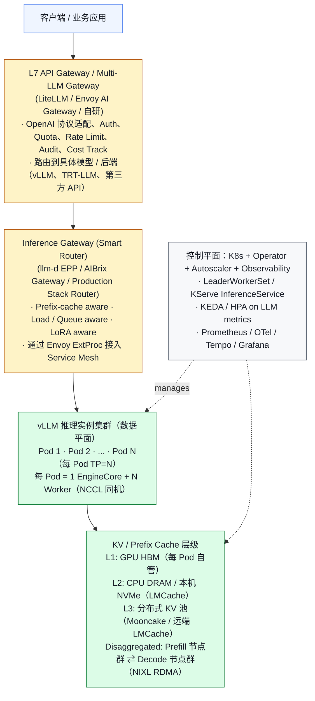
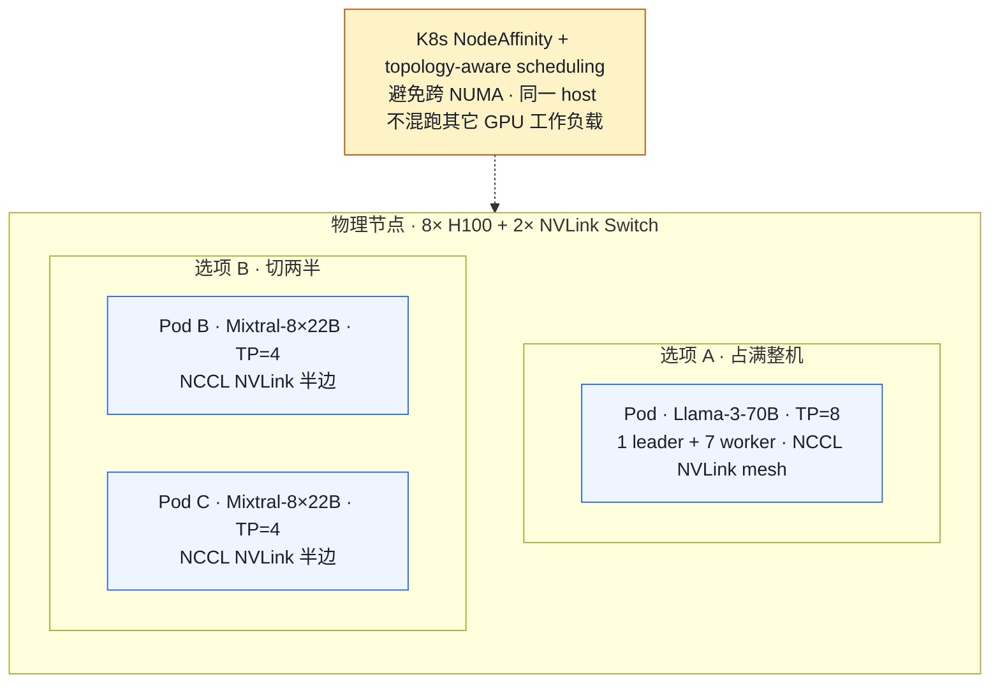
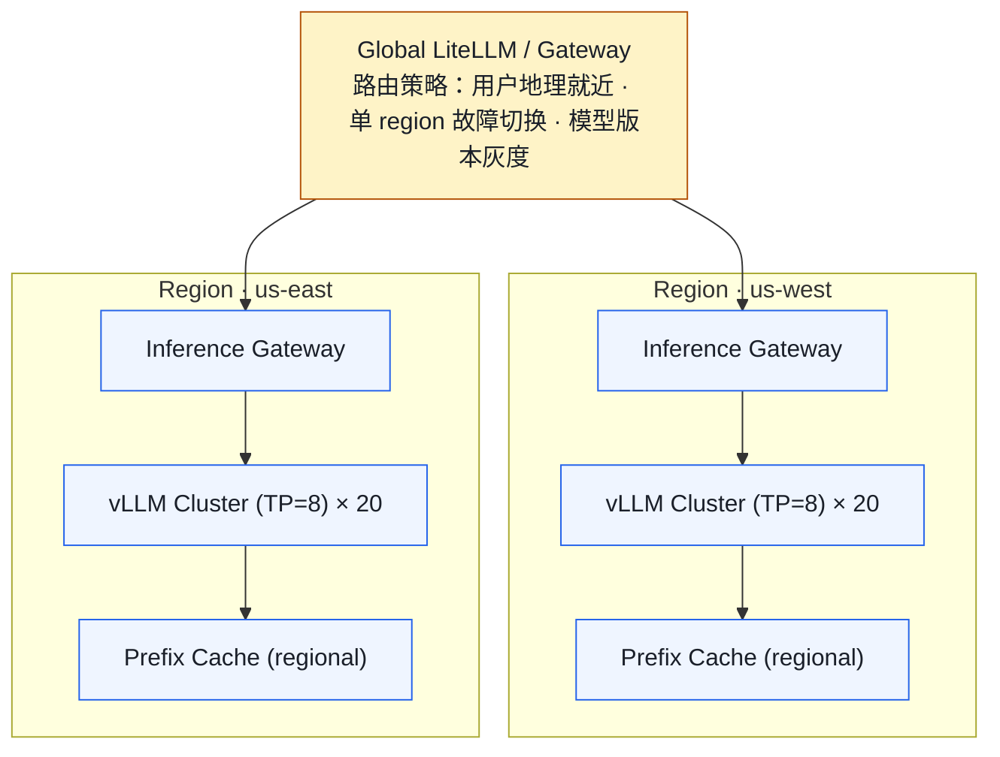

# 01. 大规模 vLLM 部署参考架构（2026 视角）

> **谁该读这一篇？** 准备搭建或评审公司 LLM 推理平台的 SRE / 平台工程师 / 推理架构师。
>
> **前置阅读：** [`02-architecture.md`](../01-overview/02-architecture.md)（理解单机 vLLM 的引擎/Worker 模型）、[`05-process-and-ipc-internals.md`](../01-overview/05-process-and-ipc-internals.md)（理解多进程 IPC）
>
> **耗时：** 约 25 分钟
>
> **学完能：**
> 1. 在白板上画出 5 层 LLM 推理平台架构（Gateway / Smart Router / vLLM 集群 / KV 层级 / 控制平面）
> 2. 区分 vLLM engine、Production Stack、Inference Gateway 与平台控制面的定位
> 3. 解释单 Pod、多 Pod gang/LeaderWorkerSet 和普通 Deployment 各自适用边界
> 4. 识别 K8s 网络层面的 NCCL/RDMA/SSE 常见坑

> **当前复核（`b23bd73f540175f9e117eaee5029cd7d8df63964`，2026-07-20）：** vLLM 本仓库是模型服务数据平面；跨副本 gateway、prefix/KV-aware routing、KEDA/编排属于 Production Stack、Gateway API Inference Extension 或其他平台组件。LeaderWorkerSet 是多 Pod 分布式方案之一，不是每个 vLLM Pod 的强制前提。外部项目能力以各自锁定版本和官方文档为准。

外部边界依据（访问于 2026-07-20）：[vLLM Production Stack](https://docs.vllm.ai/projects/production-stack/en/latest/)、[Kubernetes Gateway API Inference Extension](https://gateway-api-inference-extension.sigs.k8s.io/)。

单机跑 `vllm serve` 是 demo。生产规模（多卡、多机、多模型、多区域、SLO 驱动）要面对的是一整套**控制平面 + 数据平面**。本节回答："如果让你给一个公司搭 LLM 推理平台，从哪开始？"

---

## 1. 从一张图开始：分层 LLM 推理平台

把整张图记住，后面讨论任何生产问题都能 map 到某一层。



---

## 2. 三个可参考的外部生态

下面三个项目都能与 vLLM 组合，但它们不是 vLLM engine 本身，也不存在脱离版本、硬件和组织能力的固定排名。评估时锁定 chart/operator 版本、CRD 版本与验证日期。

### 2.1 vLLM Production Stack（vLLM 官方）

仓库：`vllm-project/production-stack`（GitHub）

- vLLM 团队官方维护
- Helm chart 一键拉起：vLLM Pod + Router + Cache + 监控
- 内置组件：`vllm-router`（基于 prefix-aware 路由）、LMCache 集成
- 适合：想直接照搬官方实践、不愿意自己选型的团队

### 2.2 llm-d

仓库：`llm-d/llm-d`（GitHub）。它把 Gateway/EPP、调度和分离式服务组织成可组合的 Kubernetes 配方。

三大支柱：

1. **vLLM-aware Inference Scheduler**：基于 prefix-cache 命中和负载选 Pod
2. **Disaggregated Serving**：Prefill / Decode 物理隔离
3. **Multi-tier KV Cache**：L1 GPU、L2 CPU/SSD、L3 远端

项目 benchmark 只能证明其特定模型、长度分布、硬件和路由配置；选型时必须用自己的 round-robin 基线重放 workload。
适合：希望深度集成 Kubernetes Gateway API，并愿意验证其 well-lit path 与自身环境差异的团队。

### 2.3 AIBrix

仓库：`vllm-project/aibrix`。由字节跳动主导贡献，已与 vLLM 社区合并。

- Gateway + Operator + Autoscaler 全套
- 可选 **KV Cache Event Synchronization**：满足 vLLM KV-event、remote tokenizer、ZMQ build、Redis 与网络前提时，gateway 可维护更及时的 prefix index
- 也支持 metric/state pull 等策略；生产多 gateway 副本还要验证共享状态和降级路径
- 适合：大规模 chatbot 场景（cache 命中收益大）、跨 Pod 共享前缀

### 2.4 怎么选？

| 选择        | 推荐场景                                          |
| --------- | --------------------------------------------- |
| Production Stack | 当前 chart/recipe 是否覆盖所需模型、路由、扩缩与可观测契约 |
| llm-d | 目标版本的 Gateway API/EPP、调度与 disaggregated well-lit path 是否匹配现有平台 |
| AIBrix | KV event/router/adapter 等目标能力是否在锁定版本中可用，团队是否能运维其依赖与降级路径 |
| 自研        | 已有完整 ML 平台、对 K8s + Envoy 深度掌握、特定监管要求          |

也可以混着用：比如外层 LiteLLM（多 LLM 网关）+ 中层 llm-d（推理调度）+ 底层 vLLM 实例。

---

## 3. Pod 编排：Deployment 什么时候够用？

单机或单 Pod 多 GPU 的 vLLM 实例可以由普通 `Deployment` 管理；一个 Pod 申请多张 GPU，vLLM 在 Pod 内启动 tensor-parallel worker。只有把同一实例拆成多个 Pod/节点时，才需要额外表达 gang scheduling 与共同生命周期：

```
单 Pod TP=8:
  - 1 Pod 申请 8 GPU；Pod 内进程组成 collective group

多 Pod / 多节点实例:
  - leader + worker Pod 共同组成一个 collective group
  - 需要 gang scheduling、稳定发现、共同 rollout/failure policy
```

普通 Deployment 不能独立表达一个多 Pod 原子副本。多 Pod 路线可选：

### 3.1 LeaderWorkerSet（LWS）
K8s SIG 推出的官方 CRD（kubernetes-sigs/lws）。一个"组"包含 1 leader + N worker，**整组作为一个副本**。
扩缩、滚动更新可按组操作。是否使用 LWS 取决于选定的 Production Stack 部署模式和版本。

### 3.2 KServe InferenceService
偏推理服务抽象，封装了模型加载、自动扩缩到 0、Transformer/Predictor 分层。
也可由 KServe 等平台承载推理工作负载，再接入经验证的网关/调度组件；组合支持矩阵以各项目锁定版本为准。

### 3.3 Ray Serve / Anyscale
基于 Ray actor 编排 worker。优点是动态资源调度灵活；缺点是引入 Ray 这层依赖。

---

## 4. 网络：能容易翻车的几个点

LLM 推理对网络极度敏感，比一般微服务苛刻：

| 通信类型             | 要求                  | 实际坑                                              |
| ---------------- | ------------------- | ------------------------------------------------ |
| TP 内 collective | 先测目标拓扑的带宽/延迟 | 跨 NUMA/PCIe/NVLink 路径不同；用 `nvidia-smi topo -m` 与 collective benchmark 留证据 |
| PP 跨段           | 由 activation 大小和 SLO 反推 | CNI、host network、RoCE/IB 路径都需端到端测量 |
| KV Transfer (DP) | connector 支持的 transport | 验证 GPU-direct/host staging、超时、backpressure 与 fallback |
| API 入口          | HTTP/2 + SSE         | gRPC LB 不一定流式正常，要测 SSE 长连接                       |

K8s 配置要点：

- `hostNetwork: true` 或 SR-IOV/Multus 让 RDMA 直通
- 跨 Pod 走 `RoCE` 时用 `k8s-rdma-shared-dev-plugin`
- Service Mesh sidecar 不要拦 NCCL / RDMA 端口（坑过很多人）

---

## 5. 一台 8-GPU 节点的示意部署



要点：

- 用 `nvidia.com/gpu` device plugin 报告卡数
- 设置 `nvidia.com/mig-config` 或 `topology-aware-scheduling` 保证 NVLink 拓扑
- 一台机器**通常只跑一种模型**——切多个模型时 NCCL group 容易踩坑
- 共享 host 上禁止跑其他 GPU 工作负载（CUDA Graph + 量化矩阵会随机抢资源）

---

## 6. 多区域 / 多机房

到了 100+ GPU 规模，部署变成"多个相同的 region"：



跨 region 的 KV cache 几乎不可能共享（带宽不够）。每个 region 自带一份完整 prefix cache。冷启动一个 region 时 cache hit rate 会从 0 慢慢爬升。

---

## 7. 容器镜像：别让镜像把你坑死

LLM 镜像有几个坑：

1. **镜像可能很大**：先记录目标镜像的 compressed/unpacked size 与各节点 cold/warm pull time。
   - 解决：节点预热（DaemonSet 提前拉）、镜像分层（base + thin overlay）、ContainerD 镜像懒加载（stargz/Nydus）
2. **模型权重不要打进镜像**：70B 模型 140GB，每次部署拉镜像太慢
   - 解决：模型权重放对象存储（S3/OSS），通过 init container 或 CSI driver 挂载；hot model 用 fluid 等缓存
3. **CUDA 兼容**：driver 版本 / CUDA / torch 三者强绑定。production 用确切的 tag，不要 `:latest`
4. **Python 包冲突**：vLLM 依赖很多 native package（flashinfer、vllm-flash-attn、xformers）。建议用 uv 锁版本 + 多阶段构建

---

## 8. 推荐部署清单（公司从 0 起步）

如果让你给一家中型公司从 0 部署 LLM 推理平台：

### Day 1
- 单实例 `vllm serve`，跑通 Llama-3-8B
- Prometheus + Grafana，先看 TTFT/TPOT
- 一个最简单的 nginx 在前面

### Week 1
- K8s 化：用 LeaderWorkerSet 或 KServe
- 多副本 + 简单 round-robin LB
- 上 OpenTelemetry tracing

### Month 1
- Helm chart 化部署（vLLM Production Stack 起手）
- 加 Smart Router（cache-aware）
- 接入 Service Mesh（Istio 或 Linkerd）做 mTLS + ratelimit
- 灰度发布机制

### Quarter 1
- Multi-tenancy（quota、fair share）
- 量化、投机解码上线
- HPA / KEDA 自动扩缩
- 多区域 + 全局 LB
- 故障演练（chaos engineering）

---

## 小结

- LLM 推理平台分 5 层：API Gateway → Smart Router → vLLM 集群 → KV/Prefix Cache 层级 → 控制平面，每层职责清晰、可独立演进。
- Production Stack、llm-d、AIBrix 的能力与成熟路径随版本变化；用所需 API、故障语义、依赖、升级和 conformance 证据选型，不按规模标签直接下结论。
- 单 Pod 多 GPU 可用 Deployment；跨 Pod/节点的一个推理副本才需要 LWS、Ray/KubeRay 或等价 gang/lifecycle 抽象。
- 网络上 NVLink/RoCE/RDMA 是命脉：Service Mesh sidecar、CNI、hostNetwork 配置不当会让吞吐塌方。
- 镜像与权重要解耦：镜像走预热 + 懒加载，模型权重走对象存储 + CSI 挂载。

## 自检

> 不用照着原文复述，重点是把现象、机制、源码入口和取舍讲顺。

**1. 70B TP=8 推理服务是否一定要用 LWS？**

**不一定。**先看 TP rank 是否都在一个 Pod/节点：

- 单 Pod 申请 8 GPU 时，Deployment 能管理这个副本；Pod 内进程由 vLLM/executor 管理。
- 跨 Pod/节点时，所有 rank 要共同发现并满足失败/重启策略，此时 LWS、Ray/KubeRay 或平台等价物更合适。
- 选择前要验证调度是否原子、任一 rank 失败后的整组恢复、drain、rollout 与 readiness，不凭模型参数量直接决定 CRD。

具体可选 CRD：KubeRay 的 `RayCluster` + workers、LeaderWorkerSet（K8s SIG-apps 标准化中）、kueue 的 `Workload`。

---

**2. SSE 流式请求每 30s 断开，先怀疑哪一层？**

**按怀疑度排序**：

1. **L7 LB idle timeout**：ALB/NLB/CloudFront 默认 idle timeout 60s 或 30s——SSE 长连接超时被中断。改：将 idle timeout 调到 600s+ 或开 keepalive
2. **Envoy/Istio streaming timeout**：默认值和可配置项随数据面版本与 route policy 变化。先复现流被哪一层关闭，再设置有限、符合客户端 deadline 的 timeout，并测试取消、断连与资源回收；不要照抄无限 timeout。
3. **HTTP/2 PING idle**：HTTP/2 默认 keepalive 没启用 → 中间路由器 idle 后断
4. **CNI 网络（如 Cilium）的 conn track timeout**：流量小时 conn 被 GC

排查命令：

```bash
# 检查 idle 配置
kubectl get gateway -o yaml | grep -i timeout
# 看 access log
kubectl logs <envoy-pod> | grep "stream_idle"
```

---

**3. AIBrix "KV Cache Event Synchronization" 通过什么通道，有哪些前提？**

vLLM KV-event publisher 使用 ZMQ pub/sub 报告 block stored/removed；AIBrix 的 event manager/indexer 消费事件并为 gateway 路由维护视图。部署还要求兼容的 vLLM、remote tokenizer、带 ZMQ 支持的 gateway build、Redis 配置和对应端口/NetworkPolicy。它默认关闭，失败时必须验证路由降级，而不是假设事件视图永远实时一致。

---

**4. 跨 region 共享 prefix cache 为什么不可行？冷启动新 region cache hit rate 曲线？**

**不可行的原因**：

- KV cache 物理上在 GPU HBM，跨 region 传输延迟 100ms+
- prefix cache 命中后还要从 cache 加载 KV 数据到本地 HBM，跨 region 加载比 recompute 还慢
- 网络成本：每 GB cache 跨 region 传输 ~$0.02-0.09，prefix cache 几 GB 反复传 → 不经济

**冷启动新 region 的 cache hit rate 记录模板**：

```
hit rate
  ↑
1.0│
   │
0.8│                                ╱───── 平台期
   │                          ╱───
0.5│                    ╱────
   │              ╱────
0.2│        ╱────
   │   ╱───
  0└───┴─────────────────────────→ 时间
   T=0          <观测窗口>          稳态判据
```

- **T=0**：cache 完全空，命中率 0%
- **观测期**：按固定窗口记录 query/hit、长度分布、router policy 与 SLO
- **稳态**：在 workload/路由一致时观察 hit/query rate 是否接近原 region；达到时间和比例必须实测

**实战建议**：若安全/租户策略允许，可用经过审批且不含真实用户数据的 golden prefix 做 A/B warmup；以 hit rate、TTFT、额外 GPU 成本和跨租户泄漏检查决定是否保留。

## 下一步

- 下一节：[`02-smart-routing-and-load-balancing.md`](./02-smart-routing-and-load-balancing.md)（把"Smart Router"这一层拆开看）
- 384 卡实战：[`13-384-h100-glm-deepseek-deployment.md`](./13-384-h100-glm-deepseek-deployment.md)（把参考架构落成 GLM-5.1/5.2 与 DeepSeek-V4-Flash 的 48 节点部署）
- 想看源码：`vllm/entrypoints/` 看单机入口、`vllm/v1/engine/` 看 EngineCore/Worker 拆分
- 想动手：[`07-hands-on/01-setup.md`](../07-hands-on/01-setup.md) 先把单机 demo 跑通再上 K8s

---

## Sources

- [vLLM Production Stack documentation](https://docs.vllm.ai/projects/production-stack/en/latest/)
- [llm-d documentation](https://llm-d.ai/docs/)
- [AIBrix documentation](https://aibrix.readthedocs.io/latest/)
- [Gateway API Inference Extension](https://gateway-api-inference-extension.sigs.k8s.io/)
