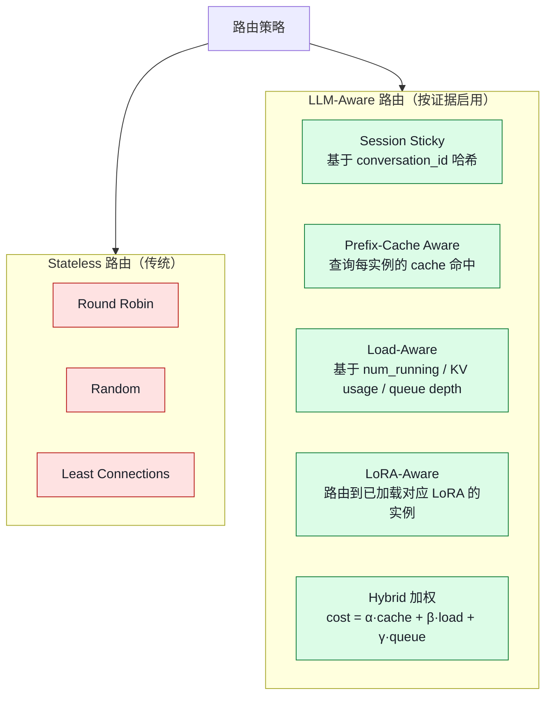
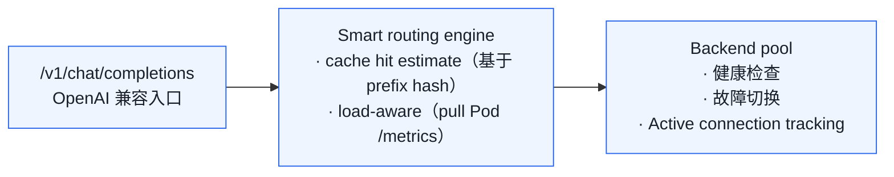
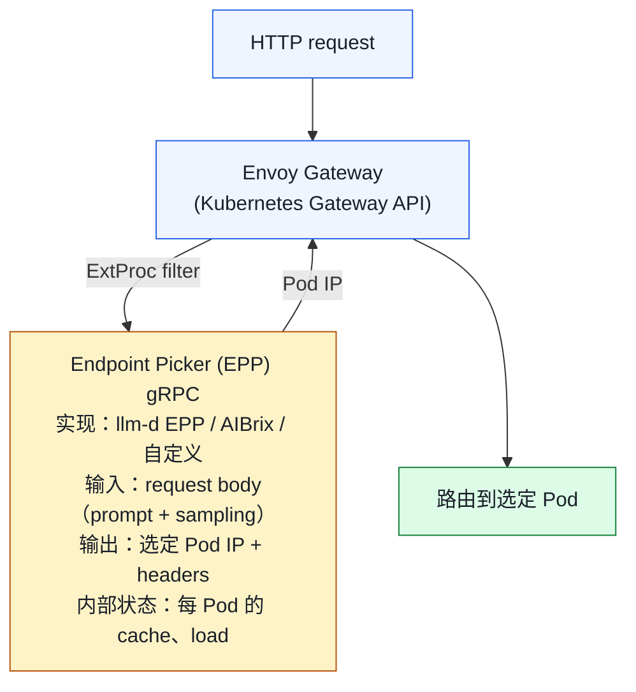
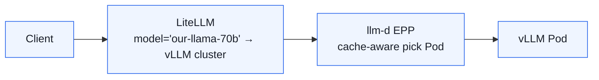
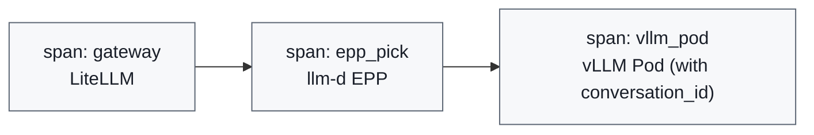

# 02. 请求调度与负载均衡：LLM 专属的"智能路由"

> **谁该读这一篇？** 负责把多副本 vLLM 接入生产流量的平台工程师 / SRE / Gateway 团队。
>
> **前置阅读：** [`01-deployment-architectures.md`](./01-deployment-architectures.md)、[`04-prefix-caching.md`](../02-core-concepts/04-prefix-caching.md)（理解 Pod 内 prefix cache）
>
> **耗时：** 约 30 分钟
>
> **学完能：**
> 1. 解释 round-robin / least-conn 的基线价值与失配条件
> 2. 列举 cache-aware / load-aware / LoRA-aware / session-sticky 四类信号
> 3. 描述 push / pull / estimate 三种 cache 状态同步方案的取舍
> 4. 画出 Envoy + ExtProc + EPP (Gateway API Inference Extension) 的请求路径

> **当前复核（2026-07-20）：** vLLM 单实例负责请求内调度，不内置跨副本全局 smart router。Production Stack 官方文档提供 prefix/KV-aware routing 用例；Gateway API Inference Extension 定义 InferencePool/EPP 协议，其 lightweight EPP 仅用于 reference/conformance。收益必须在你的 workload 实测，round-robin 也可作为低状态基线，不能写成“必然灾难”。

外部边界依据（访问于 2026-07-20）：[Production Stack Prefix Aware Routing](https://docs.vllm.ai/projects/production-stack/en/latest/use_cases/prefix-aware-routing.html)、[Inference Extension implementer guide](https://gateway-api-inference-extension.sigs.k8s.io/guides/implementers/)。

LLM 推理的负载均衡比等成本 HTTP 请求多了长度、KV、adapter 与队列状态。round-robin 是有用基线，但在有共享 prefix、长尾请求或 adapter 局部性时可能明显次优。本节讲清 smart router 的信号、协议与验证方法。

---

## 1. 为什么 round-robin / least-conn 在 LLM 下失灵？

传统服务负载均衡假设：

- 每个请求处理时间相近
- 每个实例性能相近
- 实例之间无状态

LLM 推理打破**全部**这些假设：

| 假设            | LLM 现实                                                    |
| ------------- | --------------------------------------------------------- |
| 请求时间相近        | prompt/output 长度和服务时间可跨多个数量级，比例由 workload 决定 |
| 实例无状态        | 每实例有自己的 **prefix cache**，命中收益取决于重复前缀和 prefill 成本 |
| 实例性能相近        | 不同实例的 KV usage、batch fullness 差异极大                       |
| 一来一回          | 流式输出（SSE）持续几十秒，连接长存                                      |

round-robin 基线可能暴露：

- 重复 prefix 被分散，cluster hit rate 低于 sticky/prefix-aware 变体
- 长尾长请求恰好都落同一实例 → 那实例 KV 爆 / 频繁 preempt
- decode 阶段大 batch 实例和 idle 实例并存，浪费

---

## 2. 路由策略分类



---

## 3. Session Sticky：最基础但极有效

### 思想
同一个稳定的 session key 优先路由到同一个 Pod；Pod 不健康或达到 load guardrail 时允许受控 fallback。

- 第一轮：cold start，TTFT 高
- 后续轮：完整 prefix cache 命中，TTFT 极低

### 实现
1. **客户端层**：API 调用时带 `conversation_id`，gateway 据此哈希到 Pod
2. **Header 层**：Envoy 用 `Ring Hash` LB policy（一致性哈希）
3. **K8s Service 不行**：默认基于 IP 哈希，对 NAT 客户端无效

### 一致性哈希要解决"扩缩容时少打乱"
普通哈希在 Pod 数 N → N+1 时几乎所有 key 都重映射。一致性哈希只移动 1/N 的 key。
Envoy 的 `Maglev` 或 `Ring Hash` 是事实标准。

### 代价
- 单 Pod 故障 → 该用户上下文丢失
- 热点会话：一个用户超活跃，会让那 Pod 过载（需配合"超载 fallback"）

---

## 4. Prefix-Cache Aware Routing：当下 SOTA

### 4.1 思想
Smart Router 维护一份"每 Pod 当前有什么 cached prefix"的近实时视图。新请求来时：

1. 算 prompt 的 block hashes
2. 查每个 Pod 的 cache index，找命中长度最大的
3. 路由过去

### 4.2 数据怎么同步？

**方案 A：Pull**
Router 周期获取 Pod metrics/index 摘要。实现简单但视图有采样延迟；效果由刷新周期和 eviction 速度决定。

**方案 B：Push (AIBrix KV Event Sync)**
vLLM 在 KV 状态变化时（block cached / evicted）通过 ZMQ 主动向 Gateway 发事件。
Gateway 实时维护全局视图。
该路径要求 remote tokenizer、ZMQ-enabled gateway build、Redis 和兼容的 vLLM KV-event 配置；以锁定 AIBrix release 文档为准。

**方案 C：Estimate**
Router 用 prompt 与已知路由历史维护近似 index。它不读取引擎权威 eviction 事件，需验证误判、重启和多 gateway 副本下的状态一致性。

### 4.3 效果
外部 benchmark 只能作为待复现实验假设。至少对比 round-robin、load-only、prefix-only 和组合策略，保持模型、请求到达过程、长度/前缀分布和并发一致，报告 TTFT/TPOT/goodput/error/cache-hit 与 router 开销。

### 4.4 跟 vLLM 内部 prefix caching 的关系
- vLLM Pod 内部：跨请求 prefix 命中（同一 Pod 内的请求）
- Router 跨 Pod：把"可能命中同一前缀"的请求路由到同一 Pod
- 两者**协同**——前者是数据平面的优化，后者是控制平面的优化

---

## 5. Load-Aware Routing：避免热点

### 5.1 关键信号
Gateway 从每 Pod 收集这些 metric：

| 指标                                   | 含义                  |
| ------------------------------------ | ------------------- |
| `vllm:num_requests_running`         | 当前 batch 大小         |
| `vllm:num_requests_waiting`         | 队列深度                |
| `vllm:kv_cache_usage_perc`         | KV 使用率（接近 100% 不能再进）|
| `vllm:num_preemptions_total` 增速     | 内存压力                 |
| `vllm:request_time_per_output_token_seconds` p99 | 用户体验代理              |

### 5.2 路由打分

```python
score(pod) = α * cache_hit_length(pod, prompt)         # 越高越好
           - β * pod.num_running                        # 越低越好
           - γ * pod.queue_depth                        # 越低越好
           - δ * pod.kv_usage                           # 越低越好
           + ε * (1 if pod has needed LoRA else 0)      # LoRA 命中加权

route_to = argmax(score)
```

α/β/γ/δ/ε 由 workload 实验调优；即使是 chat，prefix 重复低或队列压力高时也可能由 load 信号主导。

### 5.3 admission control
为 `kv_usage`、queue、preemption rate 和 readiness 设置经压测得到的 filter/guardrail；阈值要留出请求长度不确定性，并提供 fallback 或显式 429/503。

---

## 6. LoRA-Aware Routing

### 背景
LoRA 适配器（每个几十 MB）允许同一基模型服务多个微调版本。vLLM 支持动态 LoRA 加载/卸载。
但加载新 LoRA 要 100ms-1s（小但不可忽略）。

### 策略
1. **Affinity routing**：请求带 LoRA id，路由到已加载该 LoRA 的 Pod
2. **预热**：高频 LoRA 在所有 Pod 上常驻
3. **LRU 卸载**：长时间不用的 LoRA 自动卸载，腾显存

### 实现位置
- vLLM Pod 暴露 `loaded_adapter_ids` 列表（通过 /metrics 或 admin API）
- Router 在路由打分里加 LoRA 命中权重

---

## 7. vLLM Production Stack 的 Router 组件



启动：

```bash
helm install vllm-stack vllm/vllm-stack \
  --set router.enabled=true \
  --set router.routingPolicy=prefix-aware
```

---

## 8. Envoy AI Gateway + Gateway API Inference Extension

这是一个正在演进的开放接口方向；使用时锁定 CRD/API 版本并运行实现的 conformance/故障测试。

### 架构



### 关键点
1. **ExtProc** 是 Envoy 的扩展点：外部 gRPC 服务可以在路由前修改 request、决定 backend
2. **EPP（Endpoint Picker）** 是 Gateway API Inference Extension 标准化的接口
3. 数据面支持矩阵随 Envoy Gateway/Istio 等实现版本变化
4. 解耦：兼容同一 API/扩展契约时，路由策略可以独立迭代

### 好处
- 复用 Envoy 的 mTLS、ratelimit、observability、熔断
- 多团队可以协作（DevOps 管 Envoy，ML 平台团队管 EPP）
- 标准化：换实现（llm-d → AIBrix）只换 EPP service

---

## 9. 多 LLM 网关：LiteLLM 的位置

LiteLLM（litellm.ai）通常作为**最外层**网关：

- 统一 OpenAI 协议
- 路由到多个后端：vLLM、TRT-LLM、OpenAI API、Anthropic、Bedrock……
- API key 管理、quota、cost track
- 模型别名（"gpt-4" → 路由到自己的 Llama-70B）

它**不是替代**底层 smart router，而是上一层"哪个模型 / 哪个后端"。

典型组合：



---

## 10. 工程上的几个非显然 trick

### 10.1 Tokenization 一致性
不同 Pod 必须用**完全相同**的 tokenizer 版本。否则同一 prompt 的 block_hashes 不同，cache 命中失败。
AIBrix 当前 KV event sync 文档把 remote tokenizer 列为部署前提之一；具体 token 传递契约、gateway build 和兼容 vLLM 版本必须按锁定 release 验证，不能从教程推断。

### 10.2 流式 + Smart Router
SSE 的 first byte 已经出去后，不能换 Pod。

- 路由决策必须在 first byte 前完成
- 之后哪怕该 Pod 出问题也只能让请求失败（不能中途切）

### 10.3 长上下文请求的"特殊通道"
100k+ token 请求会显著影响 batch。建议：

- 单独一组 Pod 服务长上下文（高 KV 容量）
- 路由层识别 prompt 长度 → 走专门后端

### 10.4 流量染色
请求经过多层路由，在 OTel trace 里要能看到完整路径：



任何一步慢都能直接定位到对应 span。

---

## 11. 工程自检问答

**Q: 既然 vLLM 内部有 prefix caching，为什么还要 Router 层做 cache-aware？**
A: vLLM 内部 cache 只在**同一 Pod 内**生效。多 Pod 部署下，同一会话路由到不同 Pod 就完全 miss。Router 层 cache-aware 保证同前缀请求落到同一 Pod，让 Pod 内 cache 真的生效。

**Q: Push vs Pull 同步 cache 状态怎么选？**
A: Push 更接近引擎事件但引入 publisher、网络、状态恢复与 HA 依赖；Pull/estimate 简单但视图可能滞后。用一致 workload 比较命中、router 开销、错误与降级，不按“生产/早期”直接二选一。

**Q: 一致性哈希在 LLM 路由够用吗？**
A: 不够。一致性哈希只解决"扩缩平稳"，不感知 cache、load、LoRA。生产用 cache-aware + load-aware 综合打分。一致性哈希是 session sticky 实现的工具，不是策略本身。

**Q: 怎么测试路由策略效果？**
A: 录制真实 workload trace（带 conversation_id），离线 replay 不同策略，对比 TTFT/throughput/cache hit rate。或者 shadow 流量在 staging。

**Q: smart router 自己会不会成为瓶颈？**
A: 会。需要确保：①ExtProc/EPP 本身可扩缩 ②路由开销预算来自端到端 SLO ③状态陈旧/分区时行为可预测 ④Gateway 能降级到经过验证的低状态策略。

---

## 小结

- LLM 请求时长、状态和性能高度异质；无状态 LB 是必要基线，但在特定 workload 可能产生 cache 分散或热点。
- Cache/load/LoRA-aware 哪个收益最大取决于 prefix 重复、长度、adapter 分布和排队；用 round-robin 基线分别做单信号 A/B，不预填 TTFT 降幅。
- Cache 状态可由 push、pull 或 estimate 获得；具体项目的默认与协议必须按锁定版本核对。
- Gateway API Inference Extension + proxy/EPP 提供数据面与选择策略的契约，但可替换性仍需 API 版本和 conformance 证明。
- 工程陷阱集中在 tokenizer 一致性、SSE 首字节后不能换 Pod、长上下文需要独立通道。

## 自检

> 不用照着原文复述，重点是把现象、机制、源码入口和取舍讲顺。

**1. Cache-aware Router 跟 vLLM 内部 prefix caching 的协同关系？**

> Router 负责**把同 prefix 的请求路由到同一 vLLM pod**，让 vLLM 内部的 prefix caching **真正命中**（而不是分散到 N 个 pod 各自重算）。

两者**互补，缺一不可**：

- 没 vLLM prefix caching：即使路由对了，pod 内部也不复用 KV
- 没 cache-aware router：N 个 pod 各自有自己的 cache，命中率 ÷ N

补充：Router 维护的是"prompt hash → pod" 映射；vLLM 维护的是"block hash → 物理 KV block"。两层 hash 协同——前者解决路由，后者解决物理存储。

---

**2. 用 `num_requests_waiting` + `kv_cache_usage_perc` 设计 admission control 阈值。**

```python
def should_admit(request) -> bool:
    waiting = read_metric("vllm:num_requests_waiting")
    kv_usage = read_metric("vllm:kv_cache_usage_perc")

    # 示例阈值必须由长度分布、SLO 与压测反推
    if kv_usage > KV_HARD_LIMIT:
        return False

    # 软阈值：队列深 → 拒绝（保护 TTFT SLO）
    if waiting > WAITING_HARD_LIMIT:
        return False

    # 综合：KV 紧张 + 队列也长 → 更严格
    if kv_usage > KV_SOFT_LIMIT and waiting > WAITING_SOFT_LIMIT:
        return False

    return True
```

**阈值依据**：

- `KV_HARD_LIMIT`：由 KV 容量、请求长度分布、chunking/preemption 行为和 OOM headroom 反推
- `WAITING_HARD_LIMIT`：由实测 queue-time 与 TTFT SLO 反推，不能用 `waiting × step time` 简化为串行服务
- 复合规则：在 replay/load test 中验证误拒绝率、goodput 与恢复时间

**拒绝时返回**：HTTP 429 + `Retry-After: <估算重试时长>` header，让客户端 backoff。

补充：可把 `vllm:num_preemptions_total` rate 作为压力信号；先关联 queue/KV/SLO，再决定 shed、扩容或调参，不能由单一 counter 自动判定系统极限。

---

**3. 一致性哈希在 session sticky 中扮演什么角色？为什么单靠它不够？**

**角色**：把 user_id / session_id 映射到固定 pod，让同一用户的连续请求落同一 pod，复用对话 KV cache。

**算法核心**：将 pod 散列到 0~2^32 的环上，请求 hash 后顺时针找最近 pod。**pod 增删时只影响相邻段**，避免全量 rehash。

**为什么单靠它不够**：

1. **不能区分 prefix**：两个不同用户用同一个 system prompt（如同一公司的 chatbot），一致性 hash 把他们分到不同 pod，cache 不能共享
2. **负载不均**：用户 session 长短不一，hot session pod 过载、idle session pod 闲
3. **低复用或新 prefix**：若没有其他请求共享该 prefix，首次访问无法获得该前缀的本地命中；但不能按“新用户”直接推断命中率为零
4. **pod failure 时重路由**：用户被切到新 pod，原 pod 的 cache 失效

**需要补充**：

- **Prefix-aware fallback**：除了 session hash，还按 prompt 前缀的 block hash 路由
- **Load-balanced 一致性 hash**：bounded load consistent hashing，每个 pod 容量上限
- **EPP routing**：根据 vLLM metric 实时调整权重

→ 实战通常 "**session sticky（主）+ prefix-aware（辅）+ load 检测（兜底）**" 三层。

---

**4. 替换 EPP 实现（llm-d → AIBrix），Envoy 这边需要改什么？**

只有两边实现兼容同一 API/扩展契约并通过 conformance 时，数据面改动才可能很小。

**Envoy 端只需要**：

- 配置 ExtProc filter 指向新 EPP 的 gRPC endpoint
- 更新 endpoint、CRD/API version、认证/TLS、metadata/header 与失败策略

**EPP 端**：核对支持的 request API、body parsing、目标 endpoint metadata、flow control、streaming 与错误映射；不能只凭都使用 ext-proc 就假设透明替换。

**协议核心**：

```
Envoy → EPP (gRPC): request_header + body
EPP   → Envoy   : routing decision (target endpoint) + optional modifications
Envoy → backend : forward request
```

**Gateway API Inference Extension 的价值**：

1. **解耦**：路由策略（EPP）与数据面（Envoy）分离。替换策略不动数据面
2. **可插拔**：用户可以自己实现 EPP（rust / go / python 都行），只要符合协议
3. **标准化目标**：不同 EPP/serving 实现有机会复用 Gateway API 抽象，但必须锁定 API 版本并通过 conformance
4. **实现生态**：Istio、Envoy Gateway、Cilium 等支持范围和接入方式各异，不存在“自动兼容”保证

→ 这是把传统 K8s Ingress 缺乏的"应用层智能"统一抽象，让 LLM serving 不必每家造个轮子。详见 https://gateway-api-inference-extension.sigs.k8s.io/。

## 下一步

- 下一节：[`03-gateway-and-service-mesh.md`](./03-gateway-and-service-mesh.md)（Gateway / Service Mesh 与 LLM 流量的兼容细节）
- 想看源码：vLLM 自带 router 在 `vllm/entrypoints/openai/` 与 production-stack 仓库；Pod 暴露的 metrics 见 `vllm/v1/metrics/`
- 想动手：[`07-hands-on/03-mini-experiments.md`](../07-hands-on/03-mini-experiments.md) 起两个 vLLM 实例对比 round-robin vs sticky 的 TTFT 差异

---

## Sources

- [KV Cache Aware Routing — vLLM Production Stack](https://docs.vllm.ai/projects/production-stack/en/vllm-stack-0.1.8/use_cases/kv-cache-aware-routing.html)
- [KV Cache Events Synchronization - AIBrix](https://aibrix.readthedocs.io/latest/features/kv-event-sync.html)
- [Intelligent Inference Scheduling | llm-d](https://llm-d.ai/docs/guide/Installation/inference-scheduling)
- [KV-Cache Wins You Can See | llm-d](https://llm-d.ai/blog/kvcache-wins-you-can-see)
- [Zero-to-Hero with the vLLM Router](https://martinuke0.github.io/posts/2026-01-04-zero-to-hero-with-the-vllm-router-load-balancing-and-scaling-vllm-model-servers/)
