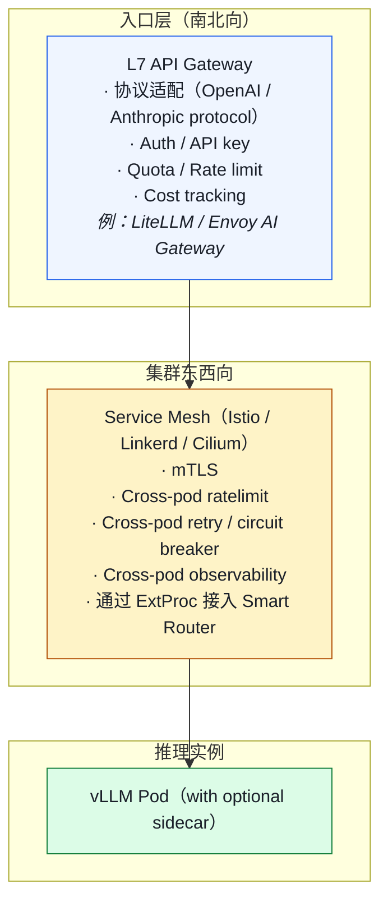
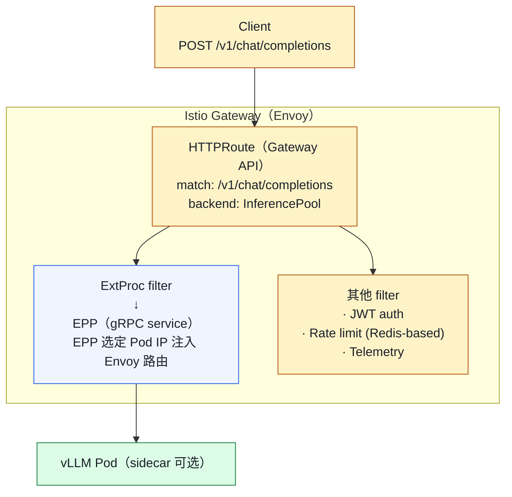
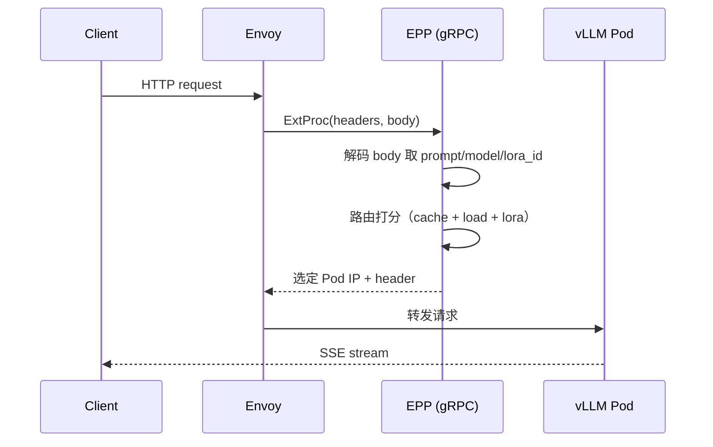

# 03. API 网关与 Service Mesh：让 LLM 流量"可治理"

> **谁该读这一篇？** 负责 Ingress / Service Mesh / 多租户治理的平台 SRE 与安全工程师。
>
> **前置阅读：** [`02-architecture.md`](../01-overview/02-architecture.md)、[`02-smart-routing-and-load-balancing.md`](./02-smart-routing-and-load-balancing.md)
>
> **耗时：** 约 30 分钟
>
> **学完能：**
>
> 1. 划清 API Gateway 与 Service Mesh 在 LLM 场景下的边界
> 2. 用 Gateway API Inference Extension (InferencePool / EPP) 描述请求路径
> 3. 配置 SSE / 长 body / 长超时的 Envoy 与 K8s Ingress 参数
> 4. 避开 mTLS 拦截 NCCL、sidecar 影响 RDMA 的典型陷阱

> **当前复核（2026-07-20）：** 外部 auth、TLS、quota、跨副本 retry/canary 通常由 gateway/mesh/platform 提供，不是 vLLM engine 能力。Gateway API Inference Extension 的 EPP 通过 ext-proc/metadata 选 endpoint；具体 data plane、streaming 和 retry 行为必须按实现版本做 conformance 与故障测试。

外部协议依据（访问于 2026-07-20）：[Inference Extension API/请求流](https://gateway-api-inference-extension.sigs.k8s.io/)、[v1 API reference](https://gateway-api-inference-extension.sigs.k8s.io/reference/spec/)。

通用微服务里 Service Mesh 是为了 mTLS / Observability / Resilience。LLM 场景下，Mesh 还要扛 SSE 长连接、ExtProc 智能路由、大 Body 体的 ratelimit、token 级 cost 计费——这些点常被忽略。

---

## 1. 为什么 LLM 也要走 Service Mesh？

抛开"赶时髦"，LLM 推理对 mesh 有真实需求：

1. **零信任 mTLS**：模型权重 + 用户 prompt 都是敏感数据
2. **租户隔离 / Quota**：不同业务方共用 GPU，要按 token / RPS 限流
3. **可观测性统一**：trace 串联 Gateway → EPP → vLLM Pod
4. **熔断 / 重试 / 超时治理**：单 Pod 卡 NCCL 时不要拖死全网
5. **流量管理**：金丝雀、shadow traffic、A/B
6. **多协议**：HTTP/2 + SSE 流式、gRPC、WebSocket

但 LLM 流量有几个**特殊性**让 mesh 必须特别配置，下面逐个说。

---

## 2. 网关 vs Mesh：边界在哪里？



**网关**主要管"南北向"（用户 ↔ 集群），**Mesh** 主要管"东西向"（集群内 Pod ↔ Pod）。
Gateway API 可以为入口与服务流量提供共同抽象，但 Istio、Envoy Gateway、Cilium 等数据面的支持版本、扩展点和行为并不相同；锁定实现并做 conformance/故障测试。

---

## 3. Istio + Gateway API Inference Extension：当下标准

### 3.1 整体



### 3.2 关键 CRD

Gateway API Inference Extension 引入：

- `InferenceModel`：声明一个模型（名字、版本、目标 InferencePool）
- `InferencePool`：一组 vLLM Pod + EPP 配置
- 复用 `HTTPRoute` 把请求路由到 InferencePool

```yaml
apiVersion: inference.networking.k8s.io/v1alpha2
kind: InferencePool
metadata:
  name: llama-70b-pool
spec:
  selector:
    app: vllm
    model: llama-3-70b
  endpointPickerRef:
    group: ""
    kind: Service
    name: llm-d-epp
```

### 3.3 ExtProc 流程



EPP 决策时间属于入口延迟预算，必须从 proxy 与 EPP trace 实测；实现语言和内存状态不能替代 p99/timeout/fallback 证据。

---

## 4. 流式 SSE：Mesh 最容易翻车的地方

许多 chat workload 使用 **Server-Sent Events** 长连接逐 token 输出，但比例由业务决定。Mesh 默认 timeout/buffering/retry 配置需要专项验证：

### 4.1 buffer：致命的"看似工作但 batch 输出"
是否 buffering 取决于实际 listener/filter/route。若链路中启用了 buffer、body transform、WAF 或 ext-proc full-body mode，token 可能被攒后再发送；要用逐块时间戳验证。

修复：

```yaml
# EnvoyFilter
spec:
  configPatches:
  - applyTo: NETWORK_FILTER
    match:
      context: GATEWAY
    patch:
      operation: MERGE
      value:
        typed_config:
          stream_idle_timeout: 600s  # 防止长 SSE 被砍
          # 关掉 response buffering
```

### 4.2 idle timeout
Gateway、route、upstream、client 和中间 LB 都可能有不同 timeout。把每一跳当前值列入兼容矩阵，并用超过目标最长生成时间的受控流验证；不要复制一个通用秒数。

### 4.3 HTTP/2 设置
- `http2_max_concurrent_streams` 与连接池/客户端复用共同限制并发；读取当前实现值并压测
- `initial_stream_window_size` 太小导致 token 推送慢

### 4.4 mTLS + SSE
mTLS 会增加握手与加密工作，但是否影响 TTFT 必须从 connection reuse、CPU 和 trace 证明。不要为了延迟直接降级明文；先验证连接池、证书轮换和 TLS termination 边界。

---

## 5. Rate Limit：LLM 维度跟传统不一样

传统 ratelimit：QPS、并发数。
LLM 需要的维度：

| 维度                | 用途                       |
| ----------------- | ------------------------ |
| RPS / 并发          | 防雪崩                       |
| input tokens / s   | 防大 prompt 攻击              |
| output tokens / s  | 防"max_tokens=999999"耗 GPU |
| total tokens / day | 按 quota 计费                |
| Concurrent streams | 防 SSE 连接泄漏                |

实现：

- Envoy `local_ratelimit`（单实例）
- `global_ratelimit` + Redis（跨 Pod 一致）
- 或自研：Envoy ExtAuthz → 自定义 quota 服务

**token 维度的 ratelimit 难点**：实际 token 数只有推理完才知道。两种做法：

1. 用 tokenizer 在 gateway 层先算 input tokens；预估 output（max_tokens 上限）
2. 推理完上报真实用量，超出 quota 下次拒绝

---

## 6. 重试与熔断：在 LLM 里要小心

普通服务重试很自然。LLM 推理重试要谨慎：

### 6.1 不要无脑重试 5xx
- 503 通常是 KV 压力或队列满 → 重试同样的 Pod 还是会 503
- 应该让 EPP 选另一个 Pod，且只在 first byte 前重试

### 6.2 流式开始后不能重试
SSE 第一帧已经发给客户端 → 中断只能让客户端感知错误，不能透明重试。

### 6.3 重试 budget
配置实现支持的 retry budget，并从总请求、重试次数和额外 token/GPU 工作反推上限；SSE first byte 后禁止透明重放。

### 6.4 熔断
按 Pod 熔断：连续 5xx 多了暂时不路由到该 Pod。
但是要小心：cache-aware router 已经在感知 Pod 状态，熔断要和它协调，避免双重决策冲突。

---

## 7. 大 Body / 长 prompt 的特殊配置

LLM 请求 body 可能很大（multimodal 携带图片 base64、长 RAG 上下文）。常见配置默认值不够：

```yaml
# 示意：字段名与资源类型必须按选定 gateway/version 核对
request_body_limit: <由 threat model 与模型输入上限反推>
request_header_limit: <由 schema/header 基线反推>

# K8s Ingress
nginx.ingress.kubernetes.io/proxy-body-size: <validated-limit>
nginx.ingress.kubernetes.io/proxy-read-timeout: <validated-timeout>
nginx.ingress.kubernetes.io/proxy-send-timeout: <validated-timeout>
```

记录 TLS CPU 与连接复用开销；是否在 gateway 后继续 mTLS 由威胁模型、合规和网络边界决定，不能只为性能默认明文。

---

## 8. Sidecar 还是不要 Sidecar？

Istio 推 sidecar 模式（每 Pod 一个 envoy）。LLM 场景下要考虑：

### 8.1 Sidecar 的代价
- 每 Pod 增加 proxy 的 CPU/内存、连接与升级成本；数值以 resource metrics 为准
- 增加网络处理路径；影响以 gateway/vLLM 两端 trace 为准
- 对 NCCL/RDMA 流量必须 exclude 否则破坏 GPU 通信

### 8.2 Sidecarless（Ambient mode / Cilium / Linkerd2）
Istio Ambient mode 把 sidecar 抽到节点级 proxy（ztunnel）。
对 LLM 适配更好：vLLM Pod 内不动，节点级 proxy 处理 mTLS + L7 治理。

### 8.3 选择门槛
- Sidecar：验证端口捕获、资源、升级是否会重启 workload，以及 RDMA/NCCL bypass
- Ambient/节点级数据面：验证 L4/L7 waypoint 覆盖、身份策略、故障域和升级影响
- 选择结果记录在兼容矩阵；不能仅凭规模预设答案

---

## 9. 观测一体化（详见 06-slo-and-observability）

Mesh 是 trace 串联的天然位置：

```mermaid
gantt
    title trace 'req-abc-123'
    dateFormat X
    axisFormat %s ms

    section Edge
    istio-ingress.handle      :a, 0, 2
    ext-proc.epp_pick (router 决策)  :b, after a, 1
    istio-mesh.forward        :c, after b, 1
    section vLLM Pod 7
    queue (排队)              :d, after c, 46
    prefill (算 prompt)        :e, after d, 100
    first_token (TTFT)        :milestone, after e, 0
    decode_stream             :f, after e, 2850
    section Edge
    istio-ingress.last_byte   :g, after f, 1
```



Istio/网关指标与 OTel/Tempo/Grafana 可以拼出被采样、已正确传播上下文的请求时间线；未埋点阶段、sampling、断连和异步边界都会造成缺口，不能承诺“任意请求完整可见”。

---

## 10. 真实部署的"小但能省命"的配置

下面是配置审查清单式伪 YAML，不可直接 `kubectl apply`；字段必须拆入所选版本的 Gateway/route/policy 资源并通过 schema/conformance：

```yaml
# 1. Gateway listener：HTTP/2 + SSE 友好
- port: 443
  protocol: HTTPS
  tls:
    mode: SIMPLE  # mTLS 终结在 gateway

# 2. VirtualService：长超时
  timeout: <validated end-to-end timeout>
  retries:
    attempts: 2
    perTryTimeout: <shorter than request deadline>
    retryOn: gateway-error,connect-failure  # 不重试 5xx (LLM 没意义)

# 3. DestinationRule：连接池 + 熔断
  connectionPool:
    http:
      h2UpgradePolicy: UPGRADE
      maxRequestsPerConnection: <load-test result>
      idleTimeout: <validated timeout>
  outlierDetection:
    consecutive5xxErrors: 10           # 连续 10 次 5xx 才隔离
    interval: 30s
    baseEjectionTime: 60s

# 4. Sidecar：明确通信范围（关键！避免 NCCL 被拦）
  egress:
  - hosts:
    - "./*"
    bind: 0.0.0.0
  inboundConnectionPool:
    tcp:
      maxConnections: 1000
  workloadSelector:
    labels:
      app: vllm
  # outbound 不限制 NCCL/RDMA 端口

# 5. PeerAuthentication：mTLS 但允许 NCCL plaintext
spec:
  mtls:
    mode: STRICT
  portLevelMtls:
    51234:  # NCCL 通信端口（示例）
      mode: DISABLE
```

---

## 11. 故障演练：验证 mesh 是否捕获 collective 流量

在隔离集群部署一个最小 collective workload，记录 proxy capture 规则、`nvidia-smi topo -m`、NCCL log 与 mesh log。若初始化或 collective 卡住，先证明流量确实被重定向，再按当前 Istio/CNI 文档配置精确 CIDR/port bypass 或改用不捕获该数据面的架构。

教训：**Mesh sidecar 必须放过 NCCL/RDMA 端口**。生产部署前用 `nccl-tests` 验证。

---

## 12. 工程自检问答

**Q: 为什么不直接用 K8s Service + Ingress？**
A: K8s Service 是有价值的低状态基线，但不感知 prefix/adapter/queue。是否增加 Gateway API、EPP 或 mesh 取决于多租户、安全、路由和可观测需求；不是所有生产服务都必须同时部署这些层。

**Q: Sidecar 给 LLM Pod 增加多少 latency？**
A: 没有通用数值。用客户端、gateway、sidecar/waypoint 和 vLLM server spans 分解 p50/p99，并在连接复用、证书轮换和高并发下复测。

**Q: Mesh 怎么做 token-level ratelimit？**
A: Envoy 自带的 ratelimit 是 connection / request 维度。token 级需要：①gateway 层 tokenize 算 input；②output 推完后由 vLLM 上报实际 token；③异步累加到 quota 服务（Redis / 自研）。

**Q: 流式输出怎么和 mesh 配合？**
A: 关掉 response buffering、调大 stream_idle_timeout、HTTP/2 stream concurrency 调到几千、不要在 first byte 后启用重试。

**Q: 多 region 的 mesh 怎么联邦？**
A: Istio multi-cluster（mesh federation）或者 Cilium ClusterMesh。但**跨 region 的 LLM 流量通常不走 mesh 直连**——延迟太高，业务上不合理。一般是每 region 自治，外层一个全局 LB 做 region 路由。

---

## 小结

- Gateway 管南北向（协议、Auth、Quota、Cost），Mesh 管东西向（mTLS、跨 Pod 治理）；Gateway API 把两者统一。
- Gateway API Inference Extension 提供 InferencePool/EPP 等开放抽象；API 版本和实现支持矩阵仍需锁定。
- SSE 在 mesh 上至少要调 3 处：关闭 response buffering、调大 stream_idle_timeout、HTTP/2 stream 并发上限。
- LLM 维度的 ratelimit 比 QPS 复杂得多：input / output / total tokens / 并发流都要管。
- mesh 不应透明捕获未验证兼容的 NCCL/RDMA 数据面；Sidecar、Ambient 或 eBPF 数据面要按 threat model 与 conformance 选择。

## 自检

> 不用照着原文复述，重点是把现象、机制、源码入口和取舍讲顺。

**1. SSE 上线前至少验证哪 3 类配置？**

| 类别 | 当前值 | 验收证据 | 原因 |
| --- | --- | --- | --- |
| route/stream/idle timeout | `<inventory>` | 最长目标流 + cancellation 测试 | 任一跳都可能提前终止 |
| buffering/ext-proc body mode | `<inventory>` | chunk arrival timeline | 全量 buffering 会破坏 streaming |
| HTTP/2 windows/connections/streams | `<inventory>` | 并发与 backpressure 测试 | 影响连接复用和流控 |
| keepalive | `<inventory>` | 跨 LB idle 测试 | 需同时满足 client/proxy/upstream 约束 |
| pending/connection circuit breaker | `<inventory>` | overload + recovery 测试 | 阈值必须保护 SLO 而非隐藏 queue |

先用一条超过目标 duration 的低速流验证 timeout 与 buffering，再做并发/backpressure/cancellation；失败时用逐跳 trace 定位是哪一层终止。

---

**2. 按 output token 累计计费 + 对路由路径侵入最小？**

**思路**：在受信任的 accounting 边界关联认证后的 tenant、request ID、响应 usage 和最终状态；不要从 Prometheus 聚合 counter 反推单租户账单。

**最小侵入方案**：

1. vLLM 的 `generation_tokens_total` 是服务聚合 counter，不应假设带 `user_id` 高基数标签，也不能单独形成可审计账单。
2. 在受信任的 gateway/accounting 服务中关联 tenant、request ID 与 OpenAI usage 字段；流式场景验证最终 usage chunk、取消和错误是否仍产生完整记录。

**为什么不在路由层**：

- 路由器拿到的是请求 metadata，不知道实际生成多少 token
- 复杂逻辑塞路由器影响路由本身延迟
- 路由器换实现（llm-d → AIBrix）就要重新写

**核心架构**：

```
client → authenticated gateway → vLLM
             │ request_id          │ usage/final status
             └──── accounting sink ┘
                       ↓
             immutable audit / billing ledger
```

---

**3. 怀疑 mesh 捕获 NCCL 流量时怎样处理？**

先用 proxy log、iptables/eBPF state、socket/flow capture 与最小 collective test 证明重定向；“初始化卡住”本身也可能来自拓扑、NCCL 配置或 rank discovery。

**排除方案**：

1. 若端口固定且 TCP 路径确被 sidecar 捕获，可在锁定 Istio 版本中评估精确的 capture exclusion / port-level policy：
```yaml
apiVersion: security.istio.io/v1beta1
kind: PeerAuthentication
metadata:
  name: vllm-nccl-bypass
spec:
  selector:
    matchLabels: { app: vllm }
  portLevelMtls:
    "<verified-service-port>": { mode: DISABLE }
```

2. NetworkPolicy/AuthorizationPolicy 只开放实际 transport 需要的源、目的和端口，并通过 deny test 证明没有扩大横向访问：
```yaml
apiVersion: security.istio.io/v1beta1
kind: AuthorizationPolicy
metadata:
  name: vllm-nccl
spec:
  selector:
    matchLabels: { app: vllm }
  action: ALLOW
  rules:
  - to:
    - operation:
        ports: ["<verified-port>"]
```

或者更简单：

3. **Pod annotation 排除部分流量出 sidecar**：
```yaml
metadata:
  annotations:
    traffic.sidecar.istio.io/excludeInboundPorts: "29500,29501,..."
    traffic.sidecar.istio.io/excludeOutboundIPRanges: "<gpu_subnet>"
```

排查命令：

```bash
# 看 NCCL 在等什么
NCCL_DEBUG=INFO  # 在隔离复现中采集，注意日志敏感信息
# 看 istio-proxy 有没有拦截
kubectl logs <pod> -c istio-proxy | grep "29500\|RST"
```

---

**4. 怎样比较 Ambient 与 Sidecar？**

**Sidecar mode**：每个 workload Pod 有代理，策略与资源归属直观，但要承担 per-Pod 资源、捕获规则和 rollout 成本。

**Ambient mode**：使用节点级 ztunnel 与可选 waypoint，把 L4 secure overlay 和 L7 policy 分开。

比较时记录：proxy/waypoint CPU 与内存、TTFT/streaming overhead、L4/L7 policy coverage、NCCL/RDMA 是否被捕获、证书轮换、节点级故障域和升级是否影响 workload。只有这些验收都通过，才能做迁移结论。参见 [Istio Ambient 官方文档](https://istio.io/latest/docs/ambient/)。

## 下一步

- 下一节：[`04-autoscaling-and-capacity.md`](./04-autoscaling-and-capacity.md)（流量进来后怎么扩缩容）
- 想看源码：vLLM OpenAI 入口在 `vllm/entrypoints/openai/`；流式响应在 `api_server.py`
- 想动手：[`07-hands-on/02-trace-a-request.md`](../07-hands-on/02-trace-a-request.md) 用 OTel 串完整 Gateway→Pod trace

---

## Sources

- [Gateway API Inference Extension](https://gateway-api-inference-extension.sigs.k8s.io/)
- [Istio traffic management](https://istio.io/latest/docs/concepts/traffic-management/)
- [Istio security](https://istio.io/latest/docs/concepts/security/)
- [Istio Ambient mode](https://istio.io/latest/docs/ambient/)
