# 04. 自动扩缩与容量规划

> **谁该读这一篇？** 负责 LLM 服务容量规划、HPA/KEDA 配置、成本治理的 SRE / 平台工程师 / FinOps。
>
> **前置阅读：** [`01-deployment-architectures.md`](./01-deployment-architectures.md)、[`05-process-and-ipc-internals.md`](../01-overview/05-process-and-ipc-internals.md)（理解 Pod 启动开销）
>
> **耗时：** 约 25 分钟
>
> **学完能：**
>
> 1. 解释为什么 CPU/Memory 不足以单独驱动扩缩，选择 queue/SLO/resource 组合信号
> 2. 配置并验证 KEDA Prometheus scaler
> 3. 分解并实测 LLM cold-ready 各阶段及预热策略
> 4. 用一个公式做出"加 1 倍流量需要多少 GPU"的初步容量估算

> **当前复核（`b23bd73f540175f9e117eaee5029cd7d8df63964`）：** `gpu_memory_utilization` 当前默认 0.92，但有效 KV 容量取决于模型、平台、并行和运行时 profile；batch token 默认也按 usage context/显存动态计算。冷启动各阶段没有跨环境固定秒数，compile cache 应通过当前 `--compilation-config` 与部署 artifact 设计，不沿用旧环境变量。

外部行为依据（访问于 2026-07-20）：[vLLM Production Stack 的 KEDA autoscaling 用例](https://docs.vllm.ai/projects/production-stack/en/latest/use_cases/autoscaling-keda.html)。实际 scaler 合并、polling、cooldown 与 fallback 语义还要按目标 KEDA 版本验证。

LLM 推理 autoscaling 的关键是冷启动链路、GPU 调度粒度、KV 工作集与 SLO goodput。实际 ready time、每副本 GPU 数和瓶颈必须从部署/benchmark 证据获得，不能套用通用分钟数。本节讲清楚怎么稳健地 scale，以及怎么做容量规划。

---

## 1. 为什么不能只靠 CPU/Memory HPA

K8s HPA 默认基于 CPU/memory。LLM Pod：

- CPU 利用率可能反映 tokenizer/frontend 压力，但不直接等价于 GPU 服务容量
- 权重/预留 KV 让显存基线很高，简单看 Pod memory 也难以表示 queue 与 SLO

→ 扩缩应以 queue、request/token rate、goodput/SLO、ready time 与平台资源信号联合决策。

---

## 2. 用哪些指标？

vLLM 暴露的 Prometheus metric 里，下面这些适合驱动扩缩：

| 指标                              | 含义              | 阈值来源          |
| ------------------------------- | --------------- | ------------- |
| `vllm:num_requests_waiting`     | 当前等待请求          | replay 中 queue-time/SLO 拐点 |
| `vllm:kv_cache_usage_perc`     | KV 已用比例          | 长度分布、preemption 与 headroom 实验 |
| `vllm:num_preemptions_total` 增速 | 抢占速率            | 与 queue/TPOT 联合的异常基线 |
| `vllm:time_to_first_token_seconds` p95 | TTFT 结果信号 | SLO 与 burn-rate policy |
| `vllm:request_time_per_output_token_seconds` p95 | TPOT 结果信号 | SLO 与 burn-rate policy |
| `vllm:num_requests_running`     | 当前运行请求        | scale-down 前的 idle/drain 窗口 |

**核心思路**：扩容信号要先于 SLO 违反触发。TPOT p95 已经超的时候才扩容就晚了。

---

## 3. KEDA：一种 Prometheus 驱动方案

KEDA（Kubernetes Event-Driven Autoscaling）可用 Prometheus query 生成扩缩信号，是把 vLLM queue/SLO recording rule 接入 Kubernetes autoscaling 的一种方案。

```yaml
apiVersion: keda.sh/v1alpha1
kind: ScaledObject
metadata:
  name: vllm-llama-70b
spec:
  scaleTargetRef:
    apiVersion: apps/v1
    kind: Deployment
    name: vllm-llama-70b
  pollingInterval: 10
  cooldownPeriod: 300
  minReplicaCount: 2
  maxReplicaCount: 20
  triggers:
  - type: prometheus
    metadata:
      serverAddress: http://prometheus.monitoring:9090
      query: |
        max(vllm:num_requests_waiting{model_name="<locked-model>"})
      threshold: '<measured-queue-threshold>'
  - type: prometheus
    metadata:
      query: |
        max(vllm:kv_cache_usage_perc{model_name="<locked-model>"})
      threshold: '<measured-kv-threshold>'
```

**几条规则**：

- `pollingInterval` 要小于允许的扩容响应时间，同时考虑 scrape lag 与 API pressure
- `cooldownPeriod` 应覆盖实际 drain、冷启动与流量周期，数值由实验决定
- `minReplicaCount` 由 failure-domain/SLO 和 cold-ready time 决定
- 用 KEDA 当前版本文档/测试确认多 trigger 的 desired-replica 合并语义

---

## 4. 冷启动：LLM autoscaling 的真实痛点

LLM ready path 通常包含更多阶段；每一段都要从本环境日志量化：

```mermaid
flowchart LR
    A["Pod 创建 / schedule<br/><实测>"] --> B
    B["镜像拉取<br/><实测 size/time>"] --> C
    C["权重获取 / load<br/><实测 revision/time>"] --> D
    D["profile / KV allocation<br/><实测>"] --> E
    E["torch.compile<br/><实测 cold/warm>"] --> F
    F["CUDA Graph capture<br/><实测>"] --> G
    G["golden warmup<br/><实测且隔离 cache>"] --> H
    H(["health + models + golden ready<br/><实测累计>"])

    classDef stage fill:#fef3c7,stroke:#b45309,color:#1a1f29;
    classDef ready fill:#dcfce7,stroke:#15803d,color:#1a1f29;
    class A,B,C,D,E,F,G stage;
    class H ready;
```



当 cold-ready time 大于可容忍的 burst lead time 时，纯 reactive autoscaling 不够；要结合 warm minimum、预测或 admission control。

### 应对策略

**1. 镜像预热**
节点 DaemonSet 或镜像缓存可提前拉镜像；用 cold/warm 对照记录节省时间和磁盘代价。

**2. 模型权重预热**
模型权重挂载到节点本地 SSD 或共享 PVC。Fluid 这类项目专门做这件事。

**3. Compile cache 共享**
通过当前 `--compilation-config` 的 `cache_dir` 设计可复用 cache，例如 `--compilation-config '{"cache_dir":"/persistent/vllm-compile"}'`。只有 source/model/config/driver 等 cache key 一致且存储语义安全时才能复用；实际节省时间要测量。

**4. Warm pool / Over-provision**
保持经容量模型计算的冗余容量，新流量来时已有可用副本。
缺点：占钱。优点：响应快、压力大时延迟稳定。

**5. Predictive scaling**
基于历史 pattern 在预测高峰前提前扩容。具体 scheduled/predictive 机制、预测误差和 fallback 由所选云平台或控制器版本决定。

**6. 用 cold-ready 预算决定 Scale-to-Zero / Warm Minimum**
若 cold-ready p99 超过请求可等待时间，就保留 warm minimum 或把请求放入明确的异步队列。共享在线 GPU 跑 offline workload 前，要证明抢占、显存清理和 SLO 隔离。

---

## 5. 缩容更难：流式连接怎么 drain？

普通服务 K8s 缩容靠 `preStop` + `terminationGracePeriodSeconds`，几秒就行。LLM：

- 一个 SSE 可能跑 5 分钟
- 强行 SIGTERM 会丢用户上下文，体验灾难

### 优雅 drain 流程

```
1. Pod 收到 SIGTERM (或 preStop hook 触发)
2. readinessProbe 改为 unhealthy → Service / LB 不再发新流量
3. gateway/平台停止新请求；不要假设当前 vLLM 内置 `/shutdown`（锁定源码中没有该公共端点）
4. 对当前版本实测 SIGTERM/ASGI shutdown 是否等待 in-flight 请求；若不满足，使用受控的外部 drain proxy/controller
5. 等所有 running 请求 finish 或超 max_drain_time
6. 终止
```

K8s 配置：

```yaml
spec:
  terminationGracePeriodSeconds: <validated-drain-deadline>
  containers:
  - name: vllm
    lifecycle:
      preStop:
        exec:
          command: ["/bin/sh", "-c", "<mark-endpoint-draining>; sleep <propagation-delay>"]
    readinessProbe:
      httpGet:
        path: /health
        port: 8000
```

---

## 6. 怎么"决定要多少 Pod"：容量规划

最常见问题之一。用单副本 SLO service curve 得到第一版：

$$\text{replicas} = \left\lceil \frac{\text{peak offered RPS}}{\text{measured sustainable RPS per replica at SLO}} \times \text{headroom factor}\right\rceil$$

其中：

- $\overline{\text{duration}} \approx \text{TTFT} + \overline{\text{output\_tokens}} \times \text{TPOT}$
- Little's Law 的 $L=\lambda W$ 用来交叉检查 in-flight 数，不把 KV 能容纳的 context 数误当作可持续吞吐
- `headroom factor` 由 burst、单副本故障、测量误差和扩容 lead time 决定

### 示例（全部是教学假设，不是硬件实测）
- peak offered load：100 RPS
- replay 测得单副本在目标长度分布和 SLO 下 sustainable goodput：8 RPS
- failure/burst headroom factor：1.5（由“失去一个副本 + burst”验算）

→ `ceil(100 / 8 × 1.5) = 19` 个副本。再用 `L=λW` 检查 100 RPS 与实测平均 duration 下的 in-flight 是否超出 KV/sequence guardrail。

### Benchmark 验证
公式估算只是起点。生产前必须做 load test：

```bash
vllm bench serve \
    --num-prompts 1000 \
    --request-rate 100 \
    --dataset-name sharegpt ...
```
看 p99 TTFT/TPOT 是否在 SLO 内。否则调 max_num_batched_tokens 或扩容。

---

## 7. 多模型混部的容量规划

如果一个集群跑多个模型：

- 模型 A (Llama-7B)：少量并发，低延迟要求
- 模型 B (Llama-70B)：高并发，吞吐优先
- 模型 C (Whisper)：脉冲流量

策略：

- **分池**：每个模型独立 Pod pool，独立扩缩
- **共池 + 动态加载**：vLLM 支持 LoRA 多租户，但完全不同的 base model 必须独立 Pod

资源调度上：

- 用 K8s `PriorityClass` 让关键模型优先抢资源
- GPU 节点池可以专用（如 H100 跑 70B、A100 跑 7B）
- Spot / Preemptible 实例只跑批量 workload，不放 in-flight

---

## 8. 成本与节流：autoscaling 的另一面

GPU 贵，要省也要省得精细：

### 8.1 Spot 实例
仅用于批量推理或 stateless 短请求。在线服务用 on-demand。

### 8.2 hot/cold 分层
- Hot：常驻 N 个副本，always warm
- Cold：scale-to-1，预留 1 个保底，流量大时从 0 拉起冷副本
- 极冷：完全 scale-to-zero，启动时间 = 服务等待时间

### 8.3 Off-peak 利用
夜间 GPU 闲下来跑数据集合成、评估、批量任务，不浪费。

### 8.4 量化 + 投机解码
本质是"用更少 GPU 装更多吞吐"——是 autoscaling 之外的另一个杠杆。

### 8.5 Cost 监控
用 `vllm:prompt_tokens_total` / `vllm:generation_tokens_total` 计算服务总 token；per-user/per-tenant 成本需要 gateway 的 tenant 标签、计费策略和基础设施成本共同计算，vLLM engine counter 本身不含用户或货币成本。

---

## 9. 实战 checklist

把下面 checklist 印一份贴墙上：

- [ ] HPA / KEDA 基于 `num_requests_waiting` + `kv_cache_usage_perc`
- [ ] cooldown 覆盖 drain、cold-ready 与流量周期
- [ ] drain hook/route removal + termination deadline 经过 in-flight 测试
- [ ] readinessProbe 在 model load 完成才报 ready
- [ ] 镜像预热 DaemonSet 部署
- [ ] 模型权重共享挂载，不打镜像
- [ ] min replicas 覆盖 failure-domain 与 cold-ready 预算
- [ ] Warm pool/headroom 来自 capacity model
- [ ] 容量基于 benchmark 验证，不光看公式
- [ ] 成本 dashboard 跟踪 GPU·hour / token

---

## 10. 工程自检问答

**Q: LLM 为什么不能用 scale-to-zero？**
A: 先测 cold ready time 与业务等待上限；若 scale-from-zero 来不及，可保留 warm minimum 或 warm pool，并量化成本。

**Q: 怎么选 KEDA trigger 阈值？**
A: 跟 SLO 反推，但 queue gauge 不能直接除以 TPOT。用 replay 同时记录 waiting、`request_queue_time_seconds`、TTFT 与 arrival rate，找出 violation 前的稳定 leading threshold。

**Q: 流式连接怎么 drain？**
A: ①先从 gateway/endpoints 移除并等待传播；②验证当前 server 对 SIGTERM/in-flight 的语义；③termination deadline 覆盖目标流；④超时后显式失败并由幂等策略决定是否重试。当前锁定源码没有公共 `/shutdown`。

**Q: 多模型 quota 共享 GPU 怎么做？**
A: ①优先 Pod 级隔离（一个模型一个 Pod 池）；②做不到时用 K8s PriorityClass + ResourceQuota；③避免在同一 Pod 内多模型加载（vLLM 不支持 simultaneous serving 多 base model）。

**Q: 怎么估算"加 1 倍流量需要加多少 GPU"？**
A: 不是 1:1 线性，因为 batching 收益。如果原来 batch 已大（GPU 算力打满）→ 接近 1:1；如果 batch 小（GPU 没打满）→ 加流量 ratio 小于 1。Benchmark 看 saturation 曲线。

---

## 小结

- CPU/Memory 不能单独表示 LLM 容量；组合 `num_requests_waiting`、KV、preemption 与 TTFT/TPOT SLO。
- KEDA + Prometheus 是一种方案；poll/cooldown/minReplicas/scale-to-zero 都由 measured lead time 与 failure budget 决定。
- 冷启动可分 6-7 个阶段，对应 6 类预热策略：镜像 DaemonSet、权重共享存储、compile cache、warm pool、predictive、scale-to-warm。
- 优雅 drain 必须先停止新路由，再验证当前 server 对 in-flight/SIGTERM 的语义并设置有界 deadline。
- 容量公式：`replicas ≈ ceil(peak RPS / measured per-replica goodput × headroom)`，并用 Little's Law/KV 约束交叉检查。

## 自检

> 不用照着原文复述，重点是把现象、机制、源码入口和取舍讲顺。

**1. KEDA ScaledObject 至少 2 个 trigger 的 PromQL + 阈值依据。**

```yaml
apiVersion: keda.sh/v1alpha1
kind: ScaledObject
metadata:
  name: vllm-scaler
spec:
  scaleTargetRef:
    name: vllm-deployment
  minReplicaCount: 2
  maxReplicaCount: 50
  triggers:
  # Trigger 1: 队列深度
  - type: prometheus
    metadata:
      query: |
        sum(vllm:num_requests_waiting) by (model_name)
      threshold: "<measured>"
      # 依据：replay 中 queue-time/TTFT 进入 burn 前的 waiting 值
  # Trigger 2: KV 利用率
  - type: prometheus
    metadata:
      query: |
        avg(vllm:kv_cache_usage_perc) by (model_name)
      threshold: "<measured>"
      # 依据：长度分布、preemption 与 OOM headroom 实验
  # Trigger 3: TTFT p95（leading indicator）
  - type: prometheus
    metadata:
      query: |
        histogram_quantile(0.95,
          sum by (model_name, le)(rate(vllm:time_to_first_token_seconds_bucket[2m]))
        ) * 1000
      threshold: "<burn-policy threshold>"
```

**取舍**：

- 用单一 trigger（如 num_requests_waiting）容易抖
- 多 trigger OR 关系：任一触发即扩，更敏感但可能过度扩容
- polling/scrape/cooldown 的组合必须小于响应预算且不放大噪声

---

**2. LLM 冷启动里 `torch.compile` vs `CUDA Graph capture` 占多少时间、怎么省。**

下面表格应填写本环境启动日志的阶段耗时；不提供可跨环境复制的“典型秒数”：

| 阶段 | 时长 | 怎么省 |
| --- | --- | --- |
| 权重 load | `<实测>` | immutable 本地/共享 artifact、并行加载；验证 page cache 影响 |
| torch.compile | `<实测>` | `--compilation-config` cache；同时验证 cache key/provenance |
| profile / KV allocation | `<实测>` | 保留 OOM headroom，不凭经验跳过 |
| CUDA Graph capture | `<实测>` | capture 配置 A/B，并检查 steady-state 回归 |
| 第一次请求 warmup | `<实测>` | 受控 golden/warmup request，不填充不应共享的 tenant cache |
| 总冷启动到 ready | `<实测>` | 与 burst lead time/HPA 窗口比较 |

**生产实战**：

- 权重使用 immutable artifact/PVC/local cache；是否 bake 进镜像由 artifact size、分发与回滚实测决定
- compile cache 持久化（带 cache key/provenance）→ 以 cold/warm 对照记录节省时间
- 用 `--enforce-eager` 做诊断 A/B；保留前必须同时通过 cold-ready 与 steady-state SLO/goodput gate
- 多 region 预热 cache（cache hit rate 曲线见 §3.4）

---

**3. 怎样从 TTFT SLO 反推 queue 告警阈值？**

**TTFT = queue_wait + prefill_time**

将 TTFT budget 分为 gateway、queue、prefill 与网络；对目标长度/到达分布做递增 replay，直接拟合 `num_requests_waiting → request_queue_time p95 → TTFT compliance`。在 compliance 开始 burn 之前选择 warning/scale threshold，并用 burst、长 prompt 与单副本故障验证。Scheduler 是 continuous batching，不能用 `queue_depth × 一个固定 step time` 当作串行队列精确计算。

---

**4. 100 RPS, 平均 9.2s 的 chat 服务，从公式估算到 benchmark 验证的步骤。**

**Step 1 · Little's Law 估算 in-flight 请求数**：

```
concurrent_requests = RPS × avg_duration = 100 × 9.2 = 920
```

**Step 2 · 单 pod 容量估算**：

- 假设 Llama-3-8B TP=2 + max_num_seqs=64
- 单 pod 持续并发 = 64
- 920 / 64 ≈ **15 个 pod**（粗算）

**Step 3 · 留余量**：

- Utilization 目标 70%：15 / 0.7 = **22 个 pod**
- 加 spike buffer +30%：**29 个 pod**

**Step 4 · benchmark 验证**：

```bash
# 在测试环境部署 1 个 pod，跑递增 RPS
for rate in 5 10 20; do
  vllm bench serve \
    --request-rate "$rate" --num-prompts 500 \
    --save-result --result-filename "capacity-qps${rate}.json"
done

# 观察 metric：
#   - TTFT p95 是否仍 < SLO
#   - throughput 是否饱和（不再随 RPS 增长）
#   - kv_cache_usage 是否 > 0.9
```

**Step 5 · 根据 benchmark 调整估算**：

- 如果单 pod 拐点是 8 RPS（不是 6.7 RPS = 100/15），实际需要 100/8 = 13 pod
- prefix hit 改变 prefill 工作量；只有对同一 workload 的 service curve 复测后才能减少副本
- 如果 KV 提前满 → 减 max_num_seqs 或调 gpu_memory_utilization

**Step 6 · 上线**：

- 部署估算 pod 数 ×1.5（首次保守）
- HPA 配 KEDA + Prometheus query
- 观察 1 周生产数据，再调整目标 pod 数

→ 公式只是起点，**benchmark 是 ground truth**，生产是动态调整。

## 下一步

- 下一节：[`05-slo-and-observability.md`](./05-slo-and-observability.md)（先把 SLO 与观测体系搭好，才能驱动扩缩）
- 想看源码：vLLM metrics 注册在 `vllm/v1/metrics/`；`/shutdown` 与健康检查在 `vllm/entrypoints/openai/api_server.py`
- 想动手：[`07-hands-on/04-profiling-and-debugging.md`](../07-hands-on/04-profiling-and-debugging.md) 压测一台机器找出"每 Pod 并发上限"

---
