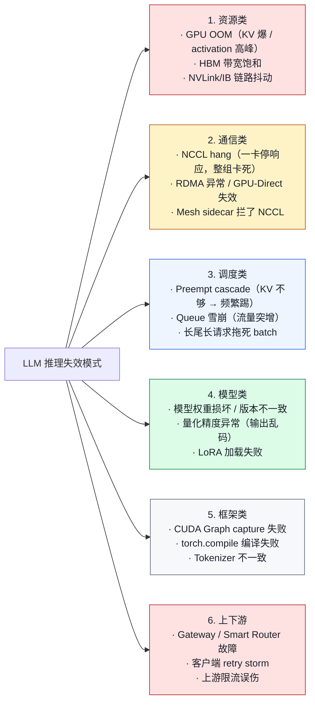
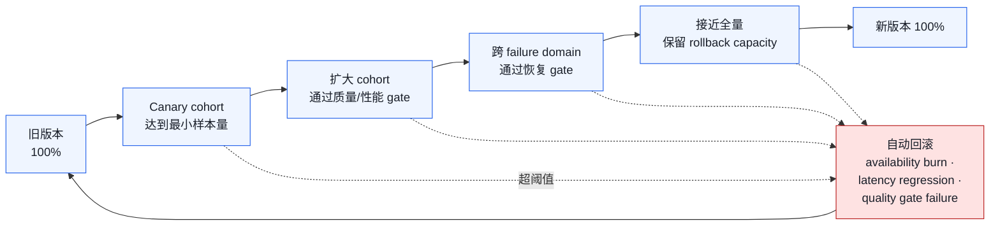

# 06. 稳定性：LLM 推理的失效模式与防护

> **谁该读这一篇？** 负责稳定性、on-call、容灾演练的 SRE / 平台工程师。
>
> **前置阅读：** [`02-architecture.md`](../01-overview/02-architecture.md)、[`05-slo-and-observability.md`](./05-slo-and-observability.md)、[`02-continuous-batching.md`](../02-core-concepts/02-continuous-batching.md)（理解 preempt 行为）
>
> **耗时：** 约 30 分钟
>
> **学完能：**
> 1. 把 LLM 推理失效分到 6 大类（资源/通信/调度/模型/框架/上下游）并对每类给出至少 1 种防御
> 2. 检测并自愈 NCCL hang、GPU OOM、preempt cascade、retry storm
> 3. 设计灰度发布 + 自动回滚阈值
> 4. 写出"上线前 checklist"和典型 chaos 演练剧本

> **当前复核（`b23bd73f540175f9e117eaee5029cd7d8df63964`）：** V1 preemption 是释放 KV 后 recompute，不是 swap；NCCL/PyTorch timeout 环境变量应按当前框架文档验证。本章所有 chaos 只允许在隔离环境、精确 workload/PID 与明确 stop condition 下执行。

LLM 推理服务的"挂掉"姿势比普通微服务多得多——GPU OOM、NCCL hang、KV cascade、CUDA Graph 异常、长尾尾巴拖死一整批请求……本节系统梳理失效模式，给出对应的工程对策。

---

## 1. LLM 特有的失效模式分类



下面挑常见且容易被忽视的几个详谈。

---

## 2. GPU OOM：最常见也最隐蔽

### 2.1 OOM 不一定是 KV 满

vLLM 启动时 profile run 已经预留好 KV cache。运行时 OOM 通常是：

1. **激活的临时高峰**：特定 batch + seq_len 组合下 activation 比 profile 时高
2. **多模态 encoder 高峰**：vision encoder 处理多张大图
3. **CUDA Graph workspace** 占用：录制时分配
4. **碎片化**：长时间运行后 PyTorch caching allocator 内部碎片
5. **第三方进程**：同卡有别的容器抢显存（不该但发生过）

### 2.2 防御
- `gpu_memory_utilization` 从当前默认 0.92 做单变量 A/B；保留多少 headroom 由 OOM/throughput/length sweep 决定
- 设 `PYTORCH_CUDA_ALLOC_CONF=expandable_segments:True` 缓解碎片
- DCGM 监控 `DCGM_FI_DEV_FB_USED`，临界值告警
- Pod 申请平台实际暴露的完整 GPU/MIG resource；不要假设存在通用 `nvidia.com/gpu.memory` resource

### 2.3 OOM 时怎么办
- vLLM 通常会先抛 `torch.cuda.OutOfMemoryError`
- 配合 `restartPolicy: Always`，自动重启
- 但**多次 OOM** 意味着配置问题（KV 算大了），需告警而非依赖自愈

---

## 3. NCCL Hang：分布式推理的噩梦

### 3.1 症状
TP=8 部署，某个时刻所有 8 个 Pod 全部"看似正常运行"但没有任何 GPU 活动。

- `vllm:num_requests_running` 不变
- Pod 没崩、健康检查通过
- 但是新请求全部超时

### 3.2 根因
一个 Pod 内的 NCCL 集合通信（AllReduce）卡住了：

- 某张卡卡了一次 kernel
- 其他卡在等它，整组通信 hang

### 3.3 检测
```bash
# 在 Pod 里看
nvidia-smi pmon -i 0   # 一段时间无活动
NCCL_DEBUG=INFO  # 启动时开
```

PyTorch ProcessGroupNCCL 提供 watchdog/timeout 机制；当前环境可用开关与行为必须按锁定 PyTorch/NCCL 版本验证，例如受控测试 `TORCH_NCCL_BLOCKING_WAIT=1`，不能只复制旧 `NCCL_*` 变量。

### 3.4 防御
1. **collective timeout/watchdog**：在当前框架配置中设置并做故障注入，验证能否终止整组而不是永久 hang
2. **Pod 整组重启**：LeaderWorkerSet 检测到任一 Pod 崩，整组重启
3. **Liveness probe**：探测点不要光是 `/health`，要包含"上一次成功 step 在 N 秒内"
4. **告警**：`vllm:num_requests_running > 0 但 token throughput == 0` 持续 1 分钟

### 3.5 排查
NCCL log + `py-spy dump` Python 栈 + `nvidia-smi nvlink -gt e`（看 NVLink 错误）。

---

## 4. Preempt Cascade：调度雪崩

### 4.1 情景
KV 接近满 → 新请求来 → preempt 一个 running → 那个 running 被重新调度 → KV 又满 → preempt 另一个 → 反复…
表现：`num_preemptions_total` 像火山喷发，TTFT/TPOT 全崩。

### 4.2 防御

**入场准入控制**（admission control）：

- KV usage > 阈值（如 0.85）时拒绝新请求或排队
- 而不是接收后再 preempt

**优先级队列**：

- 已 running 的请求 priority 高于刚进的
- 一个请求被 preempt 一次后下次更高优先级（避免反复牺牲）

**Long context 隔离**：

- 100k+ token 请求路由到专门 Pod
- 不和 chat 请求竞争同一 KV pool

**配置调优**：

- `--max-num-seqs` 适当下降，避免过度并发
- `--max-num-batched-tokens` 防长 prefill 抢 KV

### 4.3 vLLM Scheduler 内置的保护
- 同一请求被 preempt 一次后会 appendleft 到 waiting，下次最优先恢复
- preempt 优先选 waiting 时间最短的（年轻请求）

---

## 5. 长尾长请求：拖死整个 batch

### 5.1 问题
一个请求 `max_tokens=999999` 加 `temperature=0.0`，可能停不下来生成几百万 token。

- 占着 KV 不放
- 让 batch 平均处理时间变长
- 影响其他用户的 TPOT

### 5.2 防御

**Gateway 强制 max_tokens 上限**：

- 普通用户 `max_tokens ≤ 4096`
- 长文档生成业务专用 endpoint

**Repetition detection**：

- vLLM 的 stop_token、stop_string
- 或自定义：n-gram 重复检测，触发后强制 EOS

**Server-side deadline/cancellation**：

- 当前锁定 CLI 没有 `--max-model-time-per-request`；在 gateway/client deadline 与 vLLM cancellation path 上做端到端测试
- 记录 first byte 前后取消、usage、KV 释放和重试语义

**计费导向**：

- 按 token 计费天然约束滥用

---

## 6. 客户端 Retry Storm

### 6.1 场景
LLM 服务一时抖动 → 客户端 SDK 自动重试 → 流量翻倍 → 服务彻底崩 → 恶性循环。

### 6.2 防御

**Server 端：限流 + 区分 503/429**

- 429/503 的 retryability 由公开 API 契约、`Retry-After`、幂等性与 retry budget 决定
- SSE first byte 后不做透明重放；first byte 前也要换 endpoint、退避并计入预算

**Client SDK：指数退避 + jitter**

- 使用带 jitter 的指数退避，base/cap/deadline 由客户端 SLO 决定
- 重试 budget：总重试次数 / 时间窗内有上限

**Server 端：负载丢卒保车**

- 流量极高时主动返回 429 给低优先级客户端
- 保关键客户

---

## 7. Failure Mode 分类与应对（速查表）

| Failure                 | 检测                                    | 自愈                  | 人工动作            |
| ----------------------- | ------------------------------------- | ------------------- | --------------- |
| Pod OOM                 | exit code, `node_oom_kills`           | K8s restart         | 检 KV 配置          |
| GPU OOM                 | torch error                           | Pod restart         | 降 KV / 关 CG     |
| NCCL hang               | throughput 0 + running > 0            | Pod 整组重启            | 看 NCCL log     |
| Preempt cascade         | preempt rate 持续高                      | admission control 自动放慢 | 调 max_num_seqs |
| Long-tail request       | 超过请求 deadline/长度策略                  | cancellation            | 限 input/output |
| Retry storm             | 请求量异常                                  | 503 + ratelimit      | client SDK 改   |
| Tokenizer drift         | cache hit rate 突跌                     | n/a                 | 检模型版本           |
| CUDA Graph 异常          | 启动失败 / 输出乱                            | enforce-eager       | 调小 capture size|
| 模型权重损坏              | 输出全 garbage                          | replica fallback   | 重新下载            |
| Pod scrape timeout      | Prom up=0                            | restart            | 检 metrics 端点    |

---

## 8. 灰度发布与回滚

模型/运行时版本变更是高风险操作。下面阶段和阈值都是占位符，必须由 change risk、样本量与 error budget 填写：

### 8.1 灰度策略



### 8.2 蓝绿
适合"完全不同模型"切换：

- 新模型 cluster 起来跑 staging
- Gateway 一键切流
- 老 cluster 留 24h 准备回滚

### 8.3 Shadow Traffic
新模型不返回给用户，但收一份请求 → 对比新旧输出质量。
适合：评估，不适合：性能 SLO 验证（shadow 一般无 SLO 流量）。

---

## 9. Chaos Engineering：主动制造故障

定期演练，避免"没演过的故障真发生时手足无措"：

| 演练                  | 期望系统反应                       |
| ------------------- | ---------------------------- |
| 隔离环境终止一个测试副本 | endpoint 摘除；影响符合已定义 budget |
| 精确 workload 网络分区 | timeout/watchdog 与整组恢复可观察   |
| 官方工具支持的 GPU 故障 | node quarantine 与恢复路径可观察    |
| Gateway 延迟/错误注入  | retry budget 生效且无 retry storm   |
| 长上下文受控压测        | admission/queue/SLO guardrail 生效 |
| 上游限流（gateway 故障）  | Pod 不雪崩，等待恢复               |

工具：Litmus、ChaosMesh、Gremlin、k8s-fault-injector。

---

## 10. 高可用部署原则

| 原则                         | 含义                              |
| -------------------------- | ------------------------------- |
| 跨可用区分布                  | Pod 跨 AZ 分布，单 AZ 故障不影响整体        |
| 多 region                  | 大区域故障切流（DNS + global LB）          |
| 主备 Gateway                | Gateway 自己也要 HA                   |
| Multi-tenant 隔离           | 一个租户的 retry storm 不影响其他             |
| 关键路径无 SPOF              | 任何单点死了都有 fallback                 |
| 演练频次                     | 按变更/风险计划；每次有 owner、scope、stop condition、rollback |

---

## 11. 一份"上线前"checklist

```
□ HPA / KEDA 配置 + cooldown 足够
□ endpoint drain + 当前版本 SIGTERM/in-flight 语义经过验证
□ readinessProbe 在 model load 完成才 ready
□ NCCL watchdog 超时配置
□ DCGM monitoring（GPU 健康）
□ OOM auto-restart
□ Smart router 有降级到 round-robin
□ Gateway 限流（RPS + token + concurrent）
□ 强制 max_tokens 上限
□ 客户端 SDK 用指数退避 + jitter
□ 灰度发布 + 自动回滚阈值
□ Chaos 演练通过
□ 跨 AZ / 跨 region 分布
□ runbook 写好（详见 07）
□ on-call 培训
```

---

## 12. 工程自检问答

**Q: 一个 vLLM Pod 突然不响应，怎么排查？**
A: ①看 throughput（0 + running>0 = NCCL hang）；②看 GPU util；③`py-spy dump` Python 栈；④检查 mesh sidecar；⑤强制重启 Pod 看是否恢复。

**Q: KV cascade 怎么处理？**
A: 入场准入控制（KV > 阈值拒绝新进）；优先级队列（保 running）；长 context 隔离；调小 max_num_seqs。Long term：扩容或量化。

**Q: 重试在 LLM 下要注意什么？**
A: ①SSE 第一帧后不能重试；②不要重试同一 Pod（让 router 重新选）；③重试 budget；④区分 5xx 类型（503 vs 429 处理不同）。

**Q: 怎么演练 GPU 故障？**
A: 只在隔离、可回收节点使用硬件/平台官方 fault-injection 机制；先核对目标 GPU/进程、审批、stop condition 与节点恢复步骤。不要把 `nvidia-smi -p 0`（persistence mode）误当成 kill，也不要在生产拔卡。

**Q: 模型质量 regression 怎么发现？**
A: ①shadow 流量对比新旧输出；②用户反馈 thumbs；③离线 eval（金标集）；④EOS rate、格式合规率等代理指标。多层防护。

---

## 小结

- 失效模式分 6 类：资源、通信、调度、模型、框架、上下游；逐类设防御比"加 retry"有效得多。
- NCCL hang 要用当前 ProcessGroup timeout/watchdog、精确 workload 整组恢复和“有在途请求但 token throughput 停止”告警形成多层防护；具体编排不限定 LWS。
- Preempt cascade 用 admission control + 优先级队列 + 长上下文隔离来斩断。
- 重试在 LLM 下要分清 503/429、SSE 第一帧前后、retry budget，否则 retry storm 会自己把服务打死。
- 灰度发布、自动回滚、chaos 演练是把"未知未知"变成"已知"的常规手段。

## 自检

> 不用照着原文复述，重点是把现象、机制、源码入口和取舍讲顺。

**1. TP=8 Pod 组：8 个 Pod CPU 5%、GPU util 0%、`num_requests_running > 0` —— 第一反应？检测路径？**

**第一假设之一**是 collective/worker stall，但也可能是 scheduler、进程间 IPC、driver 或观测陈旧。先确认 token counter 停止、逐 rank stack 一致卡住和通信/driver 证据，再定性 NCCL hang。

**检测路径**：

```bash
# Step 1: 看请求是不是真在 running
curl http://pod:8000/metrics | grep -E "num_requests_(running|waiting)"
# 如果 running > 0 但 waiting 也涨 → 卡死无产出

# Step 2: py-spy 看 Python 栈
for pod in $(kubectl get pods -l app=vllm -o name); do
    kubectl exec $pod -- py-spy dump --pid 1
done | tee /tmp/dumps.txt
grep -A5 "all_reduce\|c10d" /tmp/dumps.txt
# 典型表现：所有 worker 都在 c10d.work.wait()

# Step 3: 看 NCCL 调用一致性
NCCL_DEBUG=INFO ; 重启服务看 log
# Step 4: 检查物理链路
kubectl exec <pod> -- nvidia-smi nvlink -e
# CRC 错误 / link down → 物理硬件问题
```

**典型根因**：

1. **不同 rank 看到不一致的 batch shape**（scheduler bug，scheduler 没同步广播）
2. **某 rank 慢了几百 ms**（GC pause、CPU 抢占等）触发其他 rank wait 超时
3. **NVLink 物理故障**
4. **NCCL 版本与驱动不匹配**（升级 CUDA driver 但忘了升级 NCCL）

**应急**：直接 `kubectl delete pod -l app=vllm` 整组重启（LWS 会自动重建）。

---

**2. KV 使用率长期 > 0.9, preempt rate 每分钟数十，3 个独立缓解手段。**

**缓解手段（独立 + 立即生效）**：

| 手段 | 操作 | 收益 | 副作用 |
| --- | --- | --- | --- |
| **1. 扩 pod 数** | HPA 触发 / 手动 `kubectl scale` | 横向分流，每 pod 负载降 | 成本上升；需几十秒 warm |
| **2. 降 `max_num_seqs`** | rolling update 做一变量 A/B | 降低可并发 sequence 上限，KV 峰值可能下降 | 吞吐/queue 可能恶化 |
| **3. 评估 FP8 KV** | 兼容硬件/模型上做 quality + perf gate | 相对 FP16/BF16 降低 KV bytes/token | 精度与 backend 支持必须实测 |
| 4. admission control 拒新请求 | gateway 返 429 给客户端 | 立即降压（保护现有请求）| 部分用户被拒 |
| 5. 调整 scheduler token budget | `--max-num-batched-tokens <tested>` | 改变 prefill/decode 调度与 step 工作量 | TTFT/TPOT/goodput 需一起测 |

**实战顺序**：

1. **立即**：admission control 拒新请求（保护当前用户）
2. **5 分钟内**：扩 pod（HPA 自动 / 手动）
3. **若 HPA 太慢**：rolling update 降 max_num_seqs 或切 FP8
4. **长期**：复盘容量规划，提高 utilization 目标 或 拉长高峰扩容窗口

→ 关键是**多手段并行**，单一手段都有滞后或副作用。

---

**3. 灰度 5% 阶段，定 3 个自动回滚阈值？覆盖什么风险？**

| 阈值 | 数值 | 覆盖风险 |
| --- | --- | --- |
| **TTFT p99 相对基线退化 > 30%** | `histogram_quantile(0.99, new) / histogram_quantile(0.99, baseline) > 1.3` | 性能回归（新版本 scheduler bug、kernel 选择失误、模型 load 异常）|
| **HTTP availability burn** | gateway 5xx/timeout multi-window burn | 服务错误/超时；engine abort 不能代表输出正确性 |
| **OOM / process failure** | K8s termination reason + GPU/server log | 配置、workload 或 runtime failure |

**第 4 个常用**：
| **KV cache hit rate 退化 > 50%** | `cache_hit_rate_new < cache_hit_rate_baseline × 0.5` | prefix caching 失效（hash 算法改了、cache key 不兼容） |

**实施**：

- 用 Argo Rollouts / Flagger 等 progressive delivery 工具
- 每个阈值连续命中 N 分钟（比如 3 分钟）才触发，避免毛刺
- 触发后自动 abort rollout + 通知 oncall

阶段比例、观察时间和阈值按样本量/风险变化；小流量 canary 不能沿用全量告警阈值。

---

**4. Chaos 演练：模拟"单 Pod NCCL hang"，期望自愈时间 + 用户侧表现？**

**演练设计**：

```bash
# Step 1: 仅在隔离 namespace，用唯一 label 解析一个 disposable test workload
target_workload=<validated-test-target>

# Step 2: 注入 NCCL hang
# 方法 A: kill 一个 worker 进程 → 其他 worker AllReduce wait
<approved fault-injector> --target "$target_workload" --fault <collective-stall>
# 方法 B: 用 chaos-mesh 注入网络分区
# 方法 C: 用 sigstop 暂停所有 NCCL 端口

# Step 3: 观察自愈
watch kubectl get pods -l app=vllm
```

**先填写验收时间线，不预填固定秒数**：

| 时间 | 系统行为 | 用户侧 |
| --- | --- | --- |
| T=0 | 注入 hang | 部分请求开始挂在那个 pod |
| `<detect>` | watchdog/liveness/throughput alert 命中 | 记录受影响请求 |
| `<remove>` | gateway 摘除 endpoint | 验证不再送新请求 |
| `<recover>` | 依部署单元恢复整组/Pod | 验证 cold-ready 与 capacity |
| `<stable>` | golden request 与 SLO 恢复 | 结束注入并留 artifact |

**目标 SLA**：

- MTTR、受影响请求比例与 error-budget 消耗都使用本服务预先批准的目标
- retry 成功率不是 100% 假设；验证幂等性、budget 与 first-byte 边界

**演练通过标准**：

- LWS 自动重建（不需人工 `kubectl delete pod`）
- 客户端 retry 后请求成功（gateway 摘除挂掉 pod 的速度足够快）
- 监控告警在 T=10s 内触发（不需 oncall 来检查）

**演练失败的常见 root cause**：

- liveness probe 太宽松（如 60s 才检测 hang）→ 改成 10s
- LWS 没配（用了 Deployment）→ 改 CRD
- gateway 健康检查间隔太久（5min）→ 改 10s
- client retry policy 没配 → 教育业务方

→ 演练目的不是"看看会怎样"，是**验证你设计的恢复机制确实工作**。

## 下一步

- 下一节：[`07-incident-playbook.md`](./07-incident-playbook.md)（把这些理论转成可执行 runbook）
- 规模化失效：[`05-distributed/05-large-scale-cluster-inference.md`](../05-distributed/05-large-scale-cluster-inference.md)（万卡的故障墙：NCCL fail-stop、blast radius、慢卡 straggler、弹性 EP）
- 想看源码：`vllm/v1/core/sched/`（preempt 与调度）、`vllm/distributed/`（NCCL/通信）
- 想动手：[`07-hands-on/04-profiling-and-debugging.md`](../07-hands-on/04-profiling-and-debugging.md) 主动制造 OOM/preempt 验证防护
