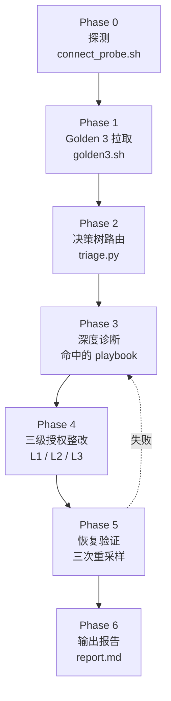

# 09. 把 playbook 编成 agent：vllm-doctor skill

> **谁该读这一篇？** SRE / 平台工程师；想让 agent 自动收集只读证据、生成处置计划，同时把每一次集群变更牢牢留在人类审批边界内的人。
>
> **前置阅读：** [`05-slo-and-observability.md`](./05-slo-and-observability.md)、[`06-reliability-and-failure-modes.md`](./06-reliability-and-failure-modes.md)、[`07-incident-playbook.md`](./07-incident-playbook.md)、[`07-hands-on/04-profiling-and-debugging.md`](../07-hands-on/04-profiling-and-debugging.md)
>
> **耗时：** 约 30 分钟
>
> **学完能：**
> 1. 说清"为什么 runbook 要升级成 skill"以及边界在哪
> 2. 读懂 7 阶段工作流，把 §07 的 8 个 case 一一对应到 8 个 playbook
> 3. 在没有真实集群的情况下用 fixture mode 完整跑一遍
> 4. 自己往 skill 里加一条新 playbook（扩展模板）

> **当前复核（2026-07-20）：** 本章的 `vllm-doctor` 是教程中的 agent 设计，不是 vLLM 上游内置 skill。默认权限必须只读；扩缩、重启、改配置、抓取可能含 prompt/secret 的 artifact 都必须走显式审批、精确 scope、dry-run、rollback 和审计日志。

§07-incident-playbook 给了 8 个案例，每个都按"症状 → 诊断 → 整改 → 长期"四段写。问题是：on-call 时需要快速找到证据和正确 runbook。`vllm-doctor` 是本教程的设计练习：把 playbook 编成 agent 可辅助执行的 SOP。agent 可自动收集只读证据和生成建议；生产整改仍由权限策略与人工审批控制。

---

## 1. 为什么把 playbook 升级为 skill

文档型 runbook 的三个老问题：

- **找得慢**：on-call 不熟某类故障时，要先翻索引才知道走哪条 case。
- **跑得慢**：每条 PromQL 都得人手粘到 Grafana 或 curl，每个 kubectl 都得想清楚参数。
- **回滚没人记**：紧急改了 env，3 小时后没人记得改回来。

skill 解决方案是三件套：

| 资产 | skill 里的对应物 | 解决的问题 |
| --- | --- | --- |
| 决策树（§07 的合成场景） | `scripts/triage.py` | 按显式服务阈值生成 playbook 假设；缺证据/阈值时 fail closed |
| 命令模板（§06-§07） | `scripts/golden3.sh` / `kv_pressure_diag.sh` / `nccl_diag.sh` / `remediate_*.sh` | 拉只读证据；remediate 只生成候选计划 |
| 上线前 checklist | `reference/checklist-prelaunch.md` | 防患于未然 |

**关键约束**：skill **不是 ChatOps bot**。它默认只读；任何会改变 cluster/gateway/node/process/filesystem/external state 的动作，无论标成 L2 还是 L3，都必须展示唯一 target、current state、command、blast radius、rollback/stop condition，并逐条取得显式批准。

---

## 2. 7 阶段工作流总览



每个 Phase 对照表：

| Phase | skill 文件 | 对应 notebook 章节 |
| --- | --- | --- |
| 0 探测 | `scripts/connect_probe.sh` | — |
| 1 拉指标 | `scripts/golden3.sh` + `reference/promql-cheatsheet.md` | §05 (§3 4 大金信号) |
| 2 决策 | `scripts/triage.py` | §07 的合成场景与当前运行证据 |
| 3 深度诊断 | `playbooks/<id>.md` 中的 Triage Commands 节 | §07-incident-playbook |
| 4 整改 | `scripts/remediate_<id>.sh` | §06 (§7 速查表) + §07 各 case |
| 5 验证 | `triage.py --verify` | — |
| 6 报告 | agent 写 `$INCIDENT_DIR/report.md` | — |

> **触发前置条件**：vLLM Pod 已经 Running 且接好 Prometheus；本机能 `kubectl exec` 进去。如果只是想做配置审查、不是真排障，看 `reference/checklist-prelaunch.md` 即可，不用触发 skill。

---

## 3. 决策树：Golden 3 → 8 个 playbook

§07-04 已经给出 30 秒决策树原型。skill 把它写成可执行的 Python：

```
TTFT_p99 > approved SLO?
├ YES → queue > validated waterline?
│       ├ YES → KV 高 + preempt/queue 高 → playbook 01 (preempt-cascade)
│       └ NO  → KV 越过本池水位? → 01 ;  否则 → 06 (cold-start)
├ NO  → throughput ≈ 0 AND running > 0 → playbook 02 (nccl-hang)
        → prefix_cache_hit 低于版本化 workload 基线 → 05 (cache regression)
        → gateway/client failure attempts 越过本地基线 → 04 (retry storm)
        → 已观察 OOMKilled/runtime OOM → 03 (gpu-oom)
        → format_compliance 低且有业务指标 → 07 (output quality)
```

8 个 playbook 的命中条件速查：

| ID | 名称 | 主要触发条件 | 排除项 |
| --- | --- | --- | --- |
| 01 | preempt-cascade | KV 越过本池水位 + preempt/queue 退化 | OOMKilled → 03；throughput=0 → 02 |
| 02 | nccl-hang | throughput 无进展 AND running>0 超过批准窗口 | running=0 不算（没流量） |
| 03 | gpu-oom | OOMKilled/runtime OOM 明确证据 | 高 KV 但无 OOM → 01 |
| 04 | retry-storm | 网关/客户端失败尝试率越过本地基线 | vLLM 无通用 HTTP failure counter；缺信号则不路由 |
| 05 | cache-hit-regression | prefix token 命中率显著低于版本化基线 | 单 pod 重启后的回落仍需按 warmup 曲线验证 |
| 06 | cold-start | TTFT 高但 KV/queue 都低，running 少 | 对照本模型 cold/warm ready 基线 |
| 07 | output-quality | 自定义质量 gate 失败或反馈率突增 | prompt/template 变化也是待定位输入，不先归责 |
| 08 | lora-thrash | 控制面 load/unload 反复 + TTFT 时间对齐 | 当前无通用 LoRA loading histogram |

**Dry-run 验证表**（下列数字仅为合成 fixture，不是生产阈值）：

| Fixture | KV | preempt | throughput | running | cache_hit | format | 命中 playbook | 备选 |
| --- | --- | --- | --- | --- | --- | --- | --- | --- |
| 1 抢占级联 | 0.95 | 0.6 | 100 | 50 | 0.8 | 1.0 | **01-preempt-cascade** | — |
| 2 NCCL hang | 0.5 | 0 | 0 | 8 | 0.8 | 1.0 | **02-nccl-hang** | — |
| 3 冷启动 | 0.3 | 0 | 5 | 2 | 0.7 | 1.0 | **06-cold-start** | — |
| 4 cache 塌方 | 0.6 | 0 | 200 | 20 | 0.3 | 1.0 | **05-cache-hit-regression** | — |
| 5 retry storm | 0.6 | 0 | 100 | 10 | 0.8 | 1.0（failed=0.5） | **04-retry-storm** | — |
| 6 输出质量 | 0.5 | 0 | 100 | 10 | 0.8 | 0.6 | **07-output-quality** | — |
| 7 健康 | 0.5 | 0 | 100 | 10 | 0.8 | 1.0 | **none** | — |

> 注意 fixture 1：高 KV 是容量压力证据，不是 OOM 证据。只有 K8s termination reason 或 runtime log 明确显示 OOM，才命中 `03-gpu-oom`。

兜底：`confidence < 0.5` → skill 不会强行进 playbook，而是把 Golden 3 截图给用户、建议人工核对客户端日志或开 OTel trace。

---

## 4. 三级整改授权（L1 / L2 / L3）

agent 不应该所有动作都问、也不应该一条都不问。`vllm-doctor` 把整改动作按破坏力分三级：

| 级别 | 例子 | 授权策略 | 必做记录 |
| --- | --- | --- | --- |
| **L1** 只读 / 旁路 | `kubectl describe`、脱敏日志、抓证据 | 可直接做 | 输出归档到 `$INCIDENT_DIR/evidence/` |
| **L2** 有状态变更 | 改 env、gateway policy、`kubectl scale` | **逐条显式批准** | current + command + rollback + stop condition |
| **L3** 高破坏性 | delete/restart/taint/rollback | **逐条显式批准** | 同上，并说明不可逆部分 |

### 三个典型决策

**A · 抢占级联**：先只读确认 workload、当前参数和 service curve。若建议改 `max_num_seqs`，必须给出精确资源、旧值、候选值、预期指标方向与 rollback；用户批准后才执行。

**B · collective stall**：先确认部署单元。多 Pod collective 可能需要整组恢复，单 Pod 多 GPU 则恢复该 Pod；不能把 LWS selector 当通用命令。任何 restart/delete 都要审批。

**C · 没有安全 rollback**：把这一点作为 stop condition/风险报告给用户，不执行“先改再看”。`remediate_<id>.sh` 只生成计划，不提供免审批执行开关。

---

## 5. 端到端演示：以"抢占级联"为例

走一遍合成 incident 流程（fixture mode 只验证分类与计划生成，不连接集群）：

### Step 1 · 触发

```bash
export VLLM_NAMESPACE=vllm
export PROM_URL=http://prom.example:9090
# 在 Claude Code：/vllm-doctor
```

### Step 2 · Phase 0 探测输出

```json
{
  "ts": "2026-05-29T03:11:00Z",
  "kubectl_context": "ok",
  "namespace": "vllm",
  "pods": "ok",
  "pod_count": 6,
  "prom": "ok",
  "gpu": "ok",
  "gpu_count": 8
}
```

### Step 3 · Phase 1 Golden 3

```json
{
  "ttft_p99_ms": 9000,
  "queue": 80,
  "kv_usage": 0.95,
  "throughput": 100,
  "running": 50,
  "prefix_cache_hit_rate": 0.8,
  "preempt_rate_per_sec": 0.6,
  "request_failed_rate": 0,
  "format_compliance_rate": 1
}
```

### Step 4 · Phase 2 决策

```json
{
  "playbook": "01-preempt-cascade",
  "confidence": 0.85,
  "reason": "kv=0.95 preempt=0.60/s + TTFT/queue 高",
  "alternatives": []
}
```

agent 进入 `playbooks/01-preempt-cascade.md`，继续用只读 evidence 区分长度分布、sequence/token budget、路由热点和真实容量不足。

### Step 5 · Phase 3 深度诊断（playbook 01）

```bash
# 经用户确认 incident 输出目录后，只读运行：
bash scripts/kv_pressure_diag.sh $INCIDENT_DIR/evidence/kv
```

输出摘要：

```json
{
  "kv_usage_now": 0.95,
  "preempt_rate_now": 0.62,
  "queue_now": 80,
  "longest_running_seconds": 142
}
```

`longest_running` 不算特别长（< 300s），所以判定不是长尾堵 batch，而是容量真不够 + `max_num_seqs` 设大了。

### Step 6 · Phase 4 整改

`remediate_01.sh` 输出（节选）：

```yaml
- level: L2
  command: kubectl set env deploy/vllm -n vllm MAX_NUM_SEQS=32
  rollback: kubectl set env deploy/vllm MAX_NUM_SEQS-
- level: L2
  command: kubectl scale lws/vllm -n vllm --replicas=$((current+2))
  rollback: kubectl scale lws/vllm -n vllm --replicas=current
- level: L3
  command: kubectl rollout restart deploy/vllm -n vllm  # 影响：所有 replica 滚动重启
  rollback: kubectl rollout undo deploy/vllm -n vllm
```

脚本只打印这份候选计划。agent 先把第一条 L2 的 target/current/rollback 展示给用户；只有用户批准才执行，然后验证，不自动继续第二条。

> 接下来要做 L3：`kubectl rollout restart deploy/vllm -n vllm`。影响：所有 replica 滚动重启，期间整体容量临时下降。是否执行？

用户可批准或跳过；跳过不会触发替代 mutation，报告记录“未执行”。

### Step 7 · Phase 5 验证

```bash
: "${VERIFY_INTERVAL_SECONDS:?set from the playbook observation window}"
for i in 1 2 3; do
  sleep "$VERIFY_INTERVAL_SECONDS"
  bash scripts/golden3.sh > $INCIDENT_DIR/verify-$i.json
done
python3 scripts/triage.py --verify verify-1.json verify-2.json verify-3.json
```

输出：

```json
{
  "status": "NO_ACTIVE_ROUTE",
  "samples": [
    {"playbook": "none", ...},
    {"playbook": "none", ...},
    {"playbook": "none", ...}
  ]
}
```

`NO_ACTIVE_ROUTE` 只说明通用路由器没再命中，不能单独宣告恢复；还要满足命中 playbook 的全部 Verification gate。缺指标或阈值时必须返回 `INSUFFICIENT_EVIDENCE`。

### Step 8 · Phase 6 报告

`report.md` 节选：

```markdown
# Incident Report 2026-05-29T03:11

## 命中 playbook
01-preempt-cascade (conf 0.85)

## 执行的整改
- L2  MAX_NUM_SEQS=<approved value>（逐条批准后执行）
- L2  scale <resolved target>（未批准则记录 skipped）
- L3  rollout restart  ← 跳过（用户选择）

## 恢复结果
RESOLVED（3 次重采样无 active route，且 playbook 专属 gate 全部通过）

## 长期改进
1. KEDA 联合观察 kv_cache_usage_perc、queue 与本池容量实验水位
2. 长上下文请求走单独 pod 池
   → reference/checklist-prelaunch.md 第 4、6 条
```

---

## 6. 离线 dry-run：没有集群也能学

想动手但手头没集群？skill 内置 `VLLM_DOCTOR_FIXTURE` 环境变量，让 `golden3.sh` 直接读 JSON 文件，跳过 Prometheus。

把下面 4 个 fixture 存到 `/tmp/`：

```json
// /tmp/preempt.json
{"ttft_p99_ms":9000,"queue":80,"kv_usage":0.95,"throughput":100,"running":50,
 "prefix_cache_hit_rate":0.8,"preempt_rate_per_sec":0.6,
 "request_failed_rate":0,"format_compliance_rate":1}
```

```json
// /tmp/nccl.json
{"ttft_p99_ms":500,"queue":0,"kv_usage":0.5,"throughput":0,"running":8,
 "prefix_cache_hit_rate":0.8,"preempt_rate_per_sec":0,
 "request_failed_rate":0,"format_compliance_rate":1}
```

```json
// /tmp/cold-start.json
{"ttft_p99_ms":8000,"queue":2,"kv_usage":0.3,"throughput":5,"running":2,
 "prefix_cache_hit_rate":0.7,"preempt_rate_per_sec":0,
 "request_failed_rate":0,"format_compliance_rate":1}
```

```json
// /tmp/healthy.json
{"ttft_p99_ms":500,"queue":0,"kv_usage":0.5,"throughput":100,"running":10,
 "prefix_cache_hit_rate":0.8,"preempt_rate_per_sec":0,
 "request_failed_rate":0,"format_compliance_rate":1}
```

跑：

```bash
SKILL=~/.claude/skills/vllm-doctor
for f in /tmp/preempt.json /tmp/nccl.json /tmp/cold-start.json /tmp/healthy.json; do
  echo "=== $f ==="
  VLLM_DOCTOR_FIXTURE="$f" bash $SKILL/scripts/golden3.sh \
    | python3 $SKILL/scripts/triage.py
done
```

预期：
- `/tmp/preempt.json` → `playbook: 01-preempt-cascade`
- `/tmp/nccl.json` → `playbook: 02-nccl-hang`
- `/tmp/cold-start.json` → `playbook: 06-cold-start`
- `/tmp/healthy.json` → `playbook: none`

**线上必填阈值**（来自服务 SLO、容量实验和版本化 workload 基线；`REPLACE_WITH_...` 必须替换成数值）：

```bash
export TTFT_SLO_MS="REPLACE_WITH_APPROVED_SLO_MS"
export QUEUE_HIGH="REPLACE_WITH_VALIDATED_QUEUE_WATERLINE"
export KV_HIGH="REPLACE_WITH_VALIDATED_KV_WATERLINE"
export PREEMPT_HIGH_PER_SEC="REPLACE_WITH_VALIDATED_PREEMPT_RATE"
export PREFIX_CACHE_DROP_FROM="REPLACE_WITH_VERSIONED_WORKLOAD_BASELINE"
export RUNNING_LOW="REPLACE_WITH_VALIDATED_LOW_RUNNING_BOUNDARY"
```

---

## 7. 怎么扩展一条新 playbook

想加一类新故障（比如"speculative decoding 命中率塌方"）？5 步：

1. **写 playbook markdown**：复制 `playbooks/05-cache-hit-regression.md` 当模板，改成 `09-spec-decode-regression.md`。统一含 Symptom Reconfirm / Triage Commands / Root Cause 判定 / Remediate（只读 / 需逐命令批准）/ Verification / Long-term 六节。
2. **加 triage.py 路由分支**：在 `route()` 里加几行
   ```python
   if spec_acceptance_rate < SPEC_ACCEPTANCE_BASELINE:
       candidates.append((0.7, "09-spec-decode-regression",
                          "spec acceptance below the versioned workload baseline"))
   ```
3. **golden3.sh 多拉一个指标**：加 `spec_acceptance_rate=$(q '...')` 进 JSON 输出。
4. **写 remediate 脚本（可选）**：脚本只能生成计划；测试禁止 `eval`、apply 模式或任何 mutation 执行通道。所有 L2/L3 逐条审批。
5. **回头给 §07-incident-playbook 加一条对应 case**（让书面 runbook 也覆盖到）—— 但这是后续工作，本 skill 第一版不强求。

模板内容尽量短：决策逻辑写清楚就够，命令尽量复用现有脚本。

---

## 8. skill 和 notebook 的关系（防漂移）

skill 是 notebook 的"运行时投影"：

- notebook（§05-§07）讲清楚为什么、给出原理图、列出所有候选命令；
- skill 把它们裁剪成可执行的最小子集，按 Phase 编排。

两边内容有重复风险。处理方式：

- 每个 playbook markdown 末尾有 `<!-- source: ../../08-production-deployment/07-incident-playbook.md case N -->` 注释作为契约
- 后续可以写 CI 检查脚本，对比两边的关键命令是否仍一致（一期不强求，记一笔）

notebook 与 skill 都不是 runtime 权威。锁定源码、当前 `/metrics`、部署清单和运行证据优先；两份文档冲突时 fail closed，停止 mutation 并修正文档/测试。

---

## 小结

- skill 把 §06-§08 的失效模式表 + incident playbook + Golden 3 决策树编成一份 agent 可执行的 SOP
- 7 阶段工作流：探测 → Golden 3 → 决策树 → 深度诊断 → 三级整改 → 验证 → 报告
- 三级分类只用于解释风险：L1 只读可自动；L2/L3 任何 mutation 都逐条显式批准
- fixture mode 让没有真集群的读者也能完整跑一遍
- skill 与 notebook 通过 source 注释和测试防漂移；runtime evidence 与锁定源码优先

## 自检

> 不用照着原文复述，重点是把现象、机制、源码入口和取舍讲顺。

**1. 为什么 NCCL hang 的重建动作必须先解析完整并行部署单元，不能默认只删一个 pod？**

NCCL 是集合通信，一个 rank 异常可能让其他 rank 等待。部署可能是单 Pod 多 GPU，也可能是 LWS 等多 Pod group；先从实际 rank/拓扑解析完整单元，再生成 drain/rebuild 计划。`remediate_02.sh` 只输出候选计划，不直接渲染删除命令。

**2. fixture 1（KV=0.95、preempt=0.6/s、queue 高）为什么命中 `01-preempt-cascade`？**

KV 高 + preemption/queue 是抢占压力证据；高 KV 本身不证明 OOM。只有 `OOMKilled` 或 runtime OOM log 等明确证据才路由 `03-gpu-oom`。

**3. 加一条新 playbook 至少要改哪几个文件？**

至少 2 个：`playbooks/<id>.md`（新建）+ `scripts/triage.py`（加路由分支）。常配套：`scripts/golden3.sh`（多拉一个指标）+ `scripts/remediate_<id>.sh`（只生成结构化候选计划）。

**4. 何时不应该触发 skill？**

- 初次部署 vLLM 还没起来 → 没指标可拉，用 `reference/checklist-prelaunch.md` 走人工 checklist
- Prometheus 没接 vLLM metrics → Phase 1 拉空
- 只是想做配置审查（不是排障）→ 还是用 checklist
- 通用路由没有命中且没有用户症状 → 不执行 mutation；若有症状但缺信号，标记 `INSUFFICIENT_EVIDENCE` 并补只读证据

## 下一步

- **装上**：`cp -r vllm-learning/.claude/skills/vllm-doctor ~/.claude/skills/`
- **离线跑一遍**：按本节 §6 的 4 个 fixture
- **想看决策细节**：[`.claude/skills/vllm-doctor/SKILL.md`](../.claude/skills/vllm-doctor/SKILL.md)
- **想看 8 个 playbook 全文**：[`.claude/skills/vllm-doctor/playbooks/`](../.claude/skills/vllm-doctor/playbooks/)
- **想看 PromQL 速查**：[`.claude/skills/vllm-doctor/reference/promql-cheatsheet.md`](../.claude/skills/vllm-doctor/reference/promql-cheatsheet.md)

---

## Sources

- [`.claude/skills/vllm-doctor/SKILL.md`](../.claude/skills/vllm-doctor/SKILL.md) —— 工作流权威定义
- [`.claude/skills/vllm-doctor/playbooks/01..08-*.md`](../.claude/skills/vllm-doctor/playbooks/) —— 8 个 playbook
- [`07-hands-on/04-profiling-and-debugging.md`](../07-hands-on/04-profiling-and-debugging.md) —— profiling 与证据收集方法
- [`06-reliability-and-failure-modes.md`](./06-reliability-and-failure-modes.md) —— 失效模式与安全演练约束
- [`07-incident-playbook.md`](./07-incident-playbook.md) —— 8 个合成场景
