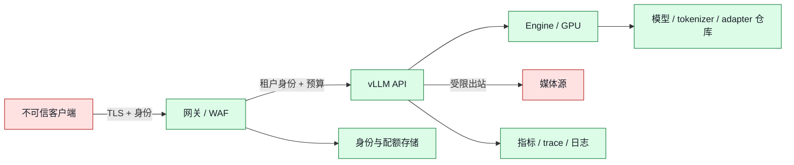

# 11. 安全与多租户：把 vLLM 放进可信边界

> **谁该读这一篇？** 要把 vLLM API 暴露给多个团队、租户或互联网入口的平台工程师、安全工程师和 SRE。
>
> **前置阅读：** [`02-smart-routing-and-load-balancing.md`](02-smart-routing-and-load-balancing.md)、[`03-gateway-and-service-mesh.md`](03-gateway-and-service-mesh.md)、[`05-slo-and-observability.md`](05-slo-and-observability.md)
>
> **耗时：** 约 35 分钟
>
> **难度：** 进阶
>
> **学完能：**
> 1. 画出客户端、网关、vLLM、模型仓库、对象存储和 GPU 节点之间的信任边界。
> 2. 区分 vLLM 内置 API key 与完整的身份、租户、配额和审计系统。
> 3. 为文本、多模态 URL、本地文件、LoRA 和自定义模型代码分别定义最小权限。
> 4. 设计不会把 prompt、密钥或租户标识泄漏进日志和高基数指标的可观测方案。
> 5. 用可验证的拒绝测试证明“默认拒绝、显式允许”。

> **当前复核（`b23bd73f540175f9e117eaee5029cd7d8df63964`）：** 本章只陈述锁定源码里可验证的 vLLM 能力。网关、Kubernetes、secret manager 和网络策略由各自版本与部署配置决定；当前 SHA 未做 GPU 或集群安全验证。

安全不是给 `vllm serve` 加一个 key 就结束。推理服务同时处理用户输入、模型权重、tokenizer、可选远程媒体、LoRA adapter 和高价值 GPU 资源；任何一项跨过错误的边界，都可能变成数据泄露、SSRF、任意文件读取、供应链污染或资源耗尽。

---

## 1. 先画资产与信任边界



威胁建模至少列出五类资产：

| 资产 | 典型威胁 | 首要控制 |
| --- | --- | --- |
| prompt / output | 日志泄露、跨租户串读 | 最小化记录、租户隔离、访问审计 |
| GPU / KV 容量 | 超长输入、并发和重试耗尽 | 请求长度、并发、速率、预算四层限制 |
| 模型与代码 | 浮动 revision、恶意自定义代码 | 固定 digest/revision、离线审查、最小权限 |
| 远程媒体 / 本地文件 | SSRF、内网探测、目录越界 | 域名允许列表、禁本地路径、出站网络策略 |
| adapter | 未授权加载、路径替换、显存挤占 | 禁运行时更新或强认证、签名与配额 |

先写清谁能发起什么动作，再选控件。只列“启用 TLS、配置 API key”而不定义资产和主体，无法做拒绝测试。

---

## 2. 内置 API key 是一道门，不是多租户身份系统

<!-- vllm-source: {"path":"vllm/entrypoints/openai/api_server.py","symbol":"build_app","anchor":"if tokens := [key for key in (args.api_key or [envs.VLLM_API_KEY]) if key]:"} -->
[源码锚点：vllm/entrypoints/openai/api_server.py · build_app](https://github.com/vllm-project/vllm/blob/b23bd73f540175f9e117eaee5029cd7d8df63964/vllm/entrypoints/openai/api_server.py#L307)

当前 `build_app()` 只有在 `--api-key` 或 `VLLM_API_KEY` 提供非空 token 时才挂载 `AuthenticationMiddleware`；CLI 值优先于环境变量。由此得到两个安全结论：

1. 未配置 key 时，不能假设 vLLM 会替你拒绝未认证请求。
2. 共享 bearer token 只能证明“持有某个 token”，不能自然表达用户、租户、角色、单独吊销、配额归属或细粒度审计。

生产入口通常由网关完成 OIDC/mTLS、租户映射、key rotation 和权限判定，再把请求转给只允许内部访问的 vLLM Service。不要把外部身份 token 原样写入 header 日志，也不要信任客户端自报的 `tenant_id`；租户身份应来自已验证的凭据。

<!-- vllm-source: {"path":"vllm/entrypoints/openai/api_server.py","symbol":"build_app","anchor":"allow_origins=args.allowed_origins,"} -->
[源码锚点：vllm/entrypoints/openai/api_server.py · CORS middleware](https://github.com/vllm-project/vllm/blob/b23bd73f540175f9e117eaee5029cd7d8df63964/vllm/entrypoints/openai/api_server.py#L281)

`allowed_origins` 等 CORS 配置是浏览器跨源策略，不是服务端认证。非浏览器客户端不受 CORS 保护，因此不能用 `allow_origins` 代替网关鉴权。

---

## 3. 控制归谁：别把所有安全责任塞给 vLLM

| 控制 | 推荐责任方 | 失败时的证据 |
| --- | --- | --- |
| 公网 TLS、证书轮换、WAF | 网关 / ingress | TLS 扫描、证书到期告警、网关 access log |
| 用户/服务身份、RBAC | IdP + 网关 | 鉴权 decision log，不记录完整凭据 |
| 租户速率、并发、token 预算 | 网关 / admission service | 带租户匿名 ID 的拒绝 counter |
| 单请求模型长度和生成上限 | 网关 + vLLM 请求校验 | 4xx 类型与请求长度分布 |
| GPU、进程、文件系统隔离 | orchestrator / node runtime | Pod security、seccomp、mount、device audit |
| 模型、tokenizer、adapter provenance | 制品仓库 + 发布流水线 | digest、revision、签名、SBOM、审批记录 |
| 推理调度与 KV block | vLLM | scheduler/KV/preemption 指标 |
| 密钥存放和轮换 | secret manager | 版本、租约、轮换演练，不导出 secret 内容 |

vLLM 也能直接配置证书文件，但谁终止 TLS 要按拓扑统一决定。若 TLS 在网关终止，网关到 vLLM 的链路仍需由私有网络、mTLS 或等价控制保护；不要无意间形成“外部加密、集群内任意 Pod 可明文调用”。

---

## 4. 多模态输入：同时防 SSRF 和本地文件读取

<!-- vllm-source: {"path":"vllm/config/model.py","symbol":"ModelConfig","anchor":"allowed_local_media_path: str = \"\""} -->
[源码锚点：vllm/config/model.py · ModelConfig.allowed_local_media_path](https://github.com/vllm-project/vllm/blob/b23bd73f540175f9e117eaee5029cd7d8df63964/vllm/config/model.py#L172)
<!-- vllm-source: {"path":"vllm/config/model.py","symbol":"ModelConfig","anchor":"allowed_media_domains: list[str] | None = None"} -->
[源码锚点：vllm/config/model.py · ModelConfig.allowed_media_domains](https://github.com/vllm-project/vllm/blob/b23bd73f540175f9e117eaee5029cd7d8df63964/vllm/config/model.py#L176)

当前源码把 `allowed_local_media_path` 默认设为空，并明确警告开放本地目录有安全风险；`allowed_media_domains` 用于限制多模态 URL 域名。生产策略建议：

- 文本模型不要开放媒体取回能力。
- 不需要本地媒体时保持本地路径为空；需要时挂载只读、独立、无 secret 的最小目录。
- URL 采用精确域名允许列表，并在出站网络层继续拒绝 link-local、metadata endpoint、loopback、集群 Service CIDR 和私网管理面。
- 网关限制 URL 数量、对象大小、MIME、重定向次数、解码后像素/时长和总处理预算。
- 对 DNS rebinding、重定向到私网、压缩炸弹和伪造 content type 做专门拒绝测试。

域名允许列表只是一层应用控制，不替代 egress policy 和代理层的解析后地址检查。

---

## 5. 模型与 tokenizer 是供应链输入

同一个模型名可能随默认分支变化。发布记录至少固定：

```text
image_digest
vllm_commit_or_version
model_id + revision
tokenizer_id + tokenizer_revision
code_revision（如适用）
quantization / dtype
chat_template_digest
adapter_digest
engine_args_digest
```

<!-- vllm-source: {"path":"vllm/config/model.py","symbol":"ModelConfig","anchor":"revision: str | None = None"} -->
[源码锚点：vllm/config/model.py · revision fields](https://github.com/vllm-project/vllm/blob/b23bd73f540175f9e117eaee5029cd7d8df63964/vllm/config/model.py#L179)

`revision`、`code_revision` 和 `tokenizer_revision` 是不同对象，不能只固定其中一个。若业务允许自定义远程代码，先在隔离流水线审查并构建成不可变镜像；运行 Pod 不应持有向模型仓库写入的凭据。模型缓存使用只读共享卷时，还要防止某租户替换另一个租户将加载的路径。

---

## 6. 运行时 LoRA 更新是高权限控制面

<!-- vllm-source: {"path":"vllm/entrypoints/serve/lora/api_router.py","symbol":"attach_router","anchor":"if not envs.VLLM_ALLOW_RUNTIME_LORA_UPDATING:"} -->
[源码锚点：vllm/entrypoints/serve/lora/api_router.py · attach_router](https://github.com/vllm-project/vllm/blob/b23bd73f540175f9e117eaee5029cd7d8df63964/vllm/entrypoints/serve/lora/api_router.py#L27)

`/v1/load_lora_adapter` 与 `/v1/unload_lora_adapter` 只有在 `VLLM_ALLOW_RUNTIME_LORA_UPDATING` 开启后才注册，当前环境变量默认关闭。不要为了方便把它和普通 completion endpoint 放在同一权限面：加载 adapter 会改变可服务模型集合并消费内存，还涉及制品路径与 provenance。

若确实需要动态更新：

1. 控制面使用独立网络路径和强身份，不对普通推理调用方授权。
2. 只接受制品仓库中的不可变 digest，不接受用户任意 URL/路径。
3. 限制每实例、每租户 adapter 数量与内存预算。
4. load/unload 形成审计事件，并在完成后验证 `/v1/models`、质量样本和资源指标。
5. 明确定义失败回滚：卸载新 adapter 或将流量切回未变更副本，而不是继续试错。

---

## 7. 资源隔离：公平不等于安全隔离

共享 continuous batching 能提高吞吐，但一个租户的长 prompt、长输出或重试仍可能影响其他租户。至少实施：

- **入口预算：** 每身份速率、并发、prompt token、output token 和日/月成本预算。
- **队列隔离：** 交互、离线、超长上下文、高风险多模态用不同池或明确的优先级策略。
- **硬隔离触发条件：** 法规/数据驻留、不同信任等级、不同模型代码、不可接受的 noisy neighbor，使用独立 Deployment/Service/节点池，而不是只打一个标签。
- **过载契约：** 超预算尽早返回明确 4xx/429；不要让所有请求进入 vLLM 队列后再超时。
- **重试预算：** 只对满足幂等和剩余 deadline 的错误重试，退避并限制总尝试次数。

KV cache 与 batch 是性能共享资源，不应被当作跨租户机密隔离机制。需要强隔离时，把安全边界落在进程、Pod、节点或账户层。

---

## 8. 日志、指标和 trace 的数据最小化

<!-- vllm-source: {"path":"vllm/entrypoints/openai/api_server.py","symbol":"build_app","anchor":"if envs.VLLM_DEBUG_LOG_API_SERVER_RESPONSE:"} -->
[源码锚点：vllm/entrypoints/openai/api_server.py · response logging warning](https://github.com/vllm-project/vllm/blob/b23bd73f540175f9e117eaee5029cd7d8df63964/vllm/entrypoints/openai/api_server.py#L328)

当前源码在调试响应日志开关旁明确警告：响应可能包含敏感信息，生产应避免开启。可观测系统遵循以下规则：

- 默认不记录 prompt、output、Authorization、signed URL 和完整异常 request body。
- request ID 使用随机值；租户标签采用受控、低基数的匿名映射。
- 指标只保留运维所需长度桶、状态码族和模型池，不把 user/session/request 写成 Prometheus label。
- trace attribute 使用长度、阶段耗时、缓存命中等元数据；内容采样必须有独立授权、加密与短保留期。
- access log、审计日志和调试内容分开存储、授权和保留。

“脱敏”要用自动测试证明：构造带 canary secret 的请求，然后搜索日志、trace、错误响应与指标标签，任何命中都算失败。

---

## 9. 无 GPU 安全实验：证明默认拒绝

本实验不声称验证完整集群，只验证源码与配置契约。所有命令在隔离测试环境运行。

### 9.1 源码证据

```bash
grep -n "AuthenticationMiddleware" vllm/vllm/entrypoints/openai/api_server.py
grep -n "allowed_local_media_path" vllm/vllm/config/model.py
grep -n "VLLM_ALLOW_RUNTIME_LORA_UPDATING" \
  vllm/vllm/entrypoints/serve/lora/api_router.py
```

记录锁定 SHA、命中符号和预期默认值。源码不存在或语义改变时，先更新安全设计，不要让教程文字覆盖代码事实。

### 9.2 拒绝矩阵

| 测试 | 预期 |
| --- | --- |
| 无凭据访问外部网关 | 401/403，不到达 vLLM |
| 租户 A 使用租户 B 的资源 ID | 拒绝并生成审计事件 |
| 超 prompt/output/concurrency 预算 | 4xx/429，响应不回显 secret |
| URL 指向 metadata、loopback、私网或重定向到它们 | 全部拒绝 |
| 访问未挂载本地文件 | 拒绝，日志不泄露目录内容 |
| 普通推理身份调用 load/unload LoRA | 404/403 |
| canary secret 出现在 prompt/output/header | 日志、trace、metric label 中零命中 |

通过标准是“每个禁止动作都有可观察的拒绝证据”，而不是“正常请求能成功”。

---

## 10. 生产权衡与失败证据

更强隔离通常牺牲 batch 合并率与 GPU 利用率；更细审计可能增加成本与隐私面；动态 adapter 提高发布速度，也扩大控制面。每项例外都应记录业务收益、风险所有者、补偿控制和到期时间。

以下任何一项出现都应阻止发布或触发回滚：

- 未认证请求到达模型 endpoint。
- egress 能访问 metadata endpoint 或非允许私网地址。
- prompt、output、密钥或 signed URL 出现在非授权日志/trace。
- 镜像、模型、tokenizer、adapter 任一制品无法对应不可变 digest/revision。
- 普通推理身份能变更 LoRA、模型或服务配置。
- 一个租户越过预算后仍能持续挤占共享队列。

硬件验证状态：**未执行当前 SHA 的 GPU/集群安全测试**。本章结论来自静态源码审查；实际发布必须补齐目标网关、CNI、orchestrator 和 secret manager 的版本化证据。

---

## 小结

- vLLM API key 是可选的入口认证层，不是完整多租户 IAM、配额与审计系统。
- CORS 不等于认证；TLS 终止位置也不等于链路其余部分自动可信。
- 多模态 URL、本地媒体、模型代码和运行时 LoRA 都是独立的高风险输入面。
- 强安全隔离应落在进程/Pod/节点/账户边界，不能依赖 batch 或 KV cache。
- 最有价值的安全实验是拒绝矩阵和 canary-secret 泄露测试。

---

## 自检

**1. 配置 `--api-key` 后，为什么还不能说“已经支持多租户”？**

要点：共享 bearer token 不包含用户/租户/RBAC/配额/单独吊销语义；这些通常由网关和身份系统承担。

**2. `allowed_media_domains` 为什么不能单独解决 SSRF？**

要点：还要处理 DNS rebinding、重定向、解析后地址、私网/metadata 网段以及网络层出站权限。

**3. 为什么动态 LoRA endpoint 应与普通推理 endpoint 分权？**

要点：它改变运行制品与资源占用，属于控制面动作，需要制品 provenance、强认证、审计和回滚。

**4. 哪种情况下要牺牲 batch 效率做硬隔离？**

要点：法规/数据驻留、不同信任等级、自定义代码、noisy-neighbor 风险超过共享收益时。

**5. 如何证明日志脱敏有效？**

要点：用 canary secret 覆盖请求各敏感字段，自动搜索日志、trace、错误响应和 metric label，要求零命中。

---

## 面试延伸

**问：你接手一个“内网可访问、无鉴权”的 vLLM 服务，会先做什么？**

答题框架：先收敛网络暴露面并确认调用方，随后在网关建立身份、预算与审计；核对媒体/模型/LoRA 输入面；用拒绝矩阵和 canary secret 验证。避免只回答“加一个 API key”，因为这没有覆盖租户和供应链边界。

---

## 下一步

下一章 [`12-upgrades-rollbacks-and-compatibility.md`](12-upgrades-rollbacks-and-compatibility.md) 把不可变制品、兼容矩阵、金丝雀、回滚和证据链串成一套升级流程。
