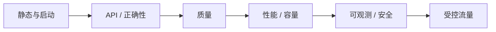
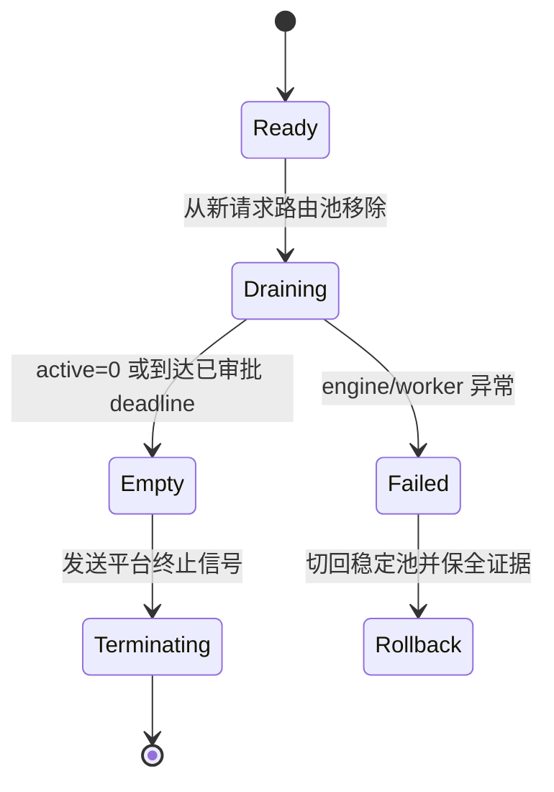
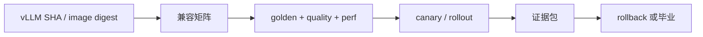

# 12. 升级、回滚与兼容性：让每次变更都可证明

> **谁该读这一篇？** 负责 vLLM 镜像、模型、驱动、网关或部署配置升级的平台工程师、发布经理和 SRE。
>
> **前置阅读：** [`05-slo-and-observability.md`](05-slo-and-observability.md)、[`06-reliability-and-failure-modes.md`](06-reliability-and-failure-modes.md)、[`11-security-and-multi-tenancy.md`](11-security-and-multi-tenancy.md)
>
> **耗时：** 约 40 分钟
>
> **难度：** 进阶
>
> **学完能：**
>
> 1. 用兼容矩阵固定镜像、vLLM、模型、tokenizer、量化、驱动、GPU 和 API 契约。
> 2. 设计同时覆盖正确性、质量、性能、可观测性与安全的 golden request 集。
> 3. 区分 shadow、canary、滚动升级和蓝绿发布各自能证明什么。
> 4. 为流量 drain、KV/prefix cache、重试和回滚定义可观测状态机。
> 5. 把本教程的 source lock 与生产 change record 接成可审计证据链。

> **当前复核（`b23bd73f540175f9e117eaee5029cd7d8df63964`）：** 当前源码会在启动时记录 vLLM version 和 model，但这不足以重建部署；必须额外保存不可变镜像、模型/tokenizer revision、完整参数和平台版本。本章未在当前 SHA 上执行 GPU 升级演练。

升级不是“新 Pod Ready，旧 Pod 删除”。vLLM 变化会同时触及 Python/API、CUDA kernel、attention/quantization backend、模型加载、调度默认值、指标名称和输出质量。一个 HTTP 200 的 smoke test 只能证明进程能答请求，不能证明兼容。

---

## 1. 先定义变更单元

以下任一变化都应进入同一套升级流程：

- vLLM 镜像、commit、release 或编译选项。
- CUDA/ROCm、driver、NCCL、PyTorch、GPU SKU/MIG 配置。
- 模型、tokenizer、chat template、processor、custom code revision。
- dtype、quantization backend、attention backend、TP/PP/DP/EP。
- scheduler、KV cache、spec decode、structured output 或 LoRA 参数。
- API 网关、认证、超时、重试、路由、autoscaling 与 metrics 规则。

“只升级驱动”也可能改变 kernel 路径；“只换 tokenizer”也可能改变 token 数、截断和输出。不要用代码仓库边界代替变更影响边界。

---

## 2. 兼容矩阵：发布前必须填满的表

每个候选版本和当前稳定版本都保存一行，空字段即不具备可回滚性：

| 维度 | 稳定版本 | 候选版本 | 验证证据 |
| --- | --- | --- | --- |
| image | registry + immutable digest | registry + immutable digest | registry attestation / SBOM |
| vLLM | release + git SHA | release + git SHA | startup log + package metadata |
| build | CUDA/ROCm target、编译 flags | 同左 | build provenance |
| runtime | Python、PyTorch、CUDA/ROCm、NCCL | 同左 | image inventory |
| platform | OS/kernel、driver、container runtime | 同左 | node inventory |
| hardware | GPU SKU、数量、MIG、互联拓扑 | 同左 | scheduler/node labels + topology |
| model | model ID + immutable revision | 同左 | artifact digest |
| tokenizer/processor | ID + revision + config digest | 同左 | golden tokenization |
| template/code | chat template + code revision | 同左 | reviewed artifact |
| precision | dtype、quantization、KV dtype | 同左 | engine args + quality gate |
| parallelism | TP/PP/DP/EP、backend | 同左 | engine args + distributed test |
| capacity | max length、seq/token budget、KV bytes | 同左 | startup config + load test |
| API | endpoint/schema/error/streaming contract | 同左 | contract test |
| observability | metric/label/trace/log schema | 同左 | scrape + dashboard test |
| security | auth、media、egress、LoRA、mount | 同左 | rejection matrix |

兼容矩阵不是 Wiki 截图，而是 change record 的结构化附件。回滚时它回答：“旧镜像还能否在当前 driver/GPU 上启动？旧模型制品是否还在？旧面板能否观察旧实例？”

---

## 3. 从源码提取可重建信息

<!-- vllm-source: {"path":"vllm/entrypoints/openai/api_server.py","symbol":"setup_server","anchor":"log_version_and_model(logger, VLLM_VERSION, args.model)"} -->
[源码锚点：vllm/entrypoints/openai/api_server.py · setup_server](https://github.com/vllm-project/vllm/blob/b23bd73f540175f9e117eaee5029cd7d8df63964/vllm/entrypoints/openai/api_server.py#L619)

当前 API server 启动时调用 `log_version_and_model`，这对事故取证有用，但只包含 version/model 仍不够。发布控制器应另外生成不可变 manifest：

```yaml
release_id: inference-2026xxxx-n
image_digest: sha256:...
vllm_git_sha: ...
model_revision: ...
tokenizer_revision: ...
chat_template_digest: ...
engine_args_digest: ...
gateway_config_digest: ...
node_pool_contract: ...
dashboard_rule_digest: ...
rollback_release_id: ...
```

manifest 中不要放 secret 值，只保存 secret version/reference。启动日志、Pod annotation、指标 build-info 与发布系统要能通过同一个 `release_id` 关联。

<!-- vllm-source: {"path":"vllm/config/model.py","symbol":"ModelConfig","anchor":"tokenizer_revision: str | None = None"} -->
[源码锚点：vllm/config/model.py · model/tokenizer revisions](https://github.com/vllm-project/vllm/blob/b23bd73f540175f9e117eaee5029cd7d8df63964/vllm/config/model.py#L186)

模型、代码和 tokenizer revision 是分开的；候选与稳定版本必须分别记录，不能用一个 `model=org/name` 代替。

---

## 4. Golden request：不只比字符串

固定一组经安全审查、可长期保存的请求夹具，覆盖真实协议边界：

| 类别 | 夹具 | 比较方式 |
| --- | --- | --- |
| tokenization | Unicode、CJK、空白、特殊 token、长边界 | token IDs / 长度精确比较 |
| completion | greedy、固定 seed 的 sampling | exact 或预定义容差 |
| chat | system/tool/multi-turn/template | 渲染输入、finish reason、schema |
| streaming | 正常、取消、断连、空 delta | event 顺序、终止、usage、无悬挂 |
| errors | 非法参数、超长、未知模型、无权限 | status、error type、无敏感回显 |
| structured output | JSON/schema/grammar | schema validity + timeout |
| multimodal | 允许与禁止 URL/大小/类型 | 输出契约 + 拒绝证据 |
| LoRA/spec decode | 启用时的代表组合 | quality、fallback、模型标识 |

生成式输出不应一律做字符串 exact match。greedy 与固定环境可以精确比；sampling、量化或 backend 变化应使用任务级质量、schema、logprob/分布或人工批准的容差。任何容差都要在看候选结果前定义，避免“测完再放宽”。

Golden 集至少保存：请求、预期 contract、比较器版本、基线输出摘要、模型/tokenizer revision 和批准人。不要放真实用户 prompt。

---

## 5. 五道发布门



### 5.1 静态与启动门

- image digest、签名、SBOM、漏洞例外齐全。
- 目标 GPU/driver/runtime 在兼容矩阵内。
- 权重加载、backend 选择、KV 容量和最终 engine config 与预期一致。
- startup log 无未知 fallback、OOM、collective error 或反复重启。

### 5.2 API 与正确性门

执行 golden request、错误契约、stream cancel、deadline、健康检查和客户端 SDK contract。特别核对默认值变化：同一请求若依赖服务端默认，升级前先把该默认显式化或记录差异。

### 5.3 质量门

用任务级离线集比较稳定与候选：准确率/通过率、格式合规、拒答、安全、长上下文和多语言。量化、attention backend、spec decode、tokenizer 或 template 变化必须单独切片。

### 5.4 性能与容量门

在可比硬件和 workload 下测 TTFT、TPOT、E2E、token/s、queue、preemption、KV、功耗/成本。门限来自当前 SLO 与稳定版本置信区间，不使用教程里的固定百分比。

### 5.5 可观测与安全门

- scrape 后逐条确认 dashboard/alert 所需 metric 和 label。
- trace/log 不泄露 canary secret，release ID 可关联。
- 无认证、越预算、禁止媒体、未授权 LoRA 等拒绝矩阵通过。
- 告警在合成故障下会触发、通知和恢复。

前一门失败就停止，不用更多线上流量“看看会不会自己好”。

---

## 6. Shadow、canary、蓝绿分别证明什么

| 方法 | 能验证 | 不能单独验证 | 主要代价 |
| --- | --- | --- | --- |
| offline replay | 正确性、质量、容量基线 | 实时到达和依赖行为 | 夹具维护、GPU 成本 |
| shadow | 真实输入形态、候选稳定性 | 用户可见流式、真实取消；敏感数据需授权 | 双倍计算、数据治理 |
| canary | 真实端到端与少量用户影响 | 全容量、稀有长尾 | 路由与回滚复杂度 |
| blue/green | 快速切流、保留旧环境 | 自动证明兼容 | 双份容量 |
| rolling | 节省容量 | 混合版本一致性与快速全量回滚 | 版本并存风险 |

Shadow 请求必须遵守原请求的隐私和数据驻留政策，并关闭任何会产生外部副作用的 tool call。候选输出默认丢弃或只保存经批准的摘要。

Canary 不按“运行了十分钟”毕业，而按请求数、workload 覆盖、错误预算和指标稳定性毕业。分桶时保持租户/会话一致，避免同一会话跨新旧版本导致 prefix、template 或输出行为混杂。

---

## 7. Drain 是路由状态机，不是一个神奇 endpoint

当前锁定的 OpenAI API server 没有可依赖的公共 `/shutdown` drain API。因此把 drain 建在外部路由和进程生命周期上，并在目标平台验证信号语义：



可靠 drain 需要：

1. 先阻止新请求进入目标实例，而不是先发终止信号。
2. 观察 gateway inflight 与 vLLM running/waiting；给 streaming 请求单独预算。
3. 到 deadline 后按业务契约取消或失败，不让 orchestrator 无限等待。
4. 客户端重试必须有幂等判断、deadline 和预算；不能因 drain 制造重试雪崩。
5. 终止后确认连接关闭、资源释放、旧 endpoint 从 discovery 消失。

preStop、termination grace、load balancer propagation 的语义随平台而变，必须做真实演练，不能照抄固定秒数。

---

## 8. KV、prefix 与编译缓存的升级影响

多数本地 KV/prefix cache 随进程退出而消失。新副本即使 Ready，也可能经历权重加载、JIT/compile、CUDA Graph capture 和 prefix 冷启动；这会让 canary 的初始 TTFT 与稳定池不可比。

发布计划明确区分：

- **正确性 warmup：** golden request 与 backend 路径都能运行。
- **性能 warmup：** compile/capture 稳定，关键长度桶被覆盖。
- **业务 cache warmup：** prefix 命中率随真实流量建立；不能用伪造用户数据预热。

外部 KV connector 或跨实例缓存不能默认跨版本兼容。cache key 至少纳入模型/tokenizer/template、KV dtype、block/hash 规则和相关配置；兼容性未经证明时使用新 namespace，回滚时保留旧 namespace 到回滚窗口结束。

不要因为候选 cache 冷就放宽所有 SLO，也不要因短暂冷启动就误判稳定态性能。分别报告 cold 与 warm 数据。

---

## 9. 指标与告警也有兼容性

<!-- vllm-source: {"path":"vllm/config/observability.py","symbol":"ObservabilityConfig","anchor":"show_hidden_metrics_for_version: str | None = None"} -->
[源码锚点：vllm/config/observability.py · hidden metrics compatibility](https://github.com/vllm-project/vllm/blob/b23bd73f540175f9e117eaee5029cd7d8df63964/vllm/config/observability.py#L21)

指标名、label、counter/gauge 类型和启用条件都会变化。源码中的 hidden/deprecated compatibility 只能作为迁移窗口，不能替代面板升级。候选 scrape 测试应自动检查：

```text
required metric exists
metric type matches
required labels exist
forbidden high-cardinality labels absent
recording rules evaluate
alerts load and fire on fixture
mixed old/new release can still be separated
```

面板查询使用 `release_id` 或等价受控标签对比候选和稳定版本。升级前先发布能同时理解两版的 recording rules；旧版退场且回滚窗口关闭后，再删除兼容规则。

---

## 10. 回滚必须在发布前排练

回滚触发器采用可观察条件，而不是“感觉不对”：

- API contract / golden request 失败。
- 质量 gate 低于预定义界限。
- 错误预算消耗、TTFT/TPOT、queue/preemption 或 worker crash 超出批准窗口。
- 指标缺失导致候选不可观测。
- 安全拒绝矩阵失败或敏感数据泄漏。
- 新版本无法 drain，或重试放大流量。

回滚步骤：

1. 停止继续放量，保存 release、日志、指标和样本摘要。
2. 将新请求切回**仍可运行且已预热**的稳定池。
3. drain 候选；不要同时删除候选日志、制品和 cache namespace。
4. 验证稳定池的 golden、SLO、容量与安全，而不是只看 Pod Ready。
5. 记录触发器、时间线、用户影响和下一次进入条件。

真正的回滚能力取决于旧镜像、旧模型/tokenizer、旧平台兼容性和足够容量都还在。若数据库、网关 schema 或制品发生不可逆迁移，就不再是简单镜像回滚，必须在设计阶段拆出向前/向后兼容步骤。

---

## 11. 演练：一份可审计的升级证据包

### 11.1 无 GPU 静态阶段

```bash
# 教程/source 契约
python3 -m tools.source_sync validate --profile contracts

# 记录锁定源码；不得只写 latest/main
cat source.lock.json

# 查启动版本记录和模型 revision 字段
grep -n "log_version_and_model" vllm/vllm/entrypoints/openai/api_server.py
grep -n "tokenizer_revision" vllm/vllm/config/model.py
```

这一步证明文档与锁定源码一致，不证明候选在 GPU 上正确或更快。

### 11.2 GPU/集群阶段

在目标硬件运行 stable 与 candidate 的同一矩阵：golden、质量集、稳态负载、burst、长上下文、stream cancel、drain、故障注入、拒绝矩阵。每个命令保存退出码、原始结果、manifest 和时间戳。

### 11.3 证据目录

```text
change-record/
  manifest.yaml
  compatibility-matrix.yaml
  golden-summary.json
  quality-summary.json
  performance-summary.json
  metrics-contract.json
  security-rejections.json
  drain-timeline.json
  rollback-timeline.json
  approvals/
```

结果文件应可重新计算摘要；敏感输入只保存不可逆摘要或批准后的脱敏 fixture。

---

## 12. 教程 source-sync 与生产 change record

本教程用 `source.lock.json` 固定上游 vLLM SHA，并通过 `vllm-source` 语义锚点检查源码引用。生产发布可以复用同一原则：



文档说“当前默认值”时必须能追到锁定源码；发布说“当前生产版本”时必须能追到不可变 manifest。两者都不能用浮动 `main`、`latest` 或手写行号当长期证据。

---

## 13. 生产权衡与失败证据

蓝绿需要双份容量，rolling 节省容量但让两版并存，shadow 提高信心却增加计算与隐私面，长回滚窗口占用制品和缓存空间。选择方法时显式记录成本、风险、所有者和退出条件。

以下证据说明升级尚未完成：

- 兼容矩阵有空项或使用浮动 tag/revision。
- golden 只覆盖成功的非流式文本请求。
- 候选指标缺失，却仍依据“无告警”继续放量。
- stable 已删除或不再兼容当前节点，回滚只存在于文档。
- drain 依赖不存在的 endpoint 或未测的固定 sleep。
- cold/warm 性能混在一起，或候选 workload 与 stable 不同。
- 失败后原始结果、release ID、配置摘要无法关联。

硬件验证状态：**未执行当前 SHA 的 GPU/集群升级与回滚演练**；本章是静态源码复核后的执行模板。

---

## 小结

- 变更单元跨越镜像、runtime、硬件、模型/tokenizer、配置、API、指标和安全。
- 兼容矩阵与不可变 manifest 是回滚的前提，不是发布后的补充文档。
- Golden request 要覆盖 tokenization、streaming、错误、结构化、多模态和可选特性，并使用事先定义的比较器。
- Shadow、canary、蓝绿和 rolling 证明的事情不同；流量时间不能代替覆盖证据。
- Drain 应由路由状态机、inflight 观测和 deadline 驱动；当前不能假设存在公共 `/shutdown`。
- 指标、cache namespace 和旧制品都要纳入兼容与回滚窗口。

---

## 自检

**1. 为什么记录 vLLM version 和 model name 仍不足以回滚？**

要点：还缺 image/build、driver/runtime、模型/tokenizer/code revision、模板、完整参数、硬件拓扑和网关/指标配置。

**2. Golden request 什么时候能 exact match，什么时候不能？**

要点：greedy、固定 tokenizer/template/环境可精确比；sampling、量化或 backend 变化通常要用预定义质量/分布/schema 容差。

**3. Shadow 流量为什么不能代替 canary？**

要点：通常不返回给用户，不能完整验证用户可见 streaming、取消、deadline 和真实路由行为；还需数据治理。

**4. 新 Pod Ready 后为什么不能立刻删旧 Pod？**

要点：Ready 不证明 golden、质量、稳态性能、指标、安全和 drain；新池可能仍在 compile/capture/cache 冷启动。

**5. 回滚最容易遗漏的依赖是什么？**

要点：旧制品是否还在、旧版是否兼容当前 driver/platform、是否留有容量，以及旧指标/网关 schema 是否还能工作。

---

## 面试延伸

**问：候选版本 p50 提升 15%，p99 退化 8%，你会发布吗？**

答题框架：不能只看两个百分比。先确认 workload 可比、置信区间、cold/warm、TTFT/TPOT/质量/错误预算和租户切片；再按预先批准的 SLO 与业务目标决定。若 p99 触发 gate 就停止，即使平均吞吐更好；若未触发，也应查清退化来源和回滚条件。

---

## 下一步

完成生产章节后，进入 [`../09-advanced-features/03-multimodal.md`](../09-advanced-features/03-multimodal.md)。任何高级特性都应沿用本章的不可变制品、golden、可观测门和回滚证据。
