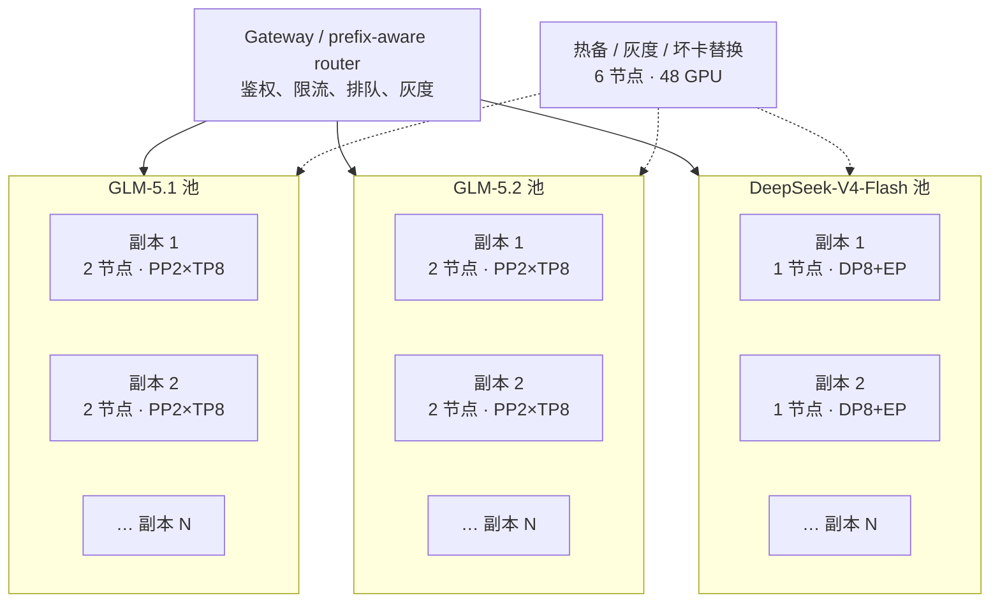

# 13. 384 卡 H100 实战：GLM-5.1 / GLM-5.2 / DeepSeek-V4-Flash / Pro 分布式生产部署

> **谁该读这一篇？** 要把前沿 MoE 模型部署到 48 台 8×H100 集群的推理平台工程师、SRE、架构师，以及需要经得住面试官逐层追问的候选人。
>
> **前置阅读：** [`01-tp-pp-ep.md`](../05-distributed/01-tp-pp-ep.md)、[`03-expert-parallel-deep-dive.md`](../05-distributed/03-expert-parallel-deep-dive.md)、[`05-large-scale-cluster-inference.md`](../05-distributed/05-large-scale-cluster-inference.md)、[`01-deployment-architectures.md`](01-deployment-architectures.md)
>
> **耗时：** 约 70 分钟；完整演练建议预留 2～3 天
>
> **学完能：**
>
> 1. 把“384 卡”拆成副本内并行、跨副本扩展和故障域，而不是创建一个 384-rank communicator
> 2. 为四个模型版本算清权重、KV cache、运行时余量，并选择 `PP×TP` 或 `DP×EP`
> 3. 从节点验收、权重分发、启动、正确性、压测、灰度一直做到 SLO 门禁
> 4. 根据日志、指标和网络证据处理 NCCL hang、OOM、慢 rank、expert 倾斜、MTP 退化与长上下文长尾
> 5. 面对“为什么不用另一种并行”“证据是什么”“故障半径多大”的连续追问

单机命令不是生产教程。384 张 H100 的难点也不是把 `--tensor-parallel-size` 改成 384，而是控制三个放大器：**同步通信、故障半径、变更半径**。本章给出一套可执行的起始设计，同时明确哪些数字必须在自己的流量上重测。

> **版本边界（2026-08-10）**
>
> 本章命令面向当前官方 checkpoint 与 vLLM recipe。模型仓库、镜像 tag 和 nightly 行为都会变化；生产必须把模型 revision、容器 digest、vLLM commit、driver 和固件写入发布单。文中的 `REPLACE_WITH_*` 不是装饰项，未替换就不得上线。
>
> 本章源码锚点已对照手册锁定的 vLLM `b23bd73f540175f9e117eaee5029cd7d8df63964`（2026-07-20）重新核验。读者切换源码 revision 后应刷新语义锚点，而不是假设行号永久稳定。

---

## 1. 先给结论：384 卡是副本池，不是一个超大实例

假设基础资源是 48 台同构节点，每台：

- 8×H100 SXM 80 GB，机内 NVLink/NVSwitch
- 本地 NVMe 可保存模型权重和编译缓存
- 至少一套经实测可达标的 400 Gb/s 级 RDMA 网络；具体是 IB 还是 RoCE 由机房决定
- GPU、NIC、NUMA 和 leaf/spine 拓扑都有可查询标签

如果实际是 H100 PCIe、不同 HBM 容量、没有 NVSwitch，或节点不是 8 卡同构机，本章的副本形状和性能结论都不能直接复用；仍可复用容量公式、门禁和排障方法，但必须重新设计 TP 域。

推荐把并行分成两层：



### 1.1 为什么 GLM 用 `PP2×TP8`

GLM-5.1/5.2 的 BF16 checkpoint 约 1.5 TB，FP8 checkpoint 也在 750 GB 量级。8×H100 一共只有 640 GB 物理 HBM，不能把“总 HBM 大于权重”建立在 `gpu-memory-utilization=1.0` 上，更不能忽略 NCCL、CUDA Graph、激活和 KV cache。

两节点 `PP=2, TP=8` 的关键收益：

- TP 的逐层 AllReduce 留在单机 NVLink 内；
- 跨机只传 pipeline stage 边界激活，不在每个 TP collective 上经过 RDMA；
- 一个副本故障只损失 16 卡，而不是拖挂整个 384 卡集群；
- 78 层可被两个 stage 拆分，模型实现本身支持 pipeline parallel。

<!-- vllm-source: {"path":"vllm/model_executor/models/registry.py","anchor":"\"GlmMoeDsaForCausalLM\": (\"deepseek_v2\", \"GlmMoeDsaForCausalLM\"),"} -->
[源码锚点：registry.py · GlmMoeDsaForCausalLM](https://github.com/vllm-project/vllm/blob/b23bd73f540175f9e117eaee5029cd7d8df63964/vllm/model_executor/models/registry.py#L116)
<!-- vllm-source: {"path":"vllm/model_executor/models/deepseek_v2.py","symbol":"DeepseekV2ForCausalLM"} -->
[源码锚点：deepseek_v2.py · DeepseekV2ForCausalLM](https://github.com/vllm-project/vllm/blob/b23bd73f540175f9e117eaee5029cd7d8df63964/vllm/model_executor/models/deepseek_v2.py#L1783)
<!-- vllm-source: {"path":"vllm/model_executor/models/deepseek_v2.py","symbol":"GlmMoeDsaForCausalLM"} -->
[源码锚点：deepseek_v2.py · GlmMoeDsaForCausalLM](https://github.com/vllm-project/vllm/blob/b23bd73f540175f9e117eaee5029cd7d8df63964/vllm/model_executor/models/deepseek_v2.py#L1920)

当前源码把 `GlmMoeDsaForCausalLM` 注册到 GLM/DSA 实现；其 `DeepseekV2ForCausalLM` 基类显式实现 `SupportsPP`，GLM 类再继承该基类。

### 1.2 为什么 DeepSeek-V4-Flash 不跨 48 台做宽 EP

DeepSeek-V4-Flash 是 284B total / 13B active 的 MoE，官方 checkpoint 为 FP4 expert + FP8 其余权重的混合格式。单副本可以收敛在一个 8 卡 H100 节点内：用 DP rank 承接请求、EP 分散 expert。这样每层 MoE 的 AllToAll 走机内链路；跨节点只做无状态请求路由。

<!-- vllm-source: {"path":"vllm/model_executor/models/registry.py","anchor":"\"DeepseekV4ForCausalLM\": (\"vllm.models.deepseek_v4\", \"DeepseekV4ForCausalLM\"),"} -->
[源码锚点：registry.py · DeepseekV4ForCausalLM](https://github.com/vllm-project/vllm/blob/b23bd73f540175f9e117eaee5029cd7d8df63964/vllm/model_executor/models/registry.py#L94)

当前 vLLM 把 `DeepseekV4ForCausalLM` 注册为模型插件。这意味着“registry 里有名字”只证明框架知道如何加载该架构，**不证明任意镜像、任意 GPU 架构、任意量化组合都已验证**。

### 1.3 DeepSeek-V4-Pro 为什么不能照抄 Flash

DeepSeek-V4-Pro 是 1.6T total / 49B active 的版本，官方 vLLM recipe 给原生 FP4+FP8 checkpoint 标出的最低显存量约为 960 GB。8×H100 80 GB 只有 640 GB，单节点无论如何调 `gpu-memory-utilization` 都装不下；16×H100 有 1.28 TB 物理 HBM，才进入可验证区间。

H100 的保守候选不是 `TP=16`，而是两节点 `PP=2, TP=8`：

- TP8 的逐层 collective 留在各自 NVSwitch 节点内；
- PP2 把层和权重分到两个 stage，跨机只传 stage 边界激活；
- 避开公开 issue 中原生 checkpoint 在 `TP=16` 时 `weight quantization block_k=128` 的分片整除失败；
- 当前 `DeepseekV4ForCausalLM` 显式实现 `SupportsPP`，但这只建立软件能力，不等于 H100 组合已通过官方性能验证。

<!-- vllm-source: {"path":"vllm/models/deepseek_v4/nvidia/model.py","symbol":"DeepseekV4ForCausalLM"} -->
[源码锚点：DeepseekV4ForCausalLM · SupportsPP](https://github.com/vllm-project/vllm/blob/b23bd73f540175f9e117eaee5029cd7d8df63964/vllm/models/deepseek_v4/nvidia/model.py#L1385)

这里必须保留两个限定：第一，vLLM 官方 recipe 的 verified hardware 列表包含 H200/B200 等，并没有把 H100 标成 verified；第二，约 960 GB 是 checkpoint 级最低显存量，不是运行态峰值。`PP2×TP8` 是依据源码能力、分片约束和 HBM 给出的 **Phase 0 候选**，没有实机完成 load、golden、最大 shape、24h soak 与故障演练前，不得进入生产池。

### 1.4 为什么不把 384 卡全放进一个 communicator

因为收益和风险不对称：

- 权重已经能在 8/16 卡服务单元内放下，继续扩大 model parallel 不再解决首要问题；
- collective 的完成时间由最慢 rank 决定，一张降频卡能拖住几百张正常卡；
- 任一进程、NIC、交换机路径异常，都可能让整个 communicator 等到 watchdog timeout；
- 发布、回滚和扩缩容必须重建巨大实例，无法小步灰度；
- 吞吐扩展更适合用外部 DP：新增独立副本，路由层按实际 token capacity 分流。

一句话答面试官：**模型并行解决“单副本放不下”，数据并行解决“服务吞吐不够”；384 卡规模不等于 384 路模型并行。**

---

## 2. 模型事实表：先区分官方事实、工程推导和待测参数

| 模型 | 官方架构事实 | 本章生产 checkpoint | 官方模型支持下限 | H100 候选服务单元 | 初始上下文上限 |
| --- | --- | --- | --- | --- | --- |
| GLM-5.1 | 744B total / 40B active，78 层，原生窗口 202,752 | `zai-org/GLM-5.1-FP8` | 0.19.0+ | 2×8 H100，`PP2×TP8` | 131,072 |
| GLM-5.2 | 约 743B total / 39B active，78 层，原生窗口 1,048,576 | `zai-org/GLM-5.2-FP8` | 0.23.0+ | 2×8 H100，`PP2×TP8` | 131,072 |
| DeepSeek-V4-Flash | 284B total / 13B active，43 层，原生窗口 1,048,576 | `deepseek-ai/DeepSeek-V4-Flash` | 0.20.0+；H100 生产候选从 0.23.0+ 硬化版本复验 | 保守 1×8 H100 `DP8+EP`；再测 4 卡形态 | 131,072 |
| DeepSeek-V4-Pro | 1.6T total / 49B active，原生窗口 1,048,576 | `deepseek-ai/DeepSeek-V4-Pro` 原生 FP4+FP8 | 0.20.0+；H100 不在官方 verified hardware 列表 | 候选 2×8 H100 `PP2×TP8`，Phase 0 fail-closed | 131,072 |

事实来源：

- GLM-5.1 官方 config 给出 78 层、64 heads、202,752 上下文；官方 vLLM recipe 用 8×H200 跑 FP8 checkpoint，并要求固定版本与 DeepGEMM。[GLM-5.1 官方模型卡](https://huggingface.co/zai-org/GLM-5.1)、[vLLM GLM-5.1 recipe](https://github.com/vllm-project/recipes/blob/main/GLM/GLM5.md)
- GLM-5.2 官方 config 给出 78 层、64 heads、1,048,576 上下文；官方 recipe 的 H200/B200 起始配置不能直接当作 H100 验收结果。[GLM-5.2 官方模型卡](https://huggingface.co/zai-org/GLM-5.2)、[vLLM GLM-5.2 recipe](https://recipes.vllm.ai/zai-org/GLM-5.2)
- DeepSeek 官方模型卡给出 284B/13B、1M context 和 FP4+FP8 mixed checkpoint；vLLM 官方说明当前实现主要面向 Hopper/Blackwell，并给出 `block-size=256`、FP8 KV、EP 等参数。[DeepSeek-V4-Flash 模型卡](https://huggingface.co/deepseek-ai/DeepSeek-V4-Flash)、[vLLM DeepSeek-V4 实现说明](https://github.com/vllm-project/vllm-project.github.io/blob/main/_posts/2026-04-24-deepseek-v4.md)
- DeepSeek-V4-Pro 官方模型卡给出 1.6T/49B、1M context；vLLM recipe 标出约 960 GB 最低显存、FP8 KV、block size 256，并把 H200/B200 等列为 verified，未把 H100 列为 verified。[DeepSeek-V4-Pro 模型卡](https://huggingface.co/deepseek-ai/DeepSeek-V4-Pro)、[vLLM DeepSeek-V4-Pro recipe](https://github.com/vllm-project/recipes/blob/main/models/deepseek-ai/DeepSeek-V4-Pro.yaml)

**必须说清的验证边界：**DeepSeek-V4 官方首发 quickstart 明确给出的是 4×B200/B300，不是 8×H100；官方实现说明称主要面向 Hopper/Blackwell，vLLM 0.20.2 又修复过 Hopper 上的 MTP hang 和 KV block 分配问题。因此本章的 H100 命令是依据架构、HBM 和当前硬化版本给出的**生产候选配置**，不是冒充官方跑分。没有经过 §13 Phase 0 实机验证，就只能说“方案待验证”，不能说“384 卡已支持”。[vLLM releases](https://github.com/vllm-project/vllm/releases)

模型支持下限也不等于生产镜像版本。GLM-5.1 官方曾推荐 0.19.0 的模型专用镜像，GLM-5.2 推荐 0.23.0；multi-node `mp` launcher 则以当前源码为准。生产有两条合法路径：基于模型专用镜像构建并验证包含 multi-node `mp` 的内部镜像，或保留原镜像并使用官方 Ray multi-node launcher。不能把“模型能 load”和“launcher 参数存在”混成同一个版本判断。

### 2.1 不要用参数量直接宣布“能放下”

容量预估至少拆成：

$$
M_{\mathrm{HBM}}
=M_{\mathrm{weight}}+M_{\mathrm{KV}}+M_{\mathrm{activation}}
+M_{\mathrm{graph}}+M_{\mathrm{comm}}+M_{\mathrm{fragment}}
$$

权重粗估只能用于第一轮排除：

$$
M_{\mathrm{weight}}
\approx N_{\mathrm{param}}\times B_{\mathrm{per\ param}}
+M_{\mathrm{scale}}+M_{\mathrm{metadata}}
$$

生产以 checkpoint manifest 的文件总量和**启动后每 rank 实测 HBM**为准。量化 checkpoint 可能混有 BF16/FP32 router、scale、embedding 和 MTP 权重，不能简单地把 744B 乘 1 byte 后就结束。

两条硬结论：

1. GLM BF16 约 1.5 TB，16×H100 的物理 HBM 只有 1.28 TB，**本章 GLM 的 H100 基线必须用官方 FP8 checkpoint**。若必须 BF16，至少从 3 节点 `PP3×TP8` 重新做容量与性能验证。
2. 原生支持 1M context 不等于生产默认开放 1M。窗口越大，单请求 KV、prefill 时间、排队时间和故障重试成本越高。先以 128K 建立 SLO，再开独立的 384K/1M 长上下文池。

### 2.2 HBM 预算表必须在发布单里出现

每个候选配置记录以下实测值，不接受“启动成功所以没问题”：

| 项目 | 记录方法 | 门禁 |
| --- | --- | --- |
| checkpoint 磁盘大小 | 固定 revision 后统计 manifest | 与制品清单一致 |
| load 完成后每 rank HBM | `nvidia-smi --query-compute-apps=...` | rank 间偏差可解释 |
| CUDA Graph capture 峰值 | 启动日志 + DCGM | 不触发 OOM |
| 空载 KV 可用块数 | vLLM 启动日志 / metrics | 支撑目标长度×并发 |
| 压测峰值 HBM | DCGM per GPU max | 至少留 5% 可解释余量 |
| 24h 碎片趋势 | HBM、KV usage、preemption 时间序列 | 不单调恶化 |

`--gpu-memory-utilization` 是 vLLM 的 KV 预算输入，不是进程的物理显存上限。设成 `0.95` 也挡不住通信 buffer、图捕获和第三方 kernel 在预算外申请显存。

---

## 3. 384 卡资源切分：先留故障预算，再谈峰值吞吐

### 3.1 一套可演练的混部基线

不是所有业务都应该均分，但第一次全链路演练可以用下面的对称布局：

| 资源池 | 活跃节点 | 活跃 GPU | 服务单元 | 活跃副本 | 单副本故障半径 |
| --- | ---: | ---: | --- | ---: | ---: |
| GLM-5.1 | 14 | 112 | 2 节点 / 16 GPU | 7 | 16 GPU |
| GLM-5.2 | 14 | 112 | 2 节点 / 16 GPU | 7 | 16 GPU |
| DeepSeek-V4-Flash | 14 | 112 | 保守 1 节点 / 8 GPU | 14；若 DP4 通过则可为 28 | 进程组 4/8 GPU；节点仍是 8 GPU |
| 热备 / canary / 坏卡替换 | 6 | 48 | 不承接稳态配额 | 0 | — |
| 合计 | 48 | 384 | — | 28 | — |

这 48 张预留卡不是浪费，它们同时支付：

- N+1/N+2 故障替换；
- 驱动、固件、镜像和模型版本的 canary；
- 滚动升级期间的容量重叠；
- 某模型突发流量的短时借池；
- 发现 Xid/ECC/降频节点后的快速 cordon。

这张对称表没有给 Pro 划固定配额，是因为 Pro 的 H100 路径尚未进入官方 verified hardware 列表。需要 Pro 时，先从 6 个 spare 节点中拿 2 个做 Phase 0；通过全部门禁后，再以完整 2 节点/16 GPU 服务单元从 GLM 或 Flash 池转配。不要在验收前把 Pro 写进承诺容量，更不能用现有 GLM/Flash benchmark 代替 Pro 结果。

全部资源只跑一种模型时，按保守整节点形态，**物理上限**是 GLM 24 个副本或 DeepSeek 48 个副本；如果 DeepSeek 的 4 卡形态通过 H100 全门禁，后者最多可变成 96 个进程副本，但节点故障仍会同时损失同机两个副本。保留 6 节点后，整节点稳态建议上限分别是 GLM 21 个、DeepSeek 42 个。没有冗余时的“满配吞吐”不能作为可承诺容量。

### 3.2 真正的分配公式是 GPU-seconds，不是请求数

不同模型、上下文和 reasoning mode 的请求成本相差几个数量级。先从压测得到每个流量桶的服务时间，再算：

$$
S_{\mathrm{GPU/request}}
=N_{\mathrm{GPU,replica}}\times \mathbb{E}\!\left[T_{\mathrm{service}}\right]
$$

$$
N_{\mathrm{GPU,need}}
=\frac{\lambda\times \mathbb{E}\!\left[S_{\mathrm{GPU/request}}\right]}
{U_{\mathrm{target}}}\times H_{\mathrm{burst}}
$$

- $\lambda$：目标到达率；
- $U_{target}$：根据 p99 和队列稳定性反推的安全利用率，不直接取 1；
- $H_{burst}$：突发、故障和估算误差的 headroom。

至少按以下维度分桶：模型、输入长度、输出长度、reasoning effort、tool calling、prefix 命中/未命中。不能拿“平均请求”规划 384 卡。

### 3.3 调度必须理解网络拓扑

调度约束按从强到弱排序：

1. 同一个 TP8 必须在同一 8 卡 NVSwitch 节点；
2. GLM 的两个 PP stage 优先位于同一 leaf、相同 rail 布局；
3. 同一副本的 NIC/GPU/NUMA 映射必须一致；
4. 不把两个 stage 放进共享带宽严重超卖的不同机架；
5. spare 节点分散在不同 leaf，不能全在一个故障域；
6. 模型池用 taint/toleration、node affinity 和 topology label 隔离。

> **工程经验：**“400G NIC”只是铭牌。真正要记录的是每个 GPU/NIC rail 的单向带宽、双向带宽、并发 collective 带宽、p99 latency，以及拥塞时的退化曲线。

---

## 4. 上线前的不可跳过项：制品、节点、网络

### 4.1 固定五件套

每次发布生成不可变清单：

```text
model_id          = zai-org/GLM-5.2-FP8
model_revision    = REPLACE_WITH_40_CHAR_COMMIT
container_image   = vllm/vllm-openai:glm52-cu129@sha256:REPLACE_WITH_DIGEST
vllm_version      = 0.23.0
driver_firmware   = REPLACE_WITH_VALIDATED_MATRIX
```

内部镜像应从模型官方 recipe 的专用镜像/稳定版出发，再进入公司的扫描、签名和回归流程：

| 模型 | 官方依赖起点 | 内部镜像必须额外证明 |
| --- | --- | --- |
| GLM-5.1 | vLLM 0.19.0、Transformers ≥5.4、FP8 需要 DeepGEMM；官方有 `glm51` CUDA 12.9/13.0 镜像 | PP2×TP8 H100、所选 launcher、MTP+tool parser |
| GLM-5.2 | vLLM 0.23.0、Transformers ≥5.9、DeepGEMM；官方有 `glm52` 镜像 | PP2×TP8 H100、FP8 KV、MTP3/5、128K/长上下文 |
| DeepSeek-V4-Flash | 模型支持从 0.20.0 引入；H100 候选用包含后续 hardening 的固定稳定版 | SM90 kernel、DP4/8+EP、FP4 indexer、MTP、parser/tokenizer |

不要把四个模型版本塞进同一个“万能 latest 镜像”。独立镜像会多占一些节点缓存，却能让依赖、回滚和 blast radius 可解释。CUDA 12.9/13.0 的选择必须匹配已验证 driver；镜像能被 driver 启动不等于所有自定义 kernel 都兼容。

不要使用 `main`、`:latest` 或可变目录。首次下载后保存：

- 模型仓库 revision；
- 每个 shard 的大小和 SHA256；
- tokenizer、chat template、generation config；
- 镜像 digest 和 SBOM；
- 一份能离线恢复的制品副本。

权重目录必须是只读的，例如：

```text
/models/
  glm-5.1-fp8/<revision>/
  glm-5.2-fp8/<revision>/
  deepseek-v4-flash/<revision>/
```

### 4.2 不要让 48 台机器同时打爆对象存储

错误做法：扩容时 48 个 Pod 同时从 Hugging Face/S3 拉 150～750 GB。

生产分发链路：

1. 下载节点拉取并校验一次；
2. 写入内部对象存储或模型制品库；
3. 每个 leaf 选 1～2 台 seed；
4. seed 到同 leaf 节点做限速树状 fan-out；
5. 节点本地 NVMe 完成校验后写 `.ready` 原子标记；
6. 调度器只把推理 Pod 放到带正确 revision 标签的节点。

监控 `download_seconds`、对象存储出口、节点磁盘读带宽、校验失败数。启动时间应拆成 download、load、JIT、graph capture、warmup，不能只报一个“Pod ready 需要 15 分钟”。

### 4.3 节点验收

每台节点执行并归档：

```bash
nvidia-smi -L
nvidia-smi topo -m
nvidia-smi --query-gpu=index,uuid,name,memory.total,pstate,clocks.sm,ecc.errors.uncorrected.volatile --format=csv
ibdev2netdev
ip -br link
lsblk -o NAME,SIZE,TYPE,MOUNTPOINT,FSTYPE
```

验收不是“命令退出码为 0”，而是：

- 8 张卡型号、HBM、固件一致；
- NVLink/NVSwitch 拓扑与金标节点一致；
- GPU 到 NIC 的 NUMA/PCIe 路径一致；
- 没有未解释的 Xid、uncorrected ECC、降频；
- 本地 NVMe 容量和连续读取达到权重加载基线；
- NTP/PTP 时钟误差满足跨节点日志关联要求。

### 4.4 网络验收要从点对点走到 collective

按四层测试：

1. `ping`/MTU/路由：只证明 IP 基本连通；
2. `ib_write_bw` 或等价 RDMA 测试：证明 HCA 数据面；
3. `nccl-tests` 两节点 16 GPU：证明 NCCL 选对 NIC/GID/rail；
4. 多副本同时压测：证明 leaf/spine 无严重 oversubscription、PFC storm 或 ECMP 热点。

不要在教程里背一个通用的“必须达到 360 GB/s”。门禁应是：候选节点对相对同拓扑金标的 bus bandwidth 不低于约定比例，且 30 分钟循环没有 hang、重传和离群 p99。

<!-- vllm-source: {"path":"examples/ray_serving/run_cluster.sh","anchor":"# For the head node, HEAD_NODE_ADDRESS and VLLM_HOST_IP should be consistent."} -->
[源码锚点：run_cluster.sh · VLLM_HOST_IP](https://github.com/vllm-project/vllm/blob/b23bd73f540175f9e117eaee5029cd7d8df63964/examples/ray_serving/run_cluster.sh#L81)

vLLM 官方多节点脚本要求每个节点使用唯一 `VLLM_HOST_IP`，并让 Ray/vLLM 选择一致的地址。官方排障文档也明确要求先验证跨节点 GPU 通信，并把 `NCCL_SOCKET_IFNAME` 等变量在集群创建时传播到所有 worker：[Distributed troubleshooting](https://docs.vllm.ai/en/latest/serving/distributed_troubleshooting/)。

### 4.5 网络环境变量：显式，但不盲抄

```bash
export VLLM_HOST_IP="REPLACE_WITH_THIS_NODE_RDMA_REACHABLE_IP"
export NCCL_SOCKET_IFNAME="REPLACE_WITH_VALIDATED_IFACE"
export GLOO_SOCKET_IFNAME="REPLACE_WITH_VALIDATED_IFACE"
export NCCL_DEBUG=INFO
export NCCL_DEBUG_SUBSYS=INIT,NET,COLL
export NCCL_ASYNC_ERROR_HANDLING=1
```

`NCCL_IB_HCA`、`NCCL_IB_GID_INDEX`、PFC/ECN 和 RoCE traffic class 必须来自网络团队验证过的矩阵。把网上某台机器的 GID index 复制到 48 台，常见结果是 NCCL 悄悄回退 socket 或直接 hang。

---

## 5. GLM-5.1：两节点 16×H100 启动实战

### 5.1 启动前提

- 两台节点均已有同 revision 的 `GLM-5.1-FP8`；
- 使用官方验证过的 GLM-5.1 镜像族，并固定 digest；
- 两台同时启动；rank 0 才接入 Service/Gateway；
- 首次只开 128K、关闭 MTP，先建立正确性和性能基线。

<!-- vllm-source: {"path":"vllm/config/parallel.py","symbol":"ParallelConfig"} -->
[源码锚点：vllm/config/parallel.py · ParallelConfig](https://github.com/vllm-project/vllm/blob/b23bd73f540175f9e117eaee5029cd7d8df63964/vllm/config/parallel.py#L117)

当前 `ParallelConfig` 把 TP、PP、DP/EP 和 executor 分开建模。多节点 `mp` 还需要明确 `master_addr`、`master_port`、`node_rank` 和 `nnodes`。

在调度 16 张卡之前，先对**实际镜像 digest**做参数契约检查：

```bash
docker run --rm --entrypoint vllm \
  "REPLACE_WITH_PINNED_IMAGE_DIGEST" serve --help \
  | grep -E -- '--(nnodes|node-rank|master-addr|master-port|pipeline-parallel-size|tensor-parallel-size)'
```

缺任何一项都不要继续套用 `mp` 模板，改走同版本 Ray launcher 或构建经过测试的新镜像。`vllm-openai` 镜像的默认 entrypoint 已经是 `vllm serve`，所以下面的 `docker run` 在镜像名后直接传模型目录；再写一次 `vllm serve` 会形成错误参数。

### 5.2 两台节点执行同一模板

节点 A 设置 `NODE_RANK=0`，节点 B 设置 `NODE_RANK=1`。两边的 `MASTER_ADDR` 都指向节点 A 的已验证通信 IP。

```bash
export NODE_RANK="REPLACE_WITH_0_OR_1"
export MASTER_ADDR="REPLACE_WITH_STAGE0_IP"
export MASTER_PORT="29500"
export THIS_NODE_IP="REPLACE_WITH_THIS_NODE_IP"
export MODEL_DIR="/models/glm-5.1-fp8/REPLACE_WITH_REVISION"
export IMAGE="registry.internal/vllm-glm51-prod@sha256:REPLACE_WITH_DIGEST"

docker run --rm --name "glm-5-1-r${NODE_RANK}" \
  --gpus all --network host --ipc host \
  --ulimit memlock=-1 --ulimit stack=67108864 \
  -v "${MODEL_DIR}:${MODEL_DIR}:ro" \
  -e VLLM_HOST_IP="${THIS_NODE_IP}" \
  -e NCCL_SOCKET_IFNAME="REPLACE_WITH_VALIDATED_IFACE" \
  -e GLOO_SOCKET_IFNAME="REPLACE_WITH_VALIDATED_IFACE" \
  -e NCCL_ASYNC_ERROR_HANDLING=1 \
  "${IMAGE}" \
  "${MODEL_DIR}" \
    --served-model-name glm-5.1-fp8 \
    --host 0.0.0.0 --port 8000 \
    --distributed-executor-backend mp \
    --nnodes 2 --node-rank "${NODE_RANK}" \
    --master-addr "${MASTER_ADDR}" --master-port "${MASTER_PORT}" \
    --pipeline-parallel-size 2 \
    --tensor-parallel-size 8 \
    --kv-cache-dtype auto \
    --gpu-memory-utilization 0.88 \
    --max-model-len 131072 \
    --max-num-seqs 16 \
    --max-num-batched-tokens 32768 \
    --enable-prefix-caching \
    --enable-chunked-prefill \
    --tool-call-parser glm47 \
    --reasoning-parser glm45 \
    --enable-auto-tool-choice \
    --chat-template-content-format string
```

注意：

- 容器名需要按节点/副本唯一化；模板里的 `r0` 只是示意。
- 如果所用稳定版尚不支持 multi-node `mp` 的某项组合，使用同镜像建立 Ray cluster，再改成 `--distributed-executor-backend ray`；不要在现场临时混用两种 launcher。
- GLM-5.1 先用 `--kv-cache-dtype auto` 建正确性基线；只有 FP8 KV 的长上下文精度、吞吐和 kernel 路径通过 A/B 后才切换。
- `gpu-memory-utilization=0.88`、`max-num-seqs=16` 是保守起点，不是官方最优值。
- 先用 `NCCL_DEBUG=INFO` 验证网卡选择；稳定后降到 `WARN`，否则 384 卡日志量会反过来影响系统。

### 5.2.1 老镜像没有 multi-node `mp` 参数时：固定版本走 Ray

不要为了得到 `--nnodes` 临时升级模型运行时。把当前仓库的 `examples/ray_serving/run_cluster.sh` 与镜像 digest 一起纳入制品，在 head/worker 分别启动同版本容器：

```bash
# 节点 A：head。脚本会覆盖镜像 entrypoint 并启动 ray head。
bash run_cluster.sh "${IMAGE}" "${MASTER_ADDR}" --head /models/hf-cache \
  -v "${MODEL_DIR}:${MODEL_DIR}:ro" \
  -e VLLM_HOST_IP="${MASTER_ADDR}" \
  -e NCCL_SOCKET_IFNAME="REPLACE_WITH_VALIDATED_IFACE" \
  -e GLOO_SOCKET_IFNAME="REPLACE_WITH_VALIDATED_IFACE"

# 节点 B：worker。WORKER_IP 必须与 head 不同。
bash run_cluster.sh "${IMAGE}" "${MASTER_ADDR}" --worker /models/hf-cache \
  -v "${MODEL_DIR}:${MODEL_DIR}:ro" \
  -e VLLM_HOST_IP="REPLACE_WITH_WORKER_IP" \
  -e NCCL_SOCKET_IFNAME="REPLACE_WITH_VALIDATED_IFACE" \
  -e GLOO_SOCKET_IFNAME="REPLACE_WITH_VALIDATED_IFACE"
```

两边 Ray 资源都出现后，在 **head 容器内**执行与 §5.2 相同的模型参数，但删除 `--nnodes/--node-rank/--master-*`，改为：

```bash
vllm serve "${MODEL_DIR}" \
  --distributed-executor-backend ray \
  --pipeline-parallel-size 2 \
  --tensor-parallel-size 8 \
  REPLACE_WITH_THE_REMAINING_VALIDATED_MODEL_FLAGS
```

官方脚本的随机容器名和前台生命周期适合验收，不适合直接管理 384 卡；生产应由 LWS/Ray Operator 固化 Pod 名、健康检查和整组重启语义。无论 MP 还是 Ray，同一服务单元只能选一个 launcher，性能基线也不能混着统计。

### 5.3 第二阶段再开 MTP

基线通过后增加：

```bash
--speculative-config.method mtp \
--speculative-config.num_speculative_tokens 3
```

比较的是端到端指标，不是“acceptance rate 越高越好”：

- p50/p99 TPOT 是否下降；
- 总 output tok/s 是否上升；
- CUDA Graph/HBM 是否增加；
- tool call JSON、reasoning 字段和 streaming chunk 是否仍正确；
- 真实 prompt 的 acceptance length，不能只看 random dataset。

官方 recipe 特别提醒：GLM-5.1 同时使用 tool calling 和 MTP 时，某些稳定版本存在解析问题。处理原则是固定已修复 commit 做 canary，而不是无条件追 nightly。

---

## 6. GLM-5.2：架构相似，不代表可以复制 GLM-5.1 配置

GLM-5.2 仍可用 `PP2×TP8` 起步，但新增了 1M context、IndexShare 和更长 MTP 路径。其 config 的 `index_topk_freq=4` 表示 sparse indexer 跨层共享；这会改变长上下文计算和缓存行为，不能拿 GLM-5.1 的 128K 压测结果外推 1M。

### 6.1 基线启动

复用上一节两节点模板，只替换：

```bash
export MODEL_DIR="/models/glm-5.2-fp8/REPLACE_WITH_REVISION"
export IMAGE="registry.internal/vllm-glm52-prod@sha256:REPLACE_WITH_DIGEST"

# vllm serve 参数差异
--served-model-name glm-5.2-fp8 \
--kv-cache-dtype fp8 \
--max-model-len 131072
```

GLM-5.2 官方 recipe 的稳定起点是 vLLM 0.23.0，并在 H200 示例中启用 5-token MTP；H100 两节点拓扑是本章基于显存与通信域做的工程方案，必须通过本节门禁后才能宣称“已支持”。

### 6.2 MTP 分三档测，不要一步开到 5

```text
实验 A：MTP off
实验 B：num_speculative_tokens = 3
实验 C：num_speculative_tokens = 5
```

每档都跑相同真实回放，记录 acceptance length、draft 开销、TPOT、ITL p99、HBM 和输出一致性。以下任一出现就回退：

- acceptance length 低，draft 计算大于节省；
- p50 变好但 p99 ITL 抖动变大；
- tool call 结构损坏；
- graph capture 组合显著增加导致启动/OOM；
- reasoning mode 的结束标记或 usage 统计错误。

### 6.3 1M context 要做独立服务等级

不要把 1M 请求和 4K chat 放在同一队列。建议至少分三档：

| 服务等级 | `max-model-len` | 典型 `max-num-seqs` | 路由与 SLO |
| --- | ---: | ---: | --- |
| interactive | 32K/64K | 较高，按压测定 | TPOT/p99 优先 |
| agentic-long | 128K/384K | 中低 | TTFT 与完成率并重 |
| ultra-long | 1M 候选池 | 从 1～2 起测 | 单独排队、限流、价格与超时 |

1M 池的上线门禁：

1. 真实 tokenizer 计数后拒绝超限，不能依赖下游 OOM；
2. chunked prefill 下短请求不会被饿死，或已物理隔离；
3. 客户端、Gateway、Envoy、vLLM 的 timeout 一致；
4. 中断/取消能及时释放 KV；
5. 重试不会重新提交一个 1M prefill 形成雪崩；
6. 单请求 cost、最大并发和租户 quota 明确。

### 6.4 为什么 384 卡也不能“随便开 1M”

384 卡解决的是总容量，不会消除单副本内的 KV 和调度约束。一个 1M 请求被路由到某个 16 卡副本后，其他 368 卡不会自动借 HBM 给它。超长上下文需要正确的**服务分层与路由**，不是更大的集群数字。

---

## 7. DeepSeek-V4-Flash：先收敛在单节点，跨节点只做副本

### 7.1 单副本基线

```bash
export MODEL_DIR="/models/deepseek-v4-flash/REPLACE_WITH_REVISION"
export IMAGE="registry.internal/vllm-dsv4-prod@sha256:REPLACE_WITH_DIGEST"

docker run --rm --name dsv4-flash-r0 \
  --gpus all --network host --ipc host \
  --ulimit memlock=-1 --ulimit stack=67108864 \
  -v "${MODEL_DIR}:${MODEL_DIR}:ro" \
  "${IMAGE}" \
  "${MODEL_DIR}" \
    --served-model-name deepseek-v4-flash \
    --host 0.0.0.0 --port 8000 \
    --trust-remote-code \
    --data-parallel-size 8 \
    --enable-expert-parallel \
    --kv-cache-dtype fp8 \
    --block-size 256 \
    --gpu-memory-utilization 0.88 \
    --max-model-len 131072 \
    --max-num-seqs 32 \
    --max-num-batched-tokens 16384 \
    --enable-prefix-caching \
    --enable-chunked-prefill \
    --compilation-config '{"cudagraph_mode":"FULL_AND_PIECEWISE","custom_ops":["all"]}' \
    --attention_config.use_fp4_indexer_cache=True \
    --tokenizer-mode deepseek_v4 \
    --tool-call-parser deepseek_v4 \
    --reasoning-parser deepseek_v4 \
    --enable-auto-tool-choice
```

这里的 `DP8+EP` 不是复制 8 份完整的 284B 权重。开启 EP 后，MoE expert 沿 DP group 分布；attention、shared expert 等仍有复制/并行开销，所以仍要看 per-rank HBM，不能用 `160 GB / 8 = 20 GB` 结束估算。

`DP8+EP` 是为了先用整节点换取 HBM 余量和清晰运维边界。它通过全门禁后，再测试两套 `CUDA_VISIBLE_DEVICES=0,1,2,3` / `4,5,6,7` 的 `DP4+EP` 双副本形态：把 `--data-parallel-size` 改为 4、端口分开，并给每个进程独立 compile cache。DP4 只有在以下条件同时成立时才能替换基线：每 rank HBM 有运行态余量；128K×目标并发不 OOM；两副本并跑没有 graph/NCCL 干扰；节点故障损失两个副本后池容量仍满足 N+1；端到端每 GPU tok/s 确实更好。

官方实现采用混合 KV cache：不同层有 sliding window、约 1/4 和约 1/128 的压缩比例；统一逻辑 block size 为 256。自行改回常见的 block size 16，会破坏这套布局假设，而不是得到一个“更细粒度”的免费优化。[vLLM DeepSeek-V4 实现说明](https://github.com/vllm-project/vllm-project.github.io/blob/main/_posts/2026-04-24-deepseek-v4.md)

### 7.2 AllToAll backend 怎么选

先用默认 backend 建立正确性基线，再在完全相同流量上 A/B：

```text
default/allgather-reducescatter
DeepEP low-latency（小 batch decode 候选）
DeepEP high-throughput（大 batch 候选）
其他硬件/版本明确支持的 backend
```

选择依据：

- per-step AllToAll p50/p99；
- 每 rank 收发 token 数分布；
- batch size 与 input/output length；
- HBM 和额外 workspace；
- 发生 expert 热点时的退化曲线；
- backend 是否包含在固定镜像且通过 24h soak。

### 7.3 第二阶段开 MTP

```bash
--speculative-config '{"method":"mtp","num_speculative_tokens":3}'
```

DeepSeek 的 reasoning/parser/tokenizer 是一组协议。只验证普通文本回答不够，必须覆盖：

- non-think、Think High、Think Max；
- streaming 与非 streaming；
- 单 tool、多 tool、并行 tool、tool error 回传；
- Unicode、超长 JSON 参数、转义字符；
- stop、EOS、usage、finish_reason；
- MTP on/off 的输出协议一致性。

本章 128K 基线只对 non-think/Think High 承诺测试；官方 recipe 指出 Think Max 至少需要 393,216 token 的窗口。Think Max 必须路由到 `max-model-len>=393216` 的独立长上下文 canary，连同低并发、OOM、取消和超时一起验收，不能在 128K endpoint 上悄悄截断。

### 7.4 48 节点如何扩展

保守 DP8 形态下每台节点是一个独立 endpoint；DP4 通过门禁后每台可有两个 endpoint。Gateway 维护 `model/revision/replica`，按以下次序路由：

1. 模型与服务等级；
2. session/prefix 亲和；
3. KV cache 命中估计；
4. waiting/running/KV usage；
5. endpoint 是否 draining；
6. 基于实测 token capacity 的权重。

不要启动一个跨 48 节点的 `--data-parallel-size 384 --enable-expert-parallel`。那会把每层 AllToAll 变成全网同步事件，并把故障半径扩大到整个池。

### 7.5 DeepSeek-V4-Pro：H100 只给 Phase 0 候选，不给虚假“最佳配置”

Pro 与 Flash 共用 DeepSeek-V4 parser、混合 KV cache 和模型入口，但权重规模完全不同。H100 候选服务单元为两台 8×H100：

```text
节点 0: PP stage 0, TP ranks 0..7, 8×H100
节点 1: PP stage 1, TP ranks 0..7, 8×H100
副本外: Gateway 做 DP；不把 EP 扩到 48 节点
```

先对固定镜像执行 `vllm serve --help` 契约检查，再在两台机器使用与 §5.2 相同的 multi-node MP 模板，只替换模型和参数：

```bash
export MODEL_DIR="/models/deepseek-v4-pro/REPLACE_WITH_REVISION"
export IMAGE="registry.internal/vllm-dsv4-pro-candidate@sha256:REPLACE_WITH_DIGEST"

# 两节点分别设置 NODE_RANK=0/1；MASTER_ADDR 指向节点 0。
docker run --rm --name "dsv4-pro-r${NODE_RANK}" \
  --gpus all --network host --ipc host \
  --ulimit memlock=-1 --ulimit stack=67108864 \
  -v "${MODEL_DIR}:${MODEL_DIR}:ro" \
  -e VLLM_HOST_IP="${THIS_NODE_IP}" \
  -e NCCL_SOCKET_IFNAME="REPLACE_WITH_VALIDATED_IFACE" \
  -e GLOO_SOCKET_IFNAME="REPLACE_WITH_VALIDATED_IFACE" \
  -e NCCL_ASYNC_ERROR_HANDLING=1 \
  "${IMAGE}" \
  "${MODEL_DIR}" \
    --served-model-name deepseek-v4-pro \
    --host 0.0.0.0 --port 8000 \
    --distributed-executor-backend mp \
    --nnodes 2 --node-rank "${NODE_RANK}" \
    --master-addr "${MASTER_ADDR}" --master-port "${MASTER_PORT}" \
    --pipeline-parallel-size 2 \
    --tensor-parallel-size 8 \
    --trust-remote-code \
    --kv-cache-dtype fp8 \
    --block-size 256 \
    --gpu-memory-utilization 0.86 \
    --max-model-len 131072 \
    --max-num-seqs 8 \
    --max-num-batched-tokens 8192 \
    --enable-chunked-prefill \
    --tokenizer-mode deepseek_v4 \
    --tool-call-parser deepseek_v4 \
    --reasoning-parser deepseek_v4 \
    --enable-auto-tool-choice \
    --compilation-config '{"cudagraph_mode":"FULL_DECODE_ONLY"}'
```

这条命令刻意关闭了 MTP 和 prefix cache，并把并发、batch token、显存利用率设为保守起点。Phase 0 按以下顺序逐项加回：

1. `max-model-len=8K` 完成 load、首请求和 greedy golden；
2. 提升到 32K/128K，记录每 rank 权重、graph、KV、workspace 与峰值 HBM；
3. 验证 PP 两个 stage 的层数、权重和耗时，确认 TP collective 全在节点内；
4. prefix cache off/on 做长前缀正确性和 HBM A/B；
5. MTP off/1/2 做 acceptance、TPOT、峰值 HBM 与协议 A/B；
6. 24h soak 后再讨论 384K/1M 独立池。

任何一步出现下面情况都 fail closed：

- `TP=8` 的 FP4/FP8 block shape 不能整除；
- stage 权重严重不均导致某 rank HBM 无余量；
- FlashMLA/DeepGEMM kernel 在 SM90 不支持当前 shape；
- PP boundary 或 NCCL collective 跨错网络；
- greedy golden、tool calling、reasoning/streaming 任一协议错误；
- 首请求能跑但混合长度或 MTP 下 hang/OOM。

不要用 `TP=16` 作为现场兜底。公开 issue 已报告原生 checkpoint 的 shared expert 分片无法被 FP8 block shape 整除；即使后续版本修复，也必须以固定镜像重新跑同一门禁。若 `PP2×TP8` 未通过，生产替代是 H200/B200 已验证形态，或昇腾 910B 的官方 W4A8 多节点路径，见下一章，而不是把未验证参数强行带入 384 卡池。

---

## 8. 从裸机模板映射到 Kubernetes

现有 [`01-deployment-architectures.md`](01-deployment-architectures.md) 已解释 LeaderWorkerSet（LWS）。384 卡落地时，资源对象应表达**服务单元**：

| 模型 | LWS group | 每 Pod GPU | group 副本数 | readiness 对象 |
| --- | ---: | ---: | ---: | --- |
| GLM-5.1 | 1 leader + 1 worker | 8 | 7（基线） | 两 Pod + engine + warmup 全部成功 |
| GLM-5.2 | 1 leader + 1 worker | 8 | 7（基线） | 同上 |
| DeepSeek-V4-Flash | 单 Pod 或 groupSize=1 | 8 | 14（基线） | engine + warmup 成功 |
| DeepSeek-V4-Pro | 1 leader + 1 worker（H100 候选） | 8 | 先 1 个 canary；通过后按容量分配 | 两 stage + golden warmup；失败不入池 |

关键约束：

- `hostNetwork: true` 或经验证的 RDMA secondary network；
- `IPC_LOCK`、足够 `/dev/shm`、`memlock=-1`；
- 一 Pod 独占 8 GPU，不做 MIG；
- GLM 两 Pod gang scheduling，任一失败整组重建；
- DeepSeek-V4-Pro 的两 stage 同样 gang scheduling；不得单独滚动一个 stage；
- `topologySpreadConstraints` 分散副本，而 `podAffinity` 约束同组 stage；
- 模型 revision 用 node label/volume annotation 约束；
- worker Pod 不进入普通 Service endpoint；
- readiness 必须等模型加载、collective、graph capture 和 golden warmup 完成；
- `terminationGracePeriodSeconds` 覆盖最长允许请求，并在 preStop 先从 Gateway drain。

### 8.1 不要让滚动升级一次动 112 张卡

升级顺序：

```text
spare 上起 1 个 canary 服务单元
→ 正确性与小流量门禁
→ 每次替换 1 个服务单元
→ 观察完整窗口
→ 再替换下一组
```

GLM 的一个 rollout 单位是两台/16 卡，DeepSeek 是一台/8 卡。`maxUnavailable` 必须按**完整服务单元**计算，而不是 Pod 数。

---

## 9. 流量、容量与 P/D 分离

### 9.1 先做 aggregated serving

先让每个副本同时处理 prefill 和 decode，原因是：

- 故障域和调试链最短；
- 不需要跨池传 KV；
- 能先得到每模型每流量桶的真实基线；
- 很多中短请求根本不需要 P/D 分离。

出现以下证据后再拆 P/D：

- 长 prefill 明显推高短请求 TPOT/ITL p99；
- chunked prefill 已调优仍不能满足两个 SLO；
- prefill/decode 的 GPU 利用形态和扩缩需求长期不同；
- KV transfer 时间明显小于重新计算收益；
- 网络和 connector 已有独立 soak/fault-injection 结果。

### 9.2 P/D 比例用 GPU 时间反推

对每个桶测 `prefill_gpu_seconds` 与 `decode_gpu_seconds`：

$$
N_P:N_D
\approx
\frac{\lambda\,\mathbb{E}[T_P]}{U_P}
:
\frac{\lambda\,\mathbb{E}[T_D]}{U_D}
$$

再加各自安全利用率、KV transfer 和故障冗余。不要背 `1:2` 或 `1:3`。GLM 的服务单元是 16 卡，调整粒度大；DeepSeek 是 8 卡，调整更灵活。

### 9.3 384 卡 P/D 的推荐演进

1. **阶段 A：**28 个 aggregated 副本 + 6 spare 节点；
2. **阶段 B：**只给 GLM-5.2/DeepSeek 的长上下文流量各切一个 canary P/D pair；
3. **阶段 C：**按真实 GPU-seconds 扩 P/D 池，短请求仍走 aggregated；
4. **阶段 D：**需要跨节点 KV 时，再引入 NIXL/Mooncake 与 topology-aware router；
5. **阶段 E：**只有跨机 KV transfer p99、取消、超时、版本兼容都过门禁后才扩到全池。

P/D 新增的失败面：握手版本不一致、KV 格式不一致、connector timeout、取消竞态、RDMA 注册失败、prefill 完成但 decode 不接单。每一种都必须有“失败时重算、重试还是 fail-fast”的明确策略。

---

## 10. 正确性、性能、稳定性：三道独立上线门禁

### 10.1 Gate 1：正确性

建立 200～1000 条内部 golden set，覆盖中文、英文、代码、数学、长上下文、tools、reasoning mode。比较：

- 固定 seed/greedy 下与已验证 reference 的 token 或语义一致性；
- chat template 渲染结果；
- reasoning/content/tool_calls 字段；
- finish reason、usage、stream chunk 拼接；
- 取消、超时、客户端断开；
- MTP on/off、prefix cache hit/miss；
- 32K、128K 及候选超长窗口的 needle/retrieval 与业务任务。

基础探针：

```bash
curl -fsS http://REPLACE_WITH_ENDPOINT:8000/health
curl -fsS http://REPLACE_WITH_ENDPOINT:8000/v1/models
curl -fsS http://REPLACE_WITH_ENDPOINT:8000/metrics >/dev/null
```

单次“首都是什么”只能证明 HTTP 路径通，不能证明模型服务正确。

### 10.2 Gate 2：性能

压测矩阵至少包含：

| 维度 | 建议桶 |
| --- | --- |
| 输入长度 | 1K、8K、32K、128K、384K/1M 候选 |
| 输出长度 | 128、1K、8K、agentic 长输出 |
| 并发 | 1、4、16、32、到饱和点 |
| prefix | 0%、业务实测命中率、高命中极限 |
| reasoning | off/high/max |
| MTP | off、3、GLM-5.2 的 5 |
| 流量形状 | steady、阶跃、脉冲、重尾 |

示例只用于生成一条可复现曲线：

```bash
vllm bench serve \
  --backend openai-chat \
  --base-url http://REPLACE_WITH_GATEWAY/v1 \
  --model REPLACE_WITH_SERVED_MODEL \
  --dataset-name random \
  --random-input-len 8192 \
  --random-output-len 1024 \
  --request-rate REPLACE_WITH_RATE \
  --num-prompts REPLACE_WITH_COUNT
```

正式结论必须来自脱敏真实回放。随机 token 往往低估 prefix 命中，也可能让 MTP acceptance 与真实业务完全不同。

记录：成功率、TTFT/TPOT/ITL/E2E p50/p95/p99、input/output tok/s、每请求 GPU-seconds、每 rank step time、KV usage/preemption、NCCL/AllToAll 时间、功耗和成本。

### 10.3 Gate 3：稳定性与故障演练

至少 24 小时 soak，期间注入：

- kill 一个 worker 进程；
- cordon/drain 一个完整节点；
- 让一个 endpoint readiness 失败；
- 模拟对象存储慢、权重缺 shard；
- 模拟 Gateway 重试和客户端取消；
- 在测试 fabric 注入受控丢包/拥塞；
- 把一台金标外节点加入候选池，确认自动拦截或摘除。

验收不是“服务最终恢复”，还要回答：丢了多少请求、多久摘流量、是否重试雪崩、是否污染其他模型池、spare 多久顶上、告警是否早于用户投诉。

---

## 11. 384 卡必须看的观测面

vLLM 在 `/metrics` 暴露请求、KV、prefix、preemption 和 latency 指标；指标定义以当前版本官方文档为准：[Production Metrics](https://docs.vllm.ai/en/latest/usage/metrics/)。完整 PromQL 见 [`08-monitoring-cookbook.md`](08-monitoring-cookbook.md)。本章强调 384 卡特有的标签与关联。

### 11.1 四层仪表盘

| 层 | 必看指标 | 必带标签 |
| --- | --- | --- |
| Gateway | 到达率、排队、429/5xx、重试、取消、路由命中 | model、revision、service_tier、tenant |
| vLLM | waiting/running、TTFT/TPOT/ITL、KV usage、preemption、prefix、MTP | replica、engine、reasoning_mode |
| rank/GPU | step time、HBM、SM/DRAM、power、clock、Xid/ECC | node、GPU UUID、rank、TP/PP/DP/EP rank |
| fabric/storage | RDMA BW/latency/retry、PFC/ECN、端口错误、NVMe read | leaf、spine、rail、HCA、device |

### 11.2 平均值会隐藏坏卡

同一服务单元计算：

```text
rank_step_max / rank_step_median
rank_hbm_max - rank_hbm_min
rank_clock_min
alltoall_p99 by rank
```

当集群平均 GPU-Util 很高但吞吐下降，先找最慢 rank，而不是继续加流量。同步系统的 step time 近似 `max(rank_time)`，均值没有决策价值。

### 11.3 告警必须对应动作

例：

| 告警 | 持续条件 | 自动动作 | 人工动作 |
| --- | --- | --- | --- |
| replica waiting + SLO 风险 | 超过基线窗口 | 停止继续加权 | 判断扩副本/限流 |
| 单 rank clock/ECC 离群 | 连续多个窗口 | endpoint 权重降为 0 | cordon 节点、换 spare |
| NCCL watchdog | 一次即严重 | 摘除完整服务单元 | 保存日志后整组重建 |
| KV usage 高 + preemption 增长 | 同时成立 | 限制长请求入口 | 调长度/并发/副本 |
| prefix hit 突降 | revision/路由变更后 | 暂停 rollout | 查 tokenizer、hash、亲和 |

---

## 12. 工程故障：按“现象 → 证据 → 根因 → 处置”排查

### 12.1 快速总表

| 现象 | 第一批证据 | 常见根因 | 首要处置 |
| --- | --- | --- | --- |
| load 阶段 OOM | 每 rank HBM、shard 分配、量化日志 | 用了 BF16/错误 revision；PP/TP 未生效 | 摘流量，核对 manifest 与 world size |
| capture 阶段 OOM | load 后 HBM vs capture 峰值 | graph shape 太多、余量过小 | 降 capture/seq/batched tokens，重测 |
| 两节点 GLM 吞吐极低 | NCCL NET 日志、busbw、NIC counter | TP 意外跨机、socket fallback、错误 rail | 修 rank placement/NIC，不先调 scheduler |
| 整组偶发卡死 | watchdog、最后 collective、rank 心跳 | worker 崩、RDMA/PFC、慢 rank | 摘完整副本并 fail-fast 重建 |
| DeepSeek GPU 忙但 tok/s 低 | AllToAll、per-rank tokens、expert 分布 | hot expert、backend 不适合 batch | A/B backend、EPLB/路由、隔离长请求 |
| 长 prompt 拖慢短 chat | TTFT/ITL 分桶、prefill queue | head-of-line blocking | chunked prefill、分池或 P/D |
| MTP 开后更慢 | acceptance length、draft time、ITL | synthetic/业务分布不匹配 | 降 token 数或关闭 MTP |
| tool call 偶发坏 JSON | 原始 token、stream chunk、parser 版本 | tokenizer/template/parser/MTP 组合 bug | 回退整套制品，不只换 parser |
| 扩容 20 分钟还未 ready | download/load/JIT/capture 分段 | 权重风暴、compile cache miss | 本地预热、分波扩容 |
| 某些副本 prefix 0% | revision、tokenizer hash、路由日志 | 跨 revision 路由或无亲和 | revision 隔离、prefix-aware routing |

### 12.2 案例 A：GLM 两节点能启动，但性能只有预期一半

错误直觉：“模型太大，H100 就这么慢。”

排查：

1. 看进程映射，确认 TP0～7 在节点 A、另一 PP stage 的 TP0～7 在节点 B；
2. 从 `NCCL_DEBUG=INFO` 确认 TP collective 走 NVLink/NVSwitch，不是 RDMA；
3. 用 `nccl-tests` 单独测节点内 TP8 和两节点网络；
4. 对比 per-stage 时间，判断 pipeline 是否一边 30 层、一边 48 层或算子不均；
5. 看输入/输出长度和 batch，判断 PP bubble 是否因微批不足放大。

处置顺序：修 rank placement → 校正 stage balance → 增加可控微批/并发 → 最后才评估 EP 或其他并行。网络路径错误时调 `max-num-seqs` 只会把错误藏起来。

### 12.3 案例 B：启动时没 OOM，第一波真实流量 OOM

根因通常是静态预算没有覆盖运行态：

- load 后还有 CUDA Graph capture；
- tool/reasoning 长输出让 KV 占用超预期；
- MTP 增加 draft state；
- 并发长 prompt 同时进入；
- 第三方 kernel workspace 不在 vLLM KV 预算里。

处置：

1. endpoint 立即降权，不让客户端重试放大；
2. 保存 OOM 前 10 分钟的 request length、KV、HBM、running/waiting；
3. 临时降低 `max-num-seqs` 和入口长度/并发；
4. 重做“最大长度×最大并发×MTP on”的组合测试；
5. 留出实测 headroom，不用把 `gpu-memory-utilization` 从 0.88 盲调到 0.95。

### 12.4 案例 C：NCCL hang，为什么不能只重启一个 Pod

一个 TP/PP communicator 的 rank 集合在初始化后固定。任一 worker 消失，其他 rank 会在下一次 collective/点对点通信等待。只重启单 Pod 得到的是新进程和旧 communicator 的混合，无法热加入。

正确动作：

```text
Gateway 摘除整个服务单元
→ 收集各 rank 最后日志、NCCL topology、Xid/NIC counter
→ 终止该组全部进程
→ 若怀疑节点则 cordon
→ 在 spare 上重建完整副本
→ golden warmup 后重新加权
```

这也是 GLM blast radius 为 16 卡、DeepSeek 为 8 卡的原因。

### 12.5 案例 D：DeepSeek expert 热点导致一张卡拖慢整组

证据链：

1. 整体 step time 上升；
2. 某 rank 的 routed token 持续高；
3. AllToAll 等待和 MoE kernel 时间在同一 rank 离群；
4. 改变输入域后热点随 expert 分布变化，而不是固定跟随硬件。

如果慢始终跟同一 GPU，先查硬件；如果随 expert 映射移动，才是负载倾斜。可选处置：EPLB/冗余 expert、合适的 AllToAll backend、按业务域拆池、增加 batch 混合度。不要把硬件慢卡误判成 hot expert。

### 12.6 案例 E：MTP benchmark 变快，线上却变慢

常见原因：

- benchmark 是重复/易预测文本，线上是代码编辑、tool JSON；
- acceptance rate 尚可，但 draft 与 verify 增加 ITL p99；
- 长 reasoning 的接受特征与短回答不同；
- MTP 让 graph shape/HBM 变大，降低了可并发数。

决策以 `accepted_tokens / draft_tokens`、acceptance length、draft/verify GPU 时间和端到端 SLO 联合判断。MTP 是 workload-dependent 优化，不是模型名字自带的固定加速比。

### 12.7 案例 F：48 台同时更新后 prefix 命中率归零

检查：

- 新旧 revision/tokenizer/chat template 是否同时存在；
- Gateway 是否把同 session 随机打到不同副本；
- rollout 是否清空所有旧 cache；
- cache key 是否包含模型 revision、LoRA、template 版本；
- 长度截断或 BOS/EOS 变化是否改变 token 序列。

处置：按 revision 建独立 backend set，canary 只接少量新 session；旧 session sticky 到旧池并自然 drain。不要让“相同 served model name”掩盖 tokenizer 差异。

### 12.8 案例 G：权重加载风暴把线上副本一起拖慢

新副本从共享存储拉权重，占满 leaf 或存储出口；线上副本的日志、KV offload 或其他 IO 也受影响。

处置：

- 模型预分发与 Pod 启动解耦；
- 每 leaf 限制并发下载；
- rollout 按 1 个服务单元一波；
- 节点本地 NVMe 命中后才调度；
- 将模型分发网络/优先级与在线通信隔离。

### 12.9 案例 H：一张 H100 降频，为什么集群平均 GPU-Util 还很好看

同步 rank 在 collective 前等待慢卡，等待也可能表现为 GPU 活跃或高利用率。平均值被其余 383 张卡稀释。真正证据是 per-rank step time、clock/power、ECC/Xid 与同组 max/median 比。

动作不是给慢副本加流量，而是 endpoint 降权、cordon 节点、用 spare 重建，并把该节点送硬件诊断。

### 12.10 案例 I：DeepSeek 在 `profile_run` 报 `Unsupported architecture`

先确认错误来自哪一个 op，而不是把所有优化一次性关闭：

1. 记录 GPU compute capability（H100 应为 SM90）、镜像 digest、vLLM/DeepGEMM/FlashInfer 版本；
2. 从 stack trace 定位是 hyper-connection、sparse indexer、FP4 expert 还是 attention kernel；
3. 对照该镜像的支持矩阵和 release fix，确认没有把 A100/SM80 或消费级 SM120 的 workaround 搬到 H100；
4. 用官方最小参数、MTP off、单个候选服务单元复现；`--enforce-eager` 只用于判断是否与 graph/compile 有关；
5. 回到已验证 digest，或升级到包含目标修复且完整跑过 golden/性能/soak 的新镜像。

`VLLM_DISABLE_DEEP_GEMM=1`、`--enforce-eager` 或替换 backend 可能让进程越过某个错误，但也可能把吞吐打穿或走未验证路径。它们是诊断实验，不是看到报错就永久写进生产参数的“万能修复”。

---

## 13. 生产发布 Runbook

### Phase 0：一套金标硬件

- 每模型只起 1 个服务单元；Pro 使用 2 个 spare 节点且不接生产流量；
- 固定制品五件套；
- 跑 correctness + 性能矩阵；
- 输出 per-rank 金标画像和容量曲线。

退出条件：GLM-5.1、GLM-5.2、Flash 有可复现启动脚本、golden 结果、饱和点和已知限制；Pro 只有在 H100 全门禁通过后才加入同一清单，否则记录为 unsupported candidate，并保留官方已验证硬件替代路径。

### Phase 1：spare 上 canary

- 用 2 个 spare 节点起 GLM canary；
- 用 1 个 spare 节点起 DeepSeek canary；
- 影子流量不返回用户；
- 再放 1% 新 session，禁止跨 revision session 漂移。

退出条件：至少覆盖峰值/低谷一个完整业务周期，无 correctness/SLO 回归。

### Phase 2：逐服务单元滚动

- 一次只替换 1 个 GLM 两节点组或 1 个 DeepSeek 节点；
- 先 drain，等 running=0 或到受控 deadline；
- 新副本 warmup 后从低权重逐步升；
- 每波观察 TTFT/TPOT、错误率、prefix、MTP、rank 离群。

### Phase 3：容量再平衡

按最近 7/14 天分桶流量与故障预算重算 GPU-seconds。移动的是完整服务单元：GLM 每次 16 卡，DeepSeek 每次 8 卡。

### Phase 4：故障演练

- 节点故障、进程故障、NIC 故障、Gateway 故障分别演练；
- 证明一个模型池事故不会耗尽另两个池的队列/重试预算；
- 证明 6 台 spare 能在目标 RTO 内恢复承诺容量。

### 回滚触发器

任一成立即停止 rollout：

- golden correctness 差异超过批准范围；
- tool/reasoning/stream 协议错误；
- p99 连续超过旧版本基线和 SLO；
- OOM、Xid、NCCL watchdog 新增；
- prefix hit 或 MTP acceptance 出现无法解释的阶跃；
- 单副本故障开始诱发 Gateway 重试雪崩。

回滚的是**模型 revision + tokenizer/template + 镜像 digest + 启动参数整体**，不是只改一个 Python 包。

---

## 14. 面试官逐步深挖：从结论一直追到证据

下面每组都按真实面试节奏组织。回答时先给结论，再给计算/证据，最后讲替代方案与触发条件。

### 14.1 “384 卡怎么切？”

**第一问：为什么不 TP384？**

TP 是为单副本放不下服务；GLM-5.1/5.2 和 Flash 已分别形成 16/16/8 卡候选基线，Pro 只在 16 卡 `PP2×TP8` 完成 Phase 0 后才算可用服务单元。TP384 会把逐层 collective 和故障域扩大到全池，吞吐应靠独立副本扩展。

**追问：你怎么证明 PP2×TP8 比 TP16 好？**

不是凭感觉。固定模型与流量，比较：跨节点字节数、NCCL collective 时间、PP bubble、TTFT/TPOT、tok/s。TP16 每层都有跨机 collective；PP2×TP8 主要在 stage 边界跨机。若超低并发导致 PP bubble 占主导，结果可能改变，所以要测。

**再追问：为什么不是 EP16？**

EP 会让 MoE 层产生跨节点 AllToAll。它可能降低权重复制并改善某些 batch，但依赖网络和 expert 负载。基线优先把高频通信留在机内；只有 A/B 证明 EP16 的端到端收益且故障/SLO 可接受才切换。

**终极追问：均分 112 卡有理论依据吗？**

没有，它是便于首次演练的初始布局。正式分配依据每类请求 GPU-seconds、到达率、目标利用率和突发/故障 headroom。

### 14.2 “GLM-5.2 说支持 1M，为什么只开 128K？”

**第一问：是不是浪费模型能力？**

原生窗口是功能上限，不是默认 SLO。1M 会改变 KV、prefill、排队、取消和重试成本，需要单独服务等级。

**追问：384 卡还不够吗？**

请求落到一个 16 卡副本，其他副本 HBM 不会自动共享。总卡数与单请求可用 KV 是两个维度。

**再追问：如何开放 1M？**

独立 endpoint/pool，从 `max-num-seqs=1～2` 起，做 1M correctness、TTFT、取消释放和并发 OOM 测试；入口 token 计数、quota、timeout、计费和重试策略一起上线。

**终极追问：什么时候做 P/D 分离？**

当分桶指标证明长 prefill 持续伤害 decode SLO，且 KV transfer p99、connector 稳定性和额外故障面优于 aggregated serving 时。

### 14.3 “OOM 怎么定位？”

**第一问：先调小哪个参数？**

先区分 load、capture、运行态 OOM。load OOM 查 checkpoint/并行；capture 查 graph shapes；运行态才看 `max-num-seqs`、长度、batched tokens、KV 和 MTP。

**追问：`gpu-memory-utilization` 为什么不是越高越好？**

它主要划 KV cache 预算，通信/graph/kernel workspace 仍可能在外部申请。设太高会把瞬态余量吃光。

**再追问：你保留多少余量？**

不背统一百分比。以最大长度×并发×MTP 的压力峰值为证据，要求 24h 无 OOM/持续碎片；0.88 是起测点，不是结论。

### 14.4 “NCCL hang 为什么发生？怎么快速恢复？”

**第一问：根因有哪些？**

rank 进程崩溃、错误 NIC/GID、RDMA 丢包/PFC、GPU Xid、慢 rank、版本/拓扑不一致。

**追问：为什么不等 timeout 自动恢复？**

同步 communicator 通常不能热替换 rank。长 timeout 只延长用户黑洞；生产用 watchdog/health 快速摘完整副本并重建。

**再追问：如何区分网络与慢卡？**

看 collective 最后位置、NIC counter、nccl-tests、per-rank step/clock/ECC。问题跟节点/NIC 走是硬件/网络，跟 expert 映射/输入走才更像负载。

**终极追问：384 卡怎样控制 blast radius？**

GLM communicator 限 16 卡，DeepSeek 限 8 卡；Gateway 外部 DP；spare 分散故障域；按完整服务单元 fail-fast 重建。

### 14.5 “DeepSeek 为什么用 DP+EP？”

**第一问：DP 不是复制模型吗？**

普通 DP 是；vLLM 在 `--enable-expert-parallel` 下用 DP group 分布 MoE expert，同时 attention/shared 部分仍有复制，因此要精确区分并实测 HBM。

**追问：为什么 EP 会长尾？**

token 路由不均导致某些 expert/rank 收到更多 token；AllToAll 是同步点，最慢 rank 决定 step。

**再追问：DeepEP 一定更快吗？**

不一定。low-latency/high-throughput 适合不同 batch，且有 workspace、版本和拓扑要求。用 per-rank AllToAll 和端到端 SLO A/B。

### 14.6 “MTP 开几个 token？”

**第一问：GLM-5.1/5.2/DeepSeek 分别多少？**

官方起点分别是 3、5、3，但生产先 off 建基线，再测 3，GLM-5.2 再测 5。

**追问：acceptance rate 高就上线吗？**

不够。还要看 acceptance length、draft/verify 开销、HBM、并发损失、TPOT/ITL p99 和协议正确性。

**再追问：为什么 random benchmark 可能误导？**

token 可预测性与真实代码、tool JSON、reasoning 不同，接受分布不同；synthetic 还没有真实 prefix 和请求重尾。

### 14.7 “怎么证明容量够？”

**第一问：看 tok/s 还是 QPS？**

两者都不够。要按输入/输出/模式分桶，得到 GPU-seconds/request 与 SLO 下的安全饱和点。

**追问：为什么不能用平均长度？**

长度是重尾分布；少量长 prompt 能决定 TTFT/排队 p99。平均值会掩盖 head-of-line blocking。

**再追问：故障容量怎么算？**

以最大可接受故障域下仍满足 SLO 为准。满 384 卡的 benchmark 不是承诺容量；本章先保留 48 卡用于故障和 rollout。

### 14.8 “发布时最容易漏什么？”

**第一问：镜像 pin 了还不够吗？**

不够。模型 revision、tokenizer、chat template、parser、driver/firmware 和启动参数都会改变输出或性能。

**追问：为什么 prefix 在升级时掉光？**

新旧 tokenizer/template/revision 生成不同 token/hash，加上 session 被随机路由。按 revision 分 backend、旧 session drain 可避免全量冷 cache。

**再追问：回滚最小单位是什么？**

一个完整服务单元和整套制品五件套；不能只重启一半 PP stage，也不能只降级 parser 留下不兼容模板。

### 14.9 “官方只给 B200 quickstart，你凭什么写 H100 教程？”

**第一问：这是不是未经验证的推断？**

H100 的具体副本形状是待实机证明的工程候选，不伪装成官方跑分。依据是官方实现面向 Hopper/Blackwell、模型 HBM 预算和当前源码能力；结论必须由 Phase 0 产生。

**追问：Phase 0 最少证明什么？**

固定制品能加载；SM90 自定义 kernel 全部通过 profile/forward；golden correctness 通过；最大长度×并发无 OOM；24h 无 hang；性能相对金标可复现。

**再追问：如果 DP4 能跑，为什么还先写 DP8？**

DP8 用整节点换 HBM/运行态余量和简单故障域，适合建立第一条可靠基线。DP4 的目标是提高每 GPU 效率，必须额外证明同机双副本无干扰以及节点故障时容量仍达标。

**终极追问：验证失败怎么办？**

不拿 384 卡暴力掩盖。保留 GLM 池运行，DeepSeek 池停在 canary；回到已支持硬件/镜像，或等待并验证上游修复。生产经验也包括明确说“当前组合不能上线”。

---

## 15. 上线清单

### 制品

- [ ] 四个模型版本都固定 revision，所有 shard 校验通过
- [ ] 镜像固定 digest，保存 SBOM 和回滚镜像
- [ ] tokenizer/template/parser 与模型 revision 绑定
- [ ] driver、CUDA、NCCL、firmware 矩阵经过验证

### 硬件与网络

- [ ] 48 台节点完成 GPU/NVLink/NIC/NVMe 金标验收
- [ ] 两节点 16 GPU nccl-tests 通过并归档
- [ ] 42 个活跃节点与 6 个 spare 分散故障域
- [ ] rank placement、NIC rail、MTU/GID 明确且一致

### 模型服务

- [ ] GLM-5.1 `PP2×TP8` 基线与 MTP3 分开验收
- [ ] GLM-5.2 MTP off/3/5 分开验收
- [ ] DeepSeek DP8+EP 与 AllToAll backend A/B 完成
- [ ] DeepSeek-V4-Pro `PP2×TP8` 已完成 H100 Phase 0；未通过时没有进入承诺容量
- [ ] 1M 能力走独立服务等级，不混入普通 chat 池

### 正确性与 SLO

- [ ] golden set 覆盖 reasoning/tools/streaming/长上下文
- [ ] 真实回放覆盖长度、并发、prefix 和突发分布
- [ ] 24h soak 无 OOM、hang、持续碎片或输出协议错误
- [ ] 每个告警都有 endpoint 降权、整组重建或限流动作

### 变更与故障

- [ ] rollout 一次只动一个完整服务单元
- [ ] Gateway 支持 revision 隔离、drain、session/prefix 亲和
- [ ] spare 替换 RTO 已实测
- [ ] 节点、rank、NIC、Gateway、对象存储故障均演练
- [ ] 回滚整套制品，不做现场拼装式降级

---

## 小结

- 384×H100 应组织成 48 个 8 卡节点和多个小故障域：GLM-5.1/5.2 以两节点 `PP2×TP8` 为起点，DeepSeek-V4-Flash 以单节点 `DP8+EP` 为起点，DeepSeek-V4-Pro 只以两节点 `PP2×TP8` 做未验证 H100 canary，吞吐通过 Gateway 外部 DP 扩展。
- 混部演练可先用 112/112/112 活跃卡加 48 卡热备；正式配额必须按分桶后的 GPU-seconds、SLO 和故障 headroom 重算。
- BF16 GLM 不适合 16×H100；FP8 是本章 H100 基线。1M 是需要独立限流、容量和故障模型的服务等级，不是一个启动参数。
- 真正的生产经验体现在证据链：per-rank HBM、step time、collective、expert token、KV/preemption、MTP acceptance 与端到端 SLO必须能互相解释。
- 大集群最重要的优化常常不是更激进的并行，而是缩小 communicator、保留 spare、固定制品、拓扑感知调度和小步 rollout。

## 自检（按面试深挖方式回答）

1. 画出 384 卡四模型版本的资源池，并说明为什么 GLM/Pro 的 TP 不跨节点、Flash 的 EP 不跨 48 节点。
2. GLM-5.2 在两节点启动成功后，如何证明 128K×16 并发不会运行态 OOM？需要哪些证据？
3. 一个 GLM 副本吞吐减半，如何用 rank placement、NCCL 日志、stage time 三步区分网络错误与 PP bubble？
4. DeepSeek 某 rank 慢，怎样区分 hot expert、GPU 降频和 NIC 路径问题？
5. MTP5 acceptance rate 变高但 p99 ITL 恶化，是否上线？如何解释？
6. 为什么 48 台同时拉模型会影响已在线副本？如何设计制品 fan-out 与 readiness？
7. 1M 请求失败后客户端自动重试，为什么可能击穿整个池？在哪几层止损？
8. 6 台 spare 同时承担 canary 与容灾，如何避免 rollout 把故障预算吃光？

## 下一步

- 对照昇腾 910B 部署：[`14-384-ascend-910b-glm-deepseek-deployment.md`](14-384-ascend-910b-glm-deepseek-deployment.md)
- 做端到端时延归因与优化：[`15-end-to-end-latency-profiling-and-optimization.md`](15-end-to-end-latency-profiling-and-optimization.md)
- 复习并行通信：[`03-expert-parallel-deep-dive.md`](../05-distributed/03-expert-parallel-deep-dive.md)
- 深挖大规模故障墙：[`05-large-scale-cluster-inference.md`](../05-distributed/05-large-scale-cluster-inference.md)
- 配置路由：[`02-smart-routing-and-load-balancing.md`](02-smart-routing-and-load-balancing.md)
- 建立 SLO 和容量模型：[`04-autoscaling-and-capacity.md`](04-autoscaling-and-capacity.md)、[`05-slo-and-observability.md`](05-slo-and-observability.md)
- 故障演练：[`07-incident-playbook.md`](07-incident-playbook.md)、[`10-gpu-utilization-and-tail-latency.md`](10-gpu-utilization-and-tail-latency.md)
