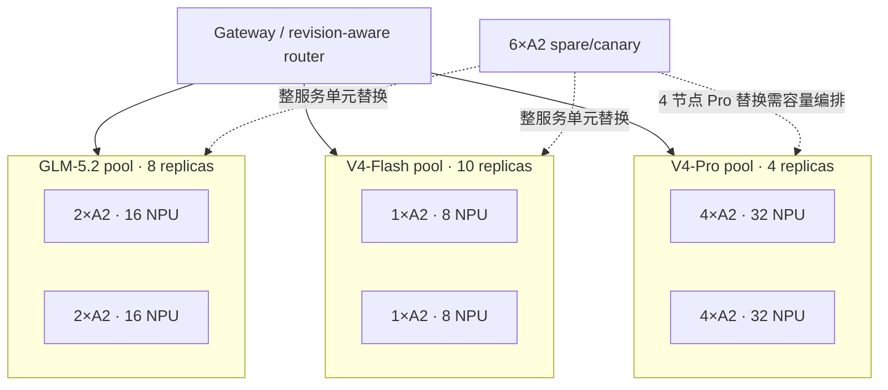

# 14. 384 卡昇腾 910B 实战：GLM-5.2 / DeepSeek-V4-Flash / Pro 大规模部署

> **谁该读这一篇？** 要在 Atlas 800 A2（8×昇腾 910B 64 GB）集群上用 vLLM Ascend 部署 GLM-5.2、DeepSeek-V4-Flash 或 DeepSeek-V4-Pro 的平台工程师、SRE 和性能工程师。
>
> **前置阅读：** [`13-384-h100-glm-deepseek-deployment.md`](13-384-h100-glm-deepseek-deployment.md)、[`01-tp-pp-ep.md`](../05-distributed/01-tp-pp-ep.md)、[`05-slo-and-observability.md`](05-slo-and-observability.md)
>
> **耗时：** 约 90 分钟；完整硬件验收、压测和故障演练建议预留 3～5 天
>
> **学完能：**
>
> 1. 区分上游 vLLM 与 vLLM Ascend 插件的版本、镜像和配置责任边界
> 2. 把 48 台 8×910B 拆成 8/16/32 卡服务单元，而不是做一个 384 卡 HCCL 大组
> 3. 为 GLM-5.2、V4-Flash、V4-Pro 分别落地 A2 启动模板、正确性门禁和扩容策略
> 4. 排查 HCCL、网口、rank、ACL Graph、量化、MTP、expert 倾斜和长上下文问题
> 5. 从裸机演练迁移到 Kubernetes/gang scheduling，并完成 canary、drain 和回滚

> **版本与验证边界（2026-08-10）**
>
> 本章以 vLLM Ascend `v0.23.0rc1` 发布线和 2026-08-10 可见的 latest 模型教程为事实基线。该 release 对齐上游 vLLM 0.23.0，并新增 GLM-5.2 A2/A3 支持；官方支持矩阵仍把 GLM-5.2、DeepSeek-V4-Flash/Pro 标为实验支持。生产必须固定 vLLM、vLLM Ascend、CANN、torch-npu、triton-ascend、驱动/固件、模型 revision 和镜像 digest。本文没有在 384 张 910B 上实测，所有吞吐和 SLO 都必须由你的金标集群产生。

---

## 1. 先给结论：A2 集群的三种服务单元

本章假设一个 A2 节点有 8 张 910B、每张 64 GB HBM。若你使用 16 卡 A3、A3 128 GB 形态、Atlas 300I 或 Ascend 950，不能只替换设备名；节点内拓扑、卡数、显存、镜像和推荐并行都不同。

当前官方教程给出的最小 A2 量级如下：

| 模型与权重 | 官方 A2 最小量级 | 本章基线服务单元 | 384 卡物理上限 | 建议稳态上限（留 6 节点） |
| --- | ---: | --- | ---: | ---: |
| `GLM-5.2-w4a8c8` / `w8a8` | 2 节点，16 NPU | 2 节点，`DP2×TP8+EP` | 24 副本 | 21 副本 |
| `DeepSeek-V4-Flash-w8a8-mtp` | 1 节点，8 NPU | 1 节点，`TP8`，EP 按官方开关 | 48 副本 | 42 副本 |
| `DeepSeek-V4-Pro-w4a8-mtp` | 4 节点，32 NPU | 4 节点，`DP4×TP8+EP` | 12 副本 | 10 副本，余 2 节点不可组成完整副本 |

“物理上限”只表示卡数能整除，不是承诺容量。42 个活跃节点加 6 个 spare 的混部示例可以是：

| 池 | 活跃节点 | NPU | 副本数 | 故障半径 |
| --- | ---: | ---: | ---: | ---: |
| GLM-5.2 | 16 | 128 | 8 | 2 节点 |
| V4-Flash | 10 | 80 | 10 | 1 节点 |
| V4-Pro | 16 | 128 | 4 | 4 节点 |
| spare/canary | 6 | 48 | 0 | 用于整单元替换 |



### 1.1 为什么不能全局 `DP=384, EP=384`

MoE 的 expert parallel 会在层内产生同步通信。把 EP 扩到 384 rank 意味着：

- 每层 dispatch/combine 穿过整个 fabric；
- 一个慢 NPU、坏网口或丢包路径拖慢所有 rank；
- HCCL communicator 的故障半径变成全池；
- 发布和扩缩容需要重建超大进程组；
- Gateway 已能用独立副本提供吞吐扩展，没有理由把无状态路由变成层内同步。

原则仍然是：**副本内并行只扩到模型放得下且通信可控；副本外扩展交给路由层。**

### 1.2 为什么同叫 `DP`，语义不一定是“复制整模型”

在这些 MoE 配置中，`--data-parallel-size` 与 `--enable-expert-parallel` 联用时，DP group 也承担 expert 分布/通信。attention、shared expert、router 和其他部分的复制方式与版本有关。不能把磁盘权重除以 DP 数就宣布每卡 HBM；发布单必须记录每 rank 实际权重、KV、graph、通信 buffer 和峰值。

---

## 2. 软件栈：不是“装一个 vllm”

昇腾路径至少包含：

```text
vLLM upstream
  + vLLM Ascend plugin
  + PyTorch / torch-npu
  + CANN Toolkit / Kernels
  + triton-ascend（若目标路径使用）
  + Ascend driver / firmware
  + HCCL
  + model-specific quantized checkpoint
```

### 2.1 制品锁定表

每次发布必须保存：

| 项 | 示例字段 | 为什么必须固定 |
| --- | --- | --- |
| 容器 | image digest + SBOM | tag 可漂移；系统库和算子都在镜像内 |
| vLLM | version + commit | CLI、scheduler、parser、metrics 会变化 |
| vLLM Ascend | version + commit | NPU backend、算子、additional config 由插件实现 |
| CANN | toolkit/kernels 版本 | ACL Graph、算子和 profiler ABI 依赖它 |
| torch-npu | 完整 build id | rc release 可能要求特定 post build |
| 驱动/固件 | 每节点查询结果 | HCCL/算子行为和稳定性依赖它 |
| 权重 | repo + revision + shard SHA256 | W4A8/W8A8/BF16 不能混用 |
| tokenizer/template | revision + hash | tool/reasoning 协议依赖它 |
| 启动参数 | 渲染后的最终 argv/env | 环境变量迁移到 additional config 时可追溯 |

vLLM Ascend `v0.23.0rc1` 的 release notes 特别要求核对 torch-npu/triton-ascend 与 CANN 的组合。不要从 release notes 复制一个 wheel URL后长期使用；把“官方兼容矩阵 + 内部验证结果”生成机器可读 lock 文件，并让 init container 在启动前拒绝不匹配版本。

官方入口：

- [vLLM Ascend release notes](https://docs.vllm.ai/projects/ascend/en/latest/user_guide/release_notes.html)
- [Supported Models](https://docs.vllm.ai/projects/ascend/en/latest/user_guide/support_matrix/supported_models.html)
- [GLM-5.2 tutorial](https://docs.vllm.ai/projects/ascend/en/latest/tutorials/models/GLM5.2.html)
- [DeepSeek-V4-Flash tutorial](https://docs.vllm.ai/projects/ascend/en/latest/tutorials/models/DeepSeek-V4-Flash.html)
- [DeepSeek-V4-Pro tutorial](https://docs.vllm.ai/projects/ascend/en/latest/tutorials/models/DeepSeek-V4-Pro.html)

### 2.2 容器设备映射基线

生产镜像由内部 registry 提供，并固定 digest。A2 8 卡容器至少需要设备、驱动库、HCCL 配置和模型目录：

```bash
export IMAGE="registry.internal/vllm-ascend-prod@sha256:REPLACE_WITH_DIGEST"
export MODEL_ROOT="/models"

docker run --rm -it \
  --name vllm-ascend-candidate \
  --net host \
  --shm-size 512g \
  --device /dev/davinci0 \
  --device /dev/davinci1 \
  --device /dev/davinci2 \
  --device /dev/davinci3 \
  --device /dev/davinci4 \
  --device /dev/davinci5 \
  --device /dev/davinci6 \
  --device /dev/davinci7 \
  --device /dev/davinci_manager \
  --device /dev/devmm_svm \
  --device /dev/hisi_hdc \
  -v /usr/local/dcmi:/usr/local/dcmi:ro \
  -v /usr/local/bin/npu-smi:/usr/local/bin/npu-smi:ro \
  -v /usr/local/Ascend/driver/lib64:/usr/local/Ascend/driver/lib64:ro \
  -v /usr/local/Ascend/driver/version.info:/usr/local/Ascend/driver/version.info:ro \
  -v /etc/ascend_install.info:/etc/ascend_install.info:ro \
  -v /etc/hccn.conf:/etc/hccn.conf:ro \
  -v "${MODEL_ROOT}:${MODEL_ROOT}:ro" \
  "${IMAGE}" bash
```

官方示例常用 `--privileged=true` 方便验证。生产安全评审应列出实际所需 capability、device 和 mount，能收窄就收窄；如果保留 privileged，必须把节点池和租户边界写进威胁模型。

### 2.3 启动前做 CLI 契约检查

不同 rc 的开关可能从环境变量迁移到 `--additional-config`。对实际 digest 运行：

```bash
vllm serve --help | grep -E -- \
  '--(data-parallel-size|data-parallel-size-local|data-parallel-start-rank|data-parallel-address|tensor-parallel-size|enable-expert-parallel|quantization|additional-config|compilation-config|profiler-config)'
```

缺参数就停止，不在现场拼接另一个版本的 Python 包。

---

## 3. 节点与 HCCL 网络验收

### 3.1 单节点金标

每台 A2 至少采集：

```bash
npu-smi info
npu-smi info -t board
npu-smi info -t health
cat /usr/local/Ascend/driver/version.info
cat /etc/hccn.conf
ip -br link
ip -br addr
numactl --hardware
lsblk -o NAME,MODEL,SIZE,ROTA,MOUNTPOINT
```

归档每卡健康、温度、功耗、HBM、PCIe/拓扑、设备 ID 与网口映射。用同一短 workload 得到单节点 golden distribution；节点相对金标离群时先 cordon，不让 384 卡压测掩盖坏卡。

### 3.2 网络变量的含义

多节点模板常见：

```bash
export HCCL_IF_IP="REPLACE_WITH_CURRENT_NODE_IP"
export GLOO_SOCKET_IFNAME="REPLACE_WITH_NIC"
export TP_SOCKET_IFNAME="REPLACE_WITH_NIC"
export HCCL_SOCKET_IFNAME="REPLACE_WITH_NIC"
```

- `HCCL_IF_IP` 是当前节点可达地址，每台不同；
- `GLOO_SOCKET_IFNAME` 是控制面；
- `TP_SOCKET_IFNAME`/`HCCL_SOCKET_IFNAME` 必须指向经过验证的数据面；
- `node0_ip` 在所有 rank 上相同，指向 DP master；
- MTU、VLAN、路由、bond、RoCE 参数必须来自本机网络设计，不能照抄文档里的占位值。

### 3.3 四层通信门禁

1. IP/MTU/路由可达；
2. 每个 NPU port 到目标 peer 的链路/错误 counter 正常；
3. HCCL 单节点与目标多节点 group benchmark 达到同拓扑金标；
4. 多副本同时运行时无 fabric oversubscription、重传或 p99 尖峰。

超长 timeout 只适合首次加载/诊断，不能把真实 hang 变成半小时用户黑洞。生产要有更短的 endpoint watchdog：发现 rank dead、HCCL error 或长时间无 step 时，从 Gateway 摘除完整副本，再整组重建。

---

## 4. 权重分发与 HBM 预算

### 4.1 不要 48 台同时拉模型

对每个 revision：

```text
对象存储/制品库
  -> 每机架受控 fan-out cache
  -> 节点本地 NVMe 临时目录
  -> shard SHA256 + manifest 校验
  -> 原子切换 revision 目录
  -> 写 READY marker
  -> 调度器才允许创建服务单元
```

下载并发按 leaf 和存储出口限速。模型分发不应与线上 HCCL/日志/存储 IO 抢同一无优先级链路。

### 4.2 每 rank HBM 账

$$
M_{\mathrm{rank}}
=M_{\mathrm{weight}}+M_{\mathrm{KV}}+M_{\mathrm{activation}}
+M_{\mathrm{graph}}+M_{\mathrm{HCCL}}+M_{\mathrm{workspace}}
+M_{\mathrm{fragment}}
$$

记录四个阶段：load 后、profile/capture 峰值、warmup 后、最大压力峰值。`gpu-memory-utilization` 影响 KV 预算，不是进程物理上限。W4A8/W8A8 还有 scale、padding、未量化层和 MTP 权重，不能按“4 bit/8 bit”直接换算。

### 4.3 上下文上限不是默认 SLO

支持矩阵可写 1M，但官方 GLM-5.2 A2/A3 矩阵当前列出的验证上限是 200K；V4 的 1M 也需要具体权重、block size、图模式和并发组合验证。建议服务等级：

| 池 | `max-model-len` 起点 | 并发起点 | 目标 |
| --- | ---: | ---: | --- |
| interactive | 32K/64K | 按压测提高 | TPOT/p99 |
| long | 128K/200K | 2～16 | TTFT/完成率 |
| ultra-long | 384K/1M canary | 1～2 | 功能验证、独立 quota |

---

## 5. GLM-5.2：两节点 16×910B 基线

### 5.1 为什么从 W4A8C8/W8A8 开始

官方教程给出的 A2 最小量级是：BF16 4 节点；W8A8 或 W4A8C8 2 节点。大规模在线服务先用经过任务精度验证的量化权重，可以把故障半径从 4 节点降到 2 节点，并提高副本数。若业务 golden 不允许量化误差，再转 BF16 4 节点基线，不能只改 `--quantization`。

### 5.2 两节点通用启动模板

下面保留官方 A2 多节点 DP 参数语义：每台 8 卡节点只能承载一个 TP8 rank，`LOCAL_DP_START` 在节点 0/1 分别为 0/1。模型、镜像和所有网络值都必须替换：

```bash
export NODE_INDEX="REPLACE_WITH_0_OR_1"
export LOCAL_DP_START="${NODE_INDEX}"
export LOCAL_IP="REPLACE_WITH_THIS_NODE_IP"
export NODE0_IP="REPLACE_WITH_NODE0_IP"
export NIC_NAME="REPLACE_WITH_VALIDATED_NIC"
export MODEL_DIR="/models/glm-5.2-w4a8c8/REPLACE_WITH_REVISION"

export HCCL_OP_EXPANSION_MODE=AIV
export HCCL_IF_IP="${LOCAL_IP}"
export GLOO_SOCKET_IFNAME="${NIC_NAME}"
export TP_SOCKET_IFNAME="${NIC_NAME}"
export HCCL_SOCKET_IFNAME="${NIC_NAME}"
export VLLM_RPC_TIMEOUT=360000
export VLLM_EXECUTE_MODEL_TIMEOUT_SECONDS=30000
export HCCL_EXEC_TIMEOUT=200
export HCCL_CONNECT_TIMEOUT=120
export OMP_PROC_BIND=false
export OMP_NUM_THREADS=10
export PYTORCH_NPU_ALLOC_CONF=expandable_segments:True
export ACL_OP_INIT_MODE=1
export TASK_QUEUE_ENABLE=1
export CPU_AFFINITY_CONF=1
export VLLM_ENGINE_READY_TIMEOUT_S=1200

EXTRA_ROLE_ARGS=()
if [[ "${NODE_INDEX}" == "0" ]]; then
  EXTRA_ROLE_ARGS+=(--api-server-count 1)
else
  EXTRA_ROLE_ARGS+=(--headless)
fi

vllm serve "${MODEL_DIR}" \
  --host 0.0.0.0 --port 7000 \
  "${EXTRA_ROLE_ARGS[@]}" \
  --safetensors-load-strategy prefetch \
  --data-parallel-size 2 \
  --data-parallel-start-rank "${LOCAL_DP_START}" \
  --data-parallel-size-local 1 \
  --data-parallel-address "${NODE0_IP}" \
  --data-parallel-rpc-port 13389 \
  --tensor-parallel-size 8 \
  --enable-expert-parallel \
  --served-model-name glm-5.2 \
  --tool-call-parser glm47 \
  --reasoning-parser glm45 \
  --enable-auto-tool-choice \
  --max-model-len 40000 \
  --max-num-seqs 16 \
  --max-num-batched-tokens 4096 \
  --gpu-memory-utilization 0.95 \
  --quantization ascend \
  --trust-remote-code \
  --block-size 128 \
  --compilation-config '{"cudagraph_mode":"FULL_DECODE_ONLY"}' \
  --additional-config '{"multistream_overlap_shared_expert":true}'
```

模板与官方 A2 示例的差异是先关闭 MTP，目的是建立最小正确性基线。基线通过后再 A/B：

```bash
--speculative-config \
  '{"num_speculative_tokens":3,"method":"deepseek_mtp","enforce_eager":true}'
```

GLM-5.2 的 MTP 再测官方 A2 起点 5 token。每档记录 acceptance length、TTFT、TPOT、HBM、graph 组合和 tool/reasoning 协议；不要只看 output tok/s。

### 5.3 A2 与 A3 优化栈不能混抄

vLLM Ascend 的 GLM-5.2 官方教程明确说明 A2 使用不同优化栈，A2 co-located 基线不使用 FlashComm1 和 DSA-CP。所以上面的 A2 命令只保留 `multistream_overlap_shared_expert`，并使用 `CPU_AFFINITY_CONF`、`ACL_OP_INIT_MODE` 和 A2 对应 timeout。

| 配置 | A2 co-located 基线 | A3 示例 | 本章原则 |
| --- | --- | --- | --- |
| global DP/TP | `DP2×TP8` | 单节点 `DP2×TP8` 或双节点 `DP4×TP8` | 先按每节点真实卡数算进程 |
| local DP ranks | 每 A2 节点 1 | 16 卡 A3 节点可为 2 | 不让 `local_dp×TP` 超过本机卡数 |
| FlashComm1 / DSA-CP | 官方 A2 co-located 不用 | A3 路径可启用 | 不把 A3 env/additional config 搬到 A2 |
| multistream shared expert | 启用候选 | 视 fused op 组合 | 做 timeline 与 correctness A/B |
| max context 起点 | 官方 A2 示例 40K | A3 示例可更高 | 按 HBM/正确性逐级扩大 |

若后续 release 给 A2 新增 FlashComm/DSA-CP 组合，必须固定新版本并把它当新实验；不能因为插件“认识开关”就推断 A2 已验证。一次只改一组有耦合关系的开关，旧环境变量和新 additional config 也不能同时设置后猜谁生效。

---

## 6. DeepSeek-V4-Flash：单节点 8×910B 基线

### 6.1 启动命令

官方 latest 教程给 W8A8 MTP checkpoint 的 A2 单节点形态。生产先保留其模型特定参数，关闭 MTP 建 baseline：

```bash
export MODEL_DIR="/models/deepseek-v4-flash-w8a8-mtp/REPLACE_WITH_REVISION"
export OMP_PROC_BIND=false
export OMP_NUM_THREADS=10
export PYTORCH_NPU_ALLOC_CONF=expandable_segments:True
export LD_PRELOAD=/usr/lib/aarch64-linux-gnu/libjemalloc.so.2:${LD_PRELOAD}
export HCCL_BUFFSIZE=1024
export TASK_QUEUE_ENABLE=1
export HCCL_OP_EXPANSION_MODE=AIV

vllm serve "${MODEL_DIR}" \
  --host 0.0.0.0 --port 8900 \
  --served-model-name deepseek-v4-flash \
  --max-model-len 131072 \
  --max-num-batched-tokens 8192 \
  --max-num-seqs 32 \
  --gpu-memory-utilization 0.90 \
  --data-parallel-size 1 \
  --tensor-parallel-size 8 \
  --enable-expert-parallel \
  --tokenizer-mode deepseek_v4 \
  --tool-call-parser deepseek_v4 \
  --reasoning-parser deepseek_v4 \
  --enable-auto-tool-choice \
  --no-enable-prefix-caching \
  --model-loader-extra-config \
    '{"enable_multithread_load":true,"num_threads":128}' \
  --quantization ascend \
  --block-size 128 \
  --compilation-config '{"cudagraph_mode":"FULL_DECODE_ONLY"}' \
  --additional-config \
    '{"ascend_compilation_config":{"enable_npugraph_ex":true,"enable_static_kernel":false},"enable_cpu_binding":true,"enable_dsa_cp":true,"enable_flashcomm1":true,"multistream_overlap_shared_expert":true}'
```

基线通过后依次测试：prefix cache、MTP1、MTP3、DSpark 对应 checkpoint。MTP 与 DSpark 不是同一个开关：DSpark 需要匹配的模型权重和版本，不能对普通 MTP checkpoint 只改 method。

### 6.2 为什么官方仍开 `TP8` 和 `enable-expert-parallel`

这组开关由 vLLM Ascend 的 DeepSeek-V4 路径共同解释。不要根据“DP=1 所以 EP 没意义”自行删除，再把性能差异归因于硬件。正确方法：先复现固定 release 的官方组合，保存实际 rank/EP 日志；再做一个变量的 A/B，并验证模型能否加载、expert mapping、golden 与性能。

### 6.3 1M 和 DSpark 独立验收

官方 latest 还给出 `block-size=32`、更高 DP/不同 TP 与 DSpark 的 1M 示例。这是另一套 shape 和 cache 设计，不是把上面 `max-model-len` 改成 1048576。独立池至少验证：

- checkpoint 与 speculative method 匹配；
- `VLLM_PREFIX_CACHE_RETENTION_INTERVAL` 是 block size 的非负整数倍；
- 1M prefill 的取消、超时、重试和 HBM 释放；
- 1M 与短请求不共用队列，或调度能证明短请求 SLO；
- MTP/DSpark acceptance 来自真实 agentic 流量；
- tool call、Think High/Max、streaming 在超长输入下仍正确。

---

## 7. DeepSeek-V4-Pro：四节点 32×910B 基线

### 7.1 rank 设计

官方 A2 形态是 4 个节点，每节点一个 local DP rank，每 rank 内 TP8，总 `DP=4, TP=8, EP on`：

```text
node0 -> DP start rank 0 -> TP8
node1 -> DP start rank 1 -> TP8
node2 -> DP start rank 2 -> TP8
node3 -> DP start rank 3 -> TP8
```

这意味着 Pro 每个副本跨 4 个节点。调度器必须 gang schedule 四台；任一节点失败就摘除完整 endpoint，不能只重启一个 local rank 后继续接流量。

### 7.2 四节点模板

每台设置唯一 `NODE_INDEX=0..3`、`LOCAL_IP`，并共享 `NODE0_IP`：

```bash
export NODE_INDEX="REPLACE_WITH_0_TO_3"
export LOCAL_IP="REPLACE_WITH_THIS_NODE_IP"
export NODE0_IP="REPLACE_WITH_NODE0_IP"
export NIC_NAME="REPLACE_WITH_VALIDATED_NIC"
export MODEL_DIR="/models/deepseek-v4-pro-w4a8-mtp/REPLACE_WITH_REVISION"

export HCCL_IF_IP="${LOCAL_IP}"
export GLOO_SOCKET_IFNAME="${NIC_NAME}"
export TP_SOCKET_IFNAME="${NIC_NAME}"
export HCCL_SOCKET_IFNAME="${NIC_NAME}"
export HCCL_BUFFSIZE=512
export ASCEND_RT_VISIBLE_DEVICES=0,1,2,3,4,5,6,7
export OMP_PROC_BIND=false
export OMP_NUM_THREADS=10
export PYTORCH_NPU_ALLOC_CONF=expandable_segments:True
export ACL_OP_INIT_MODE=1
export VLLM_ENGINE_READY_TIMEOUT_S=3600
export HCCL_OP_EXPANSION_MODE=AIV
export TASK_QUEUE_ENABLE=1
export VLLM_ASCEND_ENABLE_FLASHCOMM1=1
export HCCL_CONNECT_TIMEOUT=7200
export ASCEND_CONNECT_TIMEOUT=10000
export ASCEND_TRANSFER_TIMEOUT=10000
export VLLM_RPC_TIMEOUT=1800000
export LD_PRELOAD=/usr/lib/aarch64-linux-gnu/libjemalloc.so.2:${LD_PRELOAD}

ROLE_ARGS=()
if [[ "${NODE_INDEX}" != "0" ]]; then
  ROLE_ARGS+=(--headless)
fi

vllm serve "${MODEL_DIR}" \
  --host 0.0.0.0 --port 10010 \
  "${ROLE_ARGS[@]}" \
  --served-model-name deepseek-v4-pro \
  --data-parallel-size 4 \
  --data-parallel-size-local 1 \
  --data-parallel-start-rank "${NODE_INDEX}" \
  --data-parallel-address "${NODE0_IP}" \
  --data-parallel-rpc-port 13399 \
  --tensor-parallel-size 8 \
  --enable-expert-parallel \
  --max-model-len 131072 \
  --max-num-batched-tokens 4096 \
  --max-num-seqs 16 \
  --gpu-memory-utilization 0.90 \
  --quantization ascend \
  --no-enable-prefix-caching \
  --tokenizer-mode deepseek_v4 \
  --tool-call-parser deepseek_v4 \
  --reasoning-parser deepseek_v4 \
  --enable-auto-tool-choice \
  --safetensors-load-strategy prefetch \
  --block-size 128 \
  --compilation-config '{"cudagraph_mode":"FULL_DECODE_ONLY"}' \
  --additional-config \
    '{"ascend_compilation_config":{"enable_npugraph_ex":true,"enable_static_kernel":false},"enable_cpu_binding":true,"enable_shared_expert_dp":true,"multistream_overlap_shared_expert":true}' \
  --model-loader-extra-config \
    '{"enable_multithread_load":"true","num_threads":128}'
```

先无 MTP；随后增加官方起点：

```bash
--speculative-config \
  '{"num_speculative_tokens":1,"method":"mtp","enforce_eager":true}'
```

### 7.3 Pro 的特殊门禁

1. 四节点所有 rank 的 model revision、quant config 和 tokenizer hash 相同；
2. expert mapping 与每 rank HBM 分布可解释；
3. HCCL dispatch/combine p99 与金标一致，没有单 rank 热点；
4. Think Max 使用独立 `max-model-len>=393216` canary，不在 128K endpoint 截断；
5. MTP on/off 的 reasoning、tool、usage 和 finish reason 一致；
6. 任一 rank kill 后 Gateway 在目标秒数内摘完整副本；
7. 4 节点同时重建不会打爆模型存储或 fabric；
8. 至少 24h 混合长度 soak 无 AICore timeout、HCCL hang、OOM 或持续碎片。

---

## 8. 从单副本扩到 384 卡

### 8.1 Gateway 的 endpoint 模型

每个 endpoint 至少携带：

```text
model_family / model_revision / quant_revision
context_tier / reasoning_tier
replica_id / service_unit_nodes
vllm_ascend_version / image_digest
running / waiting / KV usage / health
warm / draining / failed
```

按模型与服务等级过滤后，再按 prefix/session 亲和、queue、KV、实际 token capacity 加权。不要用 round-robin 把多轮对话的相同前缀随机打散。

### 8.2 容量按 NPU-seconds

$$
S_{\mathrm{NPU/request}}
=N_{\mathrm{NPU,replica}}\times \mathbb{E}\!\left[T_{\mathrm{service}}\right]
$$

$$
N_{\mathrm{NPU,need}}
=\frac{\lambda\times \mathbb{E}\!\left[S_{\mathrm{NPU/request}}\right]}
{U_{\mathrm{safe}}}\times H_{\mathrm{burst}}
$$

每模型至少按输入长度、输出长度、reasoning、tool、prefix hit/miss 分桶。Pro 一个副本 32 NPU，扩缩粒度是 Flash 的四倍；autoscaler 必须提前量更大，并保留能组成完整四节点组的 spare。

### 8.3 混部不能把 spare 算两次

6 个 spare 节点能同时支撑：

- 1 个 Pro canary（4 节点）+ 2 个普通 spare；或
- 3 个 GLM replacement 单元；或
- 6 个 Flash replacement 单元。

不能在发布计划里既把 4 节点用于 Pro canary，又把同一批节点记为 GLM/Flash N+1。每个 rollout wave 前计算剩余故障预算；不足就暂停升级。

---

## 9. Kubernetes / 调度落地

### 9.1 服务单元对象

| 模型 | group size | 每 Pod NPU | 调度/更新单位 |
| --- | ---: | ---: | --- |
| GLM-5.2 | 2 Pod | 8 | 两节点同时创建、失败整组重建 |
| V4-Flash | 1 Pod | 8 | 单节点 |
| V4-Pro | 4 Pod | 8 | 四节点 gang；任一 rank 失败整组摘除 |

关键项：

- 专用 A2 node pool，节点标签包含固件、fabric、模型缓存 revision；
- NPU device plugin 资源独占，不混放训练任务；
- host network 或验证过的高性能 secondary network；
- `/etc/hccn.conf`、驱动库和设备完整映射；
- 同服务单元尽量同 leaf/rail，副本跨故障域分散；
- init container 校验权重、软件 lock 和 HCCL 连通；
- readiness 等到所有 rank、graph capture、golden warmup 完成；
- worker/headless Pod 不进入业务 Service；
- preStop 先 drain，完整服务单元一起退出。

### 9.2 rank 配置不要手工复制

用 Pod ordinal 渲染：

```text
GLM: start_rank = ordinal * 2, local_size = 2
Pro: start_rank = ordinal, local_size = 1
Flash: no remote DP coordinator
```

启动日志必须打印 `pod/node/local_ip/NODE_INDEX/start_rank/dp/tp/ep/model_revision`。控制器在 readiness 前拉取并验证 rank 集合无重复、无缺口。

---

## 10. 正确性、性能、稳定性门禁

### 10.1 正确性

- greedy golden：中文、英文、代码、数学；
- tokenizer/chat template hash；
- reasoning off/high/max；
- 单 tool、多 tool、并行 tool、异常回传；
- streaming chunk 拼接、Unicode、转义、超长 JSON；
- MTP/DSpark on/off；
- prefix hit/miss；
- 32K/128K/200K/1M 候选的 retrieval/needle；
- 取消、超时、断连、重试；
- 量化 checkpoint 相对 BF16/reference 的任务级精度。

探针：

```bash
curl -fsS http://REPLACE_WITH_ENDPOINT/health
curl -fsS http://REPLACE_WITH_ENDPOINT/v1/models
curl -fsS http://REPLACE_WITH_ENDPOINT/metrics >/dev/null
```

### 10.2 性能

```bash
vllm bench serve \
  --backend openai-chat \
  --base-url http://REPLACE_WITH_GATEWAY/v1 \
  --model REPLACE_WITH_SERVED_MODEL \
  --dataset-name random \
  --random-input-len 8192 \
  --random-output-len 1024 \
  --request-rate REPLACE_WITH_RATE \
  --num-prompts REPLACE_WITH_COUNT \
  --save-result \
  --result-dir ./results
```

正式结论使用脱敏真实回放。记录成功率、TTFT/TPOT/ITL/E2E p50/p95/p99、input/output tok/s、NPU-seconds/request、每 rank step、HCCL/AllToAll、HBM、KV/preemption、MTP acceptance、功耗。

### 10.3 稳定性与注入

至少 24h soak，并依次注入：

- kill 非 head rank；
- kill head/API rank；
- cordon 一个节点；
- 让一个 HCCL 网口不可用（在隔离测试环境）；
- 权重 shard 缺失/校验失败；
- 模型存储降速；
- Gateway 重试突发；
- 大量客户端取消；
- 超长请求与短请求混流；
- MTP/tool/reasoning 极端输入。

验证完整副本摘除、队列止损、重试预算、spare 替换 RTO 和跨模型池隔离。

---

## 11. 常见故障树

| 现象 | 先看 | 常见根因 | 第一处置 |
| --- | --- | --- | --- |
| 多节点启动卡住 | rank/env/HCCL 日志、网口 | IP/NIC 不一致、rank 重复、版本不一 | 摘完整组，核对 rank 表和 lock |
| 首请求慢或超时 | compile/graph/load timeline | 图编译、cache 冷、load 未完成 | readiness 延后，固定 warmup |
| TTFT 高、TPOT 正常 | queue/prefill/HCCL | 长 prompt、DSA-CP、chunk budget | 长短分池，profile prefill |
| TPOT 抖动 | per-rank step/expert/HCCL | expert 倾斜、慢卡、通信尾延迟 | endpoint 降权，区分负载与硬件 |
| 运行态 OOM | HBM/KV/graph/MTP | 并发×长度、碎片、workspace | 限流并回退最近配置 |
| MTP 变慢 | acceptance/draft/verify | 真实流量不可预测、draft 开销 | 回到 MTP off，分桶复测 |
| tool JSON 损坏 | tokenizer/template/parser | revision 不配套 | 整套制品回滚 |
| HCCL timeout | 最后 collective、网口 counter | rank dead、链路/PFC、慢 NPU | 摘完整副本，禁止单 rank 热替换 |
| 量化精度下降 | golden 分桶 | checkpoint/scale/算子版本 | 回滚权重+镜像，不只改 sampling |
| prefix 命中低 | token/hash/router | revision 混用、session 漂移 | revision 隔离与 sticky routing |

---

## 12. 发布 Runbook

### Phase 0：单服务单元金标

三种模型各建一个服务单元，固定全部制品，完成 load、golden、长度/并发矩阵、profile、24h soak。退出条件不是“能答一句话”，而是有可复现脚本、饱和曲线、每 rank 金标和已知限制。

### Phase 1：spare canary

- Flash 用 1 spare 节点；
- GLM 用 2 spare 节点；
- Pro 用 4 spare 节点；
- 先 shadow，再 1% 新 session；
- revision 间 session 不漂移。

### Phase 2：逐完整服务单元滚动

一次只替换一个 1/2/4 节点单元；drain 后等待 running=0 或受控 deadline；新副本完成 rank/graph/golden warmup 后从低权重升流量。

### Phase 3：故障预算复核

每波前确认剩余 spare 能覆盖最大允许故障。Pro rollout 占 4 节点，尤其容易吃完 canary 与 N+1 预算。

### 回滚触发器

- golden/tool/reasoning/streaming 回归；
- p99 或错误率连续越过门限；
- 新增 OOM、AICore、HCCL timeout；
- MTP acceptance/prefix hit 无法解释地阶跃；
- per-rank step/HBM 离群；
- 一个副本故障引发全池重试雪崩。

回滚单位是：镜像、软件 lock、权重、tokenizer/template/parser、启动 env/args 的整体。

---

## 13. 上线清单

### 制品

- [ ] vLLM/vLLM Ascend/CANN/torch-npu/triton/driver/firmware 完整锁定
- [ ] 三种权重固定 revision 与 shard hash
- [ ] tokenizer/template/parser 与模型 revision 绑定
- [ ] 镜像 digest、SBOM、回滚制品已归档

### 硬件与网络

- [ ] 48 节点完成 NPU/HBM/拓扑/NIC/NVMe 金标验收
- [ ] HCCL 单节点、2 节点、4 节点目标 group 测试归档
- [ ] rank/IP/NIC/MTU/rail 映射机器校验
- [ ] 42 活跃节点 + 6 spare 的故障预算没有重复计算

### 服务

- [ ] GLM-5.2 两节点 baseline、MTP3/5、additional config A/B 完成
- [ ] V4-Flash baseline、prefix、MTP/DSpark 分开验收
- [ ] V4-Pro 四节点 rank、expert、HCCL、Think Max 门禁完成
- [ ] 1M 使用独立池、quota、timeout 和重试策略

### 运营

- [ ] Gateway revision-aware、session/prefix sticky、drain 可用
- [ ] readiness 覆盖全 rank + graph + golden warmup
- [ ] kill rank/node/NIC/存储/取消/重试演练完成
- [ ] 每个告警都有摘副本、限流、重建或回滚动作

---

## 小结

- 384×910B 应拆成多个 8/16/32 卡服务单元：Flash 单节点，GLM 两节点，Pro 四节点；吞吐用 Gateway 外部副本扩展。
- 昇腾部署是 vLLM + vLLM Ascend + CANN + torch-npu + 驱动固件的锁定矩阵，不能只记录 `pip show vllm`。
- 官方命令是目标版本的验证起点，不是你的 SLO；环境变量、additional config、量化、图模式与 MTP 必须逐项 A/B。
- 大规模稳定性取决于缩小 HCCL 故障域、rank 可证明、spare 按完整服务单元规划、制品预分发和小步 rollout。
- 任何性能结论都要落到端到端延迟、每 rank step、HCCL、HBM/KV、算子 timeline 和正确性证据；下一章给出完整 profiling 方法。

## 自检

1. 为什么 V4-Flash、GLM-5.2、V4-Pro 在 A2 上分别用 1/2/4 节点？这些数字来自哪里，哪些仍需实测？
2. GLM 的 `DP2×TP8+EP` 与 Pro 的 `DP4×TP8+EP` 中，DP 为什么不能简单理解为多份完整模型？
3. 一个 Pro rank 失败时，为什么必须摘四节点完整副本？
4. GLM 的 balance scheduling 可能改善 TPOT 却伤害什么指标？怎样 A/B？
5. 为什么 DSpark 不能只改一个 speculative method 就上线？
6. 6 个 spare 节点为什么不能同时承诺 Pro canary 和 3 个 GLM replacement？
7. 1M context 为什么必须独立服务等级？
8. 如何区分 expert 热点、坏 NPU 和 HCCL 路径问题？

### 参考答案

1. 1/2/4 节点是模型权重、KV、并行布局和官方教程/配置给出的候选服务单元，不是当前工作区完成的硬件实测结论。必须在目标 CANN、torch-npu、vLLM Ascend、驱动和真实长度/并发矩阵上重新验证显存、HCCL、TTFT/TPOT 和 goodput。
2. DP 是独立请求副本/数据并行维度，多个 DP rank 共享同一份模型逻辑但不等于每个 rank 都独立复制全部权重；TP/EP 仍会分片权重和 expert。实际内存取决于 TP/EP sharding、replicated layers、KV 和 runtime workspace。
3. Pro 的一个 rank 属于完整 TP/PP/EP communicator；rank 失败会让 collective 参与者不一致，不能只摘一张卡继续服务。应摘除该四节点 service unit，重建一致的 rank/world-size，并让 router 在 readiness 通过前不送流量。
4. balance scheduling 可能减少某些 rank 的 token imbalance、改善 TPOT，但也可能增加重排/同步、牺牲 TTFT、吞吐或公平性。固定 workload 做 off/on A/B，按 per-rank stage、HCCL wait、TTFT/TPOT p99、goodput 和能耗共同裁决。
5. DSpark/speculative method 涉及 draft/target 模型、tokenizer、acceptance、rollback、sampling、reasoning/structured output 和硬件 backend。只改一个字符串可能启动成功但产生错误接受率、质量或长尾，必须跑正确性、接受率、TTFT/TPOT 和失败回退矩阵。
6. spare 必须先扣除故障冗余和维护余量；Pro canary 一旦占用四节点，剩余节点可能不足以替换三个 GLM unit。应按 failure domain 建立资源账本，并设置 canary reservation、replacement reservation 和 stop condition。
7. 1M context 的 KV、prefill 时间、通信和 OOM 风险与普通请求完全不同，混在同一池会造成 head-of-line blocking 和容量估算失真。应独立 admission、quota、SLO、GPU/内存池和长稳态压测。
8. expert 热点看 per-expert token/compute/all-to-all；坏 NPU 看温度、频率、ECC/硬件事件、单卡 kernel 时间；HCCL 路径看 collective wait、链路错误、rank 对齐和拓扑。用同一 batch 对照多个 rank，才能区分数据倾斜与硬件/通信故障。

## 下一步

- 端到端 profiling：[`15-end-to-end-latency-profiling-and-optimization.md`](15-end-to-end-latency-profiling-and-optimization.md)
- NVIDIA 对照部署：[`13-384-h100-glm-deepseek-deployment.md`](13-384-h100-glm-deepseek-deployment.md)
- SLO 与指标：[`05-slo-and-observability.md`](05-slo-and-observability.md)
- 尾延迟诊断：[`10-gpu-utilization-and-tail-latency.md`](10-gpu-utilization-and-tail-latency.md)
- Benchmark 方法：[`../07-hands-on/06-benchmark-methodology.md`](../07-hands-on/06-benchmark-methodology.md)
