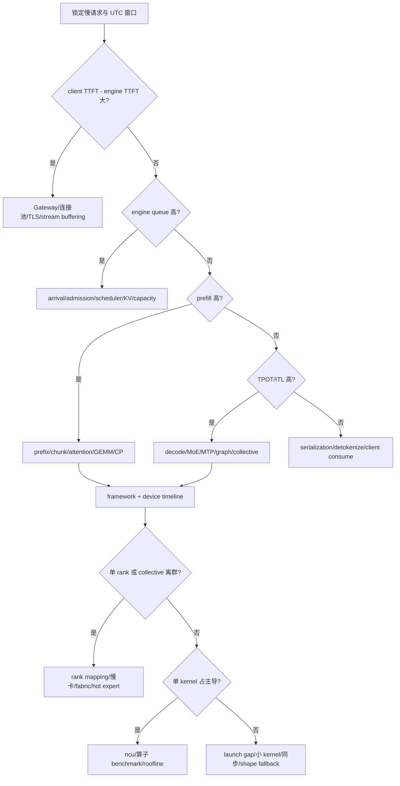

# 15. 端到端推理时延 Profiling：从客户端到 H100 / 910B Kernel 的优化闭环

> **谁该读这一篇？** 已经能启动 vLLM 服务，但面对 TTFT、TPOT、ITL 或 p99 异常，不知道慢在客户端、网关、调度、prefill、decode、通信还是 kernel 的性能工程师与 SRE。
>
> **前置阅读：** [`../07-hands-on/04-profiling-and-debugging.md`](../07-hands-on/04-profiling-and-debugging.md)、[`../07-hands-on/06-benchmark-methodology.md`](../07-hands-on/06-benchmark-methodology.md)、[`10-gpu-utilization-and-tail-latency.md`](10-gpu-utilization-and-tail-latency.md)、[`13-384-h100-glm-deepseek-deployment.md`](13-384-h100-glm-deepseek-deployment.md)、[`14-384-ascend-910b-glm-deepseek-deployment.md`](14-384-ascend-910b-glm-deepseek-deployment.md)
>
> **耗时：** 约 160 分钟；一次完整真实流量优化实验建议预留 1～3 天
>
> **学完能：**
>
> 1. 建立可相加的端到端延迟账本，区分客户端 TTFT 与 vLLM engine TTFT
> 2. 用 metrics → request trace → framework profile → device timeline → kernel counter 逐层缩小问题
> 3. 在 H100 上使用 vLLM profiler、Nsight Systems/Nsight Compute、NCCL/DCGM
> 4. 在 910B 上使用 Ascend PyTorch Profiler、MS Service Profiler、MindStudio/HCCL 证据
> 5. 针对 GLM-5.2、DeepSeek-V4-Flash/Pro 的 prefill、decode、MoE、MTP、长上下文制定优化实验
> 6. 用正确性、SLO、goodput、成本和回滚条件证明优化，而不是只报告吞吐上涨
> 7. 建立可复现的 evidence bundle，并按值班 Runbook 从一条慢请求下钻到 rank、collective 与 kernel
> 8. 使用 Prometheus API、OTel、vLLM bench、eBPF、DCGM/Nsight 或 Ascend/MS Service 工具形成工业级闭环

> **源码与硬件边界（2026-08-11）**
>
> 上游 vLLM 源码锚点对照 `b23bd73f540175f9e117eaee5029cd7d8df63964`。本章命令按该快照的 `ProfilerConfig`、metrics 和 profiling API 复核；切换 revision 后要重新执行 CLI 契约与 metrics inventory。昇腾工具以 vLLM Ascend latest profiling guide 为外部事实源。当前工作区没有 H100/910B，因此不提供伪造 trace、固定 kernel 百分比或跨硬件速度排名。

---

## 1. 先建立延迟账本

### 1.1 用户看到的 TTFT 不等于 engine TTFT

对 streaming 请求，客户端 TTFT 可以写成：

$$
\begin{aligned}
T_{\mathrm{TTFT,client}}
&=T_{\mathrm{client\ queue}}+T_{\mathrm{DNS}}+T_{\mathrm{connect}}
  +T_{\mathrm{TLS}}+T_{\mathrm{upload}} \\
&\quad +T_{\mathrm{gateway}}+T_{\mathrm{frontend}}+T_{\mathrm{engine\ queue}} \\
&\quad +T_{\mathrm{prefill}}+T_{\mathrm{first\ sample}}
  +T_{\mathrm{first\ serialize}}+T_{\mathrm{first\ byte}}
\end{aligned}
$$

vLLM `/metrics` 中的 `time_to_first_token` 从引擎可见的生命周期统计，不覆盖客户端连接池、DNS/TLS、外部网关排队和部分网络传输。两者差值大时，不要继续调 attention kernel。

完整 E2E：

$$
T_{\mathrm{E2E}}
=T_{\mathrm{TTFT,client}}
+\sum_{i=2}^{N}T_{\mathrm{ITL},i}
+T_{\mathrm{finalize}}
$$

其中 `finalize` 包括最后一次 detokenize、JSON/SSE、proxy buffering、网络与客户端消费。对非 streaming 请求，客户端只有一个响应完成时间，必须靠服务端 trace 分出 TTFT/TPOT。

### 1.2 四个核心指标

| 指标 | 定义 | 主要受什么影响 | 常见误解 |
| --- | --- | --- | --- |
| TTFT | 提交到首 token | queue、tokenize、prefill、first sample | 把所有 TTFT 高都归因于 prefill |
| ITL | 相邻输出 token 间隔 | decode step、batch、通信、streaming | 用平均 ITL 隐藏尖峰 |
| TPOT | 首 token 后平均每输出 token 时间 | decode + batch 动态 | 与 ITL 分布完全等价 |
| E2E | 请求提交到完成 | TTFT + 输出长度×TPOT + finalize | 不按输入/输出长度分桶 |

吞吐不是延迟替代品。上线同时报告：

- request success rate；
- TTFT / ITL / TPOT / E2E 的 p50、p95、p99；
- input / output token throughput；
- SLO goodput（满足全部门限的请求率）；
- accelerator-seconds/request；
- energy/request 或 cost/request。

### 1.3 每条请求的统一字段

在客户端生成不可复用的 `request_id` / `trace_id`，并让它贯穿下列字段：

| 类别 | 建议字段 |
| --- | --- |
| 身份与版本 | `request_id`、`trace_id`、`model`、`revision`、`replica_id` |
| token 与模式 | `input_tokens`、`output_tokens`、`cached_tokens`、`reasoning_mode`、`tool_mode`、`speculative_mode` |
| 客户端时间 | `client_submit`、`first_byte`、`first_token`、`last_token`、`complete` |
| Gateway 时间 | `gateway_route_start`、`gateway_route_end` |
| Engine 时间 | `engine_enqueue`、`scheduled`、`prefill_start/end`、`decode_start/end` |
| 结果 | `finish_reason`、`retry_count`、`status` |

日志不得记录原始敏感 prompt；保留 token 数、hash、长度桶、租户匿名标签和必要的安全脱敏字段。

---

## 2. 测量设计：先消除伪差异

### 2.1 实验指纹

每份报告必须包含：

- model/checkpoint/tokenizer/template revision；
- vLLM commit、镜像 digest；
- NVIDIA driver/CUDA/NCCL/FlashInfer/DeepGEMM，或 CANN/torch-npu/vLLM Ascend/HCCL；
- 设备型号、HBM、节点数、拓扑、时钟/功耗策略；
- TP/PP/DP/EP/CP、attention/MoE backend；
- dtype/quant/KV dtype/block size；
- graph/compile/MTP/prefix/chunked prefill；
- `max-model-len`、`max-num-seqs`、`max-num-batched-tokens`、memory utilization；
- 数据集、输入/输出长度、并发/到达率、seed、warmup、时长；
- 客户端、Gateway 与服务端时钟同步状态。

没有这些，两个 p99 数字不可比较。

### 2.2 开环和闭环

- **闭环 concurrency**：前一请求完成才补一个。系统变慢时发送率自动下降，适合固定并发，不适合测过载排队。
- **开环 request rate**：按目标到达率发送。适合画 capacity/SLO 曲线，必须记录 client-side missed schedule 与重试。

生产容量至少做开环阶梯：

```text
0.25×预估饱和 -> 0.5× -> 0.7× -> 0.85× -> 1.0× -> 1.2×
每档预热 -> 稳态采集 -> 冷却
```

饱和点不是 GPU/NPU utilization=100%，而是 queue 发散、p99 越 SLO、错误上升或 goodput 不再增加的最早位置。

### 2.3 长度与流量矩阵

对三个模型至少分：

| 维度 | 桶 |
| --- | --- |
| input | 1K、8K、32K、128K、384K/1M canary |
| output | 128、1K、8K、agentic 重尾 |
| concurrency/rate | 1、4、16、32、到饱和 |
| prefix | 0%、真实命中率、高命中 |
| reasoning | off/high/max |
| speculative | off、MTP1/2/3/5、匹配 checkpoint 的 DSpark |
| request shape | steady、step、burst、重尾混合 |

不要用 random token 的 MTP acceptance 代表代码、tool JSON 或 reasoning；synthetic 用于控制 shape，真实回放用于下结论。

---

## 3. 第一层：客户端与网络

### 3.1 streaming 时间戳探针

客户端至少记录下列时间点：

| 时间点 | 含义 |
| --- | --- |
| $t_0$ | 请求提交 |
| $t_1$ | 获得连接 |
| $t_2$ | 请求 header 发送完成 |
| $t_3$ | 收到响应 header |
| $t_4$ | 收到首个 SSE 字节或完整 event |
| $t_5$ | 解码出首个有效 token / content event |
| $t_N$ | 收到最后一个 token |
| $t_{\mathrm{done}}$ | stream 完全关闭 |

由此推导：

$$
\begin{aligned}
T_{\mathrm{client\ queue}} &= t_1-t_0 \\
T_{\mathrm{network+gateway\ to\ headers}} &= t_3-t_1 \\
T_{\mathrm{wire\ TTFT}} &= t_4-t_0 \\
T_{\mathrm{application\ TTFT}} &= t_5-t_0 \\
T_{\mathrm{stream\ finalize}} &= t_{\mathrm{done}}-t_N
\end{aligned}
$$

`t4 -> t5` 大说明 SSE framing、JSON parse、客户端 event loop 或 buffering；`client TTFT - engine TTFT` 大说明引擎外路径。

### 3.2 连接变量固定

A/B 时固定：

- HTTP/1.1 或 HTTP/2；
- keep-alive/连接池上限；
- TLS session reuse；
- proxy buffering 关闭策略；
- 客户端所在 AZ/机架；
- request/response compression；
- 客户端 CPU 与 event loop；
- timeout、retry、hedging。

一次请求一次 TLS 会把“模型 TTFT”变成握手 benchmark；无限连接池又会把客户端 CPU/端口耗尽伪装成服务端长尾。

### 3.3 Gateway 排队

Gateway 记录 route decision、backend connect、header、first byte、last byte。按 `backend_pool/revision/replica` 分桶。检查：

- 限流队列与 engine waiting 是否同时上升；
- retry 是否生成新 request_id，造成重复计算；
- session/prefix 是否漂移；
- streaming 是否被缓冲；
- 一个坏 endpoint 是否持续接流量；
- health/readiness 是否晚于真正可服务状态。

---

## 4. 第二层：vLLM metrics 先定方向

当前源码的核心时延 histogram 如下：

<!-- vllm-source: {"path":"vllm/v1/metrics/loggers.py","anchor":"name=\"vllm:time_to_first_token_seconds\","} -->
[源码锚点：TTFT / ITL / TPOT / E2E metrics](https://github.com/vllm-project/vllm/blob/b23bd73f540175f9e117eaee5029cd7d8df63964/vllm/v1/metrics/loggers.py#L797)

- `vllm:time_to_first_token_seconds`
- `vllm:inter_token_latency_seconds`
- `vllm:request_time_per_output_token_seconds`
- `vllm:e2e_request_latency_seconds`
- `vllm:request_queue_time_seconds`
- `vllm:request_inference_time_seconds`
- `vllm:request_prefill_time_seconds`
- `vllm:request_decode_time_seconds`

调度与 KV cache 重点指标：

- `vllm:num_requests_running`
- `vllm:num_requests_waiting`
- `vllm:num_requests_waiting_by_reason`
- `vllm:kv_cache_usage_perc`
- `vllm:num_preemptions`
- `vllm:prefix_cache_queries`
- `vllm:prefix_cache_hits`
- `vllm:external_prefix_cache_queries`
- `vllm:external_prefix_cache_hits`

metric 名会变化，部署后先保存 `/metrics` inventory；不要靠旧 dashboard 的空图判断“一切正常”。

### 4.1 PromQL 示例

```promql
# 5m TTFT p99；按实际 label 聚合策略调整。
histogram_quantile(
  0.99,
  sum by (le, model_name) (
    rate(vllm:time_to_first_token_seconds_bucket[5m])
  )
)
```

```promql
# engine queue p99
histogram_quantile(
  0.99,
  sum by (le, model_name) (
    rate(vllm:request_queue_time_seconds_bucket[5m])
  )
)
```

```promql
# prefix hit ratio；对 counter 用 rate，且保护除零。
sum(rate(vllm:prefix_cache_hits[5m]))
/
clamp_min(sum(rate(vllm:prefix_cache_queries[5m])), 1)
```

### 4.2 快速分流表

| 现象 | metrics 组合 | 下一层 |
| --- | --- | --- |
| client TTFT 高，engine TTFT 正常 | gateway/client gap | 网络/Gateway trace |
| queue 高，prefill/decode 正常 | waiting 上升 | admission/scheduler/capacity |
| prefill 高，queue 低 | input/cache/compute | prefill profile |
| TPOT/ITL 高，queue 低 | decode/communication | device timeline |
| preemption 上升 | KV 高、E2E 长尾 | HBM/KV/长度/并发 |
| hit ratio 下跌 | computed prompt tokens 上升 | router/revision/hash |
| p50 正常、p99 高 | rank/shape/burst | per-rank/device trace |

---

## 5. 第三层：OpenTelemetry request trace

启动时可配置：

```bash
vllm serve REPLACE_WITH_MODEL \
  --otlp-traces-endpoint http://otel-collector:4318/v1/traces
```

需要 model/worker 详细时间时，目标 revision 支持的 CLI 再加相应 detailed trace 配置；当前 `ObservabilityConfig` 明确警告详细 trace 可能昂贵、阻塞并影响性能，且必须同时设置 OTLP endpoint。

<!-- vllm-source: {"path":"vllm/config/observability.py","symbol":"ObservabilityConfig"} -->
[源码锚点：ObservabilityConfig](https://github.com/vllm-project/vllm/blob/b23bd73f540175f9e117eaee5029cd7d8df63964/vllm/config/observability.py#L18)

trace 使用原则：

1. 先用低开销 request spans 定位层级；
2. 只在 canary 开详细模块；
3. 固定采样率并记录 dropped spans；
4. trace overhead 单独 A/B；
5. 不把 profiling run 的绝对时延当 baseline。

理想 span tree：

```text
client.request
  gateway.auth/rate_limit/route
    api.parse/tokenize
      engine.queue
        scheduler
        model.prefill
          attention / moe / collectives
        model.decode.step[*]
          attention / moe / sample
      detokenize/serialize/stream
```

trace 找“哪一段”，device profiler 找“为什么这段慢”。

---

## 6. 第四层：vLLM 内建 Torch/CUDA profiler

### 6.1 当前配置契约

`ProfilerConfig` 支持 `torch` 与 `cuda`。Torch profiler 常用字段包括：

- 输出：`torch_profiler_dir`；
- 附加信息：`torch_profiler_with_stack`、`torch_profiler_with_flops`、`torch_profiler_record_shapes`、`torch_profiler_with_memory`；
- 采集窗口：`delay_iterations`、`max_iterations`、`warmup_iterations`、`active_iterations`、`wait_iterations`；
- 开销与标注：`ignore_frontend`、`detailed_trace_annotation`。

<!-- vllm-source: {"path":"vllm/config/profiler.py","symbol":"ProfilerConfig"} -->
[源码锚点：ProfilerConfig](https://github.com/vllm-project/vllm/blob/b23bd73f540175f9e117eaee5029cd7d8df63964/vllm/config/profiler.py#L34)

`/start_profile`、`/stop_profile` 只有启用 profiler 后才挂载，且源码明确警告只应用于本地开发/诊断。

<!-- vllm-source: {"path":"vllm/entrypoints/serve/profile/api_router.py","symbol":"attach_router"} -->
[源码锚点：profile API router](https://github.com/vllm-project/vllm/blob/b23bd73f540175f9e117eaee5029cd7d8df63964/vllm/entrypoints/serve/profile/api_router.py#L37)

### 6.2 最小 Torch profile

```bash
export PROFILE_DIR=/profiles/run-001
mkdir -p "${PROFILE_DIR}"

vllm serve REPLACE_WITH_MODEL \
  --profiler-config \
  "{\"profiler\":\"torch\",\"torch_profiler_dir\":\"${PROFILE_DIR}\",\"torch_profiler_with_stack\":false,\"torch_profiler_record_shapes\":false,\"torch_profiler_with_memory\":false,\"delay_iterations\":2,\"max_iterations\":8,\"ignore_frontend\":true}"
```

另一个终端：

```bash
vllm bench serve \
  --backend vllm \
  --base-url http://127.0.0.1:8000 \
  --model REPLACE_WITH_SERVED_MODEL \
  --dataset-name random \
  --random-input-len 8192 \
  --random-output-len 64 \
  --num-prompts 4 \
  --profile
```

也可手动：

```bash
curl -fsS -X POST http://127.0.0.1:8000/start_profile
# 只发送少量、固定 shape 请求。
curl -fsS -X POST http://127.0.0.1:8000/stop_profile
```

stop 会 flush 大量 trace，可能耗时很长。不要因 HTTP 等待就 kill 进程，否则得到损坏或不完整文件。

### 6.3 开销控制

- 第一次关闭 stack/shapes/memory/flops；
- 定位内存再单独开 memory；
- 定位 dynamic shape 再开 shapes；
- 只 profile 5～10 iterations；
- 每个 rank 独立目录，避免共享文件名与存储拥塞；
- profile 前完成 compile/graph warmup；
- profile run 与无 profiler baseline 配对。

---

## 7. H100：Nsight Systems 到 Nsight Compute

### 7.1 Nsight Systems 动态捕获

官方 vLLM profiling 文档建议多进程使用 spawn，并给出 dynamic capture：

```bash
export VLLM_WORKER_MULTIPROC_METHOD=spawn

nsys profile \
  --trace-fork-before-exec=true \
  --cuda-graph-trace=node \
  --capture-range=cudaProfilerApi \
  --capture-range-end=repeat \
  --output=/profiles/h100-dsv4-%p \
  vllm serve REPLACE_WITH_MODEL \
    --profiler-config.profiler cuda \
    REPLACE_WITH_VALIDATED_ARGS
```

用 `vllm bench serve --profile` 或 `/start_profile`/`stop_profile` 控制窗口。分析：

```bash
nsys stats /profiles/h100-dsv4-REPLACE.nsys-rep
```

timeline 先看：

1. CPU launch gap / Python gap；
2. H2D/D2H 与同步；
3. CUDA Graph replay 命中与 eager fallback；
4. prefill GEMM/attention；
5. decode attention/MoE/sampling；
6. NCCL AllReduce/AllToAll 与计算重叠；
7. per-rank start/end 是否对齐；
8. 单个长 kernel 还是大量短 kernel launch overhead。

### 7.2 Layerwise NVTX 的限制

当前 observability config 支持 layerwise NVTX，但源码注明它不与 CUDA Graph enabled 配合。若要层级 attribution，应拆成两次实验：

1. **实验 A：** graph on，采集真实性能 timeline；
2. **实验 B：** graph off + layerwise NVTX，采集归因 timeline。

不能拿 B 的绝对时延代表生产，只用它定位层/模块占比。

### 7.3 什么时候用 Nsight Compute

`nsys` 找到具体 kernel 后，才用 `ncu` 看：

- achieved occupancy；
- HBM throughput；
- Tensor Core utilization；
- SM active；
- warp stall reasons；
- register/shared memory；
- roofline / arithmetic intensity。

`ncu` 开销更高，不要包整套 384 卡服务。提取单 rank、单 shape、短窗口，在隔离 canary 复现目标 kernel。

### 7.4 NCCL 与 per-rank 证据

同时采集：

- 短时 `NCCL_DEBUG=INFO` 日志；
- nsys 中的 NCCL ranges；
- `nccl-tests` 金标；
- DCGM per-GPU clocks、power、ECC、Xid、utilization、HBM；
- per-rank step time；
- NIC bytes、retransmits、errors。

判断：

- 所有 rank compute 同时结束，collective 长：网络/backend；
- 某 rank compute 先慢，其他 rank 在 collective 前等：慢卡/hot expert/shape；
- NCCL 走 socket 而非目标 RDMA：网卡/GID/容器设备；
- 通信与计算串行：stream/依赖/backend 没有重叠；
- 平均 GPU-Util 高但 step p99 差：同步等待被平均值掩盖。

---

## 8. 910B：Ascend PyTorch Profiler 与 MS Service Profiler

### 8.1 两个工具分别回答什么

| 工具 | 粒度 | 适合问题 | 输出 |
| --- | --- | --- | --- |
| Ascend PyTorch Profiler | operator/device | 哪个算子、HCCL、拷贝慢 | `ascend_pt`、CSV、DB、trace |
| MS Service Profiler | framework/function | scheduler、KV、batch、model execute 流程 | Chrome trace、request/KV/batch CSV |

官方说明：[vLLM Ascend Service Profiling Guide](https://docs.vllm.ai/projects/ascend/en/latest/developer_guide/performance_and_debug/service_profiling_guide.html)。

### 8.2 Ascend PyTorch Profiler

在单个 canary 服务单元启用：

```bash
vllm serve REPLACE_WITH_MODEL \
  --profiler-config \
  '{"profiler":"torch","torch_profiler_dir":"/profiles/ascend-run-001","torch_profiler_with_stack":false}' \
  REPLACE_WITH_VALIDATED_ASCEND_ARGS
```

控制：

```bash
curl -fsS -X POST http://127.0.0.1:8000/start_profile
# 发送少量固定 shape 请求
curl -fsS -X POST http://127.0.0.1:8000/stop_profile
```

分析生成的 `*ascend_pt`：

```python
from torch_npu.profiler.profiler import analyse

analyse('/profiles/ascend-run-001/REPLACE_WITH_ASCEND_PT_DIR')
```

重点文件：

- `ASCEND_PROFILER_OUTPUT/analysis.db`
- `ASCEND_PROFILER_OUTPUT/kernel_details.csv`
- `ASCEND_PROFILER_OUTPUT/operator_details.csv`
- `ASCEND_PROFILER_OUTPUT/op_statistic.csv`
- `ASCEND_PROFILER_OUTPUT/step_trace_time.csv`
- `ASCEND_PROFILER_OUTPUT/trace_view.json`

在 MindStudio Insight 查看 timeline，检查 host launch、AICore、vector、HCCL、memcpy、stream overlap 与 rank 对齐。

### 8.3 MS Service Profiler

设置配置与 symbols：

```bash
export SERVICE_PROF_CONFIG_PATH=/profiles/ms_service_profiler_config.json
export PROFILING_SYMBOLS_PATH=/profiles/service_profiling_symbols.yaml
vllm serve REPLACE_WITH_MODEL REPLACE_WITH_ARGS
```

配置示例：

```json
{
  "enable": 1,
  "prof_dir": "/profiles/ms-service-run-001",
  "profiler_level": "INFO",
  "acl_task_time": 0,
  "timelimit": 180,
  "domain": "Request;KVCache;ModelExecute;BatchSchedule;Communication",
  "profiler_step_num": 20
}
```

先只采 framework；需要设备任务时再选择官方版本支持的 `acl_task_time` 级别。L1/stack/全量 domain 会显著增大开销。

解析：

```bash
msserviceprofiler parse \
  --input-path=/profiles/ms-service-run-001/REPLACE_WITH_SESSION \
  --output-path=/profiles/ms-service-run-001/parsed
```

输出：

- `chrome_tracing.json`
- `profiler.db`
- `request.csv`
- `kvcache.csv`
- `batch.csv`

用 symbols 增加版本匹配的函数时，必须写 `min_version/max_version`，例如只给目标 release 的 `NPUModelRunner.execute_model` 加 timer。symbols 改动后重启服务；导入失败会回退时要看启动日志，不能假设自定义点已生效。

### 8.4 910B per-rank 对齐

多节点 profile 每 rank 使用独立本地目录，采集窗口由同一协调器触发，并记录各机时钟偏差。比较：

- `ModelRunner.execute_model` wall time；
- batch tokens/sequences；
- HCCL dispatch/combine；
- shared expert overlap；
- ACL Graph replay/eager；
- host launch gap；
- 每卡 HBM/功耗/健康。

若某 rank 慢：用输入/expert mapping 复现判断负载；让 workload 随 rank 映射变化判断软件；让问题随物理卡/网口移动判断硬件/网络。

---

## 9. 模型阶段归因

### 9.1 Prefill 慢

证据链：

```text
request_prefill_time 高
-> computed prompt tokens / prefix hit
-> scheduler chunk size
-> attention/GEMM timeline
-> collective/CP/PP
-> kernel bandwidth/compute
```

常见动作：

- 修复 prefix 路由/revision/hash；
- 调 `max-num-batched-tokens` 与 chunked prefill；
- 长短请求分池；
- 评估 context parallel/DSA-CP；
- 长 prefill 持续伤害 decode 时评估 P/D；
- 选择目标 shape 已验证的 attention backend；
- 避免 1M 请求自动重试。

### 9.2 Decode 慢

证据链：

```text
TPOT/ITL 高
-> running/batch/step time
-> weight/KV bandwidth
-> MoE dispatch/combine
-> MTP draft/verify
-> graph replay vs eager
-> sampling/CPU/serialization
```

常见动作：

- 在 p99 允许范围提高 batch，改善权重摊销；
- 用 FP8/W8A8/W4A8 但重新做任务精度；
- A/B MTP token 数；
- 调 AllToAll backend/FlashComm/DeepEP；
- graph capture shape 与真实 batch 对齐；
- 排除 detokenize/JSON/frontend CPU；
- 隔离超长 KV 请求。

### 9.3 MoE 慢

记录每层、每个 rank 的 token count：

$$
\mathrm{imbalance}
=\frac{\max_r\!\left(\mathrm{tokens}_r\right)}
{\operatorname{median}_r\!\left(\mathrm{tokens}_r\right)}
$$

如果 compute 与 token 数一起变，先处理 expert imbalance/EPLB；如果 token 相近而某 rank 慢，看设备时钟/健康；如果 compute 完成相近而 AllToAll 慢，看 HCCL/NCCL/fabric/backend。

### 9.4 MTP 慢

不要只看 acceptance rate，还要记录：

- accepted tokens / proposed tokens；
- accepted length distribution；
- draft time；
- verify time；
- rejection / sampling time；
- extra HBM 与 graph shapes；
- TPOT / ITL / E2E p99；
- quality / protocol correctness。

粗略收益条件：

$$
T_{\mathrm{draft}}+T_{\mathrm{verify}}+T_{\mathrm{reject}}
<T_{\mathrm{saved\ decode\ steps}}
$$

GLM-5.2 测 off/3/5；Flash/Pro 按 checkpoint 和官方路径测 MTP/DSpark。不同 reasoning/tool 桶 acceptance 不同，需分别决策。

---

## 10. 参数优化矩阵

| 参数/特性 | 主要目标 | 可能改善 | 可能伤害 | 必测指标 |
| --- | --- | --- | --- | --- |
| `max-num-batched-tokens` | scheduler token budget | throughput/prefill packing | activation、TTFT、OOM | TTFT/TPOT/HBM |
| `max-num-seqs` | 并发上限 | decode batch/throughput | KV、queue、p99 | goodput/KV/preemption |
| memory utilization | KV 容量 | 并发/少 preemption | 瞬时 OOM 余量 | 峰值 HBM/24h |
| chunked prefill | 混合公平 | decode p99 | 单长 prompt TTFT | TTFT/ITL/queue |
| prefix cache | 复用 prefill | TTFT/compute | HBM/hash/路由复杂度 | hit/computed tokens |
| FP8 KV | KV 容量/带宽 | 长上下文并发 | 精度/backend 限制 | retrieval/golden |
| graph mode | launch overhead | decode TPOT | capture HBM/shape fallback | replay/eager/peak HBM |
| MTP/DSpark | 减少 decode steps | TPOT/output tok/s | draft/HBM/p99/协议 | acceptance + E2E |
| TP | 放权重/计算分片 | 单 rank HBM | collective | step/collective/PP |
| PP | 放权重、限 TP 跨机 | 通信域 | bubble、stage imbalance | stage time/TTFT |
| EP/AllToAll | expert 分片 | HBM/throughput | imbalance/network tail | per-rank tokens/A2A |
| P/D | 隔离 prefill/decode | 两类 SLO | KV transfer/故障面 | transfer p99/goodput |

一次实验只改一个主变量；耦合开关（例如 Ascend fused op 与 multistream）作为一个明确组合，并写出为什么不可拆。

---

## 11. 三个完整诊断案例

### 11.1 案例 A：TTFT p99 高，device utilization 只有 35%

1. client TTFT 4 s，engine TTFT 1.1 s，差 2.9 s；
2. Gateway trace 显示 rate-limit queue 2.4 s；
3. engine queue/prefill 正常；
4. 结论：瓶颈在 Gateway/admission，不是 GPU/NPU；
5. 动作：按 token cost 扩 queue consumer/调整 admission，修复 retry；
6. 验证：client TTFT p99、Gateway queue、engine SLO 同时改善。

### 11.2 案例 B：H100 DeepSeek TPOT p99 抖动

1. queue 低、ITL 尖峰与某 rank step 尖峰一致；
2. nsys 显示其他 rank 在 AllToAll 前等待；
3. expert token count 在慢 rank 明显高：hot expert；若 token 相同则查 clocks/Xid；
4. 动作：A/B EPLB/映射/backend，或 cordon 慢卡；
5. stop condition：AllToAll p99、TPOT p99、correctness 任一恶化即回滚。

### 11.3 案例 C：910B GLM 开 balance scheduling 后吞吐升、TTFT 变差

1. output tok/s +12%，TPOT p50 下降；
2. request_queue/prefill p99 上升，interactive TTFT 越 SLO；
3. MS Service Profiler 显示 batch policy 延后短请求；
4. 结论：优化了吞吐目标，伤害了交互 SLO；
5. 动作：interactive 池关闭或调策略，batch/long 池保留；
6. 用加权 goodput 和两个服务等级分别验收，不用全局平均宣布成功。

---

## 12. 优化实验模板

```markdown
# Experiment ID

## Hypothesis
Evidence says bottleneck is ... because ...

## Fingerprint
model/revision/image/software/hardware/topology/parallel/config

## Workload
dataset, length buckets, arrival, concurrency, warmup, duration

## Change
one variable or one inseparable configuration group

## Expected direction
TTFT ..., TPOT ..., HBM ..., quality ...

## Guardrails
correctness, error, p99, HBM, hang, cost

## Evidence
client JSON, metrics snapshot, trace ids, profiler index, device telemetry

## Result
confidence interval / repetitions / confounders

## Decision
ship / iterate / reject

## Rollback
exact previous artifact and trigger
```

原始证据目录：

```text
run-YYYYMMDD-HHMM/
  fingerprint.json
  rendered-command.txt
  workload.json
  client-results.json
  metrics-before.prom
  metrics-during.prom
  traces-index.json
  profiles/
  device-telemetry/
  correctness/
  analysis.md
  decision.md
```

---

## 13. 上线验证与持续 profiling

### 13.1 canary 顺序

```text
offline fixed-shape
-> single replica shadow
-> 1% new sessions
-> 5% / 25% / 50%
-> full rollout one service unit at a time
```

每档覆盖至少一个业务峰谷窗口。profile 工具只在隔离 canary 短时开启；持续生产用低开销 metrics、sampled trace、device telemetry，发现回归再触发深 profile。

### 13.2 自动回归门禁

按流量桶比较新旧：

- golden/tool/reasoning/streaming 必须通过；
- success/goodput 不下降；
- TTFT/TPOT/E2E p99 不越门限；
- accelerator-seconds/request 与成本符合目标；
- HBM/graph/preemption 不恶化；
- rank imbalance/collective p99 无新离群；
- 24h 无 OOM/hang/Xid/AICore/HCCL/NCCL error。

不要把 microbenchmark 的 kernel +8% 直接升级为线上收益；最终判据是相同质量和 SLO 下的 goodput/成本。

---

## 14. 工业级工具链全景

工业环境不是“装一个 profiler”就够了。工具链要覆盖四种时间尺度：常驻观测发现回归、请求级 trace 找慢段、短窗口 profiler 找算子、隔离 microbenchmark 解释 kernel 或通信。越往下开销越高，样本越小，越不能直接代表线上绝对时延。

| 层级 | 常驻工具 | 按需工具 | 回答的问题 | 主要产物 | 典型开销 |
| --- | --- | --- | --- | --- | --- |
| 客户端 | SDK 埋点、RUM、压测结果 | SSE probe、packet trace | 用户究竟等在哪里 | per-request JSON、HAR/pcap | 低～中 |
| Gateway | Envoy/Nginx 指标、access log | admin stats、trace、eBPF | 排队、重试、buffering、连接池是否异常 | structured log、span | 低～中 |
| 服务 | vLLM `/metrics`、结构化日志 | OTel detailed trace | queue、prefill、decode、KV 哪段异常 | Prometheus TSDB、trace | 低～高 |
| Framework | 无，或极低采样 | Torch Profiler、MS Service Profiler、py-spy | Python/调度/算子调用花在哪里 | Chrome trace、CSV、flame graph | 中～高 |
| Device | DCGM/NPU exporter、fabric counters | Nsight Systems、Ascend PT、MindStudio | compute、通信、memcpy、idle 如何排列 | timeline、DB、CSV | 中～高 |
| Kernel | 不常驻 | Nsight Compute、算子 benchmark、roofline | 为什么某个 kernel 慢 | counter report | 很高 |
| 网络 | NIC/switch telemetry | nccl-tests、HCCL test、perfquery、ethtool | collective 慢是软件、链路还是拓扑 | bandwidth/latency/error counters | 低～高 |

### 14.1 工具选择不是“越底层越专业”

按下面的证据升级规则使用工具：

```text
metrics 没有异常
  -> 比较 client 与 engine，查引擎外路径

metrics 指向 queue
  -> 查 arrival/admission/scheduler/capacity，不先抓 kernel

metrics 指向 prefill/decode
  -> OTel 或 framework trace 定位请求/iteration

framework trace 指向 device execute
  -> 抓 nsys / Ascend PT timeline

timeline 已锁定一个 kernel/collective
  -> 再用 ncu / kernel benchmark / fabric test
```

每次升级必须写下“上一级证据是什么、下一级要证伪什么”。否则很容易拿到数十 GB trace，却无法回答原始 SLO 问题。

### 14.2 推荐的职责分工

| 角色 | 主要拥有物 | 事故时交付 |
| --- | --- | --- |
| 客户端/业务 | request id、长度桶、重试、TTFT/ITL | 慢请求样本与业务模式 |
| Gateway/SRE | route、连接池、限流、backend first byte | 引擎外延迟和异常 endpoint |
| 推理平台 | vLLM config、metrics、scheduler/KV | queue/prefill/decode 初步归因 |
| 性能工程 | profiler、rank 对齐、kernel/collective | 根因证据和优化假设 |
| 网络/硬件 | topology、NIC/switch、健康、时钟 | 慢卡/慢链路排除或确认 |

事故期间不要让五个团队各自截一张图。所有证据都写入同一个 `run_id`，用同一 UTC 窗口、模型 revision 和服务单元标识关联。

---

## 15. 建立可复现的 evidence bundle

### 15.1 创建运行目录

下面的命令在诊断机或 profile canary 上执行。目录必须位于本地高速盘；Torch/Nsight trace 直接写 NFS/对象存储挂载可能把存储抖动带进被测系统。

```bash
export RUN_ID="$(date -u +%Y%m%dT%H%M%SZ)-glm52-h100-canary"
export RUN_DIR="/profiles/${RUN_ID}"
install -d -m 0750 \
  "${RUN_DIR}/metrics" \
  "${RUN_DIR}/bench" \
  "${RUN_DIR}/traces" \
  "${RUN_DIR}/profiles" \
  "${RUN_DIR}/telemetry" \
  "${RUN_DIR}/logs"

date -u +%FT%TZ > "${RUN_DIR}/started_at.txt"
uname -a > "${RUN_DIR}/host-uname.txt"
git -C /workspace/vllm rev-parse HEAD > "${RUN_DIR}/vllm-commit.txt"
vllm --version > "${RUN_DIR}/vllm-version.txt" 2>&1
```

容器环境再保存：

```bash
cat /etc/os-release > "${RUN_DIR}/os-release.txt"
cat /proc/cmdline > "${RUN_DIR}/kernel-cmdline.txt"
cat /proc/meminfo > "${RUN_DIR}/meminfo.txt"
lscpu --json > "${RUN_DIR}/lscpu.json"

# 只保存性能相关 allowlist，禁止直接 dump 全量环境变量和 secret。
env | sort | rg \
  '^(VLLM|CUDA|NCCL|TORCH|CANN|ASCEND|HCCL|RANK|WORLD_SIZE|MASTER_ADDR|MASTER_PORT)=' \
  > "${RUN_DIR}/performance-env.txt"
```

镜像 digest、Helm values、Kubernetes Deployment/Pod YAML 应从控制面导出，并做 token、password、registry credential 脱敏。不要只保存手工整理后的参数；最终命令和渲染后配置都要留档。

### 15.2 保存服务契约和 metric inventory

```bash
export BASE_URL=http://127.0.0.1:8000

curl -fsS "${BASE_URL}/version" \
  > "${RUN_DIR}/vllm-server-version.json" || true
curl -fsS "${BASE_URL}/metrics" \
  > "${RUN_DIR}/metrics/raw-before.prom"

rg '^# (HELP|TYPE) vllm:' "${RUN_DIR}/metrics/raw-before.prom" \
  > "${RUN_DIR}/metrics/inventory.txt"
```

`inventory.txt` 是 dashboard 契约。升级前后对它做 diff，可以提前发现指标改名、隐藏或 label 变化，而不是事故发生时才发现面板为空。

不要无条件保存 `/docs`、完整启动日志或 config dump：其中可能包含模型路径、对象存储地址和凭据。工业 evidence bundle 应有保留周期、访问控制和自动脱敏。

### 15.3 用 Prometheus HTTP API 固化事故窗口

仅保存事故时刻的一张 Grafana 截图不可复算。应把原始 range query 一起保存：

```bash
export PROM_URL=http://prometheus.monitoring.svc:9090
export START_EPOCH=REPLACE_WITH_INCIDENT_START_EPOCH
export END_EPOCH=REPLACE_WITH_INCIDENT_END_EPOCH
export STEP=15

curl -fsSG "${PROM_URL}/api/v1/query_range" \
  --data-urlencode 'query=sum by (le,model_name) (rate(vllm:time_to_first_token_seconds_bucket[5m]))' \
  --data-urlencode "start=${START_EPOCH}" \
  --data-urlencode "end=${END_EPOCH}" \
  --data-urlencode "step=${STEP}" \
  > "${RUN_DIR}/metrics/ttft-buckets.json"

curl -fsSG "${PROM_URL}/api/v1/query_range" \
  --data-urlencode 'query=sum by (model_name) (vllm:num_requests_waiting)' \
  --data-urlencode "start=${START_EPOCH}" \
  --data-urlencode "end=${END_EPOCH}" \
  --data-urlencode "step=${STEP}" \
  > "${RUN_DIR}/metrics/waiting.json"

curl -fsSG "${PROM_URL}/api/v1/query_range" \
  --data-urlencode 'query=max by (instance) (vllm:kv_cache_usage_perc)' \
  --data-urlencode "start=${START_EPOCH}" \
  --data-urlencode "end=${END_EPOCH}" \
  --data-urlencode "step=${STEP}" \
  > "${RUN_DIR}/metrics/kv-usage.json"
```

建议同时导出这些序列：

- request arrival / completion / error / cancellation；
- TTFT / ITL / TPOT / E2E histogram buckets；
- queue / prefill / decode histogram buckets；
- running / waiting / `waiting_by_reason`；
- KV usage / preemption / prefix query / hit；
- process CPU / RSS / file descriptors / event-loop lag；
- GPU/NPU utilization / HBM / power / clock / health；
- NIC bytes / drops / retransmits / switch congestion；
- Gateway pending / retry / upstream connect / first-byte。

对 histogram 必须保存 bucket，而不只是已经计算好的 p99；这样事后可以按新 label 和新窗口重算。若 Prometheus 做了 recording rule，也要保存 rule 表达式和版本。

### 15.4 标准化 `vllm bench serve` 结果

当前 bench CLI 支持开环到达率、burstiness、warmup、per-request 明细和 metadata。每次实验都应启用 `--save-result --save-detailed`，否则事后无法按长度、开始时间和慢请求重切分。

<!-- vllm-source: {"path":"vllm/benchmarks/serve.py","anchor":"\"--request-rate\","} -->
[源码锚点：serve benchmark 的到达率与结果保存参数](https://github.com/vllm-project/vllm/blob/b23bd73f540175f9e117eaee5029cd7d8df63964/vllm/benchmarks/serve.py#L1588)

固定并发基线：

```bash
vllm bench serve \
  --backend vllm \
  --base-url "${BASE_URL}" \
  --model REPLACE_WITH_SERVED_MODEL \
  --dataset-name random \
  --random-input-len 8192 \
  --random-output-len 256 \
  --num-warmups 16 \
  --num-prompts 512 \
  --max-concurrency 16 \
  --save-result \
  --save-detailed \
  --result-dir "${RUN_DIR}/bench" \
  --result-filename closed-c16-i8k-o256.json \
  --metadata run_id="${RUN_ID}" shape=i8k-o256 mode=closed concurrency=16
```

开环基线：

```bash
vllm bench serve \
  --backend vllm \
  --base-url "${BASE_URL}" \
  --model REPLACE_WITH_SERVED_MODEL \
  --dataset-name random \
  --random-input-len 8192 \
  --random-output-len 256 \
  --num-warmups 16 \
  --num-prompts 1000 \
  --request-rate 4 \
  --burstiness 1 \
  --max-concurrency 128 \
  --save-result \
  --save-detailed \
  --result-dir "${RUN_DIR}/bench" \
  --result-filename open-r4-i8k-o256.json \
  --metadata run_id="${RUN_ID}" shape=i8k-o256 mode=open rps=4
```

这里 `max-concurrency` 是安全上限，不是流量模型本身。若它过低，客户端 semaphore 会把开环压测重新变成隐式闭环；必须同时记录客户端 missed schedule、连接池等待和实际发送 RPS。

画容量曲线时，优先逐档运行并保存独立结果：

```bash
for RPS in 1 2 4 6 8 10; do
  vllm bench serve \
    --backend vllm \
    --base-url "${BASE_URL}" \
    --model REPLACE_WITH_SERVED_MODEL \
    --dataset-name random \
    --random-input-len 8192 \
    --random-output-len 256 \
    --num-warmups 8 \
    --num-prompts 600 \
    --request-rate "${RPS}" \
    --max-concurrency 256 \
    --save-result --save-detailed \
    --result-dir "${RUN_DIR}/bench" \
    --result-filename "open-r${RPS}-i8k-o256.json" \
    --metadata run_id="${RUN_ID}" rps="${RPS}"
done
```

不要把每档样本混在同一个输出文件里。每档之间应等 queue 回落、KV 与 prefix 状态按实验设计恢复，并明确是否冷 cache。

### 15.5 单请求 SSE 探针

`curl -w time_starttransfer` 只能测响应 header/首字节附近时间，不能可靠区分第一个 role-only SSE event 与第一个实际 content。下面的最小探针记录首个完整 SSE event、首个语义内容和 event 间隔；它不是 tokenizer 级 ITL 真值，但非常适合比较 client gap、proxy buffering 和 event-loop 抖动。

保存为 `probe_sse.py`：

```python
#!/usr/bin/env python
import argparse
import json
import time
import urllib.request
import uuid


def ms(t1, t0):
    return None if t1 is None else round((t1 - t0) * 1000, 3)


parser = argparse.ArgumentParser()
parser.add_argument("--url", required=True)
parser.add_argument("--model", required=True)
parser.add_argument("--prompt", required=True)
parser.add_argument("--max-tokens", type=int, default=64)
args = parser.parse_args()

request_id = str(uuid.uuid4())
payload = json.dumps({
    "model": args.model,
    "messages": [{"role": "user", "content": args.prompt}],
    "max_tokens": args.max_tokens,
    "temperature": 0,
    "stream": True,
}).encode()

request = urllib.request.Request(
    args.url,
    data=payload,
    method="POST",
    headers={
        "Content-Type": "application/json",
        "Accept": "text/event-stream",
        "X-Correlation-ID": request_id,
    },
)

t0 = time.perf_counter()
t_headers = None
t_first_event = None
t_first_content = None
t_last_content = None
content_event_times = []
status = None

with urllib.request.urlopen(request, timeout=300) as response:
    status = response.status
    t_headers = time.perf_counter()
    for raw_line in response:
        if not raw_line.startswith(b"data:"):
            continue
        now = time.perf_counter()
        if t_first_event is None:
            t_first_event = now
        data = raw_line[5:].strip()
        if data == b"[DONE]":
            break
        try:
            obj = json.loads(data)
        except json.JSONDecodeError:
            continue
        for choice in obj.get("choices", []):
            delta = choice.get("delta", {}) or {}
            piece = delta.get("content") or delta.get("reasoning_content")
            if piece:
                if t_first_content is None:
                    t_first_content = now
                t_last_content = now
                content_event_times.append(now)

t_done = time.perf_counter()
event_itl_ms = [
    round((b - a) * 1000, 3)
    for a, b in zip(content_event_times, content_event_times[1:])
]

print(json.dumps({
    "request_id": request_id,
    "status": status,
    "headers_ms": ms(t_headers, t0),
    "first_sse_event_ms": ms(t_first_event, t0),
    "first_content_ms": ms(t_first_content, t0),
    "last_content_ms": ms(t_last_content, t0),
    "complete_ms": ms(t_done, t0),
    "content_event_count": len(content_event_times),
    "content_event_itl_ms": event_itl_ms,
}, ensure_ascii=False))
```

执行：

```bash
.venv/bin/python probe_sse.py \
  --url "${BASE_URL}/v1/chat/completions" \
  --model REPLACE_WITH_SERVED_MODEL \
  --prompt '只输出 32 个递增整数。' \
  --max-tokens 128 \
  | tee "${RUN_DIR}/bench/sse-probe.jsonl"
```

需要观察 TCP/TLS/首包时，再配一份 curl wire trace：

```bash
curl --http1.1 -N -sS \
  --trace-time \
  --trace-ascii "${RUN_DIR}/traces/curl-wire.txt" \
  -H 'Content-Type: application/json' \
  -H "X-Correlation-ID: ${RUN_ID}-wire" \
  -d '{"model":"REPLACE_WITH_SERVED_MODEL","prompt":"hello","stream":true,"max_tokens":32}' \
  "${BASE_URL}/v1/completions" \
  > "${RUN_DIR}/traces/curl-stream.txt"
```

wire trace 可能包含请求或响应正文，必须使用合成 prompt、隔离目录和短保留周期。

---

## 16. 从一条慢请求到根因：标准分析 Runbook

下面是一条适合值班和性能专项共用的流程。核心原则是先做“延迟分账”，再做“资源归因”，最后才做“kernel 解释”。



### 16.1 第 0 步：先保护生产

在打开任何 profiler 前完成：

- [ ] 确定 canary replica / service unit；
- [ ] 把 profile endpoint 从公网和普通租户隔离；
- [ ] 限制 profile 请求数、输入长度和输出长度；
- [ ] 确认本地盘剩余空间；
- [ ] 设置最大采集时间和负责人；
- [ ] 准备上一版本命令、镜像和流量切回方式。

Torch Profiler、detailed trace、Nsight Compute、全量 HCCL/NCCL 日志都不能在整套 384 卡生产池上随手开启。

### 16.2 第 1 步：锁定样本而不是盯着全局 p99

从业务告警中选：

1. 一个正常请求：同模型、同长度桶、同时间窗口；
2. 一个慢请求：p99 或业务超时附近；
3. 一个失败或重试请求：如果存在。

对每条样本关联：

- client `request_id` / `trace_id`；
- Gateway upstream host 与 retry attempt；
- vLLM replica / engine process；
- model revision 与 tokenizer / template；
- input / output / cached token 数；
- queue / prefill / decode / `finish_reason`。

如果 request id 无法贯通，先修 observability contract。没有关联键时，任何“同时发生”的 GPU 尖峰都只是相关性。

### 16.3 第 2 步：做三段差值

对同一请求计算：

$$
\begin{aligned}
T_{\mathrm{outside\ engine}}
  &=T_{\mathrm{TTFT,client}}-T_{\mathrm{TTFT,engine}} \\
T_{\mathrm{inside\ engine}}
  &=T_{\mathrm{queue}}+T_{\mathrm{prefill}}+T_{\mathrm{first\ sample}} \\
T_{\mathrm{after\ engine}}
  &=T_{\mathrm{E2E,client}}-T_{\mathrm{E2E,engine}}
\end{aligned}
$$

判读：

| 最大项 | 首查 | 暂时不要做 |
| --- | --- | --- |
| `outside_engine` | client queue、Gateway queue、connect/TLS、buffering | 调 attention backend |
| `queue` | arrival rate、admission、KV、preemption、scheduler | 用 ncu 看 GEMM |
| `prefill` | input tokens、prefix hit、chunk、attention/GEMM | 只看 output tok/s |
| `decode/ITL` | batch、MoE、MTP、graph、collective | 用单请求吞吐代表生产 |
| `after_engine` | detokenize、JSON/SSE、proxy、客户端消费 | 扩 accelerator |

### 16.4 第 3 步：判断是“容量不足”还是“每步变慢”

把 arrival、waiting、running、step/engine 时间画在同一 UTC 轴：

```text
arrival 上升 -> waiting 单调上升 -> device 稳定
    = 到达率超过服务率，优先 admission/扩容/分池

arrival 稳定 -> step time 突增 -> waiting 随后上升
    = 单步执行退化，继续下钻 compute/communication/host

arrival 稳定 -> waiting 上升 -> KV 高/preemption 上升
    = 长度或并发导致 KV 压力

waiting 正常 -> client TTFT 上升
    = 引擎外路径
```

一个实用的饱和判据是：连续两个到达率档位中，完成 RPS/goodput 基本不再增加，而 queue 或 p99 持续增加。此时再增加 batch 可能提高毛吞吐，却不一定提高 SLO goodput。

### 16.5 第 4 步：用 trace 选 profile 窗口

生产中推荐 head sampling 保留极低基线，再在 collector 做 tail sampling，优先保留 error、超时和高延迟 trace。例如 OpenTelemetry Collector 的策略骨架：

```yaml
processors:
  memory_limiter:
    check_interval: 1s
    limit_mib: 2048
  tail_sampling:
    decision_wait: 10s
    num_traces: 50000
    policies:
      - name: errors
        type: status_code
        status_code:
          status_codes: [ERROR]
      - name: slow
        type: latency
        latency:
          threshold_ms: 1000
      - name: baseline
        type: probabilistic
        probabilistic:
          sampling_percentage: 1
  batch: {}
```

vLLM canary 启动示例：

```bash
export OTEL_SERVICE_NAME=vllm-glm52-canary
export OTEL_RESOURCE_ATTRIBUTES="deployment.environment=perf,run.id=${RUN_ID}"
export OTEL_EXPORTER_OTLP_TRACES_PROTOCOL=http/protobuf

vllm serve REPLACE_WITH_MODEL \
  --otlp-traces-endpoint http://otel-collector:4318/v1/traces \
  --collect-detailed-traces model,worker \
  REPLACE_WITH_VALIDATED_ARGS
```

`model,worker` detailed trace 只在 canary 短时使用。若 Gateway 没有透传 W3C `traceparent`，客户端 span 与 vLLM span 会分裂成两条 trace，应先修传播再分析。

从 trace 中选择一个稳定 iteration 范围，例如 warmup 后第 20～25 个 decode step；把它的起止 UTC、request id、batch token 数写进 profile manifest。不要“随便抓 30 秒然后翻时间线找熟悉的 kernel”。

### 16.6 第 5 步：做无 profiler 对照

每个 profile run 都配一个相同条件、不开 profiler 的 baseline：

1. `baseline-0`：profiler off；
2. `profile-1`：低开销 timeline；
3. `profile-2`：需要时增加 shape / stack / memory；
4. `profile-3`：只采目标 kernel counter；
5. `baseline-4`：profiler off，再重复一次。

若 `baseline-0` 和 `baseline-4` 已明显漂移，说明温度、时钟、cache、后台流量或网络状态没有控制住，这批 A/B 不应下结论。

### 16.7 第 6 步：形成可证伪假设

好的假设包含方向和反例：

> **假设：** TPOT p99 由 EP rank 3 的 hot expert 造成。  
> **支持证据：** rank 3 token count 与 compute time 同时升高，其他 rank 在 AllToAll 前等待。  
> **预测：** 改变 expert mapping 或开启验证过的平衡策略后，rank token CV 和 collective wait 都下降。  
> **证伪条件：** token count 相同，但慢点随物理卡移动；这更像设备或链路问题。

差的假设是“GPU 利用率不够，调大 batch”。它没有说明哪种空闲、在哪个阶段、为什么调 batch 会改善，也没有定义可能伤害 TTFT/KV 的条件。

---

## 17. H100 工业级命令与时间线判读

### 17.1 先做节点与拓扑体检

```bash
nvidia-smi --query-gpu=index,uuid,name,pci.bus_id,temperature.gpu,power.draw,clocks.sm,clocks.mem,memory.total,memory.used,utilization.gpu,ecc.errors.uncorrected.volatile.total \
  --format=csv \
  > "${RUN_DIR}/telemetry/nvidia-smi-snapshot.csv"

nvidia-smi topo -m \
  > "${RUN_DIR}/telemetry/nvidia-topology.txt"

nvidia-smi -q \
  > "${RUN_DIR}/telemetry/nvidia-smi-q.txt"
```

持续采样：

```bash
nvidia-smi dmon \
  -s pucvmet \
  -d 1 \
  -o DT \
  > "${RUN_DIR}/telemetry/nvidia-dmon.log"
```

`dmon` 字段和设备支持随 driver 变化，先运行 `nvidia-smi dmon --help`。工业集群建议使用 DCGM exporter 常驻采集；临时 CLI 先列出本版本字段，再选 ID：

```bash
dcgmi discovery -l > "${RUN_DIR}/telemetry/dcgm-discovery.txt"
dcgmi dmon -l > "${RUN_DIR}/telemetry/dcgm-fields.txt"

# REPLACE_WITH_FIELD_IDS 由 dcgmi dmon -l 选择，避免照抄其他版本的编号。
dcgmi dmon -e REPLACE_WITH_FIELD_IDS -d 1000 \
  > "${RUN_DIR}/telemetry/dcgm-dmon.log"
```

必须同时看：功耗/时钟是否掉档、ECC/Xid、HBM、PCIe/NVLink、GPU active 和 rank step time。单独一个 `GPU-Util=100%` 不能区分有效 Tensor Core compute、memory stall 和等待期间的短 kernel。

### 17.2 主机与 fabric 证据

```bash
ibstat > "${RUN_DIR}/telemetry/ibstat.txt" 2>&1 || true
ibv_devinfo > "${RUN_DIR}/telemetry/ibv-devinfo.txt" 2>&1 || true
ip -details -statistics link \
  > "${RUN_DIR}/telemetry/ip-link-stats.txt"
ethtool -S REPLACE_WITH_DATA_NIC \
  > "${RUN_DIR}/telemetry/ethtool-data-nic.txt" 2>&1 || true
```

多节点问题还要从交换机侧取 PFC/ECN、丢包、端口 flap 和拥塞计数。只有主机 NIC bytes 没有交换机证据，无法排除 fabric oversubscription。

短时打开 NCCL 日志：

```bash
export NCCL_DEBUG=INFO
export NCCL_DEBUG_SUBSYS=INIT,NET,GRAPH,COLL
export NCCL_DEBUG_FILE="${RUN_DIR}/logs/nccl-rank-%r.log"
```

日志确认：每个 rank 选了哪张 NIC、是否使用目标 RDMA transport、ring/tree/channel 如何构建、错误发生在哪一 rank。`TRACE` 级别只在隔离复现开启，并设置磁盘配额。

用 `nccl-tests` 建立 fabric 金标：

```bash
./build/all_reduce_perf -b 8M -e 1G -f 2 -g 8 \
  | tee "${RUN_DIR}/telemetry/nccl-all-reduce.txt"

./build/alltoall_perf -b 8M -e 1G -f 2 -g 8 \
  | tee "${RUN_DIR}/telemetry/nccl-all-to-all.txt"
```

命令应放进与生产相同容器、设备映射、NIC 选择和跨节点启动器中执行。单机 `-g 8` 通过不代表跨机 TP/EP 正常；测试消息大小也要覆盖模型 trace 中真实 collective size。

### 17.3 Nsight Systems 采集模板

先确认本机支持的 trace 项与 report 名：

```bash
nsys profile --help > "${RUN_DIR}/profiles/nsys-profile-help.txt"
nsys stats --help-reports > "${RUN_DIR}/profiles/nsys-reports.txt"
```

动态采集：

```bash
export VLLM_WORKER_MULTIPROC_METHOD=spawn

nsys profile \
  --trace=cuda,nvtx,osrt \
  --trace-fork-before-exec=true \
  --cuda-graph-trace=node \
  --capture-range=cudaProfilerApi \
  --capture-range-end=repeat \
  --force-overwrite=true \
  --output="${RUN_DIR}/profiles/h100-%h-%p" \
  vllm serve REPLACE_WITH_MODEL \
    --profiler-config.profiler cuda \
    REPLACE_WITH_VALIDATED_ARGS
```

固定 shape 触发一次短窗口：

```bash
vllm bench serve \
  --backend vllm \
  --base-url "${BASE_URL}" \
  --model REPLACE_WITH_SERVED_MODEL \
  --dataset-name random \
  --random-input-len 8192 \
  --random-output-len 64 \
  --num-prompts 4 \
  --max-concurrency 4 \
  --profile
```

关闭服务后统计；不同 Nsight 版本的 report 名可能不同，以 `--help-reports` 为准：

```bash
nsys stats \
  --report cuda_gpu_kern_sum,cuda_api_sum,nvtx_sum \
  "${RUN_DIR}/profiles/REPLACE_WITH_REPORT.nsys-rep" \
  > "${RUN_DIR}/profiles/nsys-stats.txt"
```

上游还提供把 GPU trace 按 attention、MoE GEMM 等类别汇总的工具。先做一遍无 nsys 的相同 workload，得到未插桩 elapsed 秒数：

```bash
.venv/bin/python tools/profiler/nsys_profile_tools/gputrc2graph.py \
  --in_file "${RUN_DIR}/profiles/REPLACE_WITH_REPORT.nsys-rep,vllm,REPLACE_WITH_MODEL,REPLACE_WITH_UNPROFILED_SECONDS" \
  --out_dir "${RUN_DIR}/profiles/nsys-summary" \
  --title "${RUN_ID}"
```

### 17.4 Nsight Systems 的固定阅读顺序

不要先按 kernel 名排序。对一个已知 iteration，从左到右阅读：

1. **CPU submit**：scheduler/model runner 到 CUDA API 是否有长空洞；
2. **CUDA API**：是否频繁 `cudaStreamSynchronize`、allocation、memcpy；
3. **graph**：是 graph replay，还是因新 shape 回到 eager；
4. **GPU compute**：prefill GEMM/attention 或 decode attention/MoE；
5. **collective**：AllReduce/AllToAll 与 compute 是否重叠；
6. **rank 对齐**：慢点先出现在 compute、collective 还是 host；
7. **尾部**：sampling、D2H、detokenize、下一 step 启动间隔。

为每个 iteration 计算近似分账：

$$
\begin{aligned}
T_{\mathrm{step\ wall}}
  &=t_{\mathrm{next\ step\ start}}-t_{\mathrm{step\ start}} \\
T_{\mathrm{GPU\ busy}}
  &=\left|\bigcup_k I_k^{\mathrm{GPU}}\right| \\
T_{\mathrm{host\ gap}}
  &=T_{\mathrm{step\ wall}}-T_{\mathrm{GPU\ busy}} \\
T_{\mathrm{collective\ exposed}}
  &=\left|I_{\mathrm{collective}}\setminus I_{\mathrm{useful\ compute}}\right|
\end{aligned}
$$

不能把每条 CUDA stream 的 kernel duration 直接相加；并发 stream 会重复计算墙钟时间。要看 interval union 和 critical path。

常见图形模式：

| 时间线形状 | 可能根因 | 下一证据 |
| --- | --- | --- |
| GPU 大片空白，CPU thread 忙 | Python/scheduler/tokenize/launch | py-spy、perf、Torch CPU trace |
| GPU 大片空白，CPU 也睡眠 | 锁、RPC、queue、I/O | off-CPU/eBPF、distributed trace |
| 很多极短 kernel + launch gap | eager/shape 多、融合不足 | graph dispatch、shape 分布 |
| compute 结束后 collective 串行 | overlap 失败/依赖 | stream dependency、backend config |
| 某 rank compute 晚，其他 rank 等 | hot expert/慢卡/输入不均 | token count、clock、rank remap |
| 所有 rank 一起进入慢 collective | fabric/collective algo/message size | nccl-tests、NIC/switch counters |
| prefill 正常，decode 周期性尖峰 | graph fallback、EPLB、后台任务 | iteration shape、NVTX、rank logs |

### 17.5 从 nsys 到 Nsight Compute

只有当 nsys 已经给出目标 kernel 名、出现的 iteration 和调用次数后，才开 ncu。建议在单机、单 rank 或可复现的离线算子环境中抓 1～3 次 launch：

```bash
ncu \
  --target-processes all \
  --kernel-name 'regex:REPLACE_WITH_ESCAPED_KERNEL_REGEX' \
  --launch-skip REPLACE_WITH_SKIP \
  --launch-count 1 \
  --section SpeedOfLight \
  --section MemoryWorkloadAnalysis \
  --section SchedulerStats \
  --export "${RUN_DIR}/profiles/target-kernel" \
  REPLACE_WITH_ISOLATED_REPRO_COMMAND
```

判读顺序：

1. 先看 duration 与调用 shape 是否对应目标样本；
2. 再看 DRAM、L2、SM、Tensor 指标，判断 compute-bound 或 memory-bound；
3. 检查 occupancy 受 register、shared memory、block size 中哪一项限制；
4. 检查 warp stall 属于 memory dependency、barrier、not selected 还是 instruction；
5. 最后才考虑 tile、fusion、layout 或 kernel 替换。

`--set full` 会采大量 counter、触发多次 replay，容易让服务时延失真。工业流程中先选少量 section；只在隔离算子上扩大 counter 集。

---

## 18. Ascend 910B 工业级命令与时间线判读

### 18.1 保存软件与设备指纹

```bash
npu-smi info \
  > "${RUN_DIR}/telemetry/npu-smi-info.txt"

.venv/bin/python -c \
  'import torch, torch_npu, vllm; print("torch", torch.__version__); print("torch_npu", torch_npu.__version__); print("vllm", vllm.__version__)' \
  > "${RUN_DIR}/telemetry/ascend-python-versions.txt"
```

还要保存 CANN、driver、firmware、vLLM Ascend、通信库和 fused-op 包版本。`npu-smi` 子命令在不同产品/driver 上并不完全一致，先把 `npu-smi info -h` 输出保存，再使用本版本支持的持续采样命令；不要从另一代 A3/A2 文档复制参数。

生产集群应常驻采集：

- AICore / vector utilization；
- HBM used / bandwidth；
- power / temperature / clock；
- PCIe / HCCS / link health；
- ECC / health / alarm；
- per-rank step time；
- HCCL bytes / duration / error；
- host CPU / run queue / network。

### 18.2 Ascend PyTorch Profiler 采集 Runbook

服务启动：

```bash
export ASCEND_PROFILE_DIR="${RUN_DIR}/profiles/ascend-pt"
install -d -m 0750 "${ASCEND_PROFILE_DIR}"

vllm serve REPLACE_WITH_MODEL \
  --profiler-config \
  "{\"profiler\":\"torch\",\"torch_profiler_dir\":\"${ASCEND_PROFILE_DIR}\",\"torch_profiler_with_stack\":false,\"torch_profiler_record_shapes\":false,\"torch_profiler_with_memory\":false,\"delay_iterations\":2,\"max_iterations\":8,\"ignore_frontend\":true}" \
  REPLACE_WITH_VALIDATED_ASCEND_ARGS
```

采集：

```bash
curl -fsS -X POST "${BASE_URL}/start_profile"

vllm bench serve \
  --backend vllm \
  --base-url "${BASE_URL}" \
  --model REPLACE_WITH_SERVED_MODEL \
  --dataset-name random \
  --random-input-len 8192 \
  --random-output-len 64 \
  --num-prompts 4 \
  --max-concurrency 4

curl -fsS -X POST "${BASE_URL}/stop_profile"
```

分析：

```bash
.venv/bin/python -c \
  "from torch_npu.profiler.profiler import analyse; analyse('${ASCEND_PROFILE_DIR}/REPLACE_WITH_ASCEND_PT_DIR')"

find "${ASCEND_PROFILE_DIR}" -maxdepth 5 -type f -print \
  | sort \
  > "${RUN_DIR}/profiles/ascend-files.txt"
```

对 `kernel_details.csv`、`operator_details.csv` 和 `step_trace_time.csv` 做三种排序：总时间、单次 p99、调用次数。总时间大的算子适合吞吐优化；单次长尾大的算子适合 SLO 排障；调用次数异常多通常提示 graph fallback、切片或融合失败。

### 18.3 MS Service Profiler 采集 Runbook

先做 framework-only，确认 request、KV、batch、model execute 的关键路径；只有证据指向 ACL task 时再打开更深层数据。

```bash
export SERVICE_PROF_CONFIG_PATH="${RUN_DIR}/profiles/ms-service-config.json"
export PROFILING_SYMBOLS_PATH="${RUN_DIR}/profiles/service-symbols.yaml"
```

配置建议从最小域开始：

```json
{
  "enable": 1,
  "prof_dir": "/profiles/REPLACE_WITH_RUN_ID/ms-service",
  "profiler_level": "INFO",
  "acl_task_time": 0,
  "timelimit": 120,
  "domain": "Request;KVCache;ModelExecute;BatchSchedule;Communication",
  "profiler_step_num": 20
}
```

解析：

```bash
msserviceprofiler parse \
  --input-path="${RUN_DIR}/profiles/ms-service/REPLACE_WITH_SESSION" \
  --output-path="${RUN_DIR}/profiles/ms-service-parsed"
```

打开 `chrome_tracing.json` 后按这个顺序看：

1. Request enqueue → BatchSchedule；
2. KV allocate / cache hit / preemption；
3. ModelExecute start / end；
4. Communication dispatch / combine；
5. request finish / stream。

把 `request.csv` 中的 request id 与 `batch.csv` 的 batch/step 对齐，再与 Ascend PT 的 step 对齐。只看 operator CSV 而不知道它属于哪个 batch，会把长 prefill 的正常大算子误判为 decode 回归。

### 18.4 910B rank 对齐方法

为每 rank 生成 manifest：

| 类别 | 字段 |
| --- | --- |
| 身份 | `host`、`rank`、`local_rank`、`device_id` |
| 时间 | `profile_start_utc`、`profile_stop_utc`、`clock_offset_ms` |
| iteration | `step_id`、`batch_tokens`、`num_sequences` |
| expert | `expert_tokens_sent`、`expert_tokens_received` |
| 时延 | `model_execute_ms`、`communication_ms` |
| 设备 | `HBM`、`AICore`、`power`、`health` |

计算：

$$
\mathrm{CV}_{\mathrm{rank}}
=\frac{\operatorname{std}_r\!\left(T_{\mathrm{step},r}\right)}
{\operatorname{mean}_r\!\left(T_{\mathrm{step},r}\right)}
$$

以及：

$$
\mathrm{straggler\ ratio}
=\frac{\max_r\!\left(T_{\mathrm{step},r}\right)}
{\operatorname{median}_r\!\left(T_{\mathrm{step},r}\right)}
$$

当比值高时做两次交换实验：

1. 固定物理卡，改变 rank/expert mapping；
2. 固定 mapping，把 workload 或容器迁到另一物理卡/网口。

问题跟随 rank/输入，优先查负载和软件；问题跟随物理设备/链路，优先查硬件、拓扑和 fabric。不要只重启一次就宣布“偶发”。

### 18.5 HCCL/通信问题的证据最低集

- 相同消息大小下的独立通信基线；
- 每个 rank 的 collective start / end 与 bytes；
- 每个 rank 从 compute end 到 collective start 的等待；
- 设备与链路健康、错误；
- host / NIC / switch 同窗口 counter；
- 算法、backend、拓扑配置和版本。

如果某 rank 晚进入 collective，collective 本身可能无罪；它只是同步点，暴露了上游 compute straggler。只有所有 rank 接近同时进入而一起晚退出，才优先把问题归给通信路径。

---

## 19. CPU、Gateway、网络与 eBPF 排障

### 19.1 主机 CPU 证据

找到 frontend/engine 进程：

```bash
pgrep -af 'vllm|api_server|engine' \
  > "${RUN_DIR}/telemetry/vllm-processes.txt"

export TARGET_PID=REPLACE_WITH_PID

pidstat -urd -p "${TARGET_PID}" 1 \
  > "${RUN_DIR}/telemetry/pidstat.log"
mpstat -P ALL 1 \
  > "${RUN_DIR}/telemetry/mpstat.log"
sar -n DEV,TCP,ETCP 1 \
  > "${RUN_DIR}/telemetry/sar-network.log"
iostat -xz 1 \
  > "${RUN_DIR}/telemetry/iostat.log"
```

判读：

| 现象 | 可能根因 |
| --- | --- |
| 单核 100%，GPU 有规律空洞 | tokenize/detokenize/JSON/Python launch 单线程瓶颈 |
| run queue 高、CPU steal 高 | 节点超卖或 CPU quota/throttling |
| major fault、RSS 抖动 | 内存压力、page fault、容器限制 |
| iowait 与 profiler flush 同时升 | trace 写盘干扰 |
| context switch 极高 | 线程数、锁竞争、busy polling |

低开销 Python 栈采样可使用 `py-spy`：

```bash
py-spy record \
  --pid "${TARGET_PID}" \
  --duration 30 \
  --rate 99 \
  --output "${RUN_DIR}/profiles/python-flame.svg"
```

attach 需要 ptrace 权限；先在 canary 验证开销和安全策略。若热点在 `json.dumps`、tokenizer、日志格式化或 request validation，继续调 GPU kernel 没有意义。

### 19.2 off-CPU 与调度延迟

当 nsys 显示 CPU/GPU 都空白，使用 eBPF 看线程为什么没运行。不同发行版命令名可能带 `-bpfcc` 后缀，先确认安装版本：

```bash
runqlat-bpfcc 10 3 \
  > "${RUN_DIR}/profiles/runqlat.txt"

offcputime-bpfcc -p "${TARGET_PID}" 30 \
  > "${RUN_DIR}/profiles/offcpu.txt"

tcplife-bpfcc \
  > "${RUN_DIR}/profiles/tcplife.txt"
```

常见解释：

| off-CPU / 调度现象 | 解释方向 |
| --- | --- |
| futex / lock 为主 | 线程或锁竞争 |
| `epoll_wait` 为主且没有请求 | 正常空闲 |
| `epoll_wait` 为主但 Gateway 已转发 | RPC、socket 或事件通知问题 |
| 文件系统 / write 为主 | 日志或 trace 存储阻塞 |
| CPU run queue 高 | quota、绑核或邻居干扰 |

eBPF 需要高权限，应由受控诊断 DaemonSet 或节点运维执行；不要给业务容器永久特权。

### 19.3 Gateway 与连接池

结构化 access log 至少有：

- 关联：`request_id`、`trace_id`、`route`、`upstream_host`；
- downstream：connect / TLS / header / first byte / last byte；
- upstream：connect / header / first byte / last byte；
- 排队与重试：`pending_queue_ms`、`retry_attempt`、`response_flags`；
- 流量与结束：`request_bytes`、`response_bytes`、`stream_reset_reason`。

三种常见模式：

| 模式 | 证据 | 动作 |
| --- | --- | --- |
| Gateway pending 高 | upstream connect 尚未开始 | 扩连接池/调整 admission/查 endpoint 健康 |
| upstream first byte 正常，downstream first byte 晚 | buffering/客户端背压 | 关闭不适合 SSE 的 buffering、查窗口与客户端消费 |
| retry attempt 高 | 首次请求已进入 engine | 修 timeout/重试策略，避免重复计算放大过载 |

查看连接状态：

```bash
ss -tinp \
  > "${RUN_DIR}/telemetry/ss-tcp.txt"

ip -s link \
  > "${RUN_DIR}/telemetry/ip-link.txt"

ethtool -S REPLACE_WITH_INTERFACE \
  > "${RUN_DIR}/telemetry/ethtool.txt" 2>&1 || true
```

关注 retrans、send/receive queue、拥塞窗口、drop/error。packet capture 只在合成请求和合规网络段使用：TLS 解密、payload 和多租户数据都有安全风险。

### 19.4 用“相关先后”而不是“同时尖峰”判断因果

事故时间线上按因果顺序找：

```text
arrival/burst
-> Gateway pending
-> engine waiting
-> batch/step shape
-> device compute/collective
-> response first byte/stream
```

如果 GPU utilization 先跌、随后 queue 上升，它可能是 engine/通信异常；如果 arrival 先升、queue 上升、GPU utilization 才升，是容量压力。只有同一张图上“都在 10:01 变差”不够。

---

## 20. 如何读 profiler 产物并形成结论

### 20.1 先做产物完整性检查

在分析前确认：

- [ ] profile start / stop 成功，文件已经 flush；
- [ ] 每个预期 rank 都有文件；
- [ ] 文件大小非 0，时间范围覆盖目标 request / step；
- [ ] host clock offset 已知；
- [ ] warmup / compile 不在分析窗口，或已经明确标注；
- [ ] profile run 有匹配的无工具 baseline。

缺一个 rank 的 trace 不能默认它“和其他 rank 一样”；缺失本身可能是进程、权限、路径或慢节点问题。

### 20.2 建立 iteration ledger

从 framework trace 和 device timeline 为 5～20 个稳定 iteration 建表：

| step | phase | batch seqs | context tokens | generation tokens | host gap | compute | collective exposed | wall | slow rank |
| --- | --- | ---: | ---: | ---: | ---: | ---: | ---: | ---: | --- |
| 101 | prefill | ... | ... | ... | ... | ... | ... | ... | ... |
| 102 | mixed | ... | ... | ... | ... | ... | ... | ... | ... |
| 103 | decode | ... | ... | ... | ... | ... | ... | ... | ... |

不要把 prefill、mixed batch 和纯 decode 放在一起求一个 kernel 平均值。不同 shape 的 attention/GEMM/collective 根本不是同一工作负载。

### 20.3 四类瓶颈的判定条件

#### Host/launch-bound

证据组合：GPU critical path 短、step wall 长、host gap 大、CPU 栈或同步点明确。优化方向是 graph、批处理、减少 Python/serialization/日志、修锁/RPC，而不是更换大 GEMM kernel。

#### Compute-bound

证据组合：目标 kernel 占 critical path，SM/Tensor 利用较高，DRAM 未饱和，shape 和 tile 明确。优化方向是量化、融合、更合适的 kernel/backend、并行分片或减少实际 FLOPs。

#### Memory-bound

证据组合：HBM/L2 流量接近平台可达上限，SM 算术利用不高，decode 小 batch 常见。优化方向是提高 batch 摊销、量化权重/KV、融合、改善访问布局、减少 KV/权重搬运。

#### Communication/straggler-bound

证据组合：exposed collective 大，或 rank barrier 前等待明显；独立通信基线、rank token count 与设备健康可以进一步区分 fabric、算法、hot expert 和慢卡。

### 20.4 结论必须写成“证据链”

推荐格式：

```markdown
现象：i8k/o1k、4 RPS 桶的 TPOT p99 回归。

分账：client gap 正常；queue 正常；decode time 与 ITL 同时回归。

定位：OTel 显示 model execute 增长；nsys 显示 rank 11 在 MoE compute 后 18 ms 才进入 AllToAll，其他 rank 等待。

解释：rank 11 expert token count 为中位数的 1.8 倍；时钟/ECC/NIC 正常。瓶颈更符合 hot expert，而非 fabric。

实验：只改变 expert balance 配置；其余指纹、流量 seed 和 cache 状态固定。

结果：rank straggler ratio、collective exposed、TPOT p99 同方向下降；TTFT、正确性、HBM 不越 guardrail。

结论：接受/拒绝/继续实验；附回滚触发器。
```

本示例的数字是格式示意，不是本章对 GLM/DeepSeek 的实测结论。

### 20.5 常见错误结论

| 错误结论 | 为什么不成立 | 正确补证据 |
| --- | --- | --- |
| GPU-Util 低，所以 GPU 不够忙 | 可能在通信、同步、短 kernel 或 host gap | timeline + step ledger |
| NCCL 时间长，所以网络慢 | 慢 rank 可能晚进入 collective | per-rank entry/exit + compute end |
| 某 kernel 总时间最大，所以先优化它 | 总时间可能来自调用次数，不在 p99 critical path | 目标请求/step 的 critical path |
| profiler 后快了/慢了 | profiler 改变调度、同步和 I/O | profiler-off 前后基线 |
| 平均 TTFT 降了，可以上线 | p99、错误、goodput、质量可能恶化 | 分桶 p99 + guardrail |
| synthetic 提升 20% | 真实 prefix/reasoning/tool/MTP 分布不同 | production replay/shadow |

---

## 21. 60 分钟值班流程

### 0～10 分钟：定界

- 确认受影响模型、revision、region、service unit、长度桶；
- 选择 3 个 request / trace id；
- 对齐 UTC 窗口；
- 比较 client TTFT 与 engine TTFT；
- 确认是否有错误、重试、OOM、Xid、HCCL 或 NCCL 告警。

### 10～20 分钟：metrics 分流

- 导出 arrival / completion / error；
- 导出 waiting / running / KV / preemption；
- 导出 queue / prefill / decode / TTFT / ITL bucket；
- 对齐 Gateway pending 和 device telemetry；
- 判断瓶颈属于 outside-engine、queue、prefill、decode 还是 finalize。

### 20～35 分钟：请求与 rank

- 查看 sampled trace；
- 确认慢请求所在 replica、batch / step、rank；
- 检查慢点是否与长度、prefix、reasoning、MTP、expert mapping 相关；
- 检查时钟、功耗、健康、NIC 与 switch。

### 35～50 分钟：最小深 profile

- 切到隔离 canary；
- 固定 shape，先跑 profiler-off baseline；
- 只抓 5～10 个 iteration；
- H100 使用 nsys，910B 使用 MS Service + Ascend PT；
- 只在锁定 kernel 后使用 ncu 或更深层 counter。

### 50～60 分钟：处置

- 形成一个可证伪假设；
- 选择降载、分池、回滚、cordon、扩容或参数 A/B；
- 写清 guardrail 与自动回滚条件；
- 保存 evidence bundle 和下一班次可复现命令。

60 分钟内未锁定 kernel 并不算失败；只要已经可靠地把问题限定为 Gateway、queue、prefill、decode、某 rank 或 fabric，处置就有依据。反而“抓到一个大 kernel 名”但没有请求和 SLO 关联，不算完成归因。

---

## 22. 快速检查清单

### 测量

- [ ] client 与 engine TTFT 分开
- [ ] 输入/输出/reasoning/prefix 分桶
- [ ] 开环容量曲线而非只有固定并发
- [ ] warmup、compile、cache 状态固定
- [ ] 时间同步和 request/trace id 可关联

### 归因

- [ ] metrics 先判断 queue/prefill/decode/KV
- [ ] trace 缩小到组件
- [ ] profiler 只抓少量稳定 iteration
- [ ] H100 有 per-rank nsys/NCCL/DCGM
- [ ] 910B 有 MS Service/Ascend PT/HCCL/NPU telemetry
- [ ] profiler overhead 有无工具 baseline

### 优化

- [ ] 一次一个主变量
- [ ] 有预期方向、stop condition、rollback
- [ ] 正确性和协议没有被吞吐掩盖
- [ ] p99/goodput/成本而非平均 tok/s 决策
- [ ] canary 与 24h soak 完成

---

## 小结

- 端到端时延是客户端、网络、Gateway、frontend、engine queue、prefill、decode、streaming 的总账；engine TTFT 不是用户 TTFT。
- 标准顺序是 metrics 定方向、trace 找组件、framework/device profiler 找时间、kernel counter 解释原因；不要一上来抓全量 kernel。
- H100 用 Torch/CUDA profiler、Nsight、NCCL、DCGM；910B 用 Ascend PyTorch Profiler、MS Service Profiler、HCCL 与 NPU telemetry。两边映射到同一延迟账本后才能公平对比。
- GLM/DeepSeek 的长上下文、MoE、MTP、混合 KV 和 tool/reasoning 协议让“最快参数”高度依赖流量；真实回放和正确性门禁不可省。
- 优化完成的证据是同质量、同 SLO 下 goodput/成本改善，并经过 canary、soak 和可执行回滚，不是单个 profiler 截图。

## 自检

1. client TTFT 比 engine TTFT 高 3 秒，为什么先查 Gateway 而不是 attention？
2. queue p99 高但 prefill/decode 正常，下一步是什么？
3. 为什么 layerwise NVTX 和 graph-on 真实性能要分两次实验？
4. nsys 中所有 rank 在某一 rank compute 后等待，怎样区分 hot expert 与坏卡？
5. MS Service Profiler 与 Ascend PyTorch Profiler 各回答什么？
6. MTP acceptance rate 上升但 TPOT p99 变差，为什么不能上线？
7. 怎样证明 `max-num-batched-tokens` 的改动不是客户端到达率波动造成？
8. 为什么优化结论要用 goodput 和 accelerator-seconds/request？

## 下一步

- Mooncake P/D、共享 DRAM / SSD Store 与数据面瓶颈：[`16-mooncake-distributed-inference-storage.md`](16-mooncake-distributed-inference-storage.md)
- NVIDIA 部署：[`13-384-h100-glm-deepseek-deployment.md`](13-384-h100-glm-deepseek-deployment.md)
- 昇腾部署：[`14-384-ascend-910b-glm-deepseek-deployment.md`](14-384-ascend-910b-glm-deepseek-deployment.md)
- 实验模板：[`../07-hands-on/templates/experiment-report.md`](../07-hands-on/templates/experiment-report.md)
- 调优 Playbook：[`../07-hands-on/07-tuning-playbook.md`](../07-hands-on/07-tuning-playbook.md)
- 生产观测：[`05-slo-and-observability.md`](05-slo-and-observability.md)、[`08-monitoring-cookbook.md`](08-monitoring-cookbook.md)
