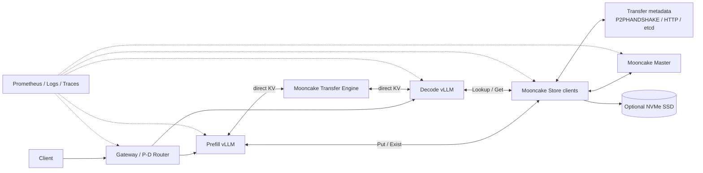
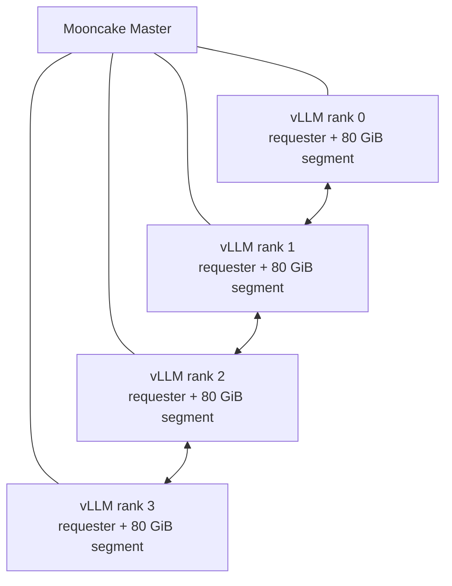
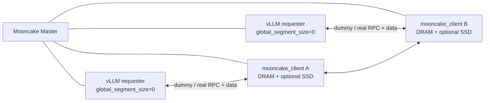
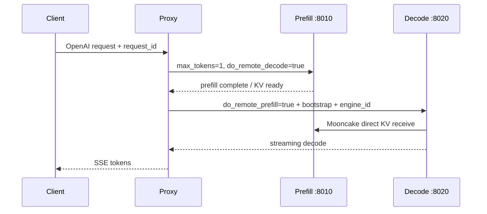
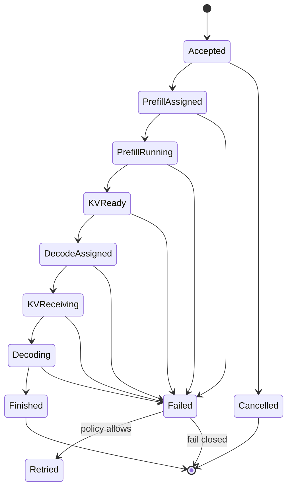

# 16. Mooncake 分布式推理存储：从 P/D KV 传输到 DRAM / SSD 共享缓存池

> **谁该读这一篇？** 已经能运行 vLLM，希望用 Mooncake 做 prefill / decode 分离、跨实例 prefix KV 共享、CPU DRAM 扩容或 NVMe 分层存储，并需要把它做成可容量规划、可观测、可压测、可回滚生产系统的推理平台工程师与 SRE。
>
> **前置阅读：** [`../02-core-concepts/03-kv-cache-management.md`](../02-core-concepts/03-kv-cache-management.md)、[`../02-core-concepts/04-prefix-caching.md`](../02-core-concepts/04-prefix-caching.md)、[`../05-distributed/02-disaggregated.md`](../05-distributed/02-disaggregated.md)、[`01-deployment-architectures.md`](01-deployment-architectures.md)、[`15-end-to-end-latency-profiling-and-optimization.md`](15-end-to-end-latency-profiling-and-optimization.md)
>
> **耗时：** 约 180 分钟；真实 RDMA、P/D 与 SSD 集群验收建议预留 2～5 天
>
> **学完能：**
>
> 1. 准确区分 `MooncakeConnector`、`MooncakeStoreConnector` 与 `MultiConnector`
> 2. 搭建 TCP 最小实验、RDMA P/D 集群、embedded DRAM 池和 standalone DRAM / SSD 池
> 3. 计算 KV 容量、传输带宽、缓存驻留时间和 SSD 写放大预算
> 4. 配置 bootstrap、Master、metadata、real client、requester 与外部 proxy / router
> 5. 用 Prometheus、日志、网络与磁盘工具定位 lookup、load、save、RDMA、SSD 和路由瓶颈
> 6. 处理 hash 不一致、端口冲突、NIC 选错、缓存污染、store 满、节点失联和 P/D 取消
> 7. 建立 benchmark 矩阵、上线门禁、证据包、灰度与回滚 Runbook

> **源码与硬件边界（2026-08-11）**
>
> 本章 vLLM 契约对照 `b23bd73f540175f9e117eaee5029cd7d8df63964` 静态复核。命令与配置覆盖该快照中的 Mooncake P2P connector、Store connector、环境变量、metrics 和示例 proxy；Mooncake 独立进程部分以 Mooncake 官方部署文档为准。当前工作区没有可用的多节点 RDMA、Mooncake Store、NVMe DirectIO 或生产 GPU 集群，因此不声称完成硬件验证，也不提供虚构的带宽、命中率或性能提升。升级 vLLM、Mooncake、RDMA 驱动或容器镜像后，必须重新跑本章契约检查和端到端验收。

---

## 1. 先划清边界：Mooncake 到底负责什么

Mooncake 在 vLLM 集成里有两类不同的数据面能力：

- **直接传输**：prefill worker 已经算出的 KV，直接传到指定 decode worker。
- **共享存储**：把 KV block 放进集群级存储池，其他兼容实例按 block key 查询和读取。

它不自动替你完成下面这些事情：

- 模型权重、tokenizer、chat template 和 LoRA artifact 的分发；
- P/D 实例发现、请求路由、负载均衡和弹性伸缩；
- 同一请求的 prefill / decode ownership、重试幂等和取消传播；
- 租户鉴权、prompt 隔离、quota、审计与数据保留策略；
- 对所有失败自动降级为本地重算且仍满足你的 SLO；
- 证明 RDMA、SSD 或共享缓存一定比本地重算快。

生产系统至少有四层：



关键点是：**Master 负责控制面元数据与放置决策，不承载 KV 数据热路径；实际数据在 client / requester 之间传输。** 因而 Master RPC 正常不等于数据面正常，Master 不可达与 RDMA 不通也要分开诊断。

---

## 2. 三种 connector，三种完全不同的语义

| 方案 | 数据去向 | 典型角色 | 解决的问题 | 不解决的问题 |
| --- | --- | --- | --- | --- |
| `MooncakeConnector` | 指定 P worker → 指定 D worker | P=`kv_producer`，D=`kv_consumer` | 一次请求的直接 P/D KV 搬运 | 跨请求共享、持久缓存池、自动路由 |
| `MooncakeStoreConnector` | vLLM ↔ 分布式 Store | standalone 常用 `kv_both`；P/D 按职责设置 | CPU/SSD offload、跨实例 prefix KV 复用 | 一次 P/D 请求的显式配对与直接传输 |
| `MultiConnector` | 同时走 direct P2P 与 Store | P/D 外层角色 + 内部 connector 列表 | P/D 直接传输并保留共享 prefix 层 | 外部 proxy、ownership、容量保护 |

### 2.1 `MooncakeConnector`：一次请求的 P2P 搬运

P 节点收到一个只做 prefill 的请求，生成 KV；D 节点收到同一个逻辑请求的 decode 阶段参数，通过 `remote_bootstrap_addr`、`remote_engine_id` 和 `transfer_id` 找到 P 端并接收 KV。

<!-- vllm-source: {"path":"vllm/distributed/kv_transfer/kv_connector/v1/mooncake/mooncake_connector.py","anchor":"class MooncakeConnector(KVConnectorBase_V1, SupportsHMA):"} -->
[源码锚点：MooncakeConnector V1 实现](https://github.com/vllm-project/vllm/blob/b23bd73f540175f9e117eaee5029cd7d8df63964/vllm/distributed/kv_transfer/kv_connector/v1/mooncake/mooncake_connector.py#L469)

这里最容易犯的错误是只启动 P 和 D，然后把普通 OpenAI 请求轮流发给它们。没有外部协调层补齐 `kv_transfer_params`，两个请求不会自动变成一次 P/D 推理。

### 2.2 `MooncakeStoreConnector`：按 block key 访问共享池

Store connector 在 scheduler 侧判断外部 prefix 命中，在 worker 侧异步 load / save KV block。它可以用于：

- 单个 vLLM 实例把热 KV 扩展到 CPU DRAM；
- 多个副本共享热门 system prompt、长文档或多轮会话前缀；
- P/D 架构中的共享 L2/L3 缓存；
- 独立大内存 / NVMe 节点承载缓存，GPU Pod 只做 requester。

<!-- vllm-source: {"path":"vllm/distributed/kv_transfer/kv_connector/v1/mooncake/store/connector.py","anchor":"class MooncakeStoreConnector(KVConnectorBase_V1, SupportsHMA):"} -->
[源码锚点：MooncakeStoreConnector V1 实现](https://github.com/vllm-project/vllm/blob/b23bd73f540175f9e117eaee5029cd7d8df63964/vllm/distributed/kv_transfer/kv_connector/v1/mooncake/store/connector.py#L87)

### 2.3 `MultiConnector`：不是二选一

`MultiConnector` 的典型组合是：

1. `MooncakeStoreConnector` 查询已经存在的共享 prefix；
2. P 节点计算未命中部分；
3. `MooncakeConnector` 把本请求新生成的 KV 直接交给 D；
4. Store connector 把可复用 block 写入共享池，供后续请求使用。

是否值得组合，取决于共享前缀比例、P/D 网络、Store load 延迟与重复 prefill 成本。不要仅凭“多一级缓存”就默认它更快。

---

## 3. 两种 Store 拓扑：embedded 与 standalone-store

### 3.1 embedded：每个 vLLM rank 都贡献内存



`global_segment_size` 是**每个 vLLM rank**贡献的容量，不是整个 Pod 或整个集群的总容量。若一个 8-rank Pod 每 rank 配 `80GB`，仅 Store segment 的目标量级就是：

$$
C_{\mathrm{pod,raw}}=8\times80\ \mathrm{GiB}=640\ \mathrm{GiB}
$$

还必须为 OS、page pinning、Transfer Engine buffer、vLLM CPU 开销与容器 runtime 留余量。不要在一台 512 GiB 主机上照抄这个配置。

优点：

- 组件少，适合先跑通；
- 数据与计算共置，可能有较好的局部性；
- 不需要额外的 resource-owning client 进程。

缺点：

- vLLM 重启会同时移除该 rank 提供的存储 segment；
- TP / DP rank 数越多，内存贡献和进程开销越容易被误算；
- GPU 节点通常不是最便宜的 DRAM / NVMe 承载位置；
- 存储扩缩容与推理扩缩容耦合。

### 3.2 standalone-store：vLLM 是 requester，外部 client 持有资源



此时 vLLM JSON 必须满足：

```json
{
  "mode": "standalone-store",
  "global_segment_size": 0,
  "local_buffer_size": "4GB"
}
```

外部 `mooncake_client` 才配置非零 `--global_segment_size`。这样缓存池可以：

- 在 vLLM rolling restart 时继续存在；
- 部署到无 GPU 的大内存 / NVMe 节点；
- 独立扩容、限额、维护和监控；
- 减少每个 vLLM rank 重复持有资源池的风险。

<!-- vllm-source: {"path":"vllm/distributed/kv_transfer/kv_connector/v1/mooncake/store/worker.py","anchor":"class MooncakeStoreConfig:"} -->
[源码锚点：embedded / standalone-store 配置校验](https://github.com/vllm-project/vllm/blob/b23bd73f540175f9e117eaee5029cd7d8df63964/vllm/distributed/kv_transfer/kv_connector/v1/mooncake/store/worker.py#L98)

启动时的 fail-closed 约束是：

- `embedded`：`global_segment_size > 0`；
- `standalone-store`：`global_segment_size == 0`；
- 两种模式：`local_buffer_size > 0`。

---

## 4. 先算账：KV 容量、带宽与收益门槛

### 4.1 每 token 的逻辑 KV 大小

对标准 attention，可用下面的逻辑大小估算未分片 KV：

$$
B_{\mathrm{token}}
=2\times L\times H_{\mathrm{kv}}\times D_{\mathrm{head}}\times S_{\mathrm{dtype}}
$$

其中：

- $2$ 表示 K 与 V；
- $L$ 是 attention layer 数；
- $H_{\mathrm{kv}}$ 是 KV head 数；
- $D_{\mathrm{head}}$ 是每个 head 的维度；
- $S_{\mathrm{dtype}}$ 是每元素字节数，例如 BF16/FP16 为 2。

一个长度为 $T$ 的前缀，逻辑 KV 大小约为：

$$
B_{\mathrm{prefix}}=T\times B_{\mathrm{token}}
$$

真实物理占用还受这些因素影响：

- TP 下 KV head 是分片还是复制；
- PP、DCP / PCP 与 hybrid KV cache group；
- block size 向上取整；
- MLA、Mamba、GDN 或 sliding-window 布局；
- KV dtype、alignment、key / metadata 与副本数；
- Store cross-layer packing 策略。

所以公式用于预算，最终以 vLLM 实际 KV cache spec、Mooncake bytes metrics 和进程 RSS / segment 指标校准。

### 4.2 block 对齐损耗

若 vLLM block size 为 $B$，长度 $T$ 需要的 block 数为：

$$
N_{\mathrm{block}}=\left\lceil\frac{T}{B}\right\rceil
$$

尾部浪费 token 数：

$$
W=N_{\mathrm{block}}\times B-T
$$

短且离散的 prefix 很多时，block 对齐与 metadata 比例会显著上升；长 prefix 通常更接近上面的线性估算。

### 4.3 传输时间的下界

对大小为 $B_{\mathrm{KV}}$ 的 KV，链路有效吞吐为 $BW_{\mathrm{eff}}$：

$$
T_{\mathrm{transfer,min}}=\frac{B_{\mathrm{KV}}}{BW_{\mathrm{eff}}}
$$

但用户看到的 load 时延还包括：

$$
T_{\mathrm{load}}
=T_{\mathrm{lookup}}+T_{\mathrm{queue}}+T_{\mathrm{alloc}}
+T_{\mathrm{transfer}}+T_{\mathrm{sync}}+T_{\mathrm{retry}}
$$

SSD 命中时再加：

$$
T_{\mathrm{SSD\ hit}}
=T_{\mathrm{disk\ queue}}+T_{\mathrm{read}}+T_{\mathrm{staging}}
+T_{\mathrm{network}}+T_{\mathrm{copy/sync}}
$$

收益判断不能只看 hit rate。对命中前缀长度桶 $k$，近似节省为：

$$
G_k=T_{\mathrm{prefill,recompute},k}-T_{\mathrm{lookup+load},k}
$$

只有 $G_k>0$ 且没有拖坏 TPOT / p99 / goodput 时，这个缓存层对该桶才有价值。

### 4.4 容量与驻留时间

设可用缓存容量为 $C_{\mathrm{usable}}$，平均每秒新写 KV 为 $R_{\mathrm{write}}$：

$$
T_{\mathrm{residence,upper}}\approx\frac{C_{\mathrm{usable}}}{R_{\mathrm{write}}}
$$

如果热门 prefix 的复用间隔大于实际驻留时间，它们会在复用前被逐出。此时“加了几 TB SSD”不一定提高 hit rate，因为写入速度、淘汰策略、热冷混合与 key 数量共同决定结果。

---

## 5. 实验 0：环境、版本与网络预检

以下命令都应在你为 vLLM 创建的 `uv` 环境内执行，不要把宿主机随机 Python 包混进生产镜像。

### 5.1 安装与导入检查

```bash
uv pip install mooncake-transfer-engine

.venv/bin/python - <<'PY'
import importlib.metadata
from mooncake.engine import TransferEngine

print("mooncake-transfer-engine:",
      importlib.metadata.version("mooncake-transfer-engine"))
print("TransferEngine:", TransferEngine)
PY
```

生产镜像要记录：

```bash
vllm --version
.venv/bin/python -m pip freeze | grep -E 'vllm|torch|mooncake'
uname -a
```

`pip freeze` 只用于取证；安装仍通过 `uv pip` 完成。

### 5.2 端口与名字解析

```bash
getent hosts mooncake-master
getent hosts prefill-0
getent hosts decode-0

ss -lntp | grep -E ':50051|:50052|:8998|:9003|:9300'
nc -vz mooncake-master 50051
```

至少规划：

| 端口 | 组件 | 注意事项 |
| --- | --- | --- |
| `50051` | Mooncake Master RPC | 默认值；生产按网络策略限制来源 |
| `50052` | `mooncake_client` RPC | 默认值；同宿主多实例必须改端口 |
| `8998` | P 端 bootstrap | 每个同宿主实例唯一；不同宿主可复用 |
| `9003` | Master metrics | 默认 metrics 端口 |
| `9300` | real client health / metrics | 显式启用后才存在 |
| `8010/8020/8000` | P / D / proxy 示例 | 按实际服务规划 |

### 5.3 RDMA 预检

```bash
ibv_devices
ibv_devinfo -v
rdma link show
ip -br addr
ethtool -i eth0
nvidia-smi topo -m
```

若使用 RoCE，还要由网络团队核对：

- MTU、PFC / ECN 与交换机 buffer；
- NIC、GPU、NUMA、PCIe root complex 的亲和性；
- 容器是否暴露 `/dev/infiniband`；
- memlock、IOMMU、GID index 与防火墙；
- 多 NIC 是否选中了同一 fabric，而不是管理网。

```bash
ulimit -l
cat /proc/self/limits | grep -i locked
numactl --hardware
```

先用 TCP 跑通功能，再切 RDMA。TCP 成功但 RDMA 失败，通常说明业务协议和 key 流程基本正确，应集中检查设备、权限、路由和注册内存。

---

## 6. 实验 1：`MooncakeConnector` 单机双 GPU P/D 最小闭环

### 6.1 架构



### 6.2 启动 P

```bash
export MODEL=Qwen/Qwen2.5-7B-Instruct
export PYTHONHASHSEED=0

CUDA_VISIBLE_DEVICES=0 \
VLLM_MOONCAKE_BOOTSTRAP_PORT=8998 \
VLLM_MOONCAKE_ABORT_REQUEST_TIMEOUT=480 \
vllm serve "$MODEL" \
  --host 0.0.0.0 \
  --port 8010 \
  --kv-transfer-config '{
    "kv_connector": "MooncakeConnector",
    "kv_role": "kv_producer",
    "kv_connector_extra_config": {
      "num_workers": 10,
      "mooncake_protocol": "tcp",
      "device_name": ""
    }
  }'
```

### 6.3 启动 D

```bash
export MODEL=Qwen/Qwen2.5-7B-Instruct
export PYTHONHASHSEED=0

CUDA_VISIBLE_DEVICES=1 \
vllm serve "$MODEL" \
  --host 0.0.0.0 \
  --port 8020 \
  --kv-transfer-config '{
    "kv_connector": "MooncakeConnector",
    "kv_role": "kv_consumer",
    "kv_connector_extra_config": {
      "num_workers": 10,
      "mooncake_protocol": "tcp",
      "device_name": ""
    }
  }'
```

### 6.4 启动示例 proxy

从 vLLM 源码仓库执行：

```bash
.venv/bin/python \
  examples/disaggregated/mooncake_connector/mooncake_connector_proxy.py \
  --prefill http://127.0.0.1:8010 8998 \
  --decode http://127.0.0.1:8020 \
  --port 8000
```

也可以直接运行上游脚本进行双 GPU 示例：

```bash
MODEL=Qwen/Qwen2.5-7B-Instruct \
PREFILL_GPUS=0 \
DECODE_GPUS=1 \
PREFILL_PORTS=8010 \
BOOTSTRAP_PORTS=8998 \
DECODE_PORTS=8020 \
PROXY_PORT=8000 \
bash examples/disaggregated/mooncake_connector/run_mooncake_connector.sh
```

示例脚本和 proxy 是教学骨架，不是现成生产网关。生产前至少补：鉴权、限流、请求体上限、健康状态、超时预算、重试幂等、取消、熔断、P/D 独立负载评分和一致 request ID。

### 6.5 发请求与验收

```bash
curl -N http://127.0.0.1:8000/v1/chat/completions \
  -H 'Content-Type: application/json' \
  -H 'Authorization: Bearer test-key' \
  -H 'X-Request-Id: mooncake-pd-001' \
  -d '{
    "model": "Qwen/Qwen2.5-7B-Instruct",
    "messages": [{"role": "user", "content": "解释 PagedAttention"}],
    "max_tokens": 64,
    "temperature": 0,
    "stream": true
  }'
```

同时观察：

```bash
curl -s http://127.0.0.1:8010/metrics | grep -i mooncake
curl -s http://127.0.0.1:8020/metrics | grep -i mooncake
ss -ntp | grep -E ':8998|:8010|:8020'
```

通过标准不是“HTTP 200”而是：

- P 只生成最小输出用于完成 prefill 协议；
- D 返回最终 streaming 输出；
- P/D 日志能用同一 `request_id` / `transfer_id` 关联；
- 中止客户端后，P 侧 block 在超时或显式通知后被释放；
- D 不可达、bootstrap 不可达、P 进程重启时均有确定错误与资源回收。

<!-- vllm-source: {"path":"examples/disaggregated/mooncake_connector/mooncake_connector_proxy.py","anchor":"async def send_request_to_service("} -->
[源码锚点：示例 proxy 组织 P/D 请求](https://github.com/vllm-project/vllm/blob/b23bd73f540175f9e117eaee5029cd7d8df63964/examples/disaggregated/mooncake_connector/mooncake_connector_proxy.py#L250)

---

## 7. 实验 2：`MooncakeStoreConnector` embedded DRAM 池

### 7.1 启动 Master

开发环境使用 P2P handshake 时：

```bash
mooncake_master --port 50051
```

另一个终端检查：

```bash
curl -fsS http://127.0.0.1:9003/metrics/summary
curl -fsS http://127.0.0.1:9003/metrics | head
```

### 7.2 创建 requester / segment 配置

`/etc/vllm/mooncake-embedded.json`：

```json
{
  "mode": "embedded",
  "metadata_server": "P2PHANDSHAKE",
  "master_server_address": "127.0.0.1:50051",
  "global_segment_size": "80GB",
  "local_buffer_size": "4GB",
  "protocol": "tcp",
  "device_name": "",
  "enable_offload": false
}
```

第一次实验不要直接用 `80GB`。按宿主内存先改成 `4GB` 或更小，确认每 rank 乘法后仍有安全余量。

### 7.3 启动 vLLM

```bash
export PYTHONHASHSEED=0
export MOONCAKE_CONFIG_PATH=/etc/vllm/mooncake-embedded.json

vllm serve meta-llama/Llama-3.1-8B-Instruct \
  --port 8000 \
  --enable-prefix-caching \
  --kv-transfer-config '{
    "kv_connector": "MooncakeStoreConnector",
    "kv_role": "kv_both",
    "kv_connector_extra_config": {
      "load_async": true,
      "lookup_async": false,
      "enable_cross_layers_blocks": false,
      "lookup_rpc_port": 0,
      "cache_prefix": "prod-llama31-8b-r1"
    }
  }'
```

### 7.4 用重复长前缀验证外部命中

请求 A 与 B 必须有完全相同的长前缀，后缀不同：

```bash
curl -s http://127.0.0.1:8000/v1/completions \
  -H 'Content-Type: application/json' \
  -d @request-a.json > response-a.json

curl -s http://127.0.0.1:8000/v1/completions \
  -H 'Content-Type: application/json' \
  -d @request-b.json > response-b.json

curl -s http://127.0.0.1:8000/metrics \
  | grep -E 'external_prefix_cache|mooncake_store'
```

严格控制：

- model revision、tokenizer、chat template、LoRA 和 KV dtype 相同；
- 首次请求完成 Store save 后再发第二次；
- 不要把 vLLM 本地 L1 命中误认成 Mooncake 外部命中；
- 对照实验清空或隔离本地 cache，或跨两个副本发相同 prefix；
- 同时记录 `cached_tokens`、TTFT、lookup/load 时间和 transferred bytes。

---

## 8. 实验 3：standalone DRAM Store

### 8.1 Master 使用 HTTP metadata

长生命周期集群可把 Transfer Engine metadata 显式服务化：

```bash
mooncake_master \
  --rpc_port=50051 \
  --enable_http_metadata_server=true \
  --http_metadata_server_host=0.0.0.0 \
  --http_metadata_server_port=8080 \
  --enable_metadata_cleanup_on_timeout=true \
  --metrics_port=9003
```

### 8.2 启动 resource-owning client

先用 TCP：

```bash
mooncake_client \
  --host=10.0.10.21 \
  --port=50052 \
  --global_segment_size=256GB \
  --master_server_address=10.0.10.10:50051 \
  --metadata_server=http://10.0.10.10:8080/metadata \
  --protocol=tcp \
  --threads=4 \
  --tenant_id=default \
  --enable_http_server=true \
  --http_port=9300
```

验收：

```bash
curl -fsS http://10.0.10.21:9300/health
curl -fsS http://10.0.10.21:9300/metrics/summary
curl -fsS http://10.0.10.10:9003/metrics/summary
```

### 8.3 vLLM requester 配置

`/etc/vllm/mooncake-standalone.json`：

```json
{
  "mode": "standalone-store",
  "metadata_server": "http://10.0.10.10:8080/metadata",
  "master_server_address": "10.0.10.10:50051",
  "global_segment_size": 0,
  "local_buffer_size": "4GB",
  "protocol": "tcp",
  "device_name": "",
  "enable_offload": false
}
```

启动 requester：

```bash
export PYTHONHASHSEED=0
export MOONCAKE_CONFIG_PATH=/etc/vllm/mooncake-standalone.json
export MOONCAKE_PREFERRED_SEGMENT=10.0.10.21:50052
export MOONCAKE_REQUESTER_LOCAL_HOSTNAME=gpu-a-01

vllm serve meta-llama/Llama-3.1-8B-Instruct \
  --port 8000 \
  --enable-prefix-caching \
  --kv-transfer-config '{
    "kv_connector": "MooncakeStoreConnector",
    "kv_role": "kv_both",
    "kv_connector_extra_config": {
      "load_async": true,
      "lookup_async": true,
      "cache_prefix": "prod-llama31-8b-r1"
    }
  }'
```

`MOONCAKE_PREFERRED_SEGMENT` 是放置偏好，不应被当成“永远只访问本机”的强一致保证。设置值必须与 real client 对外注册的 segment 地址一致；容器中不要填 `127.0.0.1`，除非 requester 与 owner 确实共享同一网络命名空间。

---

## 9. 实验 4：standalone DRAM + SSD 分层存储

SSD offload 要同时对齐三处开关：

1. Master：`--enable_offload=true`；
2. resource-owning `mooncake_client`：`--enable_offload=true`，并设置 SSD 目录；
3. vLLM JSON：`"enable_offload": true`。

缺任意一个，都不能把“进程 Ready”当成端到端 SSD offload 已生效。

### 9.1 准备 SSD

```bash
lsblk -o NAME,SIZE,TYPE,FSTYPE,MOUNTPOINT
findmnt /data/mooncake-offload
df -h /data/mooncake-offload
df -i /data/mooncake-offload
fio --name=mooncake-preflight \
  --filename=/data/mooncake-offload/fio.test \
  --rw=randrw --rwmixread=70 --bs=1M --iodepth=32 \
  --direct=1 --size=8G --runtime=60 --time_based --group_reporting
```

`fio` 会产生真实 I/O，只能在专用测试路径和变更窗口运行。不要在已有缓存文件目录里随意压测或删除文件。

### 9.2 启动 Master

```bash
mooncake_master \
  --rpc_port=50051 \
  --enable_http_metadata_server=true \
  --http_metadata_server_port=8080 \
  --enable_metadata_cleanup_on_timeout=true \
  --enable_offload=true \
  --offload_on_evict=true \
  --promotion_on_hit=true \
  --promotion_admission_threshold=2 \
  --metrics_port=9003
```

不要把旧的 `--root_fs_dir` 与这条 SSD offload 路径混用。

### 9.3 启动 owner client

```bash
export MOONCAKE_OFFLOAD_FILE_STORAGE_PATH=/data/mooncake-offload
export MC_STORE_CLIENT_METRIC=1

mooncake_client \
  --host=10.0.10.21 \
  --port=50052 \
  --global_segment_size=256GB \
  --master_server_address=10.0.10.10:50051 \
  --metadata_server=http://10.0.10.10:8080/metadata \
  --protocol=rdma \
  --device_names=mlx5_0 \
  --threads=8 \
  --enable_offload=true \
  --start_offload_rpc_server=true \
  --enable_http_server=true \
  --http_port=9300
```

### 9.4 vLLM SSD requester 配置

```json
{
  "mode": "standalone-store",
  "metadata_server": "http://10.0.10.10:8080/metadata",
  "master_server_address": "10.0.10.10:50051",
  "global_segment_size": 0,
  "local_buffer_size": "4GB",
  "protocol": "rdma",
  "device_name": "mlx5_0",
  "enable_offload": true
}
```

```bash
export PYTHONHASHSEED=0
export MOONCAKE_CONFIG_PATH=/etc/vllm/mooncake-ssd-requester.json
export MOONCAKE_PREFERRED_SEGMENT=10.0.10.21:50052
export VLLM_MOONCAKE_STORE_TIER_LOG=1
export VLLM_MOONCAKE_LOAD_RECV_THREADS=2
export VLLM_MOONCAKE_DISK_STAGING_USABLE_RATIO=0.90
```

`VLLM_MOONCAKE_DISK_STAGING_USABLE_RATIO` 控制一次批量读取可使用 owner DirectIO staging buffer 的比例。值更低更保守、子批次更多；值更高减少 round trip，但更接近 buffer 极限。先用默认值，只有拿到 oversize、staging pressure 与端到端 profile 证据后再调整。

### 9.5 SSD 真验收

写入足够多的长 prefix，使 DRAM 层发生压力，再检查：

```bash
watch -n 2 'du -sh /data/mooncake-offload; df -h /data/mooncake-offload'
iostat -xz 1
pidstat -dru -p "$(pgrep -n mooncake_client)" 1
curl -s http://10.0.10.21:9300/metrics
curl -s http://10.0.10.10:9003/metrics
```

然后重放已写入且从 DRAM 逐出的 prefix，证明：

- owner SSD 目录实际增长；
- 日志或 metrics 显示 disk tier 命中；
- `load_get` bytes 与请求命中长度相符；
- 输出 token 与无缓存基线一致；
- SSD load 没有把 TTFT p99 推过 SLO；
- disk queue、await、CPU、网络和 staging 均未饱和。

---

## 10. 实验 5：`MultiConnector` 做 P/D + 共享 prefix

### 10.1 P 节点

```bash
PYTHONHASHSEED=0 \
MOONCAKE_CONFIG_PATH=/etc/vllm/mooncake-standalone.json \
MOONCAKE_PREFERRED_SEGMENT=10.0.10.21:50052 \
VLLM_MOONCAKE_BOOTSTRAP_PORT=50060 \
vllm serve meta-llama/Llama-3.1-8B-Instruct \
  --host 0.0.0.0 \
  --port 8100 \
  --enable-prefix-caching \
  --kv-transfer-config '{
    "kv_connector": "MultiConnector",
    "kv_role": "kv_producer",
    "kv_connector_extra_config": {
      "connectors": [
        {
          "kv_connector": "MooncakeConnector",
          "kv_role": "kv_producer",
          "kv_connector_extra_config": {
            "num_workers": 10,
            "mooncake_protocol": "rdma",
            "device_name": "mlx5_0"
          }
        },
        {
          "kv_connector": "MooncakeStoreConnector",
          "kv_role": "kv_both",
          "kv_connector_extra_config": {
            "load_async": true,
            "lookup_async": true,
            "cache_prefix": "prod-llama31-8b-r1"
          }
        }
      ]
    }
  }'
```

### 10.2 D 节点

```bash
PYTHONHASHSEED=0 \
MOONCAKE_CONFIG_PATH=/etc/vllm/mooncake-standalone.json \
MOONCAKE_PREFERRED_SEGMENT=10.0.10.22:50052 \
vllm serve meta-llama/Llama-3.1-8B-Instruct \
  --host 0.0.0.0 \
  --port 8200 \
  --enable-prefix-caching \
  --kv-transfer-config '{
    "kv_connector": "MultiConnector",
    "kv_role": "kv_consumer",
    "kv_connector_extra_config": {
      "connectors": [
        {
          "kv_connector": "MooncakeConnector",
          "kv_role": "kv_consumer",
          "kv_connector_extra_config": {
            "num_workers": 10,
            "mooncake_protocol": "rdma",
            "device_name": "mlx5_0"
          }
        },
        {
          "kv_connector": "MooncakeStoreConnector",
          "kv_role": "kv_consumer",
          "kv_connector_extra_config": {
            "load_async": true,
            "lookup_async": true,
            "cache_prefix": "prod-llama31-8b-r1"
          }
        }
      ]
    }
  }'
```

### 10.3 为什么 P 用 `kv_both`，D 常用 `kv_consumer`

P 需要先从 Store 读取已有 prefix，再把新算出的 KV 保存回 Store，所以内层 Store connector 常用 `kv_both`。D 的主要职责是消费 P2P KV 与共享 cache，示例用 `kv_consumer`。实际角色必须与数据生命周期设计一致，不要仅复制外层角色。

### 10.4 组合架构的四组对照

| 组 | Direct P2P | Shared Store | 回答的问题 |
| --- | --- | --- | --- |
| A | 关 | 关 | 本地重算基线 |
| B | 开 | 关 | P/D 直接搬运收益与代价 |
| C | 关 | 开 | 共享 prefix 的独立收益 |
| D | 开 | 开 | 组合后是否有叠加收益或资源争用 |

每组必须固定模型、输入/输出长度、到达率、P:D 比例、网络和 warmup。只比较 D 与 A 无法知道收益来自 P/D 还是共享 prefix。

---

## 11. 配置参考：哪些参数属于谁

### 11.1 vLLM Store JSON

| 字段 | 含义 | 生产检查 |
| --- | --- | --- |
| `mode` | `embedded` / `standalone-store` | 与 segment owner 拓扑匹配 |
| `metadata_server` | `P2PHANDSHAKE`、HTTP 或 etcd 地址 | 所有节点可达且写法一致 |
| `master_server_address` | Master `host:port`，HA 时按 Mooncake 契约填写 | 不要误填 metrics 地址 |
| `global_segment_size` | embedded 每 rank 贡献量；standalone 必须为 0 | 乘 rank 数后做宿主容量校验 |
| `local_buffer_size` | requester 私有操作 buffer | 必须大于 0；计入 RSS / pinned memory |
| `protocol` | `tcp` / `rdma` 等 | 与 NIC、容器设备、client 一致 |
| `device_name` | vLLM 集成侧设备名 | TCP 留空；RDMA 显式核对 |
| `enable_offload` | vLLM 是否启用 SSD staging 路径 | 与 Master / owner client 三方一致 |

### 11.2 Store connector extra config

| 参数 | 默认 | 作用 | 调整条件 |
| --- | --- | --- | --- |
| `load_async` | `true` | load 与 compute 重叠 | 一般保留；关闭只用于定位 |
| `lookup_async` | `false` | lookup 放后台线程，request 等完成后恢复 | lookup 阻塞 scheduler 时 A/B |
| `enable_cross_layers_blocks` | `false` | 跨 layer 打包，减少 Store 操作数 | 先验证模型 / cache group 兼容与正确性 |
| `lookup_rpc_port` | `0` | 影响本机 ZMQ IPC path 命名 | 同宿主多实例冲突时显式区分 |
| `cache_prefix` | `""` | Store key namespace | 每个不兼容 deployment 使用独立值 |

### 11.3 P2P connector extra config

| 参数 | 默认 | 作用 |
| --- | --- | --- |
| `num_workers` | `10` | 每个 prefiller worker 的传输线程池大小 |
| `mooncake_protocol` | `rdma` | P2P Transfer Engine 协议 |
| `device_name` | 空 | 指定传输设备 |

### 11.4 vLLM 环境变量

<!-- vllm-source: {"path":"vllm/envs.py","anchor":"VLLM_MOONCAKE_BOOTSTRAP_PORT: int = 8998"} -->
[源码锚点：Mooncake 相关环境变量声明](https://github.com/vllm-project/vllm/blob/b23bd73f540175f9e117eaee5029cd7d8df63964/vllm/envs.py#L213)

| 变量 | 默认 | 作用 |
| --- | --- | --- |
| `MOONCAKE_CONFIG_PATH` | 必填于 Store connector | vLLM Store JSON 路径 |
| `VLLM_MOONCAKE_BOOTSTRAP_PORT` | `8998` | P 端 bootstrap 基础端口 |
| `VLLM_MOONCAKE_ABORT_REQUEST_TIMEOUT` | `480` 秒 | 异常请求的 P 端 KV 最终释放超时 |
| `MOONCAKE_PREFERRED_SEGMENT` | 空 | standalone owner segment 偏好 |
| `MOONCAKE_REQUESTER_LOCAL_HOSTNAME` | 自动解析 IP | requester 注册身份覆盖 |
| `VLLM_MOONCAKE_STORE_TIER_LOG` | false | 输出 memory / disk tier 批次日志 |
| `VLLM_MOONCAKE_LOAD_RECV_THREADS` | `1` | Store load 接收线程数 |
| `VLLM_MOONCAKE_DISK_STAGING_USABLE_RATIO` | `0.9` | staging buffer 单批可用比例 |

### 11.5 三套同名但不同层的配置

不要混淆：

- vLLM JSON 使用 `master_server_address`、`device_name`；
- Mooncake Python `setup()` 使用 `master_server_addr`、`rdma_devices`；
- `mooncake_client` CLI 使用 `--master_server_address`、`--device_names`。

把其中一套字段名复制到另一套，可能不会按预期生效。启动日志与 `--help` 必须进入发布证据包。

---

## 12. Hash、namespace 与兼容性：命中率为 0 的第一嫌疑

### 12.1 固定 `PYTHONHASHSEED`

所有共享同一 Store 的 vLLM 进程必须使用相同固定值：

```bash
export PYTHONHASHSEED=0
```

包括：

- 不同 DP rank；
- 不同 Pod / host；
- P 与 D 集群；
- canary 与 stable 中确实打算共享缓存的实例。

如果每个 Python 进程使用随机 hash seed，同一 token prefix 可能生成不同 block hash，表现就是“Put 成功、Store 有数据，但另一个进程永远 lookup miss”。

### 12.2 `cache_prefix` 是兼容性防火墙

推荐按下面字段生成 namespace，而不是永远使用空字符串：

```text
<env>-<tenant/security-domain>-<model>-<revision>-<tokenizer>-<kv-layout>-<schema-version>
```

例如：

```text
prod-public-llama31-8b-r20260811-bf16-bs16-v1
```

以下任一变化都应评估是否切新 namespace：

- model checkpoint / revision；
- tokenizer、chat template 或 prompt canonicalization；
- KV dtype、block size、attention / hybrid layout；
- TP / PP / cache group 产生的 key 语义变化；
- LoRA 或会改变隐状态的 adapter；
- 多租户安全域和数据保留策略。

### 12.3 不要用 namespace 代替安全隔离

`cache_prefix` 主要避免 key 冲突和误命中，不是鉴权机制。敏感租户仍需独立网络、Master / Store、密钥、配额、审计和清理策略。任何允许跨租户共享 KV 的设计都要经过明确的安全评审。

---

## 13. P/D 路由与请求 ownership

### 13.1 每个请求的最小状态机



Router 至少持有：

| 字段 | 用途 |
| --- | --- |
| `request_id` | 全链路日志、trace 与幂等键 |
| `transfer_id` | P/D KV 配对，不能跨请求复用 |
| P endpoint / engine ID / bootstrap | D 找到正确生产者 |
| D endpoint | streaming ownership |
| model / revision / tokenizer | 阻止不兼容配对 |
| TP / PP / KV layout 指纹 | 阻止不可传输组合 |
| deadline / cancel state | 资源回收与超时 |
| retry generation | 防止迟到响应污染新尝试 |

### 13.2 超时预算必须分层

不要只设置一个 480 秒总超时：

```text
client deadline
  ├─ gateway queue budget
  ├─ prefill queue + compute budget
  ├─ bootstrap / transfer setup budget
  ├─ KV transfer budget
  ├─ decode queue + generation budget
  └─ cleanup grace period
```

`VLLM_MOONCAKE_ABORT_REQUEST_TIMEOUT` 是 P 端避免 KV 永久占用的最终保险，不是客户端 SLO。它过短会误清理正常长请求，过长会在 D 失败后长期占 block。应以最长合法 prefill + transfer + 故障检测时间为基线，通过 fault injection 校准。

### 13.3 重试规则

- P 尚未开始：可以换 P，复用同一业务 request ID，生成新的 attempt / transfer ID。
- P 已计算但 D 未接收：可按 connector 状态重试 transfer，必须防止重复释放。
- D 已开始输出：默认不要透明重试，否则客户端可能收到重复 token。
- Store lookup miss：通常可本地重算，不等于请求失败。
- Store load 返回部分 key 失败：必须按 connector 语义回退或失败，不能把部分 KV 当完整 KV 使用。

---

## 14. RDMA 与多 NIC 上线流程

### 14.1 从 TCP 到 RDMA 的单变量迁移

1. TCP 下完成正确性、P/D 取消和 Store hit 验收。
2. 固定负载，保存 TCP baseline。
3. 只把 protocol 改为 `rdma`，显式指定一张 NIC。
4. 验证功能与输出一致。
5. 再测试多 NIC、线程数与 affinity。

### 14.2 设备选择

```bash
ibdev2netdev
rdma link show
cat /sys/class/infiniband/mlx5_0/device/numa_node
cat /sys/class/drm/card0/device/numa_node
lspci -tv
```

若 Mooncake 官方版本支持自动发现，可用低层环境变量控制：

```bash
export MC_MS_AUTO_DISC=1
export MC_MS_FILTERS=mlx5_0,mlx5_2
```

自动发现仍需验收日志；“发现了设备”不代表选到了离 GPU 最近、属于正确 VLAN / fabric 的设备。

### 14.3 数据面验证

```bash
sar -n DEV 1
ethtool -S eth0 | grep -Ei 'drop|err|ecn|pause|pfc'
perf stat -p "$(pgrep -n vllm)" -e cycles,instructions,context-switches -a sleep 30
```

结合 fabric 侧 telemetry 检查：

- retransmit、timeout、packet drop；
- PFC pause storm、ECN mark；
- NIC 单口打满而其他口空闲；
- CPU softirq / progress thread 饱和；
- GPU 等待网络或 host staging；
- NUMA remote access。

---

## 15. 可观测性：从一个慢请求下钻到 Store 操作

### 15.1 vLLM 暴露的 Mooncake Store metrics

<!-- vllm-source: {"path":"vllm/distributed/kv_transfer/kv_connector/v1/mooncake/store/metrics.py","anchor":"class MooncakeStorePromMetrics(KVConnectorPromMetrics):"} -->
[源码锚点：Mooncake Store Prometheus metrics](https://github.com/vllm-project/vllm/blob/b23bd73f540175f9e117eaee5029cd7d8df63964/vllm/distributed/kv_transfer/kv_connector/v1/mooncake/store/metrics.py#L101)

- `vllm:mooncake_store_operation_time_seconds`
- `vllm:mooncake_store_operation_total`
- `vllm:mooncake_store_operation_keys_total`
- `vllm:mooncake_store_operation_bytes_total`
- `vllm:mooncake_store_operation_failed_keys_total`

额外 label 包括 `operation` 与 `status`。当前 operation 语义包括：

- `save_exists`：写入前检查 key 是否已存在；
- `save_put`：保存缺失 KV；
- `load_get`：加载 KV；
- `lookup_exists`：scheduler 外部 prefix 查询。

### 15.2 PromQL

```promql
# 各操作 5 分钟调用率
sum by (operation, status) (
  rate(vllm:mooncake_store_operation_total[5m])
)
```

```promql
# load_get p99
histogram_quantile(
  0.99,
  sum by (le) (
    rate(vllm:mooncake_store_operation_time_seconds_bucket{
      operation="load_get"
    }[5m])
  )
)
```

```promql
# 成功 load 的有效吞吐；按部署 label 再分组
sum(rate(vllm:mooncake_store_operation_bytes_total{
  operation="load_get",status="ok"
}[5m]))
```

```promql
# 每次成功 load 的平均 bytes，避免只看 calls
sum(rate(vllm:mooncake_store_operation_bytes_total{
  operation="load_get",status="ok"
}[5m]))
/
clamp_min(
  sum(rate(vllm:mooncake_store_operation_total{
    operation="load_get",status="ok"
  }[5m])),
  1e-9
)
```

```promql
# failed key 比例
sum(rate(vllm:mooncake_store_operation_failed_keys_total[5m]))
/
clamp_min(
  sum(rate(vllm:mooncake_store_operation_keys_total[5m])),
  1e-9
)
```

```promql
# 外部 prefix token 命中率；先核对本版本 metric labels
sum(rate(vllm:external_prefix_cache_hits[5m]))
/
clamp_min(sum(rate(vllm:external_prefix_cache_queries[5m])), 1e-9)
```

### 15.3 推荐告警

告警阈值必须由 baseline 与 SLO 校准，下面只给结构：

```yaml
groups:
  - name: mooncake-store
    rules:
      - alert: MooncakeStoreFailedKeys
        expr: |
          sum(rate(vllm:mooncake_store_operation_failed_keys_total[5m])) > 0
        for: 5m
        labels:
          severity: warning
        annotations:
          summary: "Mooncake Store 出现失败 key"

      - alert: MooncakeStoreLoadP99High
        expr: |
          histogram_quantile(
            0.99,
            sum by (le, cluster) (
              rate(vllm:mooncake_store_operation_time_seconds_bucket{
                operation="load_get"
              }[5m])
            )
          ) > <LOAD_P99_SECONDS>
        for: 10m
        labels:
          severity: warning

      - alert: MooncakeMasterDown
        expr: up{job="mooncake-master"} == 0
        for: 1m
        labels:
          severity: critical

      - alert: MooncakeOwnerClientDown
        expr: up{job="mooncake-client"} == 0
        for: 1m
        labels:
          severity: critical
```

### 15.4 一张图不够

Dashboard 至少分五排：

1. 用户 SLO：TTFT、TPOT、E2E、goodput、错误率；
2. vLLM：waiting/running、KV usage、preemption、prefix query/hit；
3. Store：lookup/load/save p50/p99、keys、bytes、failed keys；
4. Mooncake：Master / client health、segment 容量、淘汰、offload / promotion；
5. 系统：NIC、RDMA、CPU、RSS、pinned memory、NVMe IOPS/BW/await/space/inode。

只有 Store bytes 上升但 TTFT 不降，可能是加载比重算慢；只有 hit rate 高但 goodput 下降，可能是 load 占用了网络、CPU 或 GPU 等待窗口。

---

## 16. 工业级分析流程：一次慢请求怎么查

### 阶段 A：先证明是不是 Mooncake 路径

```bash
curl -s http://vllm-pod:8000/metrics > /tmp/vllm.metrics
curl -s http://mooncake-master:9003/metrics > /tmp/master.metrics
curl -s http://mooncake-client:9300/metrics > /tmp/client.metrics
```

对同一 request ID 确认：

- 是否发生 external lookup；
- lookup 是 hit 还是 miss；
- 是否调用 `load_get`，keys / bytes 多大；
- 命中来自 DRAM 还是 disk；
- 是否走 P2P transfer；
- 慢在 lookup、queue、load、decode 还是客户端。

### 阶段 B：把延迟拆开

```text
client TTFT
  - gateway / proxy 时间
  - vLLM queue
  - Store lookup
  - Store load 或 P/D transfer
  - remaining prefill
  - first decode step
```

常见判断：

| 现象 | 首要假设 | 下一步证据 |
| --- | --- | --- |
| lookup p99 高，bytes 近 0 | Master / metadata / RPC 拥塞 | Master CPU、RPC queue、网络 RTT |
| lookup 快，load p99 高 | 数据面、owner、RDMA 或 SSD | tier log、NIC、disk await、client threads |
| load 快，TTFT 仍高 | queue、剩余 prefill、同步或 gateway | vLLM request metrics / trace |
| calls 高、每次 bytes 很小 | block 太碎、批处理差 | keys/call、bytes/call、cross-layer A/B |
| bytes 高、有效 GB/s 低 | NIC/NUMA/线程/协议 | TCP vs RDMA、topology、CPU profile |
| Store hit 高、TPOT 变差 | 资源争用 | decode NIC、CPU、GPU timeline |
| save_put error 上升 | pool 满、owner 失联或 offload 跟不上 | capacity、eviction、client / disk health |

### 阶段 C：系统命令

```bash
pidstat -druwt -p "$(pgrep -n -f 'vllm serve')" 1
pidstat -druwt -p "$(pgrep -n mooncake_client)" 1
iostat -xz 1
sar -n DEV,TCP,ETCP 1
ss -s
vmstat 1
numastat -p "$(pgrep -n mooncake_client)"
```

### 阶段 D：profile，但只抓稳定小窗口

流程与上一章一致：metrics 定方向 → request trace → CPU / device timeline → network / disk counter。不要直接对整个生产集群跑无限时长 profiler。

```bash
py-spy record \
  --pid "$(pgrep -n -f 'vllm serve')" \
  --duration 30 \
  --output /tmp/vllm-mooncake.svg

perf record -F 99 -g \
  -p "$(pgrep -n mooncake_client)" \
  -- sleep 30
perf report
```

`py-spy` / `perf` 需要相应权限；先在隔离 canary 验证开销和安全策略。

### 阶段 E：形成可证伪结论

一个合格结论应类似：

```text
8K～16K 重复前缀桶中，lookup p99 稳定，但 disk-tier load_get p99 与
NVMe await 同步上升；DRAM-only 对照不复现，网络未饱和。因此瓶颈在
owner SSD 读队列，而不是 vLLM scheduler 或 RDMA。下一实验只调整 owner
数量 / SSD 队列与热数据 promotion，回滚条件是 TTFT p99 或错误率恶化。
```

“Mooncake 慢”“RDMA 有问题”“缓存没效果”都不算完成归因。

---

## 17. Benchmark 矩阵与证据包

### 17.1 必须覆盖的变量

| 维度 | 建议桶 |
| --- | --- |
| prefix 长度 | 0、1K、8K、32K、128K |
| 共享比例 | 0%、25%、50%、90%、100% |
| Store 状态 | cold、DRAM hit、SSD hit、mixed |
| 请求到达 | concurrency 与 open-loop rate 两套 |
| connector | none、P2P、Store、Multi |
| protocol | TCP baseline、RDMA |
| 故障 | Master、owner、P、D、NIC、SSD slow/full |
| 扩缩容 | cold add、warm add、drain、restart |

### 17.2 vLLM benchmark 示例

```bash
vllm bench serve \
  --backend openai \
  --base-url http://router:8000 \
  --endpoint /v1/completions \
  --model meta-llama/Llama-3.1-8B-Instruct \
  --dataset-name random \
  --random-input-len 8192 \
  --random-output-len 256 \
  --num-prompts 1000 \
  --request-rate 8 \
  --seed 42 \
  --save-result \
  --result-dir results/mooncake
```

随机 token 用于固定 shape，不代表真实 prefix 命中。共享缓存实验要准备可审计的重复 prefix 数据集，并保证后缀和请求到达分布接近生产。

### 17.3 每轮保存

```text
evidence/<timestamp>/
├── experiment.yaml
├── image-digests.txt
├── vllm-version.txt
├── mooncake-version.txt
├── configs/
├── commands/
├── metrics-before/
├── metrics-after/
├── logs/
├── benchmark/
├── profiles/
├── correctness/
└── decision.md
```

`experiment.yaml` 至少写：

- 模型、tokenizer、模板、revision；
- vLLM / Mooncake / torch / driver / OFED；
- P/D/Store 拓扑、TP/PP/DP、NIC 与 SSD；
- 所有 connector JSON 和环境变量；
- 输入/输出/prefix 分布与 seed；
- warmup、稳态时间、开始结束时间；
- SLO、正确性、停止与回滚条件。

### 17.4 决策指标

同时报告：

- external prefix token hit rate；
- DRAM / SSD tier hit rate；
- lookup/load/save p50/p95/p99；
- load/save GB/s、keys/s、bytes/call；
- TTFT、TPOT、ITL、E2E 与 SLO goodput；
- GPU-seconds/request、CPU、DRAM、NVMe 与网络成本；
- 错误、fallback、retry、failed key 与 cache pollution。

---

## 18. 故障排查 Runbook

### 18.1 启动时报 `MOONCAKE_CONFIG_PATH` 未设置

```bash
printenv MOONCAKE_CONFIG_PATH
test -r "$MOONCAKE_CONFIG_PATH"
jq . "$MOONCAKE_CONFIG_PATH"
```

检查 systemd / Kubernetes 是否真的把变量注入 vLLM worker，而不是只注入 launcher。

### 18.2 embedded / standalone 配置冲突

症状：启动直接报 `global_segment_size` 约束错误。

处理：

- embedded 改为非零；
- standalone requester 改为 0；
- 资源容量放到外部 `mooncake_client --global_segment_size`；
- `local_buffer_size` 保持大于 0。

### 18.3 Put 成功但跨进程永远 miss

依次检查：

```bash
for host in prefill-0 prefill-1 decode-0; do
  ssh "$host" 'printf "%s %s\n" "$HOSTNAME" "$PYTHONHASHSEED"'
done
```

然后核对：

- `PYTHONHASHSEED`；
- `cache_prefix`；
- model / tokenizer / template revision；
- block size、KV dtype、TP / cache layout；
- 实际 token IDs，而不是肉眼看起来相同的字符串。

### 18.4 bootstrap 端口冲突

```bash
ss -lntp | grep ':8998'
ps -ef | grep '[v]llm serve'
```

同宿主多个 P 实例给每个实例唯一基础端口。DP / TP 派生端口也要纳入端口预算，不能只检查一个监听端口。

### 18.5 TCP 正常，RDMA 失败

```bash
ls -l /dev/infiniband
ibv_devinfo
rdma link show
ulimit -l
ip route get <peer-rdma-ip>
```

检查 connector 和 owner 两侧 `protocol`、`device_name(s)`、GID、容器设备、memlock、网络策略和路由。先固定单 NIC，不要同时调线程数与多 rail。

### 18.6 `load_get` p99 高

分三类：

- DRAM hit 也慢：看 NIC、NUMA、owner CPU、线程与 keys/call；
- 只有 SSD hit 慢：看 NVMe await、staging、offload / promotion 队列；
- vLLM metric 慢但 client 数据面快：看 requester 接收线程、同步与 scheduler 恢复。

### 18.7 failed keys 增长

不要只重试掩盖。检查：

- owner segment 是否下线或被 Master 移除；
- Store capacity / eviction 是否剧烈抖动；
- client TTL 与网络抖动；
- SSD 满、inode 满、权限或 DirectIO 条件；
- 单 key 是否超过 staging raw budget；
- 请求取消与 reset 是否和 in-flight load/save 竞态。

### 18.8 SSD 目录不增长

```bash
ps -ef | grep '[m]ooncake_master'
ps -ef | grep '[m]ooncake_client'
printenv MOONCAKE_OFFLOAD_FILE_STORAGE_PATH
findmnt /data/mooncake-offload
```

确认三方开关、实际写入压力和淘汰策略。若启用了 `offload_on_evict`，DRAM 未达到触发压力时目录不增长可以是正常现象。

### 18.9 Master 指标正常但请求失败

Master 不在数据热路径。继续查 owner client health、metadata endpoint、requester 到 owner 的 TCP/RDMA、P/D bootstrap 和实际数据传输。

### 18.10 滚动升级后命中率断崖

核对：

- namespace 是否改变；
- hash seed 是否丢失；
- 新旧版本 key / block 契约是否兼容；
- router 是否把相同 prefix 分散到冷池；
- owner 是否在升级时被一并重启；
- stable 与 canary 是否应该隔离而意外共享或相反。

---

## 19. systemd 生产骨架

### 19.1 Master unit

```ini
[Unit]
Description=Mooncake Master
After=network-online.target
Wants=network-online.target

[Service]
Type=simple
User=mooncake
Group=mooncake
ExecStart=/opt/mooncake/bin/mooncake_master \
  --rpc_port=50051 \
  --enable_http_metadata_server=true \
  --http_metadata_server_port=8080 \
  --enable_metadata_cleanup_on_timeout=true \
  --metrics_port=9003
Restart=on-failure
RestartSec=5
LimitMEMLOCK=infinity
NoNewPrivileges=true

[Install]
WantedBy=multi-user.target
```

### 19.2 Owner client unit

```ini
[Unit]
Description=Mooncake Resource-owning Client
After=network-online.target mooncake-master.service
Wants=network-online.target

[Service]
Type=simple
User=mooncake
Group=mooncake
Environment=MOONCAKE_OFFLOAD_FILE_STORAGE_PATH=/data/mooncake-offload
Environment=MC_STORE_CLIENT_METRIC=1
ExecStart=/opt/mooncake/bin/mooncake_client \
  --host=10.0.10.21 \
  --port=50052 \
  --global_segment_size=256GB \
  --master_server_address=10.0.10.10:50051 \
  --metadata_server=http://10.0.10.10:8080/metadata \
  --protocol=rdma \
  --device_names=mlx5_0 \
  --threads=8 \
  --enable_offload=true \
  --enable_http_server=true \
  --http_port=9300
Restart=on-failure
RestartSec=5
LimitMEMLOCK=infinity
TimeoutStopSec=120

[Install]
WantedBy=multi-user.target
```

上线前执行：

```bash
systemd-analyze verify /etc/systemd/system/mooncake-master.service
systemd-analyze verify /etc/systemd/system/mooncake-client.service
systemctl daemon-reload
systemctl enable --now mooncake-master
systemctl enable --now mooncake-client
journalctl -u mooncake-master -u mooncake-client -f
```

根据安全基线继续增加文件系统隔离、Capability、读写路径白名单与凭据管理；不要原样把示例当成最终 hardened unit。

---

## 20. Kubernetes 部署要点

### 20.1 组件映射

| 组件 | 推荐对象 | 原因 |
| --- | --- | --- |
| Master | Deployment / StatefulSet | 控制面；HA 模式按官方方案配 etcd |
| resource-owning client | DaemonSet 或 StatefulSet | 与大内存 / NVMe / RDMA 节点绑定 |
| vLLM P / D | 独立 Deployment / LeaderWorkerSet | 独立扩缩容与调度 |
| config | ConfigMap + immutable image config | connector JSON 可审计 |
| secret | Secret / external secret | 鉴权与证书，不放 ConfigMap |
| metrics | ServiceMonitor / PodMonitor | 分别抓 Master、client、vLLM |

### 20.2 vLLM Pod 关键片段

```yaml
apiVersion: v1
kind: ConfigMap
metadata:
  name: mooncake-vllm-config
data:
  mooncake.json: |
    {
      "mode": "standalone-store",
      "metadata_server": "http://mooncake-master:8080/metadata",
      "master_server_address": "mooncake-master:50051",
      "global_segment_size": 0,
      "local_buffer_size": "4GB",
      "protocol": "rdma",
      "device_name": "mlx5_0",
      "enable_offload": true
    }
---
apiVersion: apps/v1
kind: Deployment
metadata:
  name: vllm-prefill
spec:
  replicas: 2
  selector:
    matchLabels:
      app: vllm-prefill
  template:
    metadata:
      labels:
        app: vllm-prefill
    spec:
      containers:
        - name: vllm
          image: <YOUR_VLLM_IMAGE_BY_DIGEST>
          env:
            - name: PYTHONHASHSEED
              value: "0"
            - name: MOONCAKE_CONFIG_PATH
              value: /etc/mooncake/mooncake.json
            - name: VLLM_MOONCAKE_BOOTSTRAP_PORT
              value: "8998"
            - name: VLLM_MOONCAKE_STORE_TIER_LOG
              value: "1"
            - name: MOONCAKE_REQUESTER_LOCAL_HOSTNAME
              valueFrom:
                fieldRef:
                  fieldPath: spec.nodeName
          ports:
            - name: http
              containerPort: 8000
            - name: bootstrap
              containerPort: 8998
          volumeMounts:
            - name: mooncake-config
              mountPath: /etc/mooncake
              readOnly: true
            - name: infiniband
              mountPath: /dev/infiniband
          resources:
            limits:
              nvidia.com/gpu: "1"
          securityContext:
            capabilities:
              add: ["IPC_LOCK"]
          readinessProbe:
            httpGet:
              path: /health
              port: http
            periodSeconds: 5
      volumes:
        - name: mooncake-config
          configMap:
            name: mooncake-vllm-config
        - name: infiniband
          hostPath:
            path: /dev/infiniband
            type: Directory
```

这只是关键字段骨架。实际还要解决：

- RDMA device plugin 与安全策略，而不是默认 hostPath；
- bootstrap 如何通过稳定、可路由地址暴露给 D；
- `MOONCAKE_PREFERRED_SEGMENT` 如何按 node-local owner 注入；
- P/D 多 rank 的 bootstrap 端口范围；
- `preStop`、readiness gate、drain 与 termination grace；
- PodDisruptionBudget、topology spread、anti-affinity；
- Master / owner 与 vLLM 的 NetworkPolicy；
- owner NVMe 的 Local PersistentVolume、容量和清理流程。

### 20.3 readiness 不能只看 `/health`

生产 readiness 应组合：

1. vLLM 模型加载完成；
2. connector 初始化成功；
3. Master / metadata 可达；
4. standalone owner segment 已注册且可访问；
5. P 端 bootstrap 已监听；
6. 一次小型 synthetic Put/Get 或 P/D canary 成功。

否则 Pod 可能 Ready，但所有请求都在 Store load 或 P/D transfer 阶段失败。

---

## 21. 高可用、扩缩容与数据语义

### 21.1 Master HA

生产单 Master 是控制面单点。Mooncake 官方支持基于 etcd 等后端的 HA；启用前必须验证所用构建选项、leader discovery、OpLog / snapshot 语义和 client 地址格式。不要把单机 quick start 的 `host:50051` 直接当成 HA 配置。

示意命令：

```bash
mooncake_master \
  --enable_ha=true \
  --ha_backend_type=etcd \
  --ha_backend_connstring='10.0.0.1:2379;10.0.0.2:2379;10.0.0.3:2379' \
  --cluster_id=prod-mooncake-a \
  --enable_oplog=true \
  --rpc_address=10.0.10.10
```

必须做 leader kill、网络分区、standby 落后、client 重连与 stale replica 过滤演练。

### 21.2 缓存不是权威数据源

KV Store 是可丢失、可重建的派生缓存。正确性目标应是：

- 不读到错误 KV；
- miss / eviction 可以重算；
- 部分失败不会把不完整 KV 交给模型；
- cache 丢失只影响性能，不影响业务持久数据。

因此不要把 Mooncake 当会话数据库、审计存储或模型权重仓库。

### 21.3 扩容与缩容

扩容：

1. owner 加入但先不承接关键流量；
2. 验证 segment / health / metrics；
3. 小比例 requester 设置 preferred segment；
4. 观察数据分布、hit、p99 与错误；
5. 扩大流量。

缩容：

1. 停止向 owner 放置新对象；
2. 等待 lease / in-flight transfer 收敛；
3. 验证移除只造成可接受 miss；
4. 从 Master 注册表移除；
5. 再停止进程与卸载 SSD。

不要直接 `kill -9` owner 来完成常规缩容。

---

## 22. 安全与多租户

### 22.1 威胁面

- KV 中包含 prompt 派生的中间状态，仍可能属于敏感数据；
- 跨租户错误命中可能造成模型行为污染或信息泄露；
- Master、metadata、client RPC 与 metrics 端口暴露了控制面信息；
- SSD 文件、core dump、日志与 profile 可能保留敏感内容；
- 未授权 `remove_all` / reset 会造成全局性能事件。

### 22.2 最低控制

- 按安全域拆分 Store 与 namespace；
- NetworkPolicy / 防火墙只允许 P、D、owner、Master 必要互通；
- metrics 不暴露公网；
- 容器最小权限，RDMA / IPC_LOCK 只给需要的 workload；
- SSD 使用专用挂载、加密、容量 quota 与退役擦除流程；
- 日志不记录原始 prompt、token IDs 或可逆 key 映射；
- reset、drain、扩缩容和 namespace 变更进入审计。

若启用 Mooncake 多租户 quota，也不能替代应用层鉴权与 vLLM cache namespace 隔离。

---

## 23. 发布、灰度与回滚

### 23.1 发布顺序

1. 锁定 vLLM、Mooncake、torch、driver、OFED 和镜像 digest。
2. TCP 单节点正确性。
3. RDMA 单 owner 正确性。
4. embedded / standalone 容量与 OOM 门禁。
5. 跨副本 prefix 命中与输出一致性。
6. P/D direct transfer 和取消 / timeout。
7. SSD offload / eviction / promotion。
8. 故障注入、滚动重启与 drain。
9. 1% canary → 10% → 50% → 100%。
10. 24 小时以上 soak，覆盖峰谷与缓存稳态。

### 23.2 自动回滚条件

- 正确性 mismatch 或跨 namespace 命中；
- failed key / transfer error 超阈值；
- TTFT / TPOT / goodput 违反发布门禁；
- P、D 或 owner 内存持续增长；
- Master / metadata flap；
- SSD 空间、inode、await 或写放大失控；
- fallback / recompute 比例超预算；
- drain 后仍有不可回收 in-flight KV。

### 23.3 回滚方式

最安全的回滚通常是：

1. Router 停止把新请求送入 Mooncake canary 池；
2. 等 streaming 请求完成或到达 deadline；
3. 恢复无 connector 或旧 connector 配置的稳定池；
4. 保留 Master / owner 和证据，不急于清空；
5. 分析完成后按审批流程清理 namespace / SSD。

不要在仍有 in-flight lookup / transfer 时随意做全局 Store reset。

---

## 24. 生产验收清单

### 契约与版本

- [ ] vLLM 与 Mooncake 版本、镜像 digest、driver / OFED 已锁定
- [ ] 当前版本 `--help`、JSON 字段和环境变量已归档
- [ ] model / tokenizer / template / KV layout 兼容矩阵完成
- [ ] `PYTHONHASHSEED` 在所有共享进程相同
- [ ] `cache_prefix` 按版本与安全域设计

### 容量

- [ ] `global_segment_size × rank/client 数` 没有超配
- [ ] OS、local buffer、pinned memory 与进程 RSS 有余量
- [ ] DRAM / SSD 驻留时间覆盖目标复用间隔
- [ ] SSD 空间、inode、写带宽、寿命与清理策略明确
- [ ] Store 满和 owner 下线时有 fallback / backpressure

### 网络与 RDMA

- [ ] TCP baseline 成功
- [ ] RDMA NIC、GID、NUMA、容器设备与 memlock 正确
- [ ] bootstrap / Master / metadata / client / metrics 端口已规划
- [ ] PFC / ECN / drop / retransmit 有监控
- [ ] 多 NIC 的实际流量分布经过验证

### P/D 与路由

- [ ] request / transfer / attempt ID 不复用
- [ ] P/D 模型和 KV layout 指纹校验
- [ ] retry、cancel、deadline 与 block 释放经过故障注入
- [ ] P、D 与 Store 分别有容量 backpressure
- [ ] readiness 包含 connector 和数据面 canary

### 观测与性能

- [ ] vLLM、Master、owner client metrics 全部采集
- [ ] lookup/load/save 的 time、keys、bytes、failed keys 可见
- [ ] DRAM / SSD tier 可区分
- [ ] 用户 SLO 与 Store 指标可按 request / 时间窗口关联
- [ ] none / P2P / Store / Multi 四组对照完成
- [ ] cold / DRAM hit / SSD hit / mixed 矩阵完成

### 安全与运维

- [ ] 网络、租户、namespace 与 SSD 数据隔离通过评审
- [ ] metrics、日志、profile 没有敏感 prompt 泄漏
- [ ] Master HA 或单点风险被业务接受
- [ ] drain、扩缩容、升级、回滚和 reset 有 Runbook
- [ ] 证据包完整，且没有伪造硬件验证结论

---

## 25. 自检实验

### 实验 A：hash seed 故障

1. 两个 vLLM 副本使用相同 seed，验证跨副本 hit。
2. 只修改一个副本的 seed 并重启。
3. 证明 Store 仍有 Put，但跨副本 hit 下降。
4. 恢复 seed，确认命中恢复。

### 实验 B：owner 下线

1. 请求持续打入 canary。
2. 优雅停止一个 owner。
3. 记录 Master 检测时间、failed keys、fallback、TTFT 与错误。
4. 重新加入 owner，验证不会读到错误或陈旧 KV。

### 实验 C：SSD 慢盘

在隔离环境对 owner 注入 I/O 延迟或限速：

1. 只观察 SSD hit 桶；
2. 比较 DRAM hit；
3. 验证告警能定位到 disk queue，而不是误报 RDMA；
4. 验证 admission / fallback / SLO 保护。

### 实验 D：P 成功、D 失败

1. P 完成后阻断 D 或 bootstrap 连接。
2. 验证请求返回确定错误。
3. 检查 P 侧 KV 不会永久占用。
4. 校准 abort timeout 与 router retry。

### 实验 E：滚动升级 namespace

1. stable 与 canary 使用不同 `cache_prefix`。
2. 验证互不命中。
3. 预热 canary 后逐步切流。
4. 回滚时稳定池仍保留自己的热缓存。

---

## 小结

- `MooncakeConnector` 是一次请求的 P→D 直接 KV 传输；`MooncakeStoreConnector` 是共享 KV 存储池；`MultiConnector` 才是两者组合。
- embedded 每个 vLLM rank 都贡献 `global_segment_size`；standalone-store 的 vLLM requester 必须配置为 0，资源由外部 `mooncake_client` 持有。
- SSD offload 必须同时打开 Master、owner client 和 vLLM JSON 三处开关，且用真实目录增长、tier hit 与回放证明数据路径生效。
- `PYTHONHASHSEED`、`cache_prefix`、model / tokenizer / KV layout 是跨进程命中的正确性边界；命中率为 0 时先查这些契约。
- 性能分析要把 lookup、load、save、P2P、remaining prefill、decode 与客户端 SLO 拆开；hit rate 本身不是收益。
- 生产落地依赖外部 router、ownership、取消与超时、容量 backpressure、监控、故障注入、灰度和回滚，connector 不能替代这些系统职责。

## 自检

1. `MooncakeConnector` 与 `MooncakeStoreConnector` 的数据生命周期有什么本质区别？
2. 为什么 8-rank Pod 配置 `global_segment_size=80GB` 不能按 80 GiB 做宿主容量规划？
3. standalone-store 中 vLLM 与 `mooncake_client` 分别应配置多少 `global_segment_size`？
4. Store 中存在数据但跨 Pod 命中为 0，最先核对哪五个兼容性字段？
5. 为什么 Master `/metrics` 正常不能证明 RDMA 数据面正常？
6. SSD offload 的三处开关分别是什么？
7. `load_get` p99 高时，如何区分 DRAM、SSD、网络和 requester 同步瓶颈？
8. 为什么 P/D proxy 必须管理 `transfer_id`、attempt、deadline 与取消？
9. 怎样用四组对照分离 P2P 与共享 Store 的收益？
10. 为什么 namespace 隔离不能替代租户安全隔离？

## 下一步

- P/D 原理与 connector 抽象：[`../05-distributed/02-disaggregated.md`](../05-distributed/02-disaggregated.md)
- 全链路瓶颈分析：[`15-end-to-end-latency-profiling-and-optimization.md`](15-end-to-end-latency-profiling-and-optimization.md)
- 智能路由：[`02-smart-routing-and-load-balancing.md`](02-smart-routing-and-load-balancing.md)
- SLO 与监控：[`05-slo-and-observability.md`](05-slo-and-observability.md)、[`08-monitoring-cookbook.md`](08-monitoring-cookbook.md)
- 可靠性与故障预案：[`06-reliability-and-failure-modes.md`](06-reliability-and-failure-modes.md)、[`07-incident-playbook.md`](07-incident-playbook.md)
- 实验与调优：[`../07-hands-on/06-benchmark-methodology.md`](../07-hands-on/06-benchmark-methodology.md)、[`../07-hands-on/07-tuning-playbook.md`](../07-hands-on/07-tuning-playbook.md)

---

## Sources

- [vLLM MooncakeConnector Usage Guide](https://docs.vllm.ai/en/latest/features/mooncake_connector_usage/)
- [vLLM MooncakeStoreConnector Usage Guide](https://docs.vllm.ai/en/latest/features/mooncake_store_connector_usage/)
- [Mooncake Store Deployment & Tuning Guide](https://kvcache-ai.github.io/Mooncake/deployment/mooncake-store-deployment-guide.html)
- [Mooncake Store Design](https://kvcache-ai.github.io/Mooncake/design/mooncake-store.html)
- [Mooncake SSD Offload Design](https://kvcache-ai.github.io/Mooncake/design/ssd-offload.html)
