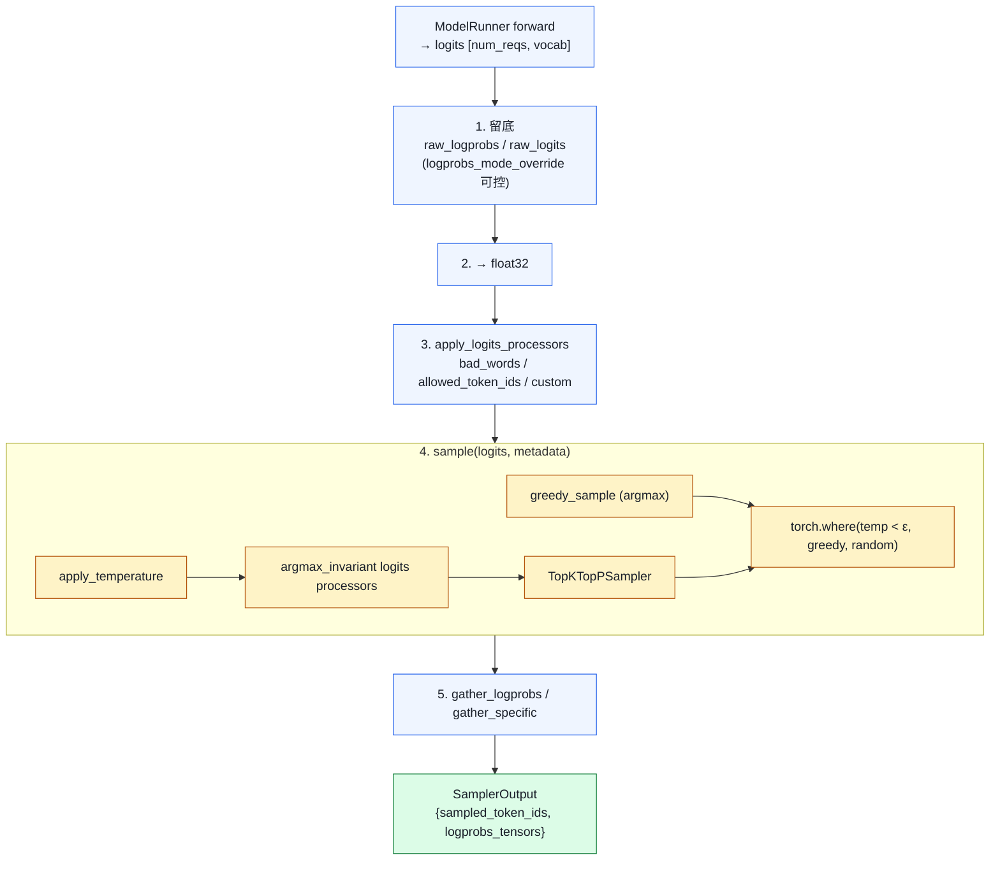

# 01. Sampling 全栈：从 logits 到 token

> **谁该读这一篇？** 想理解输出多样性 / logprobs / 投机解码正确性如何被实现的应用开发者与推理引擎贡献者。
>
> **前置阅读：** [`04-model-runner.md`](../03-code-walkthrough/04-model-runner.md)、[`02-speculative-decoding.md`](../04-optimizations/02-speculative-decoding.md)
>
> **耗时：** 约 30 分钟
>
> **难度：** 进阶
>
> **学完能：**
> 1. 画出 Sampler.forward 的 5 个 Stage（raw logprobs → fp32 → processors → sample → gather）
> 2. 解释 temperature / top-k / top-p / min-p 的语义差异与组合方式
> 3. 说出 raw_logprobs 为什么用 pre-temperature 分布
> 4. 描述 RejectionSampler 在投机解码里的"验收"流程

> **当前复核（`b23bd73f540175f9e117eaee5029cd7d8df63964`）：** 当前 `Sampler` 的顺序包含 whitelist/bad words、非 argmax-invariant processors、penalties、temperature、min-p、top-k/top-p 和 logprob gather；top-k/top-p backend 会按平台、batch、seed 与 logprobs mode 选择 FlashInfer/native/Triton/CPU/XPU/ROCm 路径。当前 SHA 未做 GPU 性能验证。

一个 forward 算完，得到 `[batch, vocab]` 的 logits，怎么挑出下一个 token？这条流水线决定了**输出多样性 + logprobs 准确性 + spec decode 正确性**。涉及文件：`vllm/v1/sample/sampler.py`、`rejection_sampler.py`、`ops/{topk_topp_sampler,penalties,bad_words,logprobs}.py`。

---

## 1. 关系图



如果开了 spec decode，输出会再经过 `RejectionSampler.forward()`，详见第 6 节。

---

## 2. SamplingParams 的全部参数

<!-- vllm-source: {"path":"vllm/sampling_params.py","symbol":"SamplingParams"} -->
[源码锚点：vllm/sampling_params.py · SamplingParams](https://github.com/vllm-project/vllm/blob/b23bd73f540175f9e117eaee5029cd7d8df63964/vllm/sampling_params.py#L199)

`vllm/sampling_params.py` 的 `SamplingParams` 是 OpenAI API 与 vLLM 之间的桥梁，关键字段：

```python
class SamplingParams:
    n: int = 1
    presence_penalty: float = 0.0
    frequency_penalty: float = 0.0
    repetition_penalty: float = 1.0
    temperature: float = 1.0
    top_p: float = 1.0
    top_k: int = 0          # 0 或 -1 表示全 vocab
    min_p: float = 0.0
    seed: int | None = None
    stop: str | list[str] | None = None
    stop_token_ids: list[int] | None = None
    bad_words: list[str] | None = None
    include_stop_str_in_output: bool = False
    ignore_eos: bool = False
    max_tokens: int | None = 16
    min_tokens: int = 0
    logprobs: int | None = None           # top-N logprobs
    prompt_logprobs: int | None = None    # 对 prompt 也算
    detokenize: bool = True
    skip_special_tokens: bool = True
    spaces_between_special_tokens: bool = True
    structured_outputs: StructuredOutputsParams | None = None
    truncate_prompt_tokens: ...
    extra_args: dict | None = None
```

`SamplingType` 有三种：

- `GREEDY`（temperature ≈ 0）
- `RANDOM`（不传 seed）
- `RANDOM_SEED`（带 seed）

---

## 3. Sampler.forward 源码节选

<!-- vllm-source: {"path":"vllm/v1/sample/sampler.py","symbol":"Sampler.forward"} -->
[源码锚点：vllm/v1/sample/sampler.py · Sampler.forward](https://github.com/vllm-project/vllm/blob/b23bd73f540175f9e117eaee5029cd7d8df63964/vllm/v1/sample/sampler.py#L72)
<!-- vllm-source: {"path":"vllm/v1/sample/sampler.py","symbol":"Sampler.forward","anchor":"return sampler_output"} -->
[源码锚点：vllm/v1/sample/sampler.py · Sampler.forward](https://github.com/vllm-project/vllm/blob/b23bd73f540175f9e117eaee5029cd7d8df63964/vllm/v1/sample/sampler.py#L149)

`vllm/v1/sample/sampler.py`，简化版：

```python
def forward(self, logits, sampling_metadata, predict_bonus_token=False, ...):
    # === Stage 1: 保留 raw logits/logprobs 供 logprobs 返回 ===
    if sampling_metadata.max_num_logprobs is not None:
        if logprobs_mode == "raw_logprobs":
            raw_logprobs = self.compute_logprobs(logits)    # log_softmax
        elif logprobs_mode == "raw_logits":
            raw_logprobs = logits.clone().float()

    # === Stage 2: 升 float32 ===
    logits = logits.to(torch.float32)

    # === Stage 3: logits processor (bad_words / allowed_token_ids / custom) ===
    logits = self.apply_logits_processors(logits, sampling_metadata, predict_bonus_token)

    # === Stage 4: 真正采样 ===
    sampled, processed_logprobs = self.sample(logits, sampling_metadata)

    # === Stage 5: 收集 logprobs ===
    sampled = sampled.long()
    if sampling_metadata.logprob_token_ids:
        # API 指定了想要 logprob 的 token 列表，用 fused Triton kernel
        logprob_token_ids_tensors = self.gather_specific_token_logprobs(...)
    if num_logprobs is None:
        logprobs_tensors = logprob_token_ids_tensors
    else:
        # 默认：返回 top-N logprobs 与采样 token 的 rank
        logprobs_tensors = self.gather_logprobs(raw_logprobs, num_logprobs, token_ids=sampled)

    return SamplerOutput(sampled_token_ids=sampled.unsqueeze(-1).to(int32),
                         logprobs_tensors=logprobs_tensors)
```

**关键设计**：

- 默认 `raw_logprobs` 用**没经过 temperature/penalty 的原始分布**；`logprobs_mode` 也可要求 raw/processed logits 或 logprobs，选择会约束采样 backend
- sampled 用 `int32`（节省 IPC 字节，FlashInfer kernel 返回 int32）
- greedy 与 random 用 `torch.where` 合并：同一 batch 里部分请求 temp=0 部分 temp>0 也能一次 forward

---

## 4. sample() 内部：温度 + top-k/p

<!-- vllm-source: {"path":"vllm/v1/sample/sampler.py","symbol":"Sampler.sample"} -->
[源码锚点：vllm/v1/sample/sampler.py · Sampler.sample](https://github.com/vllm-project/vllm/blob/b23bd73f540175f9e117eaee5029cd7d8df63964/vllm/v1/sample/sampler.py#L243)
<!-- vllm-source: {"path":"vllm/v1/sample/sampler.py","symbol":"Sampler.sample","anchor":"return sampled, processed_logprobs"} -->
[源码锚点：vllm/v1/sample/sampler.py · Sampler.sample](https://github.com/vllm-project/vllm/blob/b23bd73f540175f9e117eaee5029cd7d8df63964/vllm/v1/sample/sampler.py#L302)

`sampler.py`：

```python
def sample(self, logits, sampling_metadata, ...):
    # 4.1 greedy 路径
    if not all_random:
        greedy_sampled = self.greedy_sample(logits)   # argmax
        if all_greedy:
            return greedy_sampled, None

    # 4.2 在 float32 上应用温度
    logits = self.apply_temperature(logits, temperature, all_random)
    #         ↓ logits.div_(temp.unsqueeze(1))
    #         ↓ 对 temp < eps 的位置先替换为 1.0 避免除 0

    # 4.3 argmax-invariant 的 logits processor（按 token logit 加偏置但不改 argmax）
    for processor in sampling_metadata.logitsprocs.argmax_invariant:
        logits = processor.apply(logits)

    # 4.4 top-k / top-p 采样
    random_sampled, processed_logprobs = self.topk_topp_sampler(
        logits, generators, top_k, top_p
    )

    # 4.5 合并 greedy 与 random
    sampled = torch.where(temperature < eps, greedy_sampled, random_sampled, out=greedy_sampled)
    return sampled, processed_logprobs
```

`TopKTopPSampler`（`vllm/v1/sample/ops/topk_topp_sampler.py`）有多条条件路径：

- CUDA 在兼容 compute capability、允许的 logprobs mode、无 per-request generator 等条件下可用 **FlashInfer**；显式 opt-in 但不可用会报错
- native 路径会按平台和 batch 选择 PyTorch/Triton；CPU、XPU、ROCm AITER 还有各自分支与 fallback

top-k 实现：把 vocab 上 sort，取前 k 个；其余位置 logit = -inf。
top-p（nucleus）：sort 后从大到小累积概率，超过 p 截断。
min-p：保留所有概率 ≥ p_max × min_p 的 token，比 top-p 抗 sampling noise。

---

## 5. Penalty / Bad words 处理

`vllm/v1/sample/ops/penalties.py`：

```python
def apply_all_penalties(logits, prompt_token_ids, output_token_ids,
                        presence_penalties, frequency_penalties, repetition_penalties):
    """
    repetition_penalty: 已出现的 token logit / penalty（>1 抑制重复）
    presence_penalty:    出现过的 token logit -= presence
    frequency_penalty:   出现次数 × frequency，logit -= count×freq
    """
```

`bad_words.py` 把 bad token sequence 在 logits 里 mask 成 -inf（不只是单 token，要看上下文 n-gram）。

这两个 op 都是**就地修改 logits**，效率优先。

---

## 6. RejectionSampler：投机解码的"验收员"

`vllm/v1/sample/rejection_sampler.py`，整体结构：

```python
class RejectionSampler(nn.Module):
    def forward(self, ..., draft_token_ids, target_logits, ...):
        # 给 target_logits 应用 logits processor
        target_logits = self.apply_logits_processors(...)
        target_logits = self.apply_penalties(...)

        # 核心：对每个 draft token 跑接受/拒绝判定（Leviathan 2023）
        accepted = rejection_sample(
            draft_token_ids,
            draft_probs,
            target_probs,
            ...
        )
        # 拒绝时从修正分布 (target - draft)_+ 采样
        # 全部接受时可以再多采 1 个 bonus token

def rejection_sample(...):
    # 内部 dispatch 到两个 Triton kernel：
    #   rejection_greedy_sample_kernel
    #   rejection_random_sample_kernel
```

数学（详见 `04-optimizations/02-speculative-decoding.md`）：

```
对每个位置 i：
  r ~ U(0,1)
  if r < min(1, p_target(x_i) / p_draft(x_i)):
       接受 x_i, 继续
  else:
       拒绝, 从 (p_target - p_draft)_+ / Z 采新 token x'_i, 停止
```

vLLM 把这个公式实现成 Triton kernel（`rejection_random_sample_kernel`），整 batch 并行算。

---

## 7. Logprobs：什么时候算 / 怎么省

`vllm/v1/sample/ops/logprobs.py` + `Sampler.gather_logprobs`。

设计原则：

- 不是每个 forward 都算 logprobs（贵）。只有请求显式要求生成 / prompt logprobs 或指定 token logprob 时才走相应计算；`0`、`-1` 与正数的返回语义也不同
- `raw_logprobs` 仍需对 vocab 做 `log_softmax`，随后只保留采样 token + top-N；`logprobs=-1` 会返回 full vocab，成本完全不同
- `logprob_token_ids` 可只返回指定 token 与采样 token，适合 scoring；不能把“返回稀疏”误写成“无需 full-vocab softmax”

返回结构 `LogprobsTensors`：

```
logprob_token_ids:  [num_tokens, num_logprobs + 1]   # +1 是 sampled token
logprobs:           [num_tokens, num_logprobs + 1]   # 对应的 log p
sampled_token_ranks:[num_tokens]                    # 采样 token 在 vocab 排第几
```

prompt_logprobs 在 prefill 时算（每个 prompt token 都要给 top-N logprobs），更贵——只在用户请求时开。

---

## 8. SamplingMetadata 的批处理打包

`vllm/v1/sample/metadata.py`：把整个 batch 的 sampling 参数打包成 GPU tensor，sampler 一次性处理。

```
SamplingMetadata fields:
  temperature        # [num_reqs]
  top_p / top_k      # [num_reqs]
  min_p
  generators         # 每个 request 一个 torch.Generator（seed 模式）
  output_token_ids   # 当前已生成的 token（penalty 用）
  prompt_token_ids   # repetition penalty 用
  all_greedy: bool   # batch 全 greedy 走快路径
  all_random: bool   # batch 全 random 走快路径
  logitsprocs: LogitsProcessorManager   # 自定义 logits processor 集合
  max_num_logprobs
  logprob_token_ids: dict[int, list[int]]  # 指定 token logprob
```

打包发生在 ModelRunner 的 `_prepare_inputs`，是 V1 性能优化的关键之一。

---

## 9. 自定义 LogitsProcessor

当前 V1 通过 engine/model 配置加载 `LogitsProcessor` 类或插件，不是任意 OpenAI 请求都能上传 Python callable。自定义 processor 仍有性能与兼容陷阱：

- processor 在每个 decode step 参与处理，需测 host/device 开销与 compile/CUDA Graph 兼容性
- pooling runner 拒绝 custom processors；当前源码也拒绝 custom processor 与 speculative decoding 组合，`SamplingParams` 验证同样拒绝 spec decode 下的 `min_p` / `logit_bias`
- 若需求本质是 JSON/grammar 约束，优先评估下一章的结构化输出契约

vLLM 把 processors 分两类：

- `argmax_invariant`：processor 声明其变换不改变 argmax，可延后到随机采样路径
- 非 invariant：可能改 argmax 结果，必须在 greedy 决策前执行

argmax-invariant processor 可在全 greedy 路径跳过，是个微优化。`allowed_token_ids`、bad words 和 penalties 有各自的固定处理位置，不属于这个自定义 processor 分类示例。

---

## 10. 工程自检问答

**Q: temperature 怎么影响输出多样性？**
A: `logits / temp` 然后 softmax。temp → 0 时分布趋向 one-hot（接近 argmax）；temp = 1 是原始分布；temp > 1 平滑分布、多样性↑。vLLM 在 temp < ε 时走 greedy 快路径。

**Q: top-p（nucleus）和 top-k 的区别？**
A: top-k 最多保留 k 个 candidate；top-p 按累计概率动态保留。组合值必须由模型质量集验证，本章不提供跨模型默认值。

**Q: min-p 是什么？为啥要它？**
A: 保留概率 ≥ p_max × min_p 的 token。它相对当前最大概率设门槛；是否提高质量取决于模型与 workload，且当前 spec decode 路径对 `min_p` 有兼容限制。

**Q: logprobs 为什么不默认开？**
A: raw logprobs 需要在整 vocab 上做 `log_softmax`，随后 top-N / 指定 token 只减少 gather 与返回体；`logprobs=-1` 还返回 full vocab。是否开启应由观测 / scoring 需求决定。

**Q: 采样为什么用 float32 不用 BF16？**
A: 当前实现显式把 logits 转成 float32，并让 `log_softmax` 指定 float32，以降低低精度概率计算风险。开销是否可接受要在大 vocab、高并发和 logprobs workload 下测量，不能假设 sampling 永远不在瓶颈。

**Q: spec decode 拒绝采样为什么不改变分布？**
A: Leviathan 2023 证明：`min(1, p_t/p_d)` 接受 + `(p_t - p_d)_+ / Z` 拒绝重采，得到的分布数学等价于直接从 p_t 采。详见 `04-optimizations/02-speculative-decoding.md`。

---

## 11. 一次只改一个变量的实验

固定 model / tokenizer、prompt / output 长度、seed、并发和请求集，分别测试：baseline、仅开 top-p、仅开 min-p、请求 top-N logprobs、请求指定 token logprobs。记录输出质量、token/s、TPOT、GPU/CPU profile、实际 sampler backend 与 fallback 日志。

失败证据包括：同 seed 在相同部署条件下仍不满足预定义复现契约、backend 非预期 fallback、spec decode 组合被拒绝/参数不生效、logprobs shape/rank 与 API 契约不符，或质量/延迟越过 gate。生产取舍是可控性、质量与观测需求换取额外 vocab 计算、返回体积和 batching 异质性；先做小流量 A/B，并保留参数级回滚。

硬件验证状态：**未执行当前 SHA 的 GPU sampling 对比**；本章结论来自静态源码复核。

---

## 小结

- Sampler 的 5 个 Stage 是固定流水线：保留 raw logprobs → upcast fp32 → 应用 processors → sample → gather logprobs。
- greedy 与 random 通过 `torch.where(temp<eps, ...)` 合并，让混合 batch 一次 forward 解决。
- TopKTopPSampler 按平台、compute capability、seed / generator、batch 与 logprobs mode 选择 FlashInfer 或 native 路径；native 内部还可能选择 PyTorch / Triton / 平台实现。
- RejectionSampler 把 Leviathan 2023 的接受/拒绝公式落成两个 Triton kernel，输出分布等价于直接从 target 采。
- Logprobs 是 opt-in 的：raw logprobs 仍有 full-vocab softmax，top-N / 指定 token 主要减少 gather 与返回体；`-1` 的成本更高。

## 自检

1. SamplingMetadata 里 `all_greedy` 和 `all_random` 两个布尔值能在性能上分别省掉哪些步骤？
2. 自定义 LogitsProcessor 为什么会破坏 CUDA Graph？有什么替代方案？
3. 拒绝采样里被拒绝时从 `(p_target - p_draft)_+ / Z` 重采，这个公式保证了什么数学性质？
4. 同一个 batch 既有 `logprobs=5` 也有不要 logprobs 的请求，sampler 如何让"不要的请求"不付出额外算力？

## 下一步

- 下一节：[`02-structured-output.md`](./02-structured-output.md)（用 grammar/JSON schema 把 logits 直接 mask 到合法集合）
- 想看源码：`vllm/v1/sample/`（sampler、rejection_sampler、ops 全套）、`vllm/sampling_params.py`
- 想动手：[`07-hands-on/03-mini-experiments.md`](../07-hands-on/03-mini-experiments.md) 对比 temperature/top-p 不同组合下的输出与 logprobs

---

## Sources

<!-- vllm-source: {"path":"vllm/sampling_params.py","symbol":"SamplingType"} -->
[源码锚点：vllm/sampling_params.py · SamplingType](https://github.com/vllm-project/vllm/blob/b23bd73f540175f9e117eaee5029cd7d8df63964/vllm/sampling_params.py#L64)
<!-- vllm-source: {"path":"vllm/sampling_params.py","symbol":"SamplingParams"} -->
[源码锚点：vllm/sampling_params.py · SamplingParams](https://github.com/vllm-project/vllm/blob/b23bd73f540175f9e117eaee5029cd7d8df63964/vllm/sampling_params.py#L199)

- `vllm/sampling_params.py`（SamplingType / SamplingParams）
<!-- vllm-source: {"path":"vllm/v1/sample/sampler.py","symbol":"Sampler"} -->
[源码锚点：vllm/v1/sample/sampler.py · Sampler](https://github.com/vllm-project/vllm/blob/b23bd73f540175f9e117eaee5029cd7d8df63964/vllm/v1/sample/sampler.py#L20)
<!-- vllm-source: {"path":"vllm/v1/sample/sampler.py","symbol":"Sampler.forward"} -->
[源码锚点：vllm/v1/sample/sampler.py · Sampler.forward](https://github.com/vllm-project/vllm/blob/b23bd73f540175f9e117eaee5029cd7d8df63964/vllm/v1/sample/sampler.py#L72)
<!-- vllm-source: {"path":"vllm/v1/sample/sampler.py","symbol":"Sampler.sample"} -->
[源码锚点：vllm/v1/sample/sampler.py · Sampler.sample](https://github.com/vllm-project/vllm/blob/b23bd73f540175f9e117eaee5029cd7d8df63964/vllm/v1/sample/sampler.py#L243)
<!-- vllm-source: {"path":"vllm/v1/sample/sampler.py","symbol":"Sampler.compute_logprobs"} -->
[源码锚点：vllm/v1/sample/sampler.py · Sampler.compute_logprobs](https://github.com/vllm-project/vllm/blob/b23bd73f540175f9e117eaee5029cd7d8df63964/vllm/v1/sample/sampler.py#L305)
<!-- vllm-source: {"path":"vllm/v1/sample/sampler.py","symbol":"Sampler.apply_logits_processors"} -->
[源码锚点：vllm/v1/sample/sampler.py · Sampler.apply_logits_processors](https://github.com/vllm-project/vllm/blob/b23bd73f540175f9e117eaee5029cd7d8df63964/vllm/v1/sample/sampler.py#L371)
<!-- vllm-source: {"path":"vllm/v1/sample/sampler.py","symbol":"Sampler.apply_penalties"} -->
[源码锚点：vllm/v1/sample/sampler.py · Sampler.apply_penalties](https://github.com/vllm-project/vllm/blob/b23bd73f540175f9e117eaee5029cd7d8df63964/vllm/v1/sample/sampler.py#L420)

- `vllm/v1/sample/sampler.py`
<!-- vllm-source: {"path":"vllm/v1/sample/rejection_sampler.py","symbol":"RejectionSampler"} -->
[源码锚点：vllm/v1/sample/rejection_sampler.py · RejectionSampler](https://github.com/vllm-project/vllm/blob/b23bd73f540175f9e117eaee5029cd7d8df63964/vllm/v1/sample/rejection_sampler.py#L37)
<!-- vllm-source: {"path":"vllm/v1/sample/rejection_sampler.py","symbol":"rejection_sample"} -->
[源码锚点：vllm/v1/sample/rejection_sampler.py · rejection_sample](https://github.com/vllm-project/vllm/blob/b23bd73f540175f9e117eaee5029cd7d8df63964/vllm/v1/sample/rejection_sampler.py#L396)
<!-- vllm-source: {"path":"vllm/v1/sample/rejection_sampler.py","symbol":"rejection_greedy_sample_kernel"} -->
[源码锚点：vllm/v1/sample/rejection_sampler.py · rejection_greedy_sample_kernel](https://github.com/vllm-project/vllm/blob/b23bd73f540175f9e117eaee5029cd7d8df63964/vllm/v1/sample/rejection_sampler.py#L717)
<!-- vllm-source: {"path":"vllm/v1/sample/rejection_sampler.py","symbol":"rejection_random_sample_kernel"} -->
[源码锚点：vllm/v1/sample/rejection_sampler.py · rejection_random_sample_kernel](https://github.com/vllm-project/vllm/blob/b23bd73f540175f9e117eaee5029cd7d8df63964/vllm/v1/sample/rejection_sampler.py#L776)

- `vllm/v1/sample/rejection_sampler.py`
- `vllm/v1/sample/ops/topk_topp_sampler.py`、`penalties.py`、`bad_words.py`、`logprobs.py`
- `vllm/v1/sample/metadata.py`（SamplingMetadata）
- `csrc/sampler.cu`（一些 fallback CUDA kernel）

---

## See also

- `04-optimizations/02-speculative-decoding.md` —— rejection sampler 的算法层
- `02-core-concepts/02-continuous-batching.md` —— sampling 在 step 中的位置
- `03-code-walkthrough/04-model-runner.md` —— `_prepare_inputs` 怎么打包 SamplingMetadata
