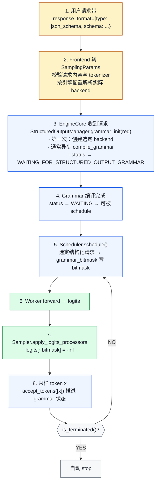

# 02. Structured Output：JSON / Regex / Grammar 约束生成

> **谁该读这一篇？** 做 Agent / Tool use / Function calling，需要 LLM 严格按 schema 输出的开发者；想理解 grammar 引擎和 sampler 接缝的引擎贡献者。
>
> **前置阅读：** [`01-sampling-and-logits.md`](./01-sampling-and-logits.md)、[`02-scheduler.md`](../03-code-walkthrough/02-scheduler.md)
>
> **耗时：** 约 25 分钟
>
> **难度：** 进阶
>
> **当前性说明：** 本章按 vLLM `b23bd73f540175f9e117eaee5029cd7d8df63964` 静态复核；后端能力与 `auto` 选择策略可能随版本变化，部署前应在目标版本重新跑兼容性矩阵。
>
> **学完能：**
>
> 1. 区分 `auto` 与 xgrammar / guidance / outlines / lm-format-enforcer 四个显式后端的失败语义
> 2. 画出 `grammar_init → grammar_bitmask → Sampler mask → accept_tokens` 的完整路径
> 3. 解释 bitmask 数据结构如何节省显存与算力
> 4. 说出结构化输出与投机解码、reasoning model 组合时的注意点

Agent / Tool use / Function calling 的底层支柱：让 LLM **只能**输出符合 schema 的 token。不是 prompt 哄它"请按 JSON 输出"，而是在 logits 层面把不合法 token 直接 mask 掉。代码目录：`vllm/v1/structured_output/`。

---

## 1. 类与文件总览

```
vllm/v1/structured_output/
├── __init__.py                   ← StructuredOutputManager（engine-level 调度）
├── backend_types.py              ← 抽象接口
│     ├─ StructuredOutputBackend  （后端基类）
│     ├─ StructuredOutputGrammar  （单请求 grammar 状态机）
│     └─ StructuredOutputOptions  （JSON / REGEX / GRAMMAR / CHOICE / ...）
├── backend_xgrammar.py           ← xgrammar 实现
├── backend_guidance.py           ← Microsoft llguidance（regex / JSON / lark）
├── backend_outlines.py           ← outlines（社区流行）
├── backend_lm_format_enforcer.py ← lm-format-enforcer
├── request.py                    ← StructuredOutputRequest（per-request 状态）
└── utils.py
```

---

## 2. 后端怎么选：先看契约，再测性能

<!-- vllm-source: {"path":"vllm/config/structured_outputs.py","symbol":"StructuredOutputsConfig"} -->
[源码锚点：vllm/config/structured_outputs.py · StructuredOutputsConfig](https://github.com/vllm-project/vllm/blob/b23bd73f540175f9e117eaee5029cd7d8df63964/vllm/config/structured_outputs.py#L18)

引擎配置 `StructuredOutputsConfig.backend` 当前可取 `auto`、`xgrammar`、`guidance`、`outlines`、`lm-format-enforcer`，默认是 `auto`。不要把一张脱离 schema、tokenizer 和版本的“速度榜”当成选择依据：不同后端支持的 grammar 语法、JSON Schema 子集、tokenizer 与配置开关并不相同。

| 选择方式 | 当前契约 | 适用场景 |
| --- | --- | --- |
| `auto` | 先验证 xgrammar；不兼容时按 tokenizer 与 schema 特征转向 guidance 或 outlines。该策略明确允许随 release 改变 | 希望由当前版本做能力匹配，并接受升级后重测 |
| 显式后端 | 只验证指定后端；验证失败直接报错，不做跨后端回退 | 需要稳定复现、已固定依赖与兼容性矩阵 |
| lm-format-enforcer | 有独立验证路径；当前不支持 Mistral tokenizer | 既有部署已验证该后端 |

两个容易踩错的配置边界：`disable_any_whitespace` 只适用于 xgrammar / guidance；`disable_additional_properties` 只适用于 guidance。V1 也不支持请求级选择不同 backend；后端由引擎配置决定，第一次使用时懒加载为引擎级实例。

---

## 3. 抽象接口

<!-- vllm-source: {"path":"vllm/v1/structured_output/backend_types.py","symbol":"StructuredOutputGrammar"} -->
[源码锚点：vllm/v1/structured_output/backend_types.py · StructuredOutputGrammar](https://github.com/vllm-project/vllm/blob/b23bd73f540175f9e117eaee5029cd7d8df63964/vllm/v1/structured_output/backend_types.py#L31)
<!-- vllm-source: {"path":"vllm/v1/structured_output/backend_types.py","symbol":"StructuredOutputBackend"} -->
[源码锚点：vllm/v1/structured_output/backend_types.py · StructuredOutputBackend](https://github.com/vllm-project/vllm/blob/b23bd73f540175f9e117eaee5029cd7d8df63964/vllm/v1/structured_output/backend_types.py#L99)

`vllm/v1/structured_output/backend_types.py`：

```python
class StructuredOutputGrammar(ABC):
    """一个请求一份。维护这个请求的 grammar 状态机。"""

    def accept_tokens(self, request_id, tokens) -> bool:
        """把已采样 token 喂回状态机，推进状态。"""

    def validate_tokens(self, tokens) -> list[int]:
        """检查一批 token 是否合法（spec decode 用）。"""

    def rollback(self, num_tokens) -> None:
        """spec decode 拒绝时回滚状态。"""

    def fill_bitmask(self, bitmask, batch_index) -> None:
        """关键：把"当前合法 token"写进 bitmask。"""

    def is_terminated(self) -> bool: ...
    def reset(self): ...


class StructuredOutputBackend(ABC):
    """全局一份，给所有请求编译 grammar。"""

    def compile_grammar(self, request_type, grammar_spec) -> StructuredOutputGrammar: ...
    def allocate_token_bitmask(self, max_num_seqs) -> torch.Tensor: ...
    def destroy(self): ...
```

**Bitmask 是核心数据结构**：后端分配按词表压缩的 `int32` 位图，每 bit 表示一个 token 在当前 grammar 状态是否可选。实际 shape 由后端实现决定；不要在业务代码里假定固定二维布局。

---

## 4. StructuredOutputManager：引擎级调度

<!-- vllm-source: {"path":"vllm/v1/structured_output/__init__.py","symbol":"StructuredOutputManager"} -->
[源码锚点：vllm/v1/structured_output/__init__.py · StructuredOutputManager](https://github.com/vllm-project/vllm/blob/b23bd73f540175f9e117eaee5029cd7d8df63964/vllm/v1/structured_output/__init__.py#L36)

`vllm/v1/structured_output/__init__.py` 一个 EngineCore 一个。关键属性：

```python
class StructuredOutputManager:
    def __init__(self, vllm_config):
        self.backend: StructuredOutputBackend | None = None
        self._use_async_grammar_compilation = (
            distributed_executor_backend != "external_launcher"
        )
        self._grammar_bitmask: torch.Tensor | None = None   # 复用 buffer
        # Grammar 编译线程池（CPU-bound；worker 数由实现计算）
        self.executor = ThreadPoolExecutor(...)
        # 大 batch 时 fill_bitmask 也并行
        self.executor_for_fillmask = ThreadPoolExecutor(...)
```

### 4.1 grammar_init（请求入队时调用）

```python
def grammar_init(self, request):
    if self.backend is None:
        # 第一次按前端已验证并解析出的引擎后端 lazy 创建
        backend = request.sampling_params.structured_outputs._backend
        if backend == "xgrammar":
            self.backend = XgrammarBackend(...)
        elif backend == "guidance":
            self.backend = GuidanceBackend(...)
        ...

    # async 提交编译，避免 block Scheduler
    if self._use_async_grammar_compilation:
        grammar = self.executor.submit(self._create_grammar, request)
    else:
        grammar = self._create_grammar(request)

    request.structured_output_request.grammar = grammar
```

**关键设计**：grammar 编译是 CPU 工作，通常异步跑在线程池。Scheduler 看到 future 还没 ready 时让请求停在 `WAITING_FOR_STRUCTURED_OUTPUT_GRAMMAR`。`external_launcher` 是例外：为保持各 TP rank 的调度确定性，代码禁用异步 grammar 编译。

### 4.2 grammar_bitmask（每步调用）

```python
def grammar_bitmask(self, requests, structured_output_request_ids, ...):
    # 对每个有 grammar 的请求：
    #   - 找出当前 grammar 状态下合法 token 集合
    #   - 写入 _grammar_bitmask[index]
    # 满足实现阈值、且没有 speculative token 时可分块并行
    if num_reqs > self.fill_bitmask_parallel_threshold and not spec_decode:
        batches = split_into_internal_chunks(...)
        futures = [_async_submit_fill_bitmask(batch) for batch in batches]
        wait(futures)
    else:
        self._fill_bitmasks(all_requests)
```

bitmask 之后会传到 worker，在采样前把非法 token 对应的 logits mask 成 `-inf`。开启投机解码时，buffer 还会为每个候选位置及 bonus / 非投机位置预留 mask，并在验证后回滚临时推进的 grammar 状态。

---

## 5. 端到端流程：一次结构化输出请求



---

## 6. 与 Scheduler / Sampler 的具体接缝

### 接缝 A：Scheduler 等 grammar 编译完成
`vllm/v1/core/sched/scheduler.py` 在 `_schedule_running` 之前会检查每个 request 的 grammar future 是否 done。没 done 的请求保持 WAITING，不进 batch。

### 接缝 B：grammar_bitmask 注入 SamplerOutput
SchedulerOutput 带 `grammar_bitmask: NDArray[int32]`。Worker.execute_model 传到 GPU。Sampler 在 `apply_logits_processors` 阶段用它 mask logits。

### 接缝 C：accept_tokens 推进状态机
引擎拿到已接受 token 后推进每个请求的 grammar 状态。顺序不能乱；投机解码会先临时推进候选 token、生成多个 mask，随后回滚，再以最终接受结果保持请求状态一致。具体推进位置属于内部实现，不应依赖“必定由某个 runner 方法逐 token 调用”这种易漂移细节。

---

## 7. 性能与容量：用测量代替常数

### 7.1 bitmask 复用
`_grammar_bitmask` 是 reusable buffer，首次按最大序列数以及投机 token 数分配，后续只填本步需要的部分。这降低了重复分配，但 buffer 容量仍会随并发、词表与投机长度增长。

### 7.2 async grammar 编译
冷 schema 的编译会增加 TTFT；异步模式允许 Scheduler 在 future 未完成时服务其他请求，但不会消除该请求自身的等待时间。相同 schema 能否命中 backend 缓存、命中粒度是什么，要对所选后端与版本实测。

### 7.3 大 batch 并行 fill_bitmask
当前实现只在非投机、大批量场景达到内部阈值后用线程池分块填 mask；小 batch 与投机场景走串行路径。阈值是实现细节，不是部署参数契约。

### 7.4 压缩与搬运仍有成本
位图比逐 token 的布尔数组紧凑，但每步仍包含 CPU 生成、序列化 / 搬运和 GPU 应用成本。容量评估应记录实际 buffer shape、CPU 利用率、H2D 时间与 decode latency，而不是套用固定“每请求多少 KB”。

---

## 8. 与 Function Calling / Tool Use 的关系

OpenAI 的 `tools` API：

- 用户传 function schema
- 模型决定调用哪个 function + 输出 JSON 参数
- 服务端解析 JSON 调实际工具

vLLM 的实现路径（`vllm/entrypoints/openai/`）：

- frontend 根据 chat template、tool parser、`tool_choice` 与请求格式构造约束；具体转换路径取决于模型与 parser
- structured output 负责 token 级语法约束
- tool parser 负责从模型输出识别工具调用并映射参数

结构化输出并不替代工具授权、参数语义校验、超时、沙箱与审计。即使 JSON 满足 schema，也不能直接把模型参数当成可信命令；生产安全边界见 [`11-security-and-multi-tenancy.md`](../08-production-deployment/11-security-and-multi-tenancy.md)。

---

## 9. 与投机解码的交互

结构化输出 + spec decode 是个**复杂组合**：

- target 模型采样后必须 accept_tokens 推进 grammar
- spec 一次提议多个 token，需要 `validate_tokens` 批量验
- 拒绝重采时要 `rollback` 回滚 grammar 状态

当前 manager 为每个候选位置生成 mask，借助 `validate_tokens`、`accept_tokens` 与 `rollback` 保持 FSM 一致。组合是否可用不只取决于后端，还取决于投机方法、tokenizer 与 schema；上生产前必须跑接受率、正确率和回滚一致性测试。

---

## 10. Reasoning Models（DeepSeek-R1 / o1 风格）

`structured_outputs_config.reasoning_parser` 让 manager 为每个请求懒建 parser：

- 模型先输出 `<think>...</think>` 然后正式答案
- 默认 `enable_in_reasoning=False` 时，parser 判断 reasoning 是否结束；结束前不填约束 mask，也不推进普通 JSON / regex / choice / grammar 的 FSM
- `enable_in_reasoning=True` 时 reasoning 阶段也应用约束
- structural tag 与 speculative decoding 的边界有专门处理，不能概括成“永远只约束答案段”

因此必须用目标模型实际输出的 reasoning 边界 token 做测试；parser 配错可能表现为约束过早、过晚或输出无法终止。

---

## 11. 最小可复现实验与失败证据

固定模型、tokenizer、schema 与采样参数，至少跑下面的矩阵；每个格子同时记录冷启动与重复 schema 的结果：

| 变量 | 建议取值 | 记录 |
| --- | --- | --- |
| backend | `auto` + 每个准备上线的显式后端 | 实际解析后端、依赖版本、验证错误 |
| 约束类型 | choice、regex、JSON、递归 / 复杂 schema | schema 编译耗时、TTFT、成功率、终止原因 |
| decode | 普通、目标投机配置 | 接受率、rollback 异常、每 token latency |
| reasoning | parser 关闭 / 开启，`enable_in_reasoning` 两种值 | reasoning 与 answer 边界、最终解析结果 |

失败证据要保留原始请求、schema hash、tokenizer 标识、后端解析结果、服务日志、原始 token IDs 与 finish reason。至少注入四类失败：空 grammar、目标后端不支持的 schema、tokenizer 不兼容、超大 / 高复杂度 schema。前端拒绝应是明确的 4xx；编译 future 异常不应让请求无限停在 grammar waiting 状态。

> **生产取舍：** `auto` 降低首次配置成本，却把后端选择策略纳入升级变量；显式后端提高可复现性，却要求团队自己维护兼容性与依赖矩阵。无论哪种方式，都应限制 schema 大小 / 复杂度、给编译设置资源预算，并把升级前的 cold / warm schema 回归纳入发布门禁。

> **硬件验证状态：** 本章完成锁定 SHA 的静态源码复核；未在当前 SHA 上执行 GPU 基准，因此不提供跨后端速度排名或固定时延结论。

---

## 12. 工程自检问答

**Q: structured output 为什么比 prompt 工程可靠？**
A: prompt 工程依赖模型遵循指令；结构化输出把当前 grammar 状态不允许的 token mask 掉，能强化**语法层**约束。但保证范围只到所选 backend、schema、tokenizer 与终止路径；它不保证字段语义正确，更不构成工具执行的安全授权。

**Q: bitmask 是怎么算的？**
A: 每个 grammar 维护请求级状态。`fill_bitmask` 把当前状态允许的 token 写入后端分配的压缩位图；采样后再用接受 token 推进状态。内部自动机形式与缓存策略由后端决定，不应一概写成 DFA 查表。

**Q: 一个 batch 里只有部分请求有结构化约束，怎么处理？**
A: Scheduler 只为结构化请求生成紧凑 bitmask 与请求 ID 映射；worker 把相应行应用到 batch 中对应请求。不要假定未约束请求一定占一个全 1 的固定行。

**Q: 异步 grammar 编译能给多少收益？**
A: 异步编译避免阻塞整个 Scheduler，但该请求仍要等待 future，所以 TTFT 仍包含 grammar 准备时间。收益取决于编译成本、缓存命中与同期可运行请求；`external_launcher` 还会禁用异步编译。

**Q: xgrammar 的精度有问题吗？**
A: 不应承诺“标准 JSON Schema 全支持”。前端会按所选后端验证功能子集；`auto` 可能回退，显式后端失败则报错。生产前应对真实 schema、tokenizer 和依赖版本做正反例与 fuzz 测试。

---

## 小结

- StructuredOutputManager 是 engine 级管理器，当前一个引擎只支持一个后端；默认 `auto` 的选择与回退策略是版本相关行为。
- 每个请求一份 `StructuredOutputGrammar` 状态，manager 生成后端定义的压缩位图，worker 在采样前应用约束。
- grammar 通常异步编译；请求自身仍等待，`external_launcher` 为保持确定性走同步路径。
- 与 spec decode 协同需要 `validate_tokens` / `rollback`，并非所有后端完全等价。
- reasoning parser 与 `enable_in_reasoning` 共同决定何时填 mask 和推进 FSM，必须按目标模型验证边界。

## 自检

1. 同步和异步 grammar 编译分别会阻塞谁？为什么 `external_launcher` 禁用异步？
2. bitmask 为什么采用压缩位图？容量估算至少需要哪些实际 shape 与配置数据？
3. spec decode 拒绝时，grammar 状态机需要怎么处理才能保持一致？
4. 为什么“schema 合法”仍不足以授权执行工具？生产入口还需要哪些校验？

### 参考答案

1. 同步编译会占住调用它的 scheduler/请求处理路径；异步编译把工作放到后台，其他请求可以继续调度，但该请求仍要等 future。`external_launcher` 为了保持外部进程/调度语义确定，当前路径禁用异步，不能假设所有部署都能后台编译。
2. bitmask 用每个 token 一个 bit 表示允许/禁止，远小于保存完整 vocab 布尔数组，并适合 GPU 批量 apply。容量至少要知道 vocab size、并发约束请求数、bitmask dtype/word packing、每步更新频率和 grammar 状态缓存策略。
3. 拒绝 speculative token 时，grammar 只能接受真正提交到输出的 token；被拒绝 token 必须 rollback，不得推进 FSM 或保留错误的 bitmask。然后用实际 accepted token 重新生成下一步约束。
4. schema 只验证语法形状，不验证参数值是否安全、用户是否有权限、工具是否允许当前租户调用或目标资源是否可信。生产入口还需 auth/RBAC、schema/size limit、参数 allowlist、SSRF/路径检查、幂等/deadline、审计和执行沙箱。

## 下一步

- 下一节：[`03-multimodal.md`](./03-multimodal.md)（多模态输入与 token 化）
- 想看源码：`vllm/v1/structured_output/`、`vllm/tool_parsers/`、`vllm/reasoning/`
- 想动手：[`07-hands-on/03-mini-experiments.md`](../07-hands-on/03-mini-experiments.md) 用同一组正反例比较 `auto` 与准备上线的显式后端

---

## Sources

<!-- vllm-source: {"path":"vllm/v1/structured_output/__init__.py","symbol":"StructuredOutputManager"} -->
[源码锚点：vllm/v1/structured_output/__init__.py · StructuredOutputManager](https://github.com/vllm-project/vllm/blob/b23bd73f540175f9e117eaee5029cd7d8df63964/vllm/v1/structured_output/__init__.py#L36)
<!-- vllm-source: {"path":"vllm/v1/structured_output/__init__.py","symbol":"StructuredOutputManager.grammar_init"} -->
[源码锚点：vllm/v1/structured_output/__init__.py · StructuredOutputManager.grammar_init](https://github.com/vllm-project/vllm/blob/b23bd73f540175f9e117eaee5029cd7d8df63964/vllm/v1/structured_output/__init__.py#L115)
<!-- vllm-source: {"path":"vllm/v1/structured_output/__init__.py","symbol":"StructuredOutputManager.grammar_bitmask"} -->
[源码锚点：vllm/v1/structured_output/__init__.py · StructuredOutputManager.grammar_bitmask](https://github.com/vllm-project/vllm/blob/b23bd73f540175f9e117eaee5029cd7d8df63964/vllm/v1/structured_output/__init__.py#L204)
<!-- vllm-source: {"path":"vllm/v1/structured_output/__init__.py","symbol":"StructuredOutputManager.should_fill_bitmask"} -->
[源码锚点：vllm/v1/structured_output/__init__.py · StructuredOutputManager.should_fill_bitmask](https://github.com/vllm-project/vllm/blob/b23bd73f540175f9e117eaee5029cd7d8df63964/vllm/v1/structured_output/__init__.py#L351)

- `vllm/v1/structured_output/__init__.py`
<!-- vllm-source: {"path":"vllm/v1/structured_output/backend_types.py","symbol":"StructuredOutputGrammar"} -->
[源码锚点：vllm/v1/structured_output/backend_types.py · StructuredOutputGrammar](https://github.com/vllm-project/vllm/blob/b23bd73f540175f9e117eaee5029cd7d8df63964/vllm/v1/structured_output/backend_types.py#L31)
<!-- vllm-source: {"path":"vllm/v1/structured_output/backend_types.py","symbol":"StructuredOutputBackend"} -->
[源码锚点：vllm/v1/structured_output/backend_types.py · StructuredOutputBackend](https://github.com/vllm-project/vllm/blob/b23bd73f540175f9e117eaee5029cd7d8df63964/vllm/v1/structured_output/backend_types.py#L99)

- `vllm/v1/structured_output/backend_types.py`
- `vllm/v1/structured_output/backend_xgrammar.py`
- `vllm/v1/structured_output/backend_guidance.py`
- `vllm/v1/structured_output/request.py`
<!-- vllm-source: {"path":"vllm/sampling_params.py","symbol":"StructuredOutputsParams"} -->
[源码锚点：vllm/sampling_params.py · StructuredOutputsParams](https://github.com/vllm-project/vllm/blob/b23bd73f540175f9e117eaee5029cd7d8df63964/vllm/sampling_params.py#L72)

- `vllm/sampling_params.py`（StructuredOutputsParams）
<!-- vllm-source: {"path":"vllm/v1/sample/sampler.py","symbol":"Sampler.apply_logits_processors"} -->
[源码锚点：vllm/v1/sample/sampler.py · Sampler.apply_logits_processors](https://github.com/vllm-project/vllm/blob/b23bd73f540175f9e117eaee5029cd7d8df63964/vllm/v1/sample/sampler.py#L371)

- `vllm/v1/sample/sampler.py`（apply_logits_processors 入口）
- `vllm/tool_parsers/`、`vllm/reasoning/`

---

## See also

- `09-advanced-features/01-sampling-and-logits.md` —— bitmask 怎么改 logits
- `06-interview/02-system-design.md` —— agent 框架设计里的 schema 强制
- `03-code-walkthrough/02-scheduler.md` —— grammar 等待状态如何融入 schedule
