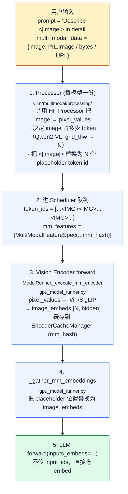

# 03. Multimodal：图像 / 视频 / 音频 一路打通

> **谁该读这一篇？** 想把视觉/语音/视频模型上线的应用开发者；想理解 vLLM 怎么把非文本模态接进 token 序列的引擎贡献者。
>
> **前置阅读：** [`04-model-runner.md`](../03-code-walkthrough/04-model-runner.md)、[`04-prefix-caching.md`](../02-core-concepts/04-prefix-caching.md)
>
> **耗时：** 约 25 分钟
>
> **难度：** 进阶
>
> **当前性说明：** 本章按 vLLM `b23bd73f540175f9e117eaee5029cd7d8df63964` 静态复核；模型支持、processor 参数与 encoder 并行能力必须以目标模型在该版本的 registry / model implementation 为准。
>
> **学完能：**
>
> 1. 画出 image → placeholder token → encoder embed → LLM 的完整数据流
> 2. 解释 EncoderCacheManager 的 LRU + ref_cnt 设计与 KV BlockPool 的相似/不同
> 3. 描述 mm_hash 如何融入 prefix caching 的 block hash
> 4. 说出视频与音频在调度、内存、encoder budget 上的差异

多模态模型接入 vLLM，靠的是一整套**输入处理 + 编码器缓存 + placeholder 与 embedding 对齐**系统。不同模型支持的模态、输入限制、placeholder 规则和 encoder 并行方式并不相同；涉及的共用代码主要在 `vllm/multimodal/`、`vllm/v1/core/encoder_cache_manager.py` 与模型实现目录。

---

## 1. 数据流：图片如何变成 token

<!-- vllm-source: {"path":"vllm/v1/worker/gpu_model_runner.py","symbol":"GPUModelRunner._execute_mm_encoder"} -->
[源码锚点：vllm/v1/worker/gpu_model_runner.py · GPUModelRunner._execute_mm_encoder](https://github.com/vllm-project/vllm/blob/b23bd73f540175f9e117eaee5029cd7d8df63964/vllm/v1/worker/gpu_model_runner.py#L2963)
<!-- vllm-source: {"path":"vllm/v1/worker/gpu_model_runner.py","symbol":"GPUModelRunner._gather_mm_embeddings"} -->
[源码锚点：vllm/v1/worker/gpu_model_runner.py · GPUModelRunner._gather_mm_embeddings](https://github.com/vllm-project/vllm/blob/b23bd73f540175f9e117eaee5029cd7d8df63964/vllm/v1/worker/gpu_model_runner.py#L3172)



---

## 2. multimodal 目录结构

```
vllm/multimodal/
├── inputs.py        ← MultiModalKwargs / FieldElem / PlaceholderRange
├── image.py         ← image 输入解析（PIL/np/bytes/URL）
├── video.py         ← video 帧抽样 / 时序重采样
├── audio.py         ← waveform 加载与切片
├── hasher.py        ← mm 内容哈希（影响 prefix caching）
├── cache.py         ← 输入侧 cache（vs encoder 输出 cache）
├── processing/      ← 每模型一份 Processor
├── registry.py      ← MultiModalRegistry：模型 ↔ processor 绑定
└── parse.py         ← OpenAI message → mm_data 解析
```

---

## 3. PlaceholderRange：核心数据结构

<!-- vllm-source: {"path":"vllm/multimodal/inputs.py","symbol":"PlaceholderRange"} -->
[源码锚点：vllm/multimodal/inputs.py · PlaceholderRange](https://github.com/vllm-project/vllm/blob/b23bd73f540175f9e117eaee5029cd7d8df63964/vllm/multimodal/inputs.py#L119)

`vllm/multimodal/inputs.py`：

```python
@dataclass
class PlaceholderRange:
    offset: int          # 在 token 序列里的起始位置
    length: int          # 占多少 token
    is_embed: torch.Tensor | None = None  # 哪些位置真的填 embed（部分模型有 padding）
```

例如某模型的 processor 把一项图片映射成 16 个 embedding 位置，并把它放在 prompt 的第 10 个位置：

```
PlaceholderRange(offset=10, length=16, is_embed=None)
```

这个 range 决定了：

- `_gather_mm_embeddings` 把 image_embeds 放到哪
- prefix caching 的 hash 怎么算（图片 hash 替代 placeholder token）

---

## 4. EncoderCacheManager：编码器输出缓存

<!-- vllm-source: {"path":"vllm/v1/core/encoder_cache_manager.py","symbol":"EncoderCacheManager"} -->
[源码锚点：vllm/v1/core/encoder_cache_manager.py · EncoderCacheManager](https://github.com/vllm-project/vllm/blob/b23bd73f540175f9e117eaee5029cd7d8df63964/vllm/v1/core/encoder_cache_manager.py#L17)

`vllm/v1/core/encoder_cache_manager.py` 一个 EngineCore 一份。结构：

```python
class EncoderCacheManager:
    cache_size: int             # 容量（按 encoder embedding 数算）
    num_free_slots: int

    # mm_hash → 引用它的 request_id 集合
    cached: dict[str, set[str]] = {}

    # 引用计数归零的可释放项：mm_hash → 该项占的 embed 数
    freeable: OrderedDict[str, int] = {}

    # 上一轮被实际驱逐的 hash（通知给 KV manager 让 prefix cache 也跟着清）
    freed: list[str] = []
```

关键方法：

- `check_and_update_cache(req, input_id)`：命中则 ref_cnt++
- `can_allocate(req, input_id, compute_budget, scheduled)`：计算预算与可回收容量是否都允许；必要时按最旧可释放项驱逐
- `allocate(req, input_id)`：占用 slot
- `free(req)`：请求结束，所有 mm input 引用 -1
- `get_freed_mm_hashes()`：返回 + 清空 freed 列表

**相似点**是“被运行中请求引用的项不能驱逐，零引用项按旧到新回收”；**不同点**是这里按单个多模态 item 的 encoder embedding 数记账，并用 request ID 集合表达引用，而不是复用 KV block 的数据结构。`free()` 只把零引用项放进 `freeable`，真正驱逐发生在后续 `can_allocate()` 需要腾空间时。

---

## 5. Encoder Budget：单步算多少 vision

vision encoder forward 也耗 GPU 算力。Scheduler 给它独立 budget：

```
SchedulerConfig.max_num_encoder_input_tokens  # 单 step encoder compute budget
SchedulerConfig.encoder_cache_size            # encoder cache space budget
```

当前默认两者都从 `max_num_batched_tokens` 初始化；预算计算还会确保单个允许的多模态 item 能放得下。Scheduler 每步扣减 compute budget，并让 `EncoderCacheManager` 同时检查 cache space；不满足就推迟相应输入。

**为什么需要独立 budget？** 一张大图可能产生几百 token 的 embed，几张图就占满 prefill 算力。隔离后 prefill 与 vision encoder 各自有上限，调度可预测。

---

## 6. mm_hash 与 Prefix Caching 的交互

参见 `02-core-concepts/04-prefix-caching.md` 第 4.3 节。要点：

```
block_hash = hash(prev_block_hash, tuple(token_ids), extra_keys)
                                                     ↑
                                              extra_keys 包含：
                                                - 对应位置上的 mm_hash（如果有图）
                                                - LoRA adapter id
                                                - cache_salt
```

这样**同一张图 hash 一致** → 跨请求 cache 命中。但**不同图 placeholder 相同** → hash 不同，正确隔离。

`MultiModalHasher` 对模型 ID、输入 item 与 processor kwargs 等组成部分做确定性序列化后哈希；图片可使用原始 bytes，或包含 mode / 像素数组 / palette，tensor 与 ndarray 还包含 dtype 和 shape。具体 hash 输入由处理路径决定，并不是“抽样部分像素再量化”。encoder cache 的 `identifier` 还可能包含 LoRA 前缀，而 processor cache 可使用不带 LoRA 前缀的 `mm_hash`。

---

## 7. 一个具体模型例子：Qwen2-VL

以 `vllm/model_executor/models/qwen2_vl.py` 的接口形态为例，简化看 forward：

```python
class Qwen2VLForConditionalGeneration(nn.Module):
    def __init__(self, ...):
        self.visual = Qwen2VisionTransformer(...)   # ViT
        self.model = Qwen2VLModel(...)              # LLM
        self.lm_head = ...

    def get_multimodal_embeddings(self, pixel_values, grid_thw, ...):
        # 1. ViT forward → image_embeds [N, hidden]
        # 2. merge: rearrange via grid_thw（spatial / temporal merging）
        return image_embeds

    def get_input_embeddings(self, input_ids, multimodal_embeddings=None):
        # 普通 token: embed_tokens(input_ids)
        # placeholder 位置：替换为 multimodal_embeddings
        inputs_embeds = self.model.embed_tokens(input_ids)
        if multimodal_embeddings is not None:
            inputs_embeds = scatter_mm_embeds_into(
                inputs_embeds, multimodal_embeddings, placeholder_positions
            )
        return inputs_embeds

    def forward(self, input_ids=None, positions=None,
                inputs_embeds=None, intermediate_tensors=None, ...):
        # vLLM 调用时通常已经传 inputs_embeds（mm 模型）
        return self.model(inputs_embeds=inputs_embeds, positions=positions, ...)
```

ModelRunner 集成（`vllm/v1/worker/gpu_model_runner.py`）：

```python
def execute_model(self, scheduler_output):
    ...
    # Step C: 多模态 encoder
    multimodal_embeds = self._execute_mm_encoder(...)
    #         └─ 内部检 encoder_cache，未命中调 model.get_multimodal_embeddings

    # Step D: 把 embed 替换进 input
    input_embeds = self._gather_mm_embeddings(multimodal_embeds, ...)

    # Step E: 主 LLM forward
    hidden_states = self.model(
        input_ids=None,
        inputs_embeds=input_embeds,
        positions=positions,
        ...
    )
```

---

## 8. 视频与音频差异

### Video
- 抽帧（按 fps 或固定步长）
- 每帧过 vision encoder
- 跨帧融合：temporal pooling / merge（Qwen2-VL 用 spatial-temporal merge）
- mm_hash 含帧序列 hash

### Audio
- waveform → mel-spectrogram → audio encoder（Whisper 用 CNN + Transformer）
- 输出 audio embedding 序列
- 与 image 类似插入到 LLM input

视频通常会因帧数、分辨率与 encoder token 数带来更高开销，但不能仅用“原视频 fps × 时长”估算：media loader、`media_io_kwargs`、processor 与模型可能先抽帧、缩放、合并或剪枝。生产入口应同时限制 item 数与每项的帧数 / 尺寸，并以处理后的 encoder embedding 数做容量测量。

---

## 9. 工程要点

### 9.1 Preprocessing 与两层 cache
API server 路径可在进入 EngineCore 前完成 media IO 与 processor 工作，并通过 processor cache 避免重复处理；配置中的 `mm_processor_cache_gb` 会按 API 进程与 DP engine core 复制，不能当成集群共享 cache。encoder cache 则保存模型 encoder 输出，两者的对象、容量单位和失效条件不同。

### 9.2 多模态请求的 input batch
batch 内不同请求的 item 数、模态与 shape 可以不同。`MultiModalFeatureSpec` 为每项携带 data、modality、identifier 与 `PlaceholderRange`；runner 只收集本步需计算的特征，按模型字段规则批处理，再把输出映射回 placeholder。能否混合某些模态或 shape 仍由模型 processor / model implementation 决定。

### 9.3 内存与输入限制
encoder embedding 的实际字节数取决于 item 的 embedding 数、hidden size、dtype、副本与并行布局，不能从原始像素数直接推出。当前 cache 的调度容量按 embedding **个数**记账，物理 GPU 内存还要从 profile 与运行指标验证。

入口用 `--limit-mm-per-prompt` 限制每模态 item 数，并可为 image / video / audio 配置尺寸、帧数或长度选项；`--media-io-kwargs` 与 `--mm-processor-kwargs` 控制 loader / processor 的模型相关行为。`--skip-mm-profiling` 会缩短启动，却把 encoder activation 与 cache 峰值估算责任交给操作者。

### 9.4 并行与隔离边界
encoder cache 是 engine 内状态，不能据此假定跨 replica / Pod 复用。多模态 encoder 的 TP 模式由 `mm_encoder_tp_mode` 控制：`weights` 按层权重切分；`data` 在每个 TP rank 放完整 encoder 权重、按 batch 分数据，而且只对明确支持的模型生效，否则回退到 `weights`。部署容量必须把 encoder 权重副本和通信方式算进去。

---

## 10. 工程自检问答

**Q: vLLM 怎么把图片"翻译"成 LLM 输入？**
A: 三步：①Processor 把字符 placeholder 换成 N 个特殊 token id；②ViT 算 image_embeds；③在 input_embeds 里把 N 个 placeholder 位置替换为 image_embeds。LLM forward 吃 inputs_embeds（不传 input_ids）。

**Q: 同一张图给两个请求，怎么不重复算？**
A: EncoderCacheManager 用 mm_hash 索引 encoder 输出。命中则 ref_cnt++，跳过 ViT forward。跟 prefix caching 在 KV 上的复用是同一套思路。

**Q: 长视频怎么部署？**
A: 先用 `limit_mm_per_prompt`、`media_io_kwargs` 与模型 processor 限制帧数 / 尺寸，再测处理后 placeholder / embedding 数、encoder latency、activation 峰值与 LLM prefill。是否启用 chunked MM、扩大 batch token budget或单独建池，要由 SLO 和 profile 决定；“把 cache 调大”本身可能直接耗尽显存。

**Q: 多模态 + prefix caching 有坑吗？**
A: 有。hash 必须覆盖会改变 processor / encoder 结果的输入，并保持序列化稳定；否则可能无效 miss，漏掉差异则更危险。当前 hasher 对 bytes、PIL image、tensor、ndarray 与通用对象走不同序列化路径，并把多模态 identifier 与相对 block offset 放进 KV block 的 extra keys。不要假定它通过像素下采样或量化稳定 hash。

**Q: vision encoder 与 LLM 怎么协同 TP？**
A: 不能用“ViT 通常不 TP”概括。当前 `mm_encoder_tp_mode=weights` 是默认，`data` 模式则复制完整 encoder 权重并按 batch 分片；模型若不支持 data 模式会回退。应检查目标模型实现和启动日志，再用每 rank 显存与通信 trace 验证实际布局。

---

## 11. 最小可复现实验与失败证据

准备可按内容 hash 去重的 image / video / audio 样本，并固定模型、processor kwargs、并行配置和服务版本：

1. 同一 item 连续请求两次，再改变一个会影响处理结果的字段；记录 processor cache、encoder cache 与 prefix cache 的 hit / miss。
2. 从小到大扫描 item 数、图片尺寸、视频帧数和音频长度；记录处理后 placeholder 数、encoder embedding 数、TTFT、encoder latency、峰值显存和吞吐。
3. 混合纯文本与不同模态请求，观察 encoder budget 不足时的排队、公平性与文本 SLO。
4. 若目标模型支持，分别验证 `weights` / `data` encoder TP；记录每 rank 权重与 activation、通信量及输出一致性。

失败证据至少覆盖：超过 `limit_mm_per_prompt`、单 item embedding 数超过 cache capacity、损坏 / 超时 URL、processor 输出与 placeholder 长度不匹配、缓存驱逐后重算。保存原始媒体 hash、解析后的模态元数据、processor 配置、`MultiModalFeatureSpec` 摘要、错误响应和 engine 日志；URL 来源与预计算 embedding 都应按不可信输入处理，安全边界见 [`11-security-and-multi-tenancy.md`](../08-production-deployment/11-security-and-multi-tenancy.md)。

> **生产取舍：** 更大的 processor / encoder cache 能提高重复媒体命中率，但会增加 CPU / 共享内存或 GPU 常驻占用；更严格的尺寸和帧数限制保护尾延迟，却可能降低任务质量。限制、cache、encoder TP 与请求池隔离必须作为同一套容量决策验证。

> **硬件验证状态：** 本章完成锁定 SHA 的静态源码复核；未在当前 SHA 上执行 GPU 多模态基准，所有容量与并行结论都应在目标模型、目标卡型上重新测量。

---

## 小结

- Multimodal 输入用 `<|image|>` 等占位符 token 占位，先经 Processor 算出占多少 token，再由 ViT/SigLIP 算 embed，最后插回 input_embeds。
- EncoderCacheManager 用 request ID 集合保护在用项，并按最旧零引用项回收；调度单位是 encoder embedding 数。
- Encoder 有独立 budget，避免大图/视频抢走 prefill 算力；这是调度可预测的关键。
- mm_hash 进入 block_hash 的 extra_keys，使得"同图复用、异图隔离"在 prefix caching 层正确表达。
- 输入 item 数、尺寸 / 帧数、processor 配置和 encoder 并行共同决定成本；生产入口必须限流并保留失败证据。

## 自检

1. 一张图在 EncoderCacheManager 里被多个请求共用时，引用计数何时归零？归零后多久才真正释放？
2. `mm_encoder_tp_mode=weights` 与 `data` 分别复制 / 切分什么？为什么必须看目标模型是否支持？
3. mm hash 漏掉 processor 参数与 hash 不稳定分别会造成什么风险？
4. 上线长视频前，入口限制、encoder budget、cache space 与 profile 分别要验证什么？

## 下一步

- 下一节：[`04-lora-serving.md`](./04-lora-serving.md)（多租户 LoRA 的加载与路由）
- 想看源码：`vllm/multimodal/`、`vllm/v1/core/encoder_cache_manager.py`、`vllm/model_executor/models/qwen2_vl.py`
- 想从生产视角理解：[`08-production-deployment/01-deployment-architectures.md`](../08-production-deployment/01-deployment-architectures.md)（多模态 Pod 池隔离）

---

## Sources

<!-- vllm-source: {"path":"vllm/multimodal/inputs.py","symbol":"PlaceholderRange"} -->
[源码锚点：vllm/multimodal/inputs.py · PlaceholderRange](https://github.com/vllm-project/vllm/blob/b23bd73f540175f9e117eaee5029cd7d8df63964/vllm/multimodal/inputs.py#L119)

- `vllm/multimodal/inputs.py`（PlaceholderRange / MultiModalFeatureSpec / MultiModalKwargs）
- `vllm/multimodal/processing/`（每模型一份）
- `vllm/multimodal/hasher.py`、`cache.py`、`encoder_budget.py`
<!-- vllm-source: {"path":"vllm/v1/core/encoder_cache_manager.py","symbol":"EncoderCacheManager"} -->
[源码锚点：vllm/v1/core/encoder_cache_manager.py · EncoderCacheManager](https://github.com/vllm-project/vllm/blob/b23bd73f540175f9e117eaee5029cd7d8df63964/vllm/v1/core/encoder_cache_manager.py#L17)

- `vllm/v1/core/encoder_cache_manager.py`
<!-- vllm-source: {"path":"vllm/v1/worker/gpu_model_runner.py","symbol":"GPUModelRunner._execute_mm_encoder"} -->
[源码锚点：vllm/v1/worker/gpu_model_runner.py · GPUModelRunner._execute_mm_encoder](https://github.com/vllm-project/vllm/blob/b23bd73f540175f9e117eaee5029cd7d8df63964/vllm/v1/worker/gpu_model_runner.py#L2963)
<!-- vllm-source: {"path":"vllm/v1/worker/gpu_model_runner.py","symbol":"GPUModelRunner._gather_mm_embeddings"} -->
[源码锚点：vllm/v1/worker/gpu_model_runner.py · GPUModelRunner._gather_mm_embeddings](https://github.com/vllm-project/vllm/blob/b23bd73f540175f9e117eaee5029cd7d8df63964/vllm/v1/worker/gpu_model_runner.py#L3172)

- `vllm/v1/worker/gpu_model_runner.py`（_execute_mm_encoder / _gather_mm_embeddings）
- `vllm/model_executor/models/qwen2_vl.py`、`llava.py`、`phi3v.py`、`internvl.py`

---

## See also

- `02-core-concepts/04-prefix-caching.md` —— mm_hash 进 block hash
- `03-code-walkthrough/04-model-runner.md` —— Stage C 多模态 embedding
- `06-interview/02-system-design.md` —— RAG / multimodal 系统设计
