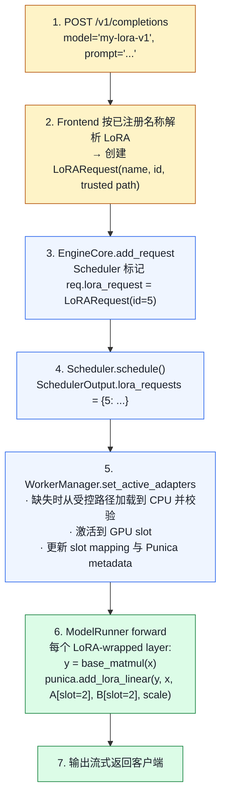

# 04. LoRA Serving：一个 base model 服务多个微调版本

> **谁该读这一篇？** 做多租户微调服务、希望同一 base model 复用多个 adapter 的应用工程师；想理解 Punica batched kernel 的引擎贡献者。
>
> **前置阅读：** [`04-model-runner.md`](../03-code-walkthrough/04-model-runner.md)、[`02-smart-routing-and-load-balancing.md`](../08-production-deployment/02-smart-routing-and-load-balancing.md)（LoRA-aware routing）
>
> **耗时：** 约 25 分钟
>
> **难度：** 进阶
>
> **当前性说明：** 本章按 vLLM `b23bd73f540175f9e117eaee5029cd7d8df63964` 静态复核；支持的 target module、rank、量化 / MoE / 多模态组合与 kernel 路径需按目标模型和硬件重测。
>
> **学完能：**
>
> 1. 解释 Punica 思想如何让多 LoRA batching 仍然高效
> 2. 描述 LoRAModelManager 注册 / 激活 / LRU swap 的关键状态
> 3. 在白板上画出 LoRA-wrapped Linear 的 forward
> 4. 选择 `max_loras` 与了解 LoRA 与量化、投机解码、prefix caching 的关系

vLLM 的 multi-LoRA serving 让同一 base model 的 batch 可以路由到不同 adapter，核心是 **LoRAModelManager + Punica wrapper**。能装多少、能同时激活多少、性能是否接近 base-only，都取决于 adapter 形状、`max_loras` / `max_cpu_loras`、目标模块、batch 构成与硬件，不能用固定“每卡几十个”概括。

---

## 1. LoRA 基础（30 秒回顾）

LoRA = Low-Rank Adaptation。微调时不动 base weight $W$，而是新增两个低秩矩阵 $A$、$B$，rank $r$ 远小于主维度：

$$\Delta W = B A, \quad W_{\text{eff}} = W + \frac{\alpha}{r} \, B A$$

$$\text{output} = x \, W_{\text{eff}} = x W + \frac{\alpha}{r} \, x B A$$

adapter 参数量通常小于 base model，但实际字节数由 target module、层数、rank、dtype、embedding / lm-head 扩展和分片方式决定；必须从真实 checkpoint 与加载后的 slot buffer 测量。

---

## 2. vLLM LoRA 目录结构

```
vllm/lora/
├── model_manager.py        ← LoRAModelManager — 主入口
├── worker_manager.py       ← Worker 侧的代理
├── lora_model.py           ← 解析单个 adapter 文件
├── lora_weights.py         ← Adapter 权重容器
├── peft_helper.py          ← PEFT 格式适配
├── request.py              ← LoRARequest dataclass
├── resolver.py             ← 解析 lora_path → 本地 / HuggingFace / S3
├── layers/                 ← 每种 Linear 的 LoRA 包装层
│   ├── base.py
│   ├── base_linear.py
│   ├── column_parallel_linear.py
│   ├── row_parallel_linear.py
│   ├── replicated_linear.py
│   ├── vocal_parallel_embedding.py
│   ├── fused_moe.py        ← MoE 的 LoRA（DeepSeek 等）
│   └── logits_processor.py
├── punica_wrapper/         ← 批量 LoRA matmul kernel 入口
│   ├── punica_base.py      ← 抽象接口
│   ├── punica_gpu.py       ← GPU 实现（CUDA 内核）
│   └── punica_cpu.py / punica_tpu.py / ...
└── ops/                    ← Triton 实现的 punica kernel
```

---

## 3. 难点：多 LoRA batching

朴素做法：每个请求带不同 LoRA → batch 内不能合并 matmul，因为每行用不同 `delta_W`。这会让 batching 失效。

**Punica 思想**（论文 Punica: Multi-Tenant LoRA Serving, Chen et al.）：

- batch 还是合并跑 `x · W`
- 然后 batched 算 `delta_y = x · B · A`：每行用各自的 `B_i, A_i`，但 kernel 内部按 `lora_id` 索引
- 输出 `y = x·W + delta_y`

这样 base matmul 一次大 GEMM，LoRA 增量是个**分段 GEMM**（per-token 用各自小矩阵），仍能并行。

---

## 4. LoRAModelManager：核心数据结构

<!-- vllm-source: {"path":"vllm/lora/model_manager.py","symbol":"LoRAModelManager"} -->
[源码锚点：vllm/lora/model_manager.py · LoRAModelManager](https://github.com/vllm-project/vllm/blob/b23bd73f540175f9e117eaee5029cd7d8df63964/vllm/lora/model_manager.py#L71)

`vllm/lora/model_manager.py`，关键属性：

```python
class LoRAModelManager:
    def __init__(self, model, max_num_seqs, max_num_batched_tokens,
                 vocab_size, lora_config, device, punica_wrapper):
        self.lora_index_to_id: list[int | None]            # GPU "slot" → adapter id
        self.lora_slots: int                                # 最大同时活跃 adapter 数（默认 = max_loras）
        self._registered_adapters: dict[int, LoRAModel]    # adapter_id → 权重
        self._active_adapters: dict[int, None]             # 当前在 slot 里的
        self.punica_wrapper: PunicaWrapperBase             # GPU/CPU/TPU 一份
```

注意 **GPU slot 数不等于可注册 adapter 数**：`max_loras` 是单 batch 可用的 LoRA 数 / 活跃 slot 容量，默认 1；`max_cpu_loras` 是注册 cache 容量，默认等于 `max_loras` 且不得更小。只有使用 LRU manager 时，超过活跃 slot 的时间局部性才通过换入换出处理。

### 4.1 activate_adapter

```python
def activate_adapter(self, lora_id, ...):
    if lora_id in self._active_adapters:
        return False  # 已激活

    # 基类只找空 slot；没有空 slot就报错
    index = self._next_free_slot()
    if index is None:
        raise ValueError("No free lora slots")

    # 把 adapter 权重 copy 到 GPU slot
    lora_model = self._registered_adapters[lora_id]
    for module_name, lora_module in self.modules.items():
        lora_module.set_adapter(index, lora_model.get_lora(module_name))

    self.lora_index_to_id[index] = lora_id
    self._active_adapters[lora_id] = None
```

### 4.2 _set_adapter_mapping

每步告诉 punica wrapper："本步 batch 内每个 token 属于哪个 adapter slot"：

```python
def _set_adapter_mapping(self, mapping: LoRAMapping):
    # mapping.index_mapping: [num_tokens] —— 每 token 用第几个 slot
    # mapping.prompt_mapping: prompt 段的 slot
    self.punica_wrapper.update_metadata(mapping, self.lora_index_to_id, ...)
```

ModelRunner 在每步 forward 前调这个。

---

## 5. LRUCacheLoRAModelManager：自动换入换出

<!-- vllm-source: {"path":"vllm/lora/model_manager.py","symbol":"LRUCacheLoRAModelManager"} -->
[源码锚点：vllm/lora/model_manager.py · LRUCacheLoRAModelManager](https://github.com/vllm-project/vllm/blob/b23bd73f540175f9e117eaee5029cd7d8df63964/vllm/lora/model_manager.py#L1176)

`model_manager.py`：

```python
class LRUCacheLoRAModelManager(LoRAModelManager):
    """CPU 注册 cache 与 GPU active cache 分别使用 LRU 容量。"""

    def activate_adapter(self, lora_id):
        # 命中：lookup + 标记 recent
        # 未命中：evict 最旧 → load 新 adapter 到 GPU
```

注册 adapter 先在 CPU 加载并校验，激活时写入 GPU slot；CPU cache 超过 `max_cpu_loras`、GPU active cache 超过 `max_loras` 时分别淘汰最旧未 pin 项。`pin_adapter` 会同时 pin CPU 与 GPU cache，若滥用可能让后续加载因无可淘汰项失败。容量应以实际工作集与内存预算决定，不能承诺固定 adapter 数。

---

## 6. PunicaWrapper：批量 LoRA matmul

<!-- vllm-source: {"path":"vllm/lora/punica_wrapper/punica_base.py","symbol":"PunicaWrapperBase"} -->
[源码锚点：vllm/lora/punica_wrapper/punica_base.py · PunicaWrapperBase](https://github.com/vllm-project/vllm/blob/b23bd73f540175f9e117eaee5029cd7d8df63964/vllm/lora/punica_wrapper/punica_base.py#L124)

`vllm/lora/punica_wrapper/punica_base.py` 抽象：

```python
class PunicaWrapperBase:
    def add_lora_linear(self, y, x, lora_a_stacked, lora_b_stacked, scale, ...):
        """y += scale * x @ A @ B，按 token 的 lora_id 路由"""

    def add_shrink(self, y, x, lora_a_stacked, scale):
        """中间步：y = scale * x @ A，输出 [N, r] (r=rank)"""

    def add_expand(self, y, x, lora_b_stacked, ...):
        """中间步：y += x @ B"""

    def add_lora_logits(self, y, x, lora_a_stacked, lora_b_stacked, scale):
        """LM head 的 LoRA（vocab parallel）"""
```

GPU 实现 `punica_gpu.py` 内部调 Triton kernel：

- `bgmv_shrink`：batched grouped matmul vec（shrink 段）
- `bgmv_expand`：批量 expand
- 已融合到一个 kernel 减少 launch 数

GPU 路径会根据平台、dtype、rank 与层类型选择相应实现。不要从抽象接口推导“任意 rank、任意量化、任意 MoE 格式都能混跑”；加载阶段的 `PEFTHelper.validate_legal`、`max_lora_rank` 与模型支持模块共同限定契约。

---

## 7. LoRA 包装层：每种 Linear 一个版本

`vllm/lora/layers/` 里每种 Linear 都有 LoRA 版本：

```
Linear (vllm/model_executor/layers/linear.py)
   │
   ├── ColumnParallelLinear  ← LoRA: column_parallel_linear.py
   ├── RowParallelLinear     ← LoRA: row_parallel_linear.py
   ├── ReplicatedLinear      ← LoRA: replicated_linear.py
   └── MergedColumnParallelLinear (QKV pack 合并)
        └── LoRA 要分别处理 QKV 各自的 adapter
```

`LoRAModelManager._create_lora_modules` 扫描模型，匹配目标 module，并把支持的层替换 / 连接到 LoRA wrapper。`target_modules` 可以在部署时限制后缀；未支持、被模型跳过或找不到对应 Punica wrapper 的 module 不应假定会自动生效。

包装层 forward 大致：

```python
class ColumnParallelLinearWithLoRA(...):
    def forward(self, x):
        y = self.base_layer(x)                          # 大 matmul
        self.punica_wrapper.add_lora_linear(
            y, x, self.lora_a_stacked, self.lora_b_stacked,
            self.scaling,
        )                                              # LoRA 增量
        return y
```

base matmul 没变，多了个 LoRA 增量 op。

---

## 8. WorkerManager：和 Worker 的接口

`vllm/lora/worker_manager.py` 是 EngineCore → Worker 的 RPC 接口：

```python
class LRUCacheWorkerLoRAManager:
    def add_adapter(self, lora_request) -> bool: ...
    def remove_adapter(self, lora_id): ...
    def pin_adapter(self, lora_id): ...    # 防止 LRU 驱逐
    def list_adapters(self) -> set[int]: ...
    def set_active_adapters(self, requests, mapping): ...
```

每步 Scheduler 把"本步要服务的 adapter id 列表"传过来，WorkerManager 确保它们都活跃。

---

## 9. 一次请求的 LoRA 路径



---

## 10. 与 Smart Router 的协同

参见 `08-production-deployment/02-smart-routing-and-load-balancing.md` 第 6 节。

**LoRA-aware routing 策略**：

- Router 维护"每 Pod 当前激活哪些 adapter"的视图
- 路由请求时优先选**该 adapter 已激活**的 Pod
- 否则可能触发加载 / 激活与 LRU 淘汰，代价取决于 checkpoint、存储、CPU cache 与 GPU copy

实现：

路由器需要从经过验证的 inventory / telemetry 获得“已注册、已激活、正在加载、失败冷却”等状态；具体 metric 名称与第三方路由能力不是 vLLM LoRA manager 的稳定 API，应按部署栈核准。

---

## 11. 工程要点

### 11.1 max_loras 怎么选
`max_loras` 同时限制单 batch 内 LoRA 数与 GPU active slot；`max_cpu_loras` 限制注册 cache，必须不小于前者。slot 字节数应从各 wrapper 为 target modules 分配的 stacked A / B buffer、dtype、最大 rank、额外 vocab 与分片布局求和，再用实际显存 profile 校验。过大挤压 KV / activation 空间，过小则让不同 adapter 的并发无法进入同一步或增加工作集切换。

### 11.2 加载延迟
首次注册需要解析路径、读取 PEFT 配置 / 权重、在 CPU 构造并校验 adapter；激活再写入 GPU slot。冷延迟取决于本地 / 远端 resolver、文件系统、checkpoint 大小、TP rank 和 GPU copy，不能套固定秒数。建议：

- 热门 adapter 启动时**预加载**
- LRU 别太激进（cache miss 痛）

### 11.3 同 batch 跨 adapter 是真正并发吗
Punica 的 mapping 让同一 batch 的 token 指向不同 slot，base matmul 仍批处理，LoRA 增量按映射执行。但增量 kernel、metadata、padding、rank、adapter 混合度和 batch 碎片都会产生成本；是否接近 base-only 必须用目标流量分布测量。

### 11.4 LoRA + 量化
不能笼统称为“正交”。base quantization method、layer wrapper、MoE 格式、平台 kernel 与 `lora_dtype` 必须形成受支持组合；`lora_dtype=auto` 跟随 base model dtype。加载成功只证明形状 / 配置过关，精度与性能仍需对照未量化基线。

### 11.5 LoRA + 投机解码
draft 与 target 是否使用同一 adapter 会改变 proposal 分布与接受率。即便最终验证由 target 完成，也不能据此保证所有 speculative method、LoRA 路径和并行组合都受支持；应检查启动校验，并分别比较正确性、接受率与端到端吞吐。

### 11.6 加载 API 与安全边界
静态 adapter 应通过启动配置 `--lora-modules` 注册，客户端请求只选择服务端已公布的 model 名称。运行时端点是 `/v1/load_lora_adapter` 与 `/v1/unload_lora_adapter`，只有设置 `VLLM_ALLOW_RUNTIME_LORA_UPDATING=1` 才挂载；当前代码明确警告它**仅用于本地开发**，并禁止与 `api_server_count > 1` 组合。

不要允许普通推理请求携带任意 `lora_path`。路径 / resolver 访问意味着文件或网络读取，还会改变所有请求共享的 worker 内存状态；生产控制面必须做强认证授权、名称唯一性、base compatibility、来源 allowlist、checkpoint 签名 / hash、大小配额、并发锁、审计与回滚。完整边界见 [`11-security-and-multi-tenancy.md`](../08-production-deployment/11-security-and-multi-tenancy.md)。

---

## 12. 工程自检问答

**Q: vLLM 怎么做到一个 batch 跨多个 LoRA 仍能高吞吐？**
A: Punica kernel：base matmul 还是一次大 GEMM，LoRA 增量按 token 的 `lora_id` 路由到对应 `B_i, A_i`。每 batch 内部分段并行执行 LoRA 部分，是个 batched grouped GEMM。

**Q: max_loras 设小了会怎样？**
A: 单步不能容纳超过 `max_loras` 个不同 adapter；时间上的活跃工作集超过 slot 时，LRU manager 会淘汰并重新激活。表现可能是 batch 分割、adapter thrash、TTFT 与 CPU / GPU copy 上升。应从真实 metrics inventory 选择注册数、active 数、加载 / 激活时延和失败计数，不能假定固定 metric 名。

**Q: 怎么动态加 / 卸 adapter？**
A: 静态使用 `--lora-modules`。运行时端点全名是 `/v1/load_lora_adapter` / `/v1/unload_lora_adapter`，须显式启用危险开关，而且源码只把它定位为本地开发能力；普通推理请求不应传任意路径触发加载。

**Q: 多 LoRA 与 K8s 自动扩缩怎么协同？**
A: 单个 Pod 服务多 LoRA → 减少 Pod 副本，提高 GPU 利用率。但 Smart Router 必须感知"哪 Pod 有哪些 adapter"，否则 swap 抖动。

**Q: LoRA 的 prefix caching 怎么工作？**
A: block_hash 的 extra_keys 含 LoRA adapter id。同一段 prompt 用不同 LoRA 是**不同 cache entry**（KV 内容确实不同，必须分开）。

---

## 13. 最小可复现实验与失败证据

准备至少三个 adapter：两个 rank / target module 不同但合法，一个故意与 base 不兼容。固定 prompt 集，比较 base-only、单 LoRA、混合 LoRA：

1. 扫描不同 `max_loras` / `max_cpu_loras` 与 adapter 热度分布，记录每步 adapter 混合度、注册 / 激活 / 淘汰、TTFT、吞吐和各 rank 显存。
2. 冷加载、CPU cache 命中、GPU active 命中分别测量；把存储延迟与 GPU copy 分开。
3. 对同一 prompt 切换 adapter，验证输出、prefix-cache 隔离与删除 / 重载后的版本一致性。
4. 对计划使用的量化、TP / EP、MoE、多模态和投机组合逐一跑启动、正确性与性能门禁。

失败注入至少包括：不存在 / 越界路径、损坏 checkpoint、base / target module / rank 不兼容、CPU cache 和 active cache 全部被 pin、同名并发更新、加载中取消以及 worker 部分失败。保留 adapter name、不可变版本 / hash、base model revision、PEFT config、每 rank 日志、控制面审计记录和加载前后 inventory；不要在日志泄露凭证化路径。

> **生产取舍：** 增大 CPU cache 降低磁盘读取，却增加 host memory；增大 active slot 减少换入，却挤占 KV cache；LoRA-aware routing 提高命中，却可能导致热点 Pod。版本化静态发布通常比开放运行时加载更容易审计和回滚。

> **硬件验证状态：** 本章完成锁定 SHA 的静态源码复核；未在当前 SHA 上执行 GPU Punica / LoRA 基准，因此不提供固定 adapter 数、显存、加载时间或 base-only 性能差值。

---

## 小结

- Punica 让 base matmul 仍然一次大 GEMM，LoRA 增量按 token `lora_id` 路由到 per-slot `A/B` 小矩阵，实现真正的跨 adapter batching。
- LoRAModelManager 区分 CPU 注册 cache 与 GPU active slot；LRU manager 分别按 `max_cpu_loras` / `max_loras` 淘汰，pin 会改变可淘汰性。
- 每种 Linear 都有 LoRA wrapper 版本（column/row parallel、replicated、fused MoE、logits），都接到 PunicaWrapper。
- `max_loras` 决定单 batch LoRA 上限与 active slot；容量必须从真实 adapter buffer、工作集与 KV 预算测量。
- LoRA-aware routing 可减少冷加载，但控制面 inventory、路径信任、版本审计与失败回滚同样是生产契约。

## 自检

1. 一个 batch 内有 3 个不同 LoRA 的请求，PunicaWrapper 的 `index_mapping` 大概长什么样？
2. `max_loras=8` 但当前队列有 12 个 adapter 时，为什么“单步上限”与“时间上的 LRU 淘汰”要分开分析？
3. 同一 prompt 用 LoRA A 和 LoRA B 命中的是同一段 prefix cache 吗？为什么？
4. 开放运行时 LoRA path 为什么会扩大文件 / 网络与共享 worker 状态的攻击面？

### 参考答案

1. `index_mapping` 会把 batch 中每个 token/sequence 映射到对应 LoRA slot，例如 base 请求映射到 0，LoRA A 的若干 token 映射到 slot 1，LoRA B 映射到 slot 2；Punica kernel 据此选择 adapter 权重，避免为每个 LoRA 拆成独立 batch。
2. `max_loras=8` 是单个 step/执行批次同时活跃的硬上限；队列有 12 个 adapter 时，另外 4 个可能等待、被分批或触发加载/淘汰。LRU 是跨时间的驻留策略，决定哪些 adapter 保留在 GPU/CPU，不能把一次 step 上限当成长期容量。
3. 通常不能直接命中同一 prefix，因为 LoRA adapter 会改变隐状态和 KV；cache key 应包含 LoRA identity/version。只有明确证明某段计算完全不受 adapter 影响并设计了安全 namespace，才可共享部分 cache。
4. 运行时 path 允许请求触发任意文件读取、下载、解压和动态加载，扩大 SSRF、路径穿越、恶意制品、资源耗尽与共享 worker 状态污染风险。应使用签名/allowlist 制品、沙箱、配额、强鉴权、审计和可回滚加载流程。

## 下一步

- 下一节：[`05-embedding-and-pooling.md`](./05-embedding-and-pooling.md)（vLLM 不只是 generative）
- 想看源码：`vllm/lora/`（model_manager、punica_wrapper、layers、ops 全套）
- 想从生产视角理解：[`08-production-deployment/02-smart-routing-and-load-balancing.md`](../08-production-deployment/02-smart-routing-and-load-balancing.md)（LoRA-aware routing）

---

## Sources

<!-- vllm-source: {"path":"vllm/lora/model_manager.py","symbol":"LoRAModelManager"} -->
[源码锚点：vllm/lora/model_manager.py · LoRAModelManager](https://github.com/vllm-project/vllm/blob/b23bd73f540175f9e117eaee5029cd7d8df63964/vllm/lora/model_manager.py#L71)
<!-- vllm-source: {"path":"vllm/lora/model_manager.py","symbol":"LoRAModelManager.activate_adapter"} -->
[源码锚点：vllm/lora/model_manager.py · LoRAModelManager.activate_adapter](https://github.com/vllm-project/vllm/blob/b23bd73f540175f9e117eaee5029cd7d8df63964/vllm/lora/model_manager.py#L301)
<!-- vllm-source: {"path":"vllm/lora/model_manager.py","symbol":"LoRAModelManager._set_adapter_mapping"} -->
[源码锚点：vllm/lora/model_manager.py · LoRAModelManager._set_adapter_mapping](https://github.com/vllm-project/vllm/blob/b23bd73f540175f9e117eaee5029cd7d8df63964/vllm/lora/model_manager.py#L360)
<!-- vllm-source: {"path":"vllm/lora/model_manager.py","symbol":"LRUCacheLoRAModelManager"} -->
[源码锚点：vllm/lora/model_manager.py · LRUCacheLoRAModelManager](https://github.com/vllm-project/vllm/blob/b23bd73f540175f9e117eaee5029cd7d8df63964/vllm/lora/model_manager.py#L1176)

- `vllm/lora/model_manager.py` (LoRAModelManager / LRUCacheLoRAModelManager)
<!-- vllm-source: {"path":"vllm/lora/punica_wrapper/punica_base.py","symbol":"PunicaWrapperABC"} -->
[源码锚点：vllm/lora/punica_wrapper/punica_base.py · PunicaWrapperABC](https://github.com/vllm-project/vllm/blob/b23bd73f540175f9e117eaee5029cd7d8df63964/vllm/lora/punica_wrapper/punica_base.py#L22)
<!-- vllm-source: {"path":"vllm/lora/punica_wrapper/punica_base.py","symbol":"PunicaWrapperBase"} -->
[源码锚点：vllm/lora/punica_wrapper/punica_base.py · PunicaWrapperBase](https://github.com/vllm-project/vllm/blob/b23bd73f540175f9e117eaee5029cd7d8df63964/vllm/lora/punica_wrapper/punica_base.py#L124)
<!-- vllm-source: {"path":"vllm/lora/punica_wrapper/punica_base.py","symbol":"PunicaWrapperBase._update_base_metadata"} -->
[源码锚点：vllm/lora/punica_wrapper/punica_base.py · PunicaWrapperBase._update_base_metadata](https://github.com/vllm-project/vllm/blob/b23bd73f540175f9e117eaee5029cd7d8df63964/vllm/lora/punica_wrapper/punica_base.py#L168)

- `vllm/lora/punica_wrapper/punica_base.py` (interface)
- `vllm/lora/punica_wrapper/punica_gpu.py`
- `vllm/lora/layers/{column_parallel_linear,row_parallel_linear,fused_moe,logits_processor}.py`
- `vllm/lora/worker_manager.py`
- `vllm/lora/request.py`、`peft_helper.py`、`resolver.py`
- `vllm/lora/ops/`（Triton bgmv kernels）
- `vllm/config/lora.py`（`LoRAConfig` 的 CPU / GPU 容量与 dtype 契约）
- `vllm/entrypoints/serve/lora/api_router.py`（运行时端点与开发环境警告）

---

## See also

- `08-production-deployment/02-smart-routing-and-load-balancing.md` —— LoRA-aware routing
- `02-core-concepts/04-prefix-caching.md` —— extra_keys 的 LoRA 字段
- `04-optimizations/01-quantization.md` —— 核准 LoRA 与量化组合的 backend / layer 支持
