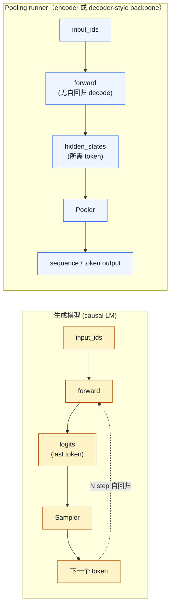
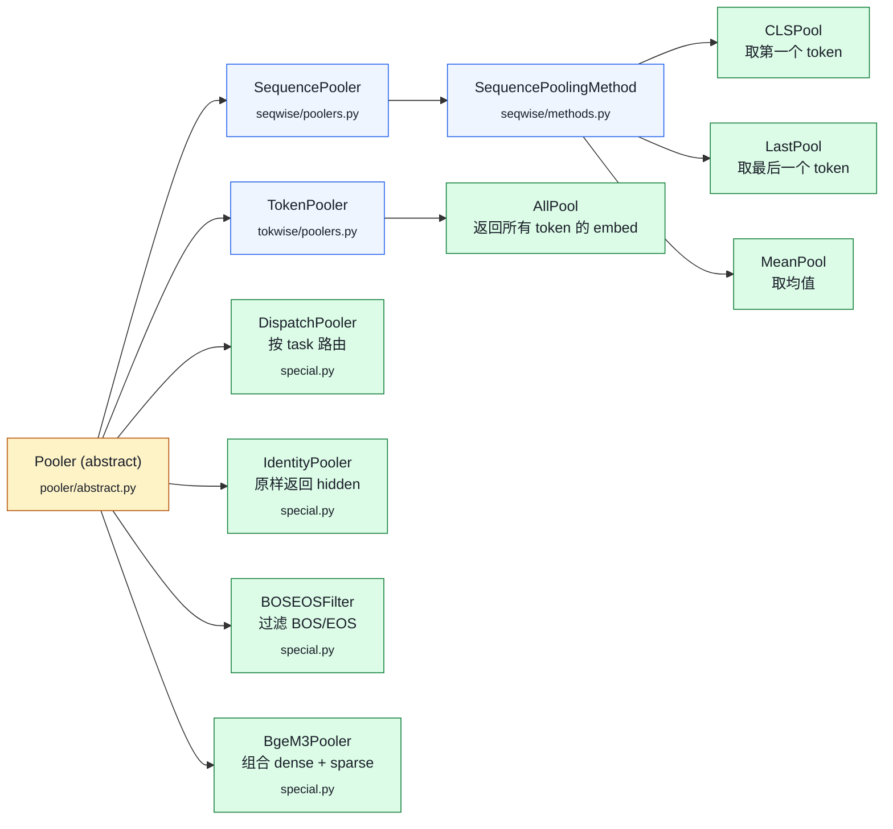
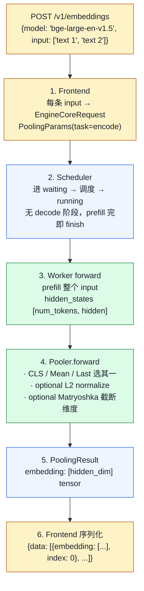

# 05. Embedding / Pooling 模型：vLLM 不只能做生成

> **谁该读这一篇？** 用 vLLM 替代 sentence-transformers 跑 embedding / reranker / 分类的应用开发者；做 RAG 后端的工程师。
>
> **前置阅读：** [`04-model-runner.md`](../03-code-walkthrough/04-model-runner.md)、[`01-sampling-and-logits.md`](./01-sampling-and-logits.md)（了解 sampling 这一支才能理解 pooling 是怎么替换的）
>
> **耗时：** 约 25 分钟
>
> **难度：** 进阶
>
> **当前性说明：** 本章按 vLLM `b23bd73f540175f9e117eaee5029cd7d8df63964` 静态复核；endpoint 是否挂载、pooling task、归一化与 score 语义都由目标模型 / pooler 决定。
>
> **学完能：**
>
> 1. 解释 pooling runner 复用了哪些引擎能力，以及为什么不能预设固定加速倍数
> 2. 在 sequence-level 与 token-level 输出、CLS / Mean / Last / All / Step 中正确选型
> 3. 描述 BGE-M3 的 dense、sparse、ColBERT 任务怎样由不同 pooler 分支暴露
> 4. 区分 bi-encoder（embedding）与 cross-encoder（reranker）的部署方式

pooling runner 复用 vLLM 的调度、模型执行与平台 attention backend，把自回归采样出口换成 sequence-level 或 token-level pooler。它可服务 embedding、分类、score / rerank 与模型插件任务，但支持面由模型实现决定。相对其他 serving 栈的性能没有固定倍数，必须在相同模型 revision、dtype、输入分布、batching 与输出语义下比较。

---

## 1. Embedding 与生成模型的差异



vLLM 的处理：

- engine / scheduler / attention backend 与请求生命周期复用；KV cache 形式取决于模型 attention type
- 不走 sampling 路径，改走 pooling 路径
- 没有逐 token 自回归 decode；长输入仍可能分 step / chunk 调度，完成整段所需 hidden state 后才返回最终 pooling 输出

---

## 2. Pooler 类层级

`vllm/model_executor/layers/pooler/`：

<!-- vllm-source: {"path":"vllm/model_executor/layers/pooler/abstract.py","symbol":"Pooler"} -->
[源码锚点：vllm/model_executor/layers/pooler/abstract.py · Pooler](https://github.com/vllm-project/vllm/blob/b23bd73f540175f9e117eaee5029cd7d8df63964/vllm/model_executor/layers/pooler/abstract.py#L16)
<!-- vllm-source: {"path":"vllm/model_executor/layers/pooler/seqwise/poolers.py","symbol":"SequencePooler"} -->
[源码锚点：vllm/model_executor/layers/pooler/seqwise/poolers.py · SequencePooler](https://github.com/vllm-project/vllm/blob/b23bd73f540175f9e117eaee5029cd7d8df63964/vllm/model_executor/layers/pooler/seqwise/poolers.py#L44)
<!-- vllm-source: {"path":"vllm/model_executor/layers/pooler/seqwise/methods.py","symbol":"SequencePoolingMethod"} -->
[源码锚点：vllm/model_executor/layers/pooler/seqwise/methods.py · SequencePoolingMethod](https://github.com/vllm-project/vllm/blob/b23bd73f540175f9e117eaee5029cd7d8df63964/vllm/model_executor/layers/pooler/seqwise/methods.py#L21)
<!-- vllm-source: {"path":"vllm/model_executor/layers/pooler/tokwise/poolers.py","symbol":"TokenPooler"} -->
[源码锚点：vllm/model_executor/layers/pooler/tokwise/poolers.py · TokenPooler](https://github.com/vllm-project/vllm/blob/b23bd73f540175f9e117eaee5029cd7d8df63964/vllm/model_executor/layers/pooler/tokwise/poolers.py#L48)
<!-- vllm-source: {"path":"vllm/model_executor/layers/pooler/special.py","symbol":"DispatchPooler"} -->
[源码锚点：vllm/model_executor/layers/pooler/special.py · DispatchPooler](https://github.com/vllm-project/vllm/blob/b23bd73f540175f9e117eaee5029cd7d8df63964/vllm/model_executor/layers/pooler/special.py#L25)
<!-- vllm-source: {"path":"vllm/model_executor/layers/pooler/special.py","symbol":"IdentityPooler"} -->
[源码锚点：vllm/model_executor/layers/pooler/special.py · IdentityPooler](https://github.com/vllm-project/vllm/blob/b23bd73f540175f9e117eaee5029cd7d8df63964/vllm/model_executor/layers/pooler/special.py#L140)
<!-- vllm-source: {"path":"vllm/model_executor/layers/pooler/special.py","symbol":"BOSEOSFilter"} -->
[源码锚点：vllm/model_executor/layers/pooler/special.py · BOSEOSFilter](https://github.com/vllm-project/vllm/blob/b23bd73f540175f9e117eaee5029cd7d8df63964/vllm/model_executor/layers/pooler/special.py#L152)
<!-- vllm-source: {"path":"vllm/model_executor/layers/pooler/special.py","symbol":"BgeM3Pooler"} -->
[源码锚点：vllm/model_executor/layers/pooler/special.py · BgeM3Pooler](https://github.com/vllm-project/vllm/blob/b23bd73f540175f9e117eaee5029cd7d8df63964/vllm/model_executor/layers/pooler/special.py#L202)



<!-- vllm-source: {"path":"vllm/model_executor/layers/pooler/activations.py","symbol":"PoolerActivation"} -->
[源码锚点：vllm/model_executor/layers/pooler/activations.py · PoolerActivation](https://github.com/vllm-project/vllm/blob/b23bd73f540175f9e117eaee5029cd7d8df63964/vllm/model_executor/layers/pooler/activations.py#L79)

PoolerActivation（`activations.py`）后处理：

- `PoolerIdentity`：原样输出
- `PoolerNormalize`：L2 normalize；启用后 dot product 可直接表示 cosine，关闭时调用方必须遵守模型的相似度契约
- `PoolerClassify` / `PoolerMultiLabelClassify`：分类头

---

## 3. 三种 pooling 方法该选哪个

| Pooling | 含义                    | 典型模型                |
| ------- | --------------------- | ------------------- |
| CLS     | 取首 token 的 hidden | 训练配置指定首 token 汇聚的模型 |
| Mean    | 按有效 token 聚合均值 | 训练配置指定 mean pooling 的模型 |
| Last    | 取最后一个有效 token | 训练配置指定 last-token 表示的模型 |

不同模型训练 / 导出时的 pooling、prompt 模板与归一化是检索质量契约。vLLM 用 `--runner auto` 解析模型类型，也可显式 `--runner pooling`；`PoolerConfig` 中 `seq_pooling_type` / `tok_pooling_type` 是内部明确字段，兼容入口 `pooling_type` 只会解析到其中一类。覆盖默认值前要先读取模型配置并做离线评估。

---

## 4. PoolingParams：API 入口

`vllm/pooling_params.py`：

```python
class PoolingParams(msgspec.Struct):
    use_activation: bool | None = None
    dimensions: int | None = None
    step_tag_id: int | None = None
    returned_token_ids: list[int] | None = None
    task: PoolingTask | None = None
    requires_token_ids: bool = False
    skip_reading_prefix_cache: bool | None = None
    late_interaction_params: LateInteractionParams | None = None
    output_kind = RequestOutputKind.FINAL_ONLY
```

当前 pooling tasks 包括 `embed`、`classify`、`token_embed`、`token_classify`、`plugin` 与复合的 `embed&token_classify`。`dimensions` 只对 embedding 类 task 有效，并会检查模型是否声明 Matryoshka 支持；pooling 输出只允许 `FINAL_ONLY`。

API router 按模型支持 task 有条件挂载：`/v1/embeddings`（另有 Cohere `/v2/embed`）、`/classify`、`/score`、`/rerank` 与通用 `/pooling`。`/v1/score`、`/v1/rerank` 仍存在但会提示使用不冒充 OpenAI 标准的无 `/v1` 路径；调用方不应假定所有 pooling 模型都暴露所有 endpoint。

---

## 5. 引擎层：Pool 替代 Sample

`vllm/v1/pool/` 包含 pool task 的 metadata + 后处理。

`ModelConfig.runner_type` 决定该 engine 实例走 `generate` 还是 `pooling`；pooling runner 在请求加入 persistent batch 时，让模型 pooler 校验 task 并更新 `PoolingParams`。forward 完成后走 `_pool`：

```python
def _pool(self, hidden_states, ...):
    assert num_reqs == len(self.input_batch.pooling_params)
    pooling_metadata = self.input_batch.get_pooling_metadata()
    pooling_metadata.build_pooling_cursor(...)
    raw_output = model.pooler(hidden_states, pooling_metadata)
    return ModelRunnerOutput(pooler_output=copy_finished_to_cpu(raw_output))
```

同一个 runner batch 要么全部是 pooling 请求，要么不是；一个生成模型实例与另一个 embedding 模型实例也不会因为在同一台机器就自动共 batch。

---

## 6. 一次 embedding 请求生命周期



---

## 7. 为什么可能更快，以及如何公平比较

| 维度          | sentence-transformers | vLLM                       |
| ----------- | --------------------- | -------------------------- |
| Batching    | 用户自己组 batch          | continuous batching 自动     |
| Attention   | 取决于所用 PyTorch / HF backend | 取决于模型、平台与 vLLM backend 选择 |
| padding / 调度 | 取决于调用方 batching | scheduler 可跨请求聚合不同长度输入 |
| dtype / 量化 | 取决于部署实现 | 仅可使用目标模型与平台明确支持的组合 |
| 并发 | 由外部队列 / batcher 决定 | engine scheduler 统一管理请求 |
| 输出 | 必须固定 pooling / normalize / truncation | 必须保持同一语义才能比较 |

公平 benchmark 应固定 tokenized inputs、输出 dtype / 维度、pooling 与 normalize、warmup、并发和 SLO，再分别报告短 / 长文本的吞吐与 p50 / p99。若另一侧没有动态 batching，测到的差异主要是 serving architecture，而不只是 kernel。

---

## 8. BGE-M3：多任务 pooler 范例

BGE-M3 输出 3 种表示：

- Dense（CLS pool + normalize）
- Sparse（每 token 计算稀疏权重）
- ColBERT（per-token embedding for late interaction）

<!-- vllm-source: {"path":"vllm/model_executor/layers/pooler/special.py","symbol":"BgeM3Pooler"} -->
[源码锚点：vllm/model_executor/layers/pooler/special.py · BgeM3Pooler](https://github.com/vllm-project/vllm/blob/b23bd73f540175f9e117eaee5029cd7d8df63964/vllm/model_executor/layers/pooler/special.py#L202)

当前 `RobertaForMaskedLM` 的 BGE-M3 路径用 `DispatchPooler` 暴露不同 task：

- `embed`：sequence embedding（dense）
- `token_embed`：经 `colbert_linear` 的 token embedding，并过滤相应特殊 token
- `token_classify`：经 `sparse_linear` + ReLU 的 token score
- `embed&token_classify`：`BgeM3Pooler` 把 dense 向量与展平的 sparse token score 串接

因此 `BgeM3Pooler` 本身不是返回 `{"dense", "sparse", "colbert"}` 的三字段容器；ColBERT 是独立的 `token_embed` 分支：

```python
class BgeM3Pooler(Pooler):
    def forward(self, hidden_states, pooling_metadata):
        dense_outputs = self.embed_pooler(hidden_states, metadata)
        sparse_outputs = self.token_classify_pooler(hidden_states, metadata)
        return [cat(dense.view(-1), sparse.view(-1))
                for dense, sparse in zip(dense_outputs, sparse_outputs)]
```

---

## 9. Late Interaction（ColBERT）

`vllm/v1/pool/late_interaction.py` 实现 ColBERT 的 token-level 相似度。

给定 query embedding 形状 $[L_q, d]$ 和 doc embedding 形状 $[L_d, d]$（每行是一个 token 的 embedding），score 是 **MaxSim**——每个 query token 找它在 doc 里相似度最大的 token，再求和：

$$\text{score}(q, d) = \sum_{i=1}^{L_q} \max_{j=1, \ldots, L_d} \, q_i \cdot d_j$$

这是 late-interaction score 的核心，不等同于所有 reranker：cross-encoder 通常直接输出 sequence score。当前 serving 可把 query token embeddings 缓存在 worker 进程，并把同一 query 的 document 请求路由到同一 engine，在 worker 侧计算 MaxSim；缓存是进程本地状态，必须考虑 query key、使用次数、取消与清理。

---

## 10. 与 paged attention 的关系

pooling runner 既可能包装 encoder-only 模型，也可能把 decoder-style 模型转换为 embedding runner，不能把两者的 attention / KV 语义混写。对 `AttentionType.ENCODER_ONLY`：

- 无 causal mask
- 一次 forward 完成
- attention 是双向的，并有专门的 `EncoderOnlyAttentionSpec`

当前 GPU runner 会把 encoder-only layer 加到 KV cache config，标为 runner-only attention layer；具体 backend / buffer 布局仍由平台选择。prefix caching 对 sequence-level pooling 可能有读复用价值，但 token-level `token_embed` / `token_classify` 默认 `skip_reading_prefix_cache=True`，因为命中前缀后拿不到被跳过 token 的逐 token 输出。结论应按模型 attention type 和输出粒度判断，不能概括为“pooling 不用 KV / prefix cache”。

---

## 11. 工程要点

### 11.1 batch 设计
先从真实 token 长度分布、输出粒度和 SLO 建模，再扫描 `max_num_batched_tokens` / `max_num_seqs`。增大 token budget 可能提高 GPU 利用率，也会增加单步工作量、排队和输出搬运；token-level embeddings 的返回体还可能成为显存、CPU copy 和网络瓶颈。

### 11.2 多 task 共存
DispatchPooler 让**同一个模型已实现的任务**按 `PoolingTask` 分派；不是任意模型都同时支持 embed / classify / score：

```python
class DispatchPooler(Pooler):
    def __init__(self, task_to_pooler: dict[PoolingTask, Pooler]):
        ...
    def forward(self, hidden, metadata):
        task = metadata.pooling_params.task
        return self.task_to_pooler[task](hidden, metadata)
```

### 11.3 Matryoshka 维度截取
`PoolingParams.dimensions = 256` 只有在模型声明 Matryoshka 支持，且（若给出）256 位于允许维度列表时才通过验证。截断后仍要按该模型契约处理 activation / normalize，并用目标检索集评估 recall、存储与 latency 取舍。

### 11.4 Rerank 部署
Reranker（cross-encoder）跟 embedding（bi-encoder）不一样：

- bi-encoder：分别 encode query / doc → 算相似度
- cross-encoder：拼接 `[CLS] query [SEP] doc` 一次 forward → 输出 score

vLLM 的 scoring frontend 根据 pooler task 映射为 bi-encoder、cross-encoder 或 late-interaction；`/score` / `/rerank` 是 API endpoint，不是 `PoolingTask` 字面值。部署前要核准 query / document 模板、截断方式、score activation / calibration 和分数方向。

---

## 12. 工程自检问答

**Q: 为什么 BGE 在 vLLM 上比 sentence-transformers 快？**
A: 不能先假定更快。vLLM 的潜在优势来自跨请求调度、所选 attention / model kernel 与支持的 dtype；结果还受输入长度、batching、输出搬运和对方 backend 影响。只能用同模型、同 token、同输出语义和同 SLO benchmark 得出结论。

**Q: embedding 模型用得到 PagedAttention 吗？**
A: 要看 attention type 与输出粒度。当前 encoder-only layer 有专用 cache spec；sequence-level pooling 可读取 prefix cache，而 token-level 输出默认跳过 prefix-cache read，以免丢失逐 token hidden output。不要从“无 decode”直接推出“不需要 cache”。

**Q: BGE-M3 三个输出怎么在 vLLM 里实现？**
A: `DispatchPooler` 分别提供 `embed`（dense）、`token_classify`（sparse）与 `token_embed`（ColBERT）；`BgeM3Pooler` 的复合 task 只拼接 dense + sparse，不包含 ColBERT。

**Q: Reranker 跟 embedding 怎么不同？**
A: bi-encoder 独立编码 query / document，再由相似度函数打分；cross-encoder 联合编码 pair，返回 sequence score；late-interaction 则保留 token embeddings 做 MaxSim。score 是否在 0–1、是否 activation / calibration，完全由模型和 pooler 配置决定。

**Q: Embedding 服务的容量怎么估？**
A: 用生产长度直方图分别测 sequence / token 输出，记录 tokens/s、requests/s、p50/p99、峰值显存、pooler / D2H / 序列化 / 网络成本和质量指标。再扫描 batch token 与并发，不应套用固定卡型 QPS。

---

## 13. 最小可复现实验与失败证据

固定模型 revision、tokenizer、prompt 模板与一份带标签的 query / document 数据集：

1. 核准 runner 解析结果、`get_supported_tasks()` 与实际挂载 endpoint；对不支持 task 验证明确失败。
2. 对 CLS / MEAN / LAST、activation / normalize、truncation、query / document 前缀做单变量实验，记录检索 recall / NDCG 或分类指标，性能比较必须保持语义相同。
3. 扫描长度、并发与 `max_num_batched_tokens`，分别记录 sequence-level 与 token-level 的 GPU、D2H、JSON 序列化和网络成本。
4. 若使用 Matryoshka，逐个允许维度比较质量、向量库容量与查询延迟；若使用 rerank，检查 score calibration 与排序稳定性。

失败证据至少覆盖：错误 runner、模型不支持的 task / endpoint、非法 Matryoshka 维度、超过最大长度、空输入、token-level 巨大响应、prefix-cache read 语义差异、query / document 模板反转。保存 tokenized input、pooler config、task、原始向量 / logits 的摘要、activation / normalize 设置、错误响应与 server 日志。

> **生产取舍：** 更大的动态 batch 提高吞吐却可能抬高尾延迟；token-level 输出保留更多信息却放大内存与网络；降维节省存储却可能损失 recall。容量门禁必须同时看服务 SLO 与离线质量，而不是只看 tokens/s。

> **硬件验证状态：** 本章完成锁定 SHA 的静态源码复核；未在当前 SHA 上执行 GPU pooling 基准，因此不提供相对 sentence-transformers 的倍数或固定卡型 QPS。

---

## 小结

- vLLM 把 sampling 换成 pooling 即可服务 embedding/分类/score 模型，复用 continuous batching + FlashAttn + 量化收益。
- Pooler 体系分 Sequence / Token / Dispatch / Identity / 复合（BgeM3）几类，预训练时定型，用错即废。
- PoolingParams 通过 `task`、`activation`、`dimensions`（Matryoshka）控制输出形态。
- BGE-M3 用 DispatchPooler 暴露 dense / sparse / ColBERT 分支；复合 BgeM3Pooler 当前拼接 dense + sparse。
- pooling 的 KV / prefix-cache 语义取决于 attention type 与 sequence / token 输出；token-level task 默认跳过 prefix-cache read。

## 自检

1. 你拿到一个声称兼容 BERT 的 embedding 模型，怎么判断该用 CLS、Mean 还是 Last pool？
2. `PoolingParams.dimensions=256` 通过验证需要哪些模型声明？降维后还要评估什么？
3. 一个 RAG pipeline 想同时支持 bi-encoder 检索和 cross-encoder rerank，什么时候需要两个模型实例？哪些 task 可能由一个多任务模型提供？
4. 同一台 GPU 上的 embedding 与 generation 模型为什么不会自动进入同一个 runner batch？

### 参考答案

1. 先看模型 config、pooler 实现和训练/模型卡说明：CLS pooling 取特殊 token，Mean pooling 按 attention mask 对有效 token 平均，Last pooling 取最后有效 token。不能仅凭“兼容 BERT”猜，因为不同 embedding checkpoint 的训练目标和 pooler 约定不同。
2. 需要模型声明支持输出维度、pooler/projector 的输入输出 shape，以及当前 task/backend 接受 `dimensions=256`。降维后还要评估归一化、余弦/内积分布、检索 recall、rerank 质量、吞吐和存储索引兼容性。
3. bi-encoder 为 query/document 分别编码并可离线建索引；cross-encoder 要同时看 query+document 做 pairwise scoring，计算图和输入 schema 不同，通常需要两个模型实例。只有明确支持多个 task/runner 的多任务模型，才可能共享权重但仍要验证 batching 与质量。
4. embedding/pooling 与 generation 的输出契约、模型 forward、采样/池化、KV cache 和 scheduler metadata 不同；同一 GPU 只能通过平台层做资源复用或多模型调度，不会自动把它们塞进同一个 runner batch。需要按 task 分池并设置显存、队列和优先级策略。

## 下一步

- 横向延展：[`02-system-design.md`](../06-interview/02-system-design.md)（用 embedding+生成模型一起设计 RAG）
- 想看源码：`vllm/model_executor/layers/pooler/`、`vllm/v1/pool/`、`vllm/pooling_params.py`、`vllm/model_executor/models/bert.py`
- 想从生产视角理解：[`08-production-deployment/04-autoscaling-and-capacity.md`](../08-production-deployment/04-autoscaling-and-capacity.md)（embedding 服务的容量规划与 GPU 选型）

---

## Sources

<!-- vllm-source: {"path":"vllm/model_executor/layers/pooler/abstract.py","symbol":"Pooler"} -->
[源码锚点：vllm/model_executor/layers/pooler/abstract.py · Pooler](https://github.com/vllm-project/vllm/blob/b23bd73f540175f9e117eaee5029cd7d8df63964/vllm/model_executor/layers/pooler/abstract.py#L16)

- `vllm/model_executor/layers/pooler/abstract.py`（Pooler）
<!-- vllm-source: {"path":"vllm/model_executor/layers/pooler/seqwise/methods.py","symbol":"CLSPool"} -->
[源码锚点：vllm/model_executor/layers/pooler/seqwise/methods.py · CLSPool](https://github.com/vllm-project/vllm/blob/b23bd73f540175f9e117eaee5029cd7d8df63964/vllm/model_executor/layers/pooler/seqwise/methods.py#L37)
<!-- vllm-source: {"path":"vllm/model_executor/layers/pooler/seqwise/methods.py","symbol":"LastPool"} -->
[源码锚点：vllm/model_executor/layers/pooler/seqwise/methods.py · LastPool](https://github.com/vllm-project/vllm/blob/b23bd73f540175f9e117eaee5029cd7d8df63964/vllm/model_executor/layers/pooler/seqwise/methods.py#L50)
<!-- vllm-source: {"path":"vllm/model_executor/layers/pooler/seqwise/methods.py","symbol":"MeanPool"} -->
[源码锚点：vllm/model_executor/layers/pooler/seqwise/methods.py · MeanPool](https://github.com/vllm-project/vllm/blob/b23bd73f540175f9e117eaee5029cd7d8df63964/vllm/model_executor/layers/pooler/seqwise/methods.py#L60)

- `vllm/model_executor/layers/pooler/seqwise/methods.py`（CLS/Last/Mean）
- `vllm/model_executor/layers/pooler/tokwise/methods.py`
<!-- vllm-source: {"path":"vllm/model_executor/layers/pooler/activations.py","symbol":"PoolerActivation"} -->
[源码锚点：vllm/model_executor/layers/pooler/activations.py · PoolerActivation](https://github.com/vllm-project/vllm/blob/b23bd73f540175f9e117eaee5029cd7d8df63964/vllm/model_executor/layers/pooler/activations.py#L79)
<!-- vllm-source: {"path":"vllm/model_executor/layers/pooler/activations.py","symbol":"PoolerNormalize"} -->
[源码锚点：vllm/model_executor/layers/pooler/activations.py · PoolerNormalize](https://github.com/vllm-project/vllm/blob/b23bd73f540175f9e117eaee5029cd7d8df63964/vllm/model_executor/layers/pooler/activations.py#L108)
<!-- vllm-source: {"path":"vllm/model_executor/layers/pooler/activations.py","symbol":"PoolerClassify"} -->
[源码锚点：vllm/model_executor/layers/pooler/activations.py · PoolerClassify](https://github.com/vllm-project/vllm/blob/b23bd73f540175f9e117eaee5029cd7d8df63964/vllm/model_executor/layers/pooler/activations.py#L118)

- `vllm/model_executor/layers/pooler/activations.py`
<!-- vllm-source: {"path":"vllm/model_executor/layers/pooler/special.py","symbol":"DispatchPooler"} -->
[源码锚点：vllm/model_executor/layers/pooler/special.py · DispatchPooler](https://github.com/vllm-project/vllm/blob/b23bd73f540175f9e117eaee5029cd7d8df63964/vllm/model_executor/layers/pooler/special.py#L25)
<!-- vllm-source: {"path":"vllm/model_executor/layers/pooler/special.py","symbol":"BgeM3Pooler"} -->
[源码锚点：vllm/model_executor/layers/pooler/special.py · BgeM3Pooler](https://github.com/vllm-project/vllm/blob/b23bd73f540175f9e117eaee5029cd7d8df63964/vllm/model_executor/layers/pooler/special.py#L202)

- `vllm/model_executor/layers/pooler/special.py`（Dispatch / BgeM3）
- `vllm/v1/pool/late_interaction.py`、`metadata.py`
- `vllm/pooling_params.py`
- `vllm/model_executor/models/bert.py`、`roberta.py`（BGE-M3 pooler 装配）、`jina.py`
- `vllm/tasks.py`、`vllm/config/pooler.py`
- `vllm/entrypoints/pooling/{embed,scoring,classify,pooling}/api_router.py`

---

## See also

- `04-optimizations/01-quantization.md` —— embedding 模型怎么量化
- `03-code-walkthrough/04-model-runner.md` —— pooling vs sampling 分支
- `06-interview/02-system-design.md` —— RAG 服务设计
