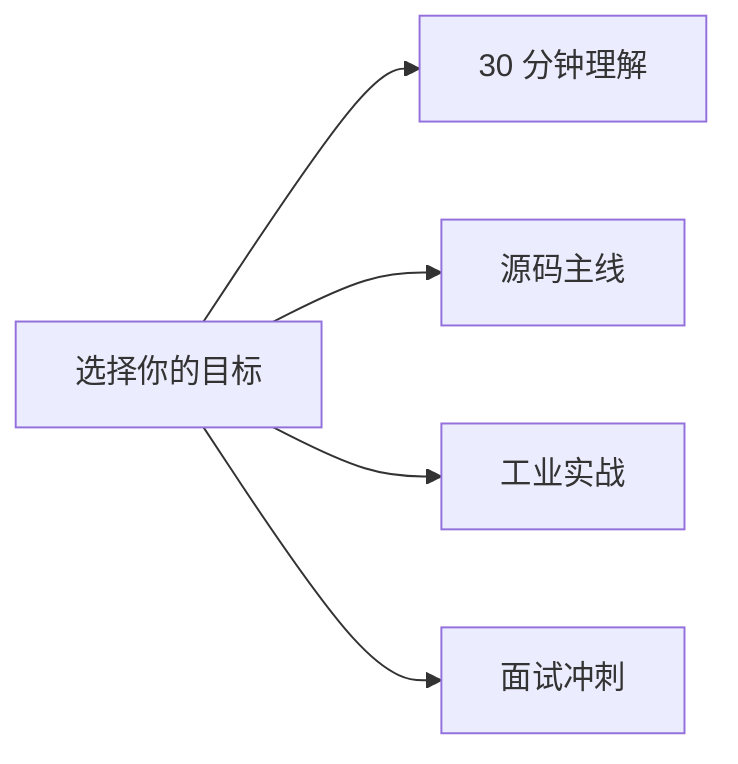

# 详细目录与学习参考

> 本页是 [README](README.md) 的延伸，包含 60 章详细索引、学习路径、源码地标、自检清单和必读资料。
>
> 快速入口：[学习路径](#-学习路径) · [章节索引](#part-i--总览6-章) · [源码地标](#vllm-仓库地标速查) · [自检清单](#工程理解自检清单)

---

## 🧭 学习路径

| 路径 | 适合 | 线路 |
| --- | --- | --- |
| **30 分钟理解** | 第一次接触 vLLM | [前置](01-overview/00-prerequisites.md) → [是什么](01-overview/01-what-is-vllm.md) → [架构](01-overview/02-architecture.md) → [API 服务](07-hands-on/05-serve-openai-api.md) |
| **源码主线** | 读代码 / 改代码 | [入口](03-code-walkthrough/01-entry-points.md) → [调度](03-code-walkthrough/02-scheduler.md) → [KV](03-code-walkthrough/03-kv-cache-manager.md) → [Runner](03-code-walkthrough/04-model-runner.md) → [Attention](03-code-walkthrough/05-attention-backends.md) → [输出](03-code-walkthrough/09-output-processing-and-streaming.md) |
| **工业实战** | 上线推理服务 | [环境](07-hands-on/01-setup.md) → [基准](07-hands-on/06-benchmark-methodology.md) → [调优](07-hands-on/07-tuning-playbook.md) → [部署](08-production-deployment/01-deployment-architectures.md) → [SLO](08-production-deployment/05-slo-and-observability.md) → [升级](08-production-deployment/12-upgrades-rollbacks-and-compatibility.md) |
| **面试冲刺** | 准备推理工程面试 | [高频题](06-interview/01-common-questions.md) → [系统设计](06-interview/02-system-design.md) → [计算题](06-interview/03-capacity-and-troubleshooting-drills.md) → [模拟面试](06-interview/04-mock-interview-and-rubric.md) |

按这个节奏走，刷完整本约 **25-35 小时**。每章统一结构：章首导读 → 正文 → 小结 → 自检 → 下一步。

---

## 📖 章节索引

每章后面一句话告诉你为什么要读。

### Part I · 总览（6 章）

| 文件 | 为什么读 |
| --- | --- |
| [`00-prerequisites`](01-overview/00-prerequisites.md) | 🆕 token / KV cache / TTFT·TPOT / TP·PP·DP 一次铺平，零基础起点 |
| [`01-what-is-vllm`](01-overview/01-what-is-vllm.md) | vLLM 是什么，为什么快，靠哪三大武器 |
| [`02-architecture`](01-overview/02-architecture.md) | 三层进程、四个核心数据结构、一步推理的完整数据流 |
| [`03-v0-vs-v1`](01-overview/03-v0-vs-v1.md) | V1 重构改了什么，为什么改 |
| [`04-project-structure`](01-overview/04-project-structure.md) | 1700+ 文件按模块分类导航（很长，按需查阅） |
| [`05-process-and-ipc-internals`](01-overview/05-process-and-ipc-internals.md) | fork vs spawn / ZMQ ROUTER-DEALER / 共享内存零拷贝 |

### Part II · 核心概念（5 章）

| 文件 | 为什么读 |
| --- | --- |
| [`01-paged-attention`](02-core-concepts/01-paged-attention.md) | 用 OS 虚拟内存类比讲 paged KV cache + block table |
| [`02-continuous-batching`](02-core-concepts/02-continuous-batching.md) | 为什么不用 static batching，迭代级调度的两个前提 |
| [`03-kv-cache-management`](02-core-concepts/03-kv-cache-management.md) | Block Pool / 引用计数 / preempt vs swap 策略 |
| [`04-prefix-caching`](02-core-concepts/04-prefix-caching.md) | Merkle 链式 hash + extra_keys，多卡/LoRA/多模态怎么算 |
| [`05-chunked-prefill`](02-core-concepts/05-chunked-prefill.md) | 长 prompt 怎么切才不卡 decode，`max-num-batched-tokens` 怎么调 |

### Part III · 源码走读（10 章）

| 文件 | 为什么读 |
| --- | --- |
| [`01-entry-points`](03-code-walkthrough/01-entry-points.md) | `LLM` / `AsyncLLM` / `EngineCore` 的调用链 |
| [`02-scheduler`](03-code-walkthrough/02-scheduler.md) | `Scheduler.schedule()` 完整走读，token budget + preemption |
| [`02b-scheduling-policies`](03-code-walkthrough/02b-scheduling-policies.md) | FCFS vs PRIORITY、优先级反演、抢占代价量化 |
| [`03-kv-cache-manager`](03-code-walkthrough/03-kv-cache-manager.md) | `allocate` / `free` / `hash` 的代码级细节 |
| [`04-model-runner`](03-code-walkthrough/04-model-runner.md) | `execute_model`：输入拼装 / forward / sampler |
| [`05-attention-backends`](03-code-walkthrough/05-attention-backends.md) | FlashAttn / FlashInfer / Triton / MLA 怎么选 |
| [`06-cuda-kernels`](03-code-walkthrough/06-cuda-kernels.md) | PagedAttention v1/v2、RoPE、RMSNorm CUDA 实现 |
| [`07-model-architectures`](03-code-walkthrough/07-model-architectures.md) | MLA / Mamba / MoE / GQA 在源码层的差异 |
| [`08-input-processing`](03-code-walkthrough/08-input-processing-and-tokenization.md) | 从 OpenAI 请求、chat template、tokenizer 到 EngineCoreRequest |
| [`09-output-processing`](03-code-walkthrough/09-output-processing-and-streaming.md) | 从 sampler/detokenizer 到 SSE、finish reason 与取消传播 |

### Part IV · 优化（5 章）

| 文件 | 为什么读 |
| --- | --- |
| [`01-quantization`](04-optimizations/01-quantization.md) | FP8 / INT4 / AWQ / GPTQ / Marlin 的选型矩阵 |
| [`02-speculative-decoding`](04-optimizations/02-speculative-decoding.md) | n-gram / EAGLE / Medusa / MTP 的取舍 |
| [`03-cudagraph-and-compile`](04-optimizations/03-cudagraph-and-compile.md) | CUDA Graph + torch.compile 何时开/关/降级 |
| [`04-compilation-internals`](04-optimizations/04-compilation-internals.md) | CompilerManager / VllmBackend / 自定义 pass 深度 |
| [`05-roofline`](04-optimizations/05-roofline-and-arithmetic-intensity.md) | 🆕 存算比推导：prefill 为何 compute-bound、decode 为何 memory-bound |

### Part V · 分布式（5 章）

| 文件 | 为什么读 |
| --- | --- |
| [`01-tp-pp-ep`](05-distributed/01-tp-pp-ep.md) | TP 切法 / PP 流水气泡 / EP expert 负载均衡 |
| [`02-disaggregated`](05-distributed/02-disaggregated.md) | Prefill/Decode 分离 + NIXL RDMA + 决策表 |
| [`03-expert-parallel`](05-distributed/03-expert-parallel-deep-dive.md) | MoE AllToAll 6 后端、EPLB、宽 EP 部署 |
| [`04-context-parallel`](05-distributed/04-context-parallel.md) | PCP/DCP 双维度长上下文切分 |
| [`05-large-scale`](05-distributed/05-large-scale-cluster-inference.md) | 🆕 千卡/万卡实战：通信墙/故障墙/长尾墙 |

### Part VI · 工程问答（4 章）

| 文件 | 为什么读 |
| --- | --- |
| [`01-common-questions`](06-interview/01-common-questions.md) | 30 题按结论→机制→取舍→验证展开 |
| [`02-system-design`](06-interview/02-system-design.md) | 容量、架构、故障域、成本推演 |
| [`03-capacity-drills`](06-interview/03-capacity-and-troubleshooting-drills.md) | 8 道计算题 + 8 类故障题 |
| [`04-mock-interview`](06-interview/04-mock-interview-and-rubric.md) | 五轮评分与项目叙事模板 |

### Part VII · 实操（8 章）

| 文件 | 为什么读 |
| --- | --- |
| [`01-setup`](07-hands-on/01-setup.md) | uv 环境 / 预编译 vs 源码 / GPU 检查 |
| [`02-trace-a-request`](07-hands-on/02-trace-a-request.md) | debugger 跟一个请求从 HTTP 到 token |
| [`03-mini-experiments`](07-hands-on/03-mini-experiments.md) | 5 个动手实验（block_size / prefix hit / batching） |
| [`04-profiling`](07-hands-on/04-profiling-and-debugging.md) | torch.profiler / NVTX / py-spy / 显存泄漏 |
| [`05-serve-openai-api`](07-hands-on/05-serve-openai-api.md) | 从零启动、健康检查、鉴权、streaming |
| [`06-benchmark-methodology`](07-hands-on/06-benchmark-methodology.md) | 固定变量、quality gate、goodput |
| [`07-tuning-playbook`](07-hands-on/07-tuning-playbook.md) | 从症状到单变量、可回滚调优 |
| [`08-production-capstone`](07-hands-on/08-production-capstone.md) | 交付可运维、可扩容、可回滚的证据包 |

### Part VIII · 生产部署（12 章）

| 文件 | 为什么读 |
| --- | --- |
| [`01-deployment-architectures`](08-production-deployment/01-deployment-architectures.md) | vLLM Production Stack / llm-d / AIBrix 三套参考栈 |
| [`02-smart-routing`](08-production-deployment/02-smart-routing-and-load-balancing.md) | prefix-cache aware / session sticky / 负载打分 |
| [`03-gateway-and-service-mesh`](08-production-deployment/03-gateway-and-service-mesh.md) | Istio + Gateway API + ExtProc |
| [`04-autoscaling`](08-production-deployment/04-autoscaling-and-capacity.md) | KEDA / 容量公式 / 冷启动 / drain |
| [`05-slo-and-observability`](08-production-deployment/05-slo-and-observability.md) | TTFT/TPOT/p99 + Prometheus + OTel |
| [`06-reliability`](08-production-deployment/06-reliability-and-failure-modes.md) | 8 个失效模式与防护 |
| [`07-incident-playbook`](08-production-deployment/07-incident-playbook.md) | 8 个真实故障 runbook |
| [`08-monitoring-cookbook`](08-production-deployment/08-monitoring-cookbook.md) | 可直接抄走的 PromQL / 告警 / Grafana 骨架 |
| [`09-vllm-doctor-skill`](08-production-deployment/09-vllm-doctor-skill.md) | 把人工流程编成 agent 自动跑 |
| [`10-gpu-utilization`](08-production-deployment/10-gpu-utilization-and-tail-latency.md) | 🆕 GPU-Util 是谎言、MBU/MFU、长尾 8 类根因 |
| [`11-security`](08-production-deployment/11-security-and-multi-tenancy.md) | 威胁模型、auth、quota、tenant isolation |
| [`12-upgrades`](08-production-deployment/12-upgrades-rollbacks-and-compatibility.md) | 兼容矩阵、canary、drain、rollback |

### Part IX · 应用特性（5 章）

| 文件 | 为什么读 |
| --- | --- |
| [`01-sampling-and-logits`](09-advanced-features/01-sampling-and-logits.md) | sampling 顺序、backend、seed 边界 |
| [`02-structured-output`](09-advanced-features/02-structured-output.md) | auto/显式后端、grammar compile、fallback |
| [`03-multimodal`](09-advanced-features/03-multimodal.md) | 图像/视频/音频编码器、encoder cache |
| [`04-lora-serving`](09-advanced-features/04-lora-serving.md) | LoRAModelManager / Punica / 多 LoRA batching |
| [`05-embedding-and-pooling`](09-advanced-features/05-embedding-and-pooling.md) | BGE / E5 / 复用引擎做 embedding |

---

## vLLM 仓库地标速查

<!-- vllm-source: {"path":"vllm/v1/core/kv_cache_utils.py","symbol":"hash_block_tokens"} -->
[源码锚点：vllm/v1/core/kv_cache_utils.py · hash_block_tokens](https://github.com/vllm-project/vllm/blob/b23bd73f540175f9e117eaee5029cd7d8df63964/vllm/v1/core/kv_cache_utils.py#L596)

| 想知道什么 | 去哪里看 |
| --- | --- |
| 用户怎么调用 vLLM | `vllm/entrypoints/llm.py`、`vllm/entrypoints/openai/api_server.py` |
| 引擎主循环 | `vllm/v1/engine/core.py`、`vllm/v1/engine/llm_engine.py` |
| 调度器 | `vllm/v1/core/sched/scheduler.py` |
| KV cache 块管理 | `vllm/v1/core/kv_cache_manager.py`、`block_pool.py` |
| Prefix caching hash | `vllm/v1/core/kv_cache_utils.py` (`hash_block_tokens`) |
| Model runner | `vllm/v1/worker/gpu_model_runner.py` |
| Attention 后端 | `vllm/v1/attention/backends/`（FlashAttn / FlashInfer / Triton / MLA） |
| PagedAttention CUDA | `csrc/attention/` |
| 模型实现 | `vllm/model_executor/models/` |
| 张量并行 | `vllm/distributed/parallel_state.py` |
| 量化 | `vllm/model_executor/layers/quantization/` |
| 投机解码 | `vllm/v1/spec_decode/` |
| 采样 | `vllm/v1/sample/`、`csrc/sampler.cu` |
| KV transfer | `vllm/distributed/kv_transfer/`、`vllm/v1/kv_offload/` |

完整地图见 [`01-overview/04-project-structure.md`](01-overview/04-project-structure.md)。

---

## 学习方法（5 条铁律）

1. **概念落到代码。** 不看博客的二手解读，源码才是唯一真相。
2. **先看数据契约，再看内部。** 读 Scheduler 前先看 `SchedulerOutput` 的字段。
3. **打 print 比读注释快。** 给 Scheduler、KVCacheManager 各加一句 print，跑一次就懂。
4. **三张图刻进脑子。** 请求生命周期、KV 物理↔逻辑映射、Scheduler 决策流。
5. **永远做对比。** 讲 vLLM 优势，必须能讲清"HF Transformers 怎么做、为什么慢"。

---

## 工程理解自检清单

读完整套后，每个问题应能在 1-2 分钟内讲清并指出源码位置：

- Paged KV cache、continuous batching、prefix caching 分别解决什么，代价是什么？
- KV block size 太大太小各有什么问题？
- Continuous batching 和 static batching 的本质区别？
- Prefix caching 的 hash 怎么算？怎么避免冲突？
- Chunked prefill 解决了什么？
- Tensor parallel 在 MLP 用 column → row 的原因？
- Speculative decoding 的接受率怎么算？
- FP8 / INT8 / INT4 美度损失主要在哪？
- V0 → V1 重构的三个最大改变？
- KV 不够时 V1 默认 recompute 还是 swap？

每题都有展开，见 [`06-interview/`](06-interview/)。

---

## 必读资料

1. **PagedAttention 论文** — Kwon et al., *Efficient Memory Management for LLM Serving with PagedAttention*, SOSP 2023
2. **Continuous Batching 博客** — Anyscale, *How Continuous Batching Enables 23× Throughput*
3. **vLLM 官方文档** — <https://docs.vllm.ai>，重点看 design / kernel 章节
4. **FlashAttention v1/v2/v3** — 理解 SRAM tiling 的关键
5. **Speculative Decoding 论文** — Leviathan et al., 2023
6. **EAGLE / MTP** — 当下最强的投机方案系列
